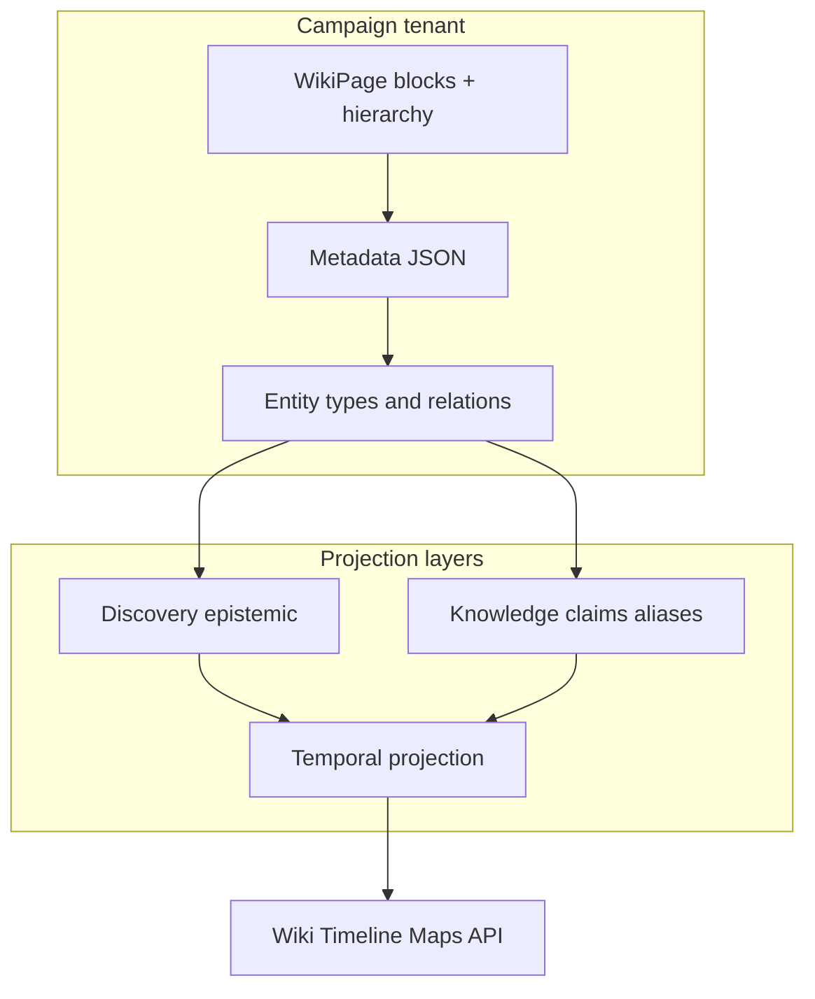

# Campaign model

How Esiana thinks about world data. Read this before API or plugin documentation.

---

## Campaign

A **campaign** is an isolated tenant. All lore, sessions, maps, plugins, and membership for one tabletop world live inside a single campaign container, addressed by **handle** (slug) in URLs and API paths:

```text
/api/campaigns/{campaignHandle}/...
```

Campaigns do not share wiki content, discovery state, or plugin data. Cross-campaign features (shared universe chronology, public directory) are explicit product surfaces — not implicit data leakage.

**See also:** [Campaigns API guide](../api/campaigns.md)

---

## Wiki page

The **wiki page** is Esiana's canonical content substrate. Each page has:

- **TipTap block JSON** — prose, images, infoboxes, layout grids
- **Hierarchy** — `parentId` for folders and nesting
- **Visibility tier** — Public / Party / GM-only (role visibility, distinct from discovery)
- **Template** — character, location, organization, session note, map, etc.

Graphs, maps, diplomacy views, and storyboards are **derived projections** on wiki metadata — not parallel content databases.

**See also:** [Wiki pages API guide](../api/wiki-pages.md)

---

## Entity

An **entity** is a typed narrative thing in the campaign: character, location, organization, quest arc, object, and so on. In practice, an entity is usually a **wiki page with a template** plus structured **metadata**.

The entity graph (`EntityRelation`) is **derived only** — synced from wiki links, metadata JSON, calendar prerequisites, and map pin targets. Edit the wiki; relations follow.

**See also:** [Entities API guide](../api/entities.md) · [Entity graph (internal)](../../esiana-core/docs/architecture-internal/entity-graph.md)

---

## Metadata

**Metadata** is structured JSON stored on wiki pages (and some operational records). It drives:

- Org membership, character relationships, quest lifecycle
- Map asset references and pin targets
- Import module typing and export round-trip

Plugins extend behavior through metadata and overlay tables — not by replacing the wiki as source of truth.

---

## Discovery

**Discovery** is what a viewer has *found* epistemically — party knowledge, codex entries, revelation fog. It answers: *does this actor know this exists?*

Discovery is separate from:

- **GM editorial status** — draft, published, archived on a page
- **Role visibility** — Public / Party / GM-only tiers

Browse surfaces, search, links, and party-knowledge views use a shared discovery projection contract.

**See also:** [Discovery system](discovery-system.md) · [Discovery & revelation (operations)](../features/discovery-and-revelation.md)

---

## Knowledge

**Knowledge** is sovereign lore attached to entities:

- **Lore claims** — attributed statements with sources
- **Historical aliases** — names an entity was known by over time
- **Citations** — provenance for claims

Knowledge round-trips in sovereign campaign export (`sovereign/knowledge.json`). It is narrative fact, not membership or admin records.

**See also:** [Knowledge model](knowledge-model.md) · [Sovereign export](sovereignty.md)

---

## Temporal projection

**Temporal projection** decides what is visible *when* for a given viewer:

- **Campaign clock** — current in-world date
- **Revelation fog** — undiscovered content hidden or redacted
- **Role tiers** — party vs GM visibility
- **Surface policy** — wiki, timeline, map, and lore adapters compose the same primitives differently

Projection is intentional asymmetry with a single code path per axis — not perfect historical simulation on every surface.

**See also:** [Temporal runtime](temporal-runtime.md) · [Narrative foundation](narrative-foundation.md)

---

## How the pieces fit



---

## See also

- [Narrative foundation](narrative-foundation.md) — L1–L4 platform layers
- [API overview](../api/overview.md) — REST surface
- [Plugin development](../plugin-development/getting-started.md) — extensions
