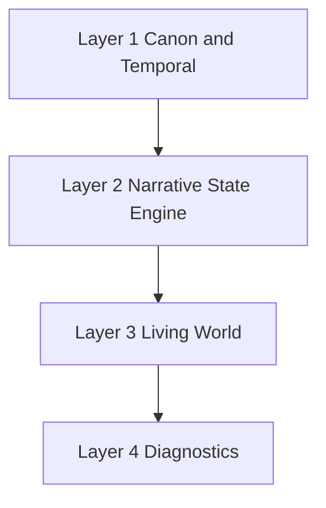

# Narrative foundation

Esiana's narrative platform is organized in four layers. Vocabulary for world data: [Campaign model](campaign-model.md).

---

## Layer 1 — Canon and temporal infrastructure

**What it is:** Wiki as canonical substrate, campaign clock, calendars, temporal snapshots, entity graph, unified narrative projection semantics.

**In practice:** When the campaign date changes, surfaces re-filter lore, map pins, and timeline cards through the same projection rules — not by duplicating content per era.

**Shipped pillars:**

| Pillar | Role |
|--------|------|
| Knowledge / fog / revelation | Visibility state on entities; map presence resolver |
| Discovery | Codex, hub banners, party epistemic projection |
| Historical aliases | Names entities were known by over time |
| Lore citations | Claims with sources on entities |
| Continuity warnings | Structural batch diagnostics for GMs |
| Narrative threads | Thread hub; lifecycle rebuilt on restore |
| Since-last-visit | Region snapshots for returning players |
| Atlas / maps | Temporal projection, fog, Visual Atlas v1 |

**Deferred polish:** map marker clustering, cached Visual Atlas manifests, Layer 6 intelligence (session prep, pacing).

---

## Layer 2 — Narrative state engine

Quest arcs, scenes, objectives, storyboards — orchestration metadata on wiki entities. Lifecycle tables rebuild from page metadata on import; not a parallel content DB.

**In practice:** [Narrative threads](../features/narrative-threads.md) are wiki pages with lifecycle metadata — resolving a thread updates state objects, not a separate quest database.

---

## Layer 3 — Living world

Downtime havens, projects, reputation, scheduled effects, [world advance](../features/world-advance.md) — operational satellites around the wiki canon.

**In practice:** [World advance](../features/world-advance.md) batches faction and economic deltas when time passes; it does not replace advancing the campaign clock in [Chronology](../features/chronology-and-calendars.md).

---

## Layer 4 — Diagnostics

Narrative density, orphan analysis, dead-end detection, circular dependencies — deterministic GM-facing diagnostics (not AI by default).

**In practice:** Diagnostics flag structural risks (orphaned clues, dead ends) for staff review — they do not auto-rewrite lore.

---

## Layer stack

---

## See also

- [Discovery & revelation (feature guide)](../features/discovery-and-revelation.md)
- [Campaign model](campaign-model.md)
- [Discovery system](discovery-system.md)
- [Temporal runtime](temporal-runtime.md)
- Engineering sign-off: [`esiana-core/docs/audits/narrative-foundation-signoff.md`](../../esiana-core/docs/audits/narrative-foundation-signoff.md)
