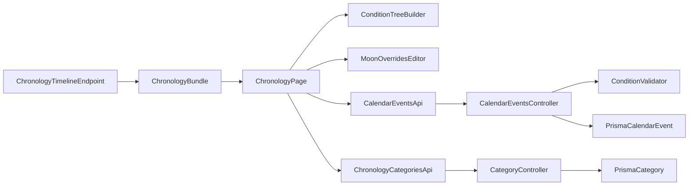

# Advanced Chronology Rules Implementation Plan

## Objectives
- Extend chronology events with advanced automation fields (category, duration, repetitions, limits, moon overrides).
- Add campaign-scoped event categories.
- Store nested condition logic as JSON (`ConditionNode` tree) on events and validate it server-side.
- Deliver a full visual rule-builder UI in chronology create/edit flows.
- Add backend virtual occurrence expansion so dynamic rules are evaluated per request window.
- Guard runtime performance with hard expansion ceilings for repeating/high-frequency rules.

## Backend Changes

### 1) Prisma schema and migration
- Update [c:\Users\allison\Documents\GIT\Esiana-ttrpg\esiana-core\backend\prisma\schema.prisma](c:\Users\allison\Documents\GIT\Esiana-ttrpg\esiana-core\backend\prisma\schema.prisma):
  - Add `CalendarEventCategory` model:
    - `id`, `campaignId`, `name`, `color`, timestamps
    - relation from `Campaign`
    - relation to `CalendarEvent`
    - indexes/uniqueness (`campaignId`, `name`)
  - Extend `Campaign` with `calendarEventCategories` relation.
  - Extend `CalendarEvent` with:
    - `categoryId String?`
    - `duration Int @default(1)`
    - `isRepeating Boolean @default(false)`
    - `repeatInterval Int?`
    - `repeatUnit String?` (`DAYS|MONTHS|YEARS|ERAS`, enforced in app layer)
    - `limitRepetitions Int?`
    - `conditions Json?`
    - `moonOverrides Json?`
  - Add index coverage for new query/filter columns (`categoryId`, `isRepeating`, `repeatUnit`).
- Add a migration SQL file in [c:\Users\allison\Documents\GIT\Esiana-ttrpg\esiana-core\backend\prisma\migrations](c:\Users\allison\Documents\GIT\Esiana-ttrpg\esiana-core\backend\prisma\migrations) to create category table and rebuild/alter `CalendarEvent` with new columns and FK.

### 2) Event controller validation + serialization
- Update [c:\Users\allison\Documents\GIT\Esiana-ttrpg\esiana-core\backend\src\controllers\calendarEventsController.ts](c:\Users\allison\Documents\GIT\Esiana-ttrpg\esiana-core\backend\src\controllers\calendarEventsController.ts):
  - Parse/validate new payload fields in create/update.
  - Enforce category ownership (`categoryId` must belong to same campaign).
  - Enforce numeric constraints:
    - `duration >= 1`
    - if `isRepeating`, require valid `repeatInterval >= 1` and `repeatUnit`
    - `limitRepetitions >= 1` when present
  - Add `conditions` validator for recursive `ConditionNode` shape:
    - group nodes: `type='GROUP'`, valid `operator`, non-empty `children`
    - criteria nodes: `type='CRITERIA'`, valid `parameter/comparison/value`, `moonId` only with `MOON_PHASE`
  - Add `moonOverrides` validator shape (initial strict typed object array, even if UI sends empty list).
  - Add deterministic irregular-calendar repetition fallback:
    - month/day rollover policy: if target day exceeds month length, clip to last valid day for that month.
  - Add expansion safety constraints metadata validation:
    - enforce `limitRepetitions` or apply system default cap during evaluation.
    - reject pathological rules that cannot be bounded for preview windows.
  - Include all new fields in serialized response.

### 3) Category management endpoints
- Add new controller file [c:\Users\allison\Documents\GIT\Esiana-ttrpg\esiana-core\backend\src\controllers\calendarEventCategoriesController.ts](c:\Users\allison\Documents\GIT\Esiana-ttrpg\esiana-core\backend\src\controllers\calendarEventCategoriesController.ts):
  - `GET /chronology/categories`
  - `POST /chronology/categories`
  - `PATCH /chronology/categories/:categoryId`
  - `DELETE /chronology/categories/:categoryId` (safe behavior for linked events: set null or block with message)
- Register routes in [c:\Users\allison\Documents\GIT\Esiana-ttrpg\esiana-core\backend\src\routes\campaignScoped.ts](c:\Users\allison\Documents\GIT\Esiana-ttrpg\esiana-core\backend\src\routes\campaignScoped.ts) with manager guards for writes.

### 4) Aggregate chronology endpoint extension
- Update [c:\Users\allison\Documents\GIT\Esiana-ttrpg\esiana-core\backend\src\controllers\chronologyController.ts](c:\Users\allison\Documents\GIT\Esiana-ttrpg\esiana-core\backend\src\controllers\chronologyController.ts):
  - Include `categories` in response bundle.
  - Include new event fields (`categoryId`, duration/repetition fields, `conditions`, `moonOverrides`).
  - Add `virtualEventExpansion()` evaluation step:
    - input: base events + requested timeline window + calendar definitions (months/leap-days/moons)
    - evaluate condition trees + repeat rules + moon overrides
    - output: bounded virtual occurrence rows for timeline/ledger payload
  - Include source linkage in expanded rows (`baseEventId`, `occurrenceIndex`, start/end markers).
  - Add hard safety ceiling per request (e.g. max 100 generated instances per base event, max N total generated rows) and return truncation metadata if capped.
  - Keep existing visibility filtering behavior intact.

### 4.1) Concrete API response shape (recommended)
- Recommendation: return **both** base event definitions and expanded occurrences in one payload.
  - Why:
    - builder/editor UI needs canonical source rows (`baseEvents`) for mutation and audit
    - timeline/ledger rendering needs occurrence-level rows (`occurrences`)
    - avoids lossy reverse-mapping from virtual rows back to source definitions
- Contract for `GET /chronology/timeline`:
```ts
type ChronologyTimelineResponse = {
  eras: Array<{
    id: string;
    campaignId: string;
    title: string;
    description: string | null;
    order: number;
  }>;
  calendars: Array<{
    id: string;
    name: string;
    isMasterTime: boolean;
  }>;
  categories: Array<{
    id: string;
    campaignId: string;
    name: string;
    color: string | null;
  }>;

  // Canonical DB-backed event definitions (manager editing source of truth)
  baseEvents: Array<{
    id: string;
    calendarId: string;
    eraId: string | null;
    categoryId: string | null;
    prerequisiteId: string | null;
    visibility: 'PUBLIC' | 'PARTY' | 'DM_ONLY';
    title: string;
    description: string | null;
    duration: number;
    isRepeating: boolean;
    repeatInterval: number | null;
    repeatUnit: 'DAYS' | 'MONTHS' | 'YEARS' | 'ERAS' | null;
    limitRepetitions: number | null;
    targetYear: number | null;
    targetMonth: number | null;
    targetDay: number | null;
    targetEpochMinute: string | null;
    conditions: ConditionNode | null;
    moonOverrides: MoonOverride[] | null;
    recurrenceRule: unknown;
    tags: string[];
    createdAt: string;
    updatedAt: string;
  }>;

  // Virtualized, request-window scoped materialized rows for rendering
  occurrences: Array<{
    occurrenceId: string; // deterministic: `${baseEventId}:${occurrenceIndex}`
    baseEventId: string;
    occurrenceIndex: number;
    calendarId: string;
    eraId: string | null;
    categoryId: string | null;
    visibility: 'PUBLIC' | 'PARTY' | 'DM_ONLY';
    title: string;
    description: string | null;
    start: {
      year: number | null;
      month: number | null;
      day: number | null;
      epochMinute: string | null;
    };
    end: {
      year: number | null;
      month: number | null;
      day: number | null;
      epochMinute: string | null;
    };
    duration: number;
    isStart: boolean;
    isContinuation: boolean;
    dayOffset: number; // 0 for start, 1..n for continuation day
    sourceType: 'STATIC' | 'REPEATING' | 'CONDITION_MATCHED' | 'MOON_OVERRIDE';
    prerequisiteBaseEventId: string | null;
  }>;

  // Evaluation + safety diagnostics for UX and observability
  expansionMetadata: {
    window: {
      mode: 'ERA' | 'YEAR_RANGE' | 'EPOCH_RANGE';
      from: string; // tokenized based on mode
      to: string;
    };
    limits: {
      maxGeneratedPerBaseEvent: number;
      maxGeneratedTotal: number;
    };
    generated: {
      totalOccurrences: number;
      totalBaseEventsConsidered: number;
      truncated: boolean;
      truncatedBaseEventIds: string[];
    };
    warnings: ExpansionWarningCode[];
    evaluationVersion: string; // for deterministic rule engine migration tracking
  };
};
```
- Standardized warning enum:
```ts
type ExpansionWarningCode =
  | 'CAP_APPLIED_PER_EVENT'
  | 'CAP_APPLIED_TOTAL'
  | 'UNBOUNDED_RULE_FORCED_CAP'
  | 'CLIPPED_DAY_TO_MONTH_END'
  | 'MOON_OVERRIDE_TARGET_NOT_FOUND'
  | 'INVALID_CONDITION_NODE_SKIPPED'
  | 'PREREQUISITE_REFERENCE_MISSING'
  | 'WINDOW_PARSE_FALLBACK_APPLIED';
```
- Warning payload detail recommendation:
  - keep `warnings` as compact codes for fast UI badges
  - optionally add `warningDetails` array with `{ code, baseEventId?, occurrenceId?, message }` for diagnostics panels
- Request query additions:
  - `windowMode=ERA|YEAR_RANGE|EPOCH_RANGE`
  - `from`, `to` (required with selected mode)
  - optional `includeBaseEvents=true|false` (default true)
  - optional `includeOccurrences=true|false` (default true)
- Backward compatibility:
  - Keep temporary alias `events = occurrences` for one transition release to avoid immediate frontend breakage.

### 4.2) Deterministic occurrenceId strategy
- Goal: stable keys across repeated queries for same `baseEvent` + window/evaluation inputs.
- Deterministic id algorithm:
  - canonical key parts:
    - `baseEventId`
    - `occurrenceIndex`
    - normalized start token (`startEpochMinute` if present else `year|month|day`)
    - normalized end token
    - `evaluationVersion`
  - build source string:
    - `baseEventId|occurrenceIndex|startToken|endToken|evaluationVersion`
  - hash with a stable algorithm (e.g. sha256) and truncate for payload size
  - final:
    - `occurrenceId = "occ_" + hash.slice(0, 16)`
- Collision policy:
  - if collision detected in one expansion run, append monotonic suffix `"_2"`, `"_3"` (should be rare)
- Index semantics:
  - `occurrenceIndex` is monotonically increasing per `baseEventId` within evaluated window after sorting by start date then creation timestamp fallback.
- Cache semantics:
  - frontend should key rows by `occurrenceId`
  - mutation/edit UIs should key source rows by `baseEventId` (never by virtual id)

## Frontend Changes

### 5) API client and types
- Update [c:\Users\allison\Documents\GIT\Esiana-ttrpg\esiana-core\frontend\src\lib\calendarEventsApi.ts](c:\Users\allison\Documents\GIT\Esiana-ttrpg\esiana-core\frontend\src\lib\calendarEventsApi.ts):
  - Extend event record and create/update payloads with advanced fields.
- Update [c:\Users\allison\Documents\GIT\Esiana-ttrpg\esiana-core\frontend\src\lib\chronologyApi.ts](c:\Users\allison\Documents\GIT\Esiana-ttrpg\esiana-core\frontend\src\lib\chronologyApi.ts):
  - Add category and advanced rule fields to aggregate bundle types.
- Add [c:\Users\allison\Documents\GIT\Esiana-ttrpg\esiana-core\frontend\src\lib\chronologyCategoriesApi.ts](c:\Users\allison\Documents\GIT\Esiana-ttrpg\esiana-core\frontend\src\lib\chronologyCategoriesApi.ts) for CRUD category requests.

### 6) Chronology page form expansion
- Update [c:\Users\allison\Documents\GIT\Esiana-ttrpg\esiana-core\frontend\src\pages\ChronologyPage.tsx](c:\Users\allison\Documents\GIT\Esiana-ttrpg\esiana-core\frontend\src\pages\ChronologyPage.tsx):
  - Expand edit side panel with:
    - category selector
    - duration/repetition controls
    - repeat interval/unit/limit controls
    - moon overrides editor entry
    - conditions editor entry
  - Expand create modal with same advanced fields.
  - Maintain manager-only editability; read-only viewer mode for non-managers.
  - Add evaluation window controls for heavy datasets (era/year range selectors) so virtual expansion is request-bounded.

### 7) Full nested condition rule-builder UI
- Add reusable components under chronology:
  - [c:\Users\allison\Documents\GIT\Esiana-ttrpg\esiana-core\frontend\src\components\chronology\ConditionTreeBuilder.tsx](c:\Users\allison\Documents\GIT\Esiana-ttrpg\esiana-core\frontend\src\components\chronology\ConditionTreeBuilder.tsx)
  - [c:\Users\allison\Documents\GIT\Esiana-ttrpg\esiana-core\frontend\src\components\chronology\ConditionGroupEditor.tsx](c:\Users\allison\Documents\GIT\Esiana-ttrpg\esiana-core\frontend\src\components\chronology\ConditionCriteriaEditor.tsx)
- Capabilities:
  - Add/remove/reorder nodes
  - GROUP nodes with operators `AND|OR|NAND|XOR`
  - CRITERIA nodes with parameter/comparison/value inputs
  - `moonId` selector appears only for `MOON_PHASE`
  - schema-safe serialization to backend `conditions` JSON
  - inline validation errors before save

### 8) Moon overrides editor
- Add [c:\Users\allison\Documents\GIT\Esiana-ttrpg\esiana-core\frontend\src\components\chronology\MoonOverridesEditor.tsx](c:\Users\allison\Documents\GIT\Esiana-ttrpg\esiana-core\frontend\src\components\chronology\MoonOverridesEditor.tsx)
  - Build overrides against calendar moon definitions
  - support enabled/disabled overrides per moon and phase/cycle targeting
  - output normalized JSON stored in `moonOverrides`

### 9) Category management UX
- Add a lightweight manager modal/section in Chronology for category CRUD (name + color), using `chronologyCategoriesApi` and optimistic refresh of local bundle.

### 10) Multi-day duration rendering rules
- Update [c:\Users\allison\Documents\GIT\Esiana-ttrpg\esiana-core\frontend\src\components\chronology\TechTreeTimeline.tsx](c:\Users\allison\Documents\GIT\Esiana-ttrpg\esiana-core\frontend\src\components\chronology\TechTreeTimeline.tsx):
  - For occurrences with `duration > 1`, render span-aware visuals:
    - primary node at start cell
    - continuation anchors/badges in subsequent active cells or explicit `Day X of Y` indicators.
  - Ensure long-running events do not appear as single-day cards.
- Update [c:\Users\allison\Documents\GIT\Esiana-ttrpg\esiana-core\frontend\src\components\chronology\EventsLedgerView.tsx](c:\Users\allison\Documents\GIT\Esiana-ttrpg\esiana-core\frontend\src\components\chronology\EventsLedgerView.tsx):
  - include duration columns and occurrence start/end metadata.

## Data Flow


## Recommended action on Gemini suggestion
- Adopt Gemini’s direction, but **do not replace raw rows outright**.
- Preferred action:
  - return `baseEvents` + `occurrences` + `expansionMetadata` together.
  - let renderer consume `occurrences`; let editors mutate `baseEvents`.
- This balances performance safety, UI correctness, and future maintainability for advanced automation rules.

## Validation & Regression Strategy
- Backend unit-level validation checks for invalid condition trees and repetition constraints.
- Manual API sanity cases:
  - create/update with nested group+criteria trees
  - invalid trees rejected with clear 400 errors
  - category cross-campaign reference rejected
  - `isRepeating=false` with stale repeat fields normalized/ignored per chosen rule
  - virtual expansion ceiling hit returns safe truncated payload with metadata (no server freeze)
  - daily repeating rule without explicit limit still bounded by system hard cap
  - irregular month repeat policy verified (day clipping to month-end)
- UI checks:
  - manager can build nested trees and save
  - players see read-only advanced fields
  - prerequisite self-loop still blocked
  - timeline/ledger rendering remains stable with new metadata
  - multi-day events visibly span or show continuation indicators

## Delivery Order
1. Prisma schema + migration.
2. Backend controller validation + serialization.
3. Category endpoints.
4. Aggregate bundle expansion.
5. Frontend API type updates.
6. Condition builder + moon override components.
7. Chronology page create/edit integration.
8. End-to-end validation and regressions.