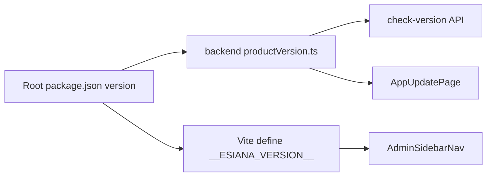

# App version source of truth

## Current state

| Location | Value |
|----------|-------|
| [package.json](package.json) | `0.1.0` (workspace label) |
| [backend/src/controllers/systemController.ts](backend/src/controllers/systemController.ts) | Hardcoded `CURRENT_VERSION = '0.7.0'` |
| [README.md](README.md), [todo.md](todo.md), [changelog.md](changelog.md) | Alpha **v0.7.0**; changelog explicitly says `package.json` is **not** the source of truth |
| Admin UI | [AdminSidebarNav.tsx](frontend/src/components/admin/AdminSidebarNav.tsx) has a **RESOURCES** footer (GitHub / Documentation) with no version |

Existing **Update Core** flow ([AppUpdatePage.tsx](frontend/src/pages/AppUpdatePage.tsx) → `GET /api/admin/system/check-version`) already compares installed vs GitHub releases via [semverCompare.ts](backend/src/lib/semverCompare.ts). It will automatically pick up the new version once `CURRENT_VERSION` is replaced.



## Source of truth

**Root [package.json](package.json) `version` field** — bump to **`0.8.0`** for this task.

- Leave workspace packages ([backend/package.json](backend/package.json), [frontend/package.json](frontend/package.json)) at `0.1.0` unless you want them mirrored later; they are not used for product display today.
- **Release milestones** (document only, no automation):
  - **0.9.0** when Phase 7 (Spatial visualization & mapping) completes — already framed in [todo.md](todo.md) “Version 0.9.0 Release Candidate”
  - **1.0.0** when Phase 13 completes
  - Process for each release: bump root `version` → update README status line → add/adjust [changelog.md](changelog.md) section → update todo product status → `git tag vX.Y.Z` (manual; not part of code change unless you ask)

## Implementation

### 1. Shared backend reader

Add [backend/src/lib/productVersion.ts](backend/src/lib/productVersion.ts):

- Resolve repo root from `import.meta.url` (works from `src/` and compiled `dist/lib/`)
- `readFileSync` + parse root `package.json`
- Export `PRODUCT_VERSION` (and optionally re-export as `CURRENT_VERSION` for minimal churn)

Update [systemController.ts](backend/src/controllers/systemController.ts):

- Replace hardcoded `'0.7.0'` with `PRODUCT_VERSION`
- Keep `export const CURRENT_VERSION` as alias if anything external imports it (today only this file)

`backend/tsconfig.json` already has `resolveJsonModule`; no need to import JSON from outside `include` if we read via `fs`.

### 2. Frontend build metadata

In [frontend/vite.config.ts](frontend/vite.config.ts):

- Read root `package.json` (e.g. `readFileSync` or `import` with path `../package.json`)
- `define: { __ESIANA_VERSION__: JSON.stringify(version) }`

In [frontend/src/vite-env.d.ts](frontend/src/vite-env.d.ts):

- `declare const __ESIANA_VERSION__: string`

Optional thin helper [frontend/src/lib/productVersion.ts](frontend/src/lib/productVersion.ts): `export const productVersion = __ESIANA_VERSION__` for consistent imports.

### 3. Admin UI — version above RESOURCES

Edit [AdminSidebarNav.tsx](frontend/src/components/admin/AdminSidebarNav.tsx) footer block (lines 78–104):

- Insert a read-only block **above** the `RESOURCES` heading, e.g. muted label “Esiana” + monospace `v{productVersion}` (beta badge optional: “Beta” if you want parity with README)
- Use `__ESIANA_VERSION__` / helper — no extra API call; sidebar is admin-only and version is static per deploy

This matches your placement request (“global admin settings above Resources”) without overloading [AdminGeneralSettingsForm.tsx](frontend/src/components/admin/AdminGeneralSettingsForm.tsx), which has no Resources section.

**Consistency:** Update Core page continues to show `result.currentVersion` from the API (same `package.json` at runtime). After deploy, sidebar and Update Core always agree.

### 4. Documentation alignment

| File | Changes |
|------|---------|
| [package.json](package.json) | `"version": "0.8.0"` |
| [README.md](README.md) | Status note → Beta (v0.8.0); revise [Versioning note](README.md) (~line 105) to state root `package.json` **is** the source of truth |
| [changelog.md](changelog.md) | Update header; move relevant `[Unreleased]` items into **`[0.8.0]`** with date; add short entry for version source-of-truth work |
| [todo.md](todo.md) | Product status → **v0.8.0 beta**; mark **App version source of truth** `[x]`; keep Phase 7 → 0.9.0 / Phase 13 → 1.0.0 milestone notes as roadmap-only |

### 5. Git tag (manual)

After merge/release, align remote releases with:

```bash
git tag v0.8.0
git push origin v0.8.0
```

GitHub **check-version** compares tags like `v0.8.0` against installed version (leading `v` stripped in [semverCompare.ts](backend/src/lib/semverCompare.ts)).

## Out of scope (per todo item wording)

- Contributor setup guide
- Automated release scripts / CI version bump
- Storing version in `SystemSetting` DB (unnecessary; build-time + `package.json` is enough)

## Verification

1. `npm run dev:backend` + `npm run dev:frontend` — admin sidebar shows **v0.8.0** above RESOURCES
2. **Update Core** (`/admin/config/update`) shows installed **v0.8.0**
3. Grep repo for stale `0.7.0` product references (exclude `node_modules` / unrelated deps)
4. Optional: `npm run build` in frontend to confirm `__ESIANA_VERSION__` is inlined
