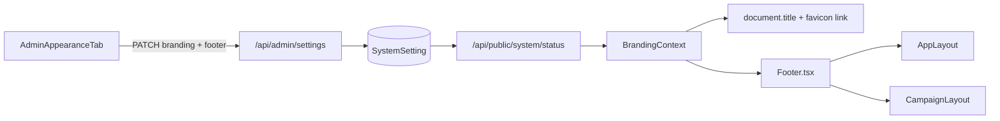

# Appearance: Favicon + Footer Configuration

## Context

This repo stores instance-wide config in the Prisma **`SystemSetting`** model (`id = "GLOBAL_CONFIG"`), not an `InstanceSettings` type. Admin changes go through existing **`GET/PATCH /api/admin/settings`** ([`backend/src/controllers/adminSettingsController.ts`](backend/src/controllers/adminSettingsController.ts)). Public consumers use **`GET /api/public/system/status`** ([`backend/src/controllers/publicSystemController.ts`](backend/src/controllers/publicSystemController.ts)).

There is **no** [`Footer.tsx`](frontend/src/components/layout/Footer.tsx) today; layouts are header + main only ([`AppLayout.tsx`](frontend/src/components/layout/AppLayout.tsx), [`CampaignLayout.tsx`](frontend/src/layouts/CampaignLayout.tsx)). Favicon/title are not dynamic ([`index.html`](frontend/index.html) has a static `<title>Esiana</title>` and no `<link rel="icon">`).



---

## 1. Database schema + migration

Add columns to `SystemSetting` in [`backend/prisma/schema.prisma`](backend/prisma/schema.prisma):

| Column | Type | Default | API section |
|--------|------|---------|-------------|
| `faviconUrl` | `String?` | — | `branding.faviconUrl` |
| `footerCustomText` | `String?` | — | `footer.customText` |
| `footerTosUrl` | `String?` | — | `footer.tosUrl` |
| `footerPrivacyPolicyUrl` | `String?` | — | `footer.privacyPolicyUrl` |
| `footerDiscordUrl` | `String?` | — | `footer.discordUrl` |
| `footerGithubUrl` | `String?` | — | `footer.githubUrl` |
| `footerAlignment` | `String` | `"center"` | `footer.alignment` |

Create a new Prisma migration under `backend/prisma/migrations/` (same style as [`20260527230000_modern_palettes_apply_background_tint`](backend/prisma/migrations/20260527230000_modern_palettes_apply_background_tint/migration.sql)):

```sql
ALTER TABLE "SystemSetting" ADD COLUMN "faviconUrl" TEXT;
ALTER TABLE "SystemSetting" ADD COLUMN "footerCustomText" TEXT;
-- ...remaining footer columns...
ALTER TABLE "SystemSetting" ADD COLUMN "footerAlignment" TEXT NOT NULL DEFAULT 'center';
```

Run `npm run db:migrate` (or `db:push` for local quick start per [`backend/prisma/README.md`](backend/prisma/README.md)).

---

## 2. Backend serialization + PATCH handling

### Serialize ([`backend/src/lib/systemSettings.ts`](backend/src/lib/systemSettings.ts))

- Extend `branding` with `faviconUrl: row.faviconUrl ?? null`.
- Add nested `footer` object:

```ts
footer: {
  customText: row.footerCustomText ?? '',
  tosUrl: row.footerTosUrl ?? '',
  privacyPolicyUrl: row.footerPrivacyPolicyUrl ?? '',
  discordUrl: row.footerDiscordUrl ?? '',
  githubUrl: row.footerGithubUrl ?? '',
  alignment: row.footerAlignment ?? 'center',
}
```

- Mirror `faviconUrl` + `footer` in **`serializePublicSystemSettings`** so unauthenticated layouts can render them.

### Validate + map PATCH ([`backend/src/controllers/adminSettingsController.ts`](backend/src/controllers/adminSettingsController.ts))

Follow existing imperative patterns (`optionalString`, URL checks like `globalLogoUrl`):

- **`branding.faviconUrl`**: accept empty string to clear; otherwise require `http(s)://` (same as logo URL).
- **`footer` section**: map each sub-field to flat Prisma columns.
- **`footer.alignment`**: new helper `sanitizeFooterAlignment()` in e.g. [`backend/src/lib/footerAlignment.ts`](backend/src/lib/footerAlignment.ts) with allowed values `left | center | right`; return `400` on invalid (same pattern as [`sanitizeThemePreset`](backend/src/lib/themePresets.ts)).
- URL fields (`tosUrl`, `privacyPolicyUrl`, `discordUrl`, `githubUrl`): empty clears; non-empty must pass `^https?:\/\//i`.

No new routes.

---

## 3. Frontend types

Update [`frontend/src/types/admin.ts`](frontend/src/types/admin.ts):

```ts
export type FooterAlignment = 'left' | 'center' | 'right';

export interface FooterConfig {
  customText: string;
  tosUrl: string;
  privacyPolicyUrl: string;
  discordUrl: string;
  githubUrl: string;
  alignment: FooterAlignment;
}

export const DEFAULT_FOOTER_CONFIG: FooterConfig = { /* empty strings, alignment: 'center' */ };
```

- Add `faviconUrl: string | null` to `SystemBrandingSettings`.
- Add `footer: FooterConfig` to `SystemSettings`.
- Add `footer?: Partial<FooterConfig>` to `SystemSettingsPatch`.
- Add `faviconUrl` + `footer` to `PublicSystemStatus`.

---

## 4. Branding context + document head

Extend [`frontend/src/contexts/BrandingContext.tsx`](frontend/src/contexts/BrandingContext.tsx):

- State: `faviconUrl`, `footer` (from `fetchPublicSystemStatus()` in `loadSystemBranding`).
- Expose via `useBranding()`.

Add a small hook [`frontend/src/hooks/useDocumentBranding.ts`](frontend/src/hooks/useDocumentBranding.ts) (or inline `useEffect` in `BrandingProvider`):

- **`document.title`**: `globalTitle` (fallback `'Esiana'`).
- **Favicon**: ensure a single `<link rel="icon">` in `document.head`:
  - `href = faviconUrl?.trim() || DEFAULT_FAVICON` where `DEFAULT_FAVICON = '/favicon.svg'`.
  - Cleanup/replace on change to avoid duplicate tags.

Add default static asset: **`frontend/public/favicon.svg`** (simple Esiana mark). Optionally add a static fallback in [`frontend/index.html`](frontend/index.html) for pre-React FOUC (same path).

---

## 5. Admin Appearance UI

Update [`frontend/src/components/admin/AdminBrandingTab.tsx`](frontend/src/components/admin/AdminBrandingTab.tsx):

**Favicon** (inside existing “Global Appearance” card, below logo URL):

- Text input bound to `faviconUrl` state; loaded from `row.branding.faviconUrl`.
- Helper text: leave empty to use default `/favicon.svg`.

**Footer** (new `AdminSectionCard` titled “Footer”):

| Field | Control |
|-------|---------|
| Custom text | `<textarea>` or text input |
| Terms of Service URL | text/url input |
| Privacy Policy URL | text/url input |
| Discord URL | text/url input |
| GitHub URL | text/url input |
| Alignment | 3-option radio grid (reuse pattern from [`AdminGeneralSettingsForm.tsx`](frontend/src/components/admin/AdminGeneralSettingsForm.tsx) banner duration) |

**Save** (`handleSave`): single PATCH with both sections:

```ts
await updateAdminSettings({
  branding: { globalTitle, globalLogoUrl, faviconUrl: faviconUrl.trim() || null, ...legacy },
  footer: { customText, tosUrl, privacyPolicyUrl, discordUrl, githubUrl, alignment },
});
await refreshBranding();
```

---

## 6. New `Footer.tsx` + layout integration

Create [`frontend/src/components/layout/Footer.tsx`](frontend/src/components/layout/Footer.tsx):

- Read `footer` from `useBranding()`.
- **Visibility** (per your choice): render nothing when `customText` is empty/whitespace **and** all four link URLs are empty.
- **Links**: render Discord, GitHub, ToS, Privacy only when respective URL is non-empty (`target="_blank"`, `rel="noopener noreferrer"`).
- **Alignment**: map `footer.alignment` to Tailwind `justify-start | justify-center | justify-end` on the link row; text block follows same alignment.
- Styling: subdued `text-muted-foreground`, `border-t border-border`, compact padding — match existing layout tokens.

Mount in:

- [`frontend/src/components/layout/AppLayout.tsx`](frontend/src/components/layout/AppLayout.tsx) — after `<main>`, inside the `flex min-h-screen flex-col` shell.
- [`frontend/src/layouts/CampaignLayout.tsx`](frontend/src/layouts/CampaignLayout.tsx) — at bottom of the outer column (below the sidebar + main flex row so it spans full width).

Skip admin layout unless you want footer on admin pages too (not required by spec).

---

## 7. Default constants (frontend)

Add [`frontend/src/lib/footerConfig.ts`](frontend/src/lib/footerConfig.ts) with `DEFAULT_FAVICON`, `DEFAULT_FOOTER_CONFIG`, and a `hasFooterContent(footer: FooterConfig): boolean` helper used by `Footer.tsx`.

---

## Verification checklist

1. Run migration + `prisma generate`; restart backend.
2. Admin → Appearance: set favicon URL, footer text/links, each alignment; Save.
3. Reload app: tab icon and title update; footer shows configured content.
4. Clear all footer fields + save → footer disappears.
5. Set only `customText` → footer shows text, no link chips.
6. Set only one link URL → only that link appears.
7. Empty favicon URL → `/favicon.svg` used.

No new API routes; no new test files unless you request them later.
