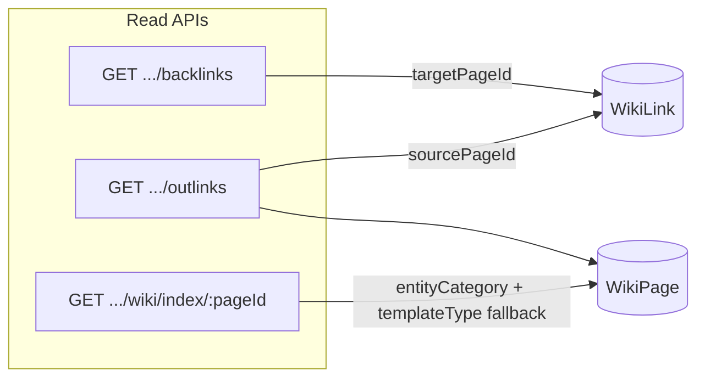

# Bi-directional wiki references and cross-hierarchy index

## Context

Recent work added [`WikiLink`](backend/prisma/schema.prisma) (`campaignId`, `sourcePageId`, `targetPageId`) and [`getWikiBacklinks`](backend/src/controllers/wikiController.ts) backed by [`wikiLinkService.ts`](backend/src/lib/wikiLinkService.ts). Category indices still use **direct children only** in [`getCategoryIndex`](backend/src/controllers/wikiController.ts) (`parentId === categoryPageId`). The UI widget is [`BacklinksWidget.tsx`](frontend/src/components/wiki/widgets/BacklinksWidget.tsx) registered as block type `wiki-backlinks`.

**Route convention:** Esiana mounts wiki APIs at `/api/c/:campaignSlug/wiki/...` (not bare `/api/wiki/...`). The outlinks endpoint will follow that pattern.



---

## 1. Backend: Outlinks API

### Service ([`backend/src/lib/wikiLinkService.ts`](backend/src/lib/wikiLinkService.ts))

Add `getWikiOutlinksForPage` mirroring `getWikiBacklinksForPage`:

- Query `WikiLink` where `campaignId` + `sourcePageId = pageId`
- Join `targetPage`; apply same visibility filter as backlinks (DM/Co-DM see all; players see `Public`/`Party` targets)
- Map rows to `WikiOutlinkRow`: `{ id, title, type, parentId, visibility, updatedAt, breadcrumbLabel, href }`
  - `type` ← `targetPage.templateType` (this is Esiana’s entity-type field today)
  - `href` ← `buildWikiPageHref`; use `/characters/:id` when `type === 'CHARACTER'` (mirror [`campaignCategoryChildPath`](frontend/src/lib/campaignPaths.ts))

### Controller + route

- Add `getWikiOutlinks` in [`wikiController.ts`](backend/src/controllers/wikiController.ts) → `{ outlinks, total }`
- Register in [`campaignScoped.ts`](backend/src/routes/campaignScoped.ts) **before** `GET /wiki/:pageId` to avoid param shadowing:

```ts
campaignScopedRouter.get('/wiki/:pageId/outlinks', getWikiOutlinks);
```

(Place next to existing `/backlinks` and `/link-integrity` routes.)

---

## 2. Frontend: References widget (bi-directional)

### Rename / refactor

| From | To |
|------|-----|
| `BacklinksWidget.tsx` | `ReferencesWidget.tsx` (new primary export) |
| `BacklinksWidget` | Re-export alias for backward compatibility (optional thin wrapper) |

Keep block type **`wiki-backlinks`** in schema/registry so existing layouts do not break; update labels in [`wikiWidgets.ts`](frontend/src/utils/wikiWidgets.ts) to **“References”**.

### Tab UI

No dedicated `Tabs` primitive exists; reuse the button-row pattern from [`WikiContentTabs.tsx`](frontend/src/components/wiki/WikiContentTabs.tsx):

- **Tab 1 — “Linked Here”:** existing backlinks fetch via `fetchWikiBacklinks`
- **Tab 2 — “Mentions”:** new `fetchWikiOutlinks` → `GET /c/:slug/wiki/:pageId/outlinks`

Each tab owns independent state: `loading | error | empty | list`, skeleton rows, and retry. Lazy-fetch outlinks on first tab activation to avoid extra requests on pages that never open Mentions.

### API client ([`frontend/src/lib/wiki.ts`](frontend/src/lib/wiki.ts))

```ts
export interface WikiOutlink {
  id: string;
  title: string;
  type: string;
  parentId: string | null;
  breadcrumbLabel?: string;
  href?: string;
}
export async function fetchWikiOutlinks(campaignSlug, pageId): Promise<WikiOutlink[]>
```

### Wire-up

- Update [`WidgetRegistry.tsx`](frontend/src/components/wiki/WidgetRegistry.tsx) to render `ReferencesWidget`
- Panel header: **“References”** with per-tab counts when loaded

---

## 3. Backend: Type-based category index aggregation

### Shared category → entity mapping (new helper)

Create [`backend/src/lib/wikiCategoryEntityIndex.ts`](backend/src/lib/wikiCategoryEntityIndex.ts) (frontend mirror optional in [`frontend/src/lib/wikiCategoryEntityIndex.ts`](frontend/src/lib/wikiCategoryEntityIndex.ts)):

| Category folder title | Primary filter |
|----------------------|----------------|
| Characters | `templateType: 'CHARACTER'` |
| Locations | `templateType: 'LOCATION'` |
| All index categories | `metadata.entityCategory === categoryTitle` |

### Stamp `metadata.entityCategory` on create

- [`CreatePageModal.tsx`](frontend/src/components/CreatePageModal.tsx): when `parentId` is a category folder (index create flow), set `metadata: { ...existing, entityCategory: categoryTitle }`
- [`createWikiPage`](backend/src/controllers/wikiController.ts): merge `entityCategory` from body metadata if provided; do not strip unknown metadata keys

### Refactor `getCategoryIndex`

Replace direct-child query with campaign-wide aggregation:

```ts
where: {
  campaignId,
  OR: [
    { metadata: { path: ['entityCategory'], equals: category.title } }, // Prisma JSON filter
    ...templateTypeFallbackOrConditions(category.title),
  ],
  ...wikiPageVisibilityFilter(canManage),
}
```

- Include `templateType` in select; return `type: child.templateType` on each child row
- Add optional `entityCategory` on response child objects for debugging/UI
- Sort with existing [`compareWikiTitles`](backend/src/lib/wikiSort.js)
- Keep `category` envelope unchanged for compatibility

**Backfill (lightweight):** no migration script required for v1; Characters/Locations still appear via `templateType` fallback until re-saved or a future admin backfill sets `entityCategory`.

---

## 4. Frontend: Location trails in index views

### Types ([`frontend/src/lib/wiki.ts`](frontend/src/lib/wiki.ts))

Extend `CategoryIndexChild`:

```ts
templateType?: string;
locationTrail?: string | null; // preformatted "Sword Coast › Shadowdale" or null when at category root
```

Backend *may* omit `locationTrail` and let the client compute it; preferred approach: **compute client-side** with existing helpers to avoid duplicating hierarchy logic.

### [`WikiIndexView.tsx`](frontend/src/components/wiki/WikiIndexView.tsx) + [`IndexGridView.tsx`](frontend/src/components/IndexGridView.tsx)

For each child:

1. `pageById = buildWikiPageLookup(flatPages)` (already in WikiIndexView)
2. If `child.parentId === categoryPageId` → no trail (standard root placement)
3. Else:
   - `parentChain = resolveWikiParentChain(child.id, null, pageById)`
   - `crumbs = buildWikiBreadcrumbs(parentChain)` (structural dividers already stripped)
   - Exclude the category folder title and the child’s own title from the trail
   - Render muted subtext: `located in: Sword Coast → Shadowdale` (use `→` or `›` consistently with breadcrumbs)

Apply in **both** list (`IndexGridView` title cell) and card (`IndexCardView`) layouts.

Extract a tiny helper `formatIndexLocationTrail(child, categoryPageId, categoryTitle, pageById)` in [`frontend/src/lib/wikiHierarchy.ts`](frontend/src/lib/wikiHierarchy.ts) to keep components clean.

---

## 5. Files to change

**Backend**

- [`backend/src/lib/wikiLinkService.ts`](backend/src/lib/wikiLinkService.ts) — `getWikiOutlinksForPage`
- [`backend/src/controllers/wikiController.ts`](backend/src/controllers/wikiController.ts) — `getWikiOutlinks`, refactor `getCategoryIndex`, `createWikiPage` metadata merge
- [`backend/src/routes/campaignScoped.ts`](backend/src/routes/campaignScoped.ts) — outlinks route
- **New** [`backend/src/lib/wikiCategoryEntityIndex.ts`](backend/src/lib/wikiCategoryEntityIndex.ts)

**Frontend**

- **New** [`frontend/src/components/wiki/widgets/ReferencesWidget.tsx`](frontend/src/components/wiki/widgets/ReferencesWidget.tsx)
- [`frontend/src/components/wiki/WidgetRegistry.tsx`](frontend/src/components/wiki/WidgetRegistry.tsx)
- [`frontend/src/lib/wiki.ts`](frontend/src/lib/wiki.ts) — outlink types + fetch
- [`frontend/src/types/wiki.ts`](frontend/src/types/wiki.ts) — optional shared outlink type
- [`frontend/src/components/wiki/WikiIndexView.tsx`](frontend/src/components/wiki/WikiIndexView.tsx)
- [`frontend/src/components/IndexGridView.tsx`](frontend/src/components/IndexGridView.tsx)
- [`frontend/src/components/CreatePageModal.tsx`](frontend/src/components/CreatePageModal.tsx)
- [`frontend/src/lib/wikiHierarchy.ts`](frontend/src/lib/wikiHierarchy.ts) — `formatIndexLocationTrail`
- [`frontend/src/utils/wikiWidgets.ts`](frontend/src/utils/wikiWidgets.ts) — label “References”

---

## 6. Verification

1. Page A links to B in TipTap → save layout → open A → **Mentions** lists B; open B → **Linked Here** lists A.
2. Create character under `Locations › Shadowdale` → **Characters** index shows entry with location trail; not limited to direct children of Characters folder.
3. Create object from Objects index → appears in Objects index even if nested under a location folder (`entityCategory: 'Objects'`).
4. Player role: outlinks/backlinks respect visibility; DM sees DM-only sources/targets.
5. Existing pages with `wiki-backlinks` block still render the upgraded References widget.
