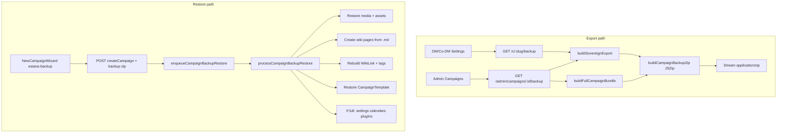

# Unified Campaign Backup & Sovereign Export

## Context

Today, backup is **admin-only** and ships as **gzip JSON v1** with base64-embedded media ([`backend/src/lib/campaignBackup.ts`](backend/src/lib/campaignBackup.ts) → `GET /api/admin/campaigns/:campaignId/backup`). Wiki content lives as JSON blocks in the DB, not markdown files. Obsidian ZIP import ([`backend/src/lib/campaignImportProcessor.ts`](backend/src/lib/campaignImportProcessor.ts)) is the inverse pattern to mirror for export/restore.

The wizard already advertises Esiana backup restore as `.zip` ([`frontend/src/components/hub/NewCampaignWizard.tsx`](frontend/src/components/hub/NewCampaignWizard.tsx) lines 132–136) but it is `planned: true` with no handler.

## Goals (from todo lines 117–118)

| Item | Deliverable |
|------|-------------|
| Unified campaign backup engine | Downloadable `.zip` packaging wiki, templates, and relations |
| Sovereign content export | Human-portable Markdown + YAML frontmatter + isolated `media/` inside the ZIP |

**Access (per your answers):**
- **DM/Co-DM**: export content scoped to their campaign (sovereign layer only)
- **Site admin**: full-restore bundle (sovereign layer + machine bundle with all campaign settings)

**In scope:** export **and** restore in this phase.

---

## ZIP format: `esiana-campaign-backup-v2`

```
manifest.json                 # format, exportedAt, exportKind, campaign meta
sovereign/
  wiki/                       # hierarchical .md files (folder path from parent tree)
  media/
    manifest.json             # assetId → filename, type, originalUrl
    {assetId}.{ext}           # binary files (no base64)
  templates/
    {folder}/{name}.json      # CampaignTemplate blocks + metadata
  relations.json              # WikiLink edges + page↔tag map + parent tree index
esiana/                       # admin full export only (exportKind: "full")
  campaign.json               # Prisma-shaped dump (v1 fields, media as refs not base64)
```

**`manifest.json` essentials:**
```json
{
  "format": "esiana-campaign-backup-v2",
  "exportKind": "sovereign" | "full",
  "exportedAt": "2026-05-29T…",
  "campaign": { "id", "name", "slug", "gameSystem", "language", "version": 1 }
}
```

**Fix v1 gaps in full bundle:** include `WikiLink`, `CalendarEvent`, `CalendarEventCategory`, and `MapPin` (currently missing from [`buildCampaignBackupBundle`](backend/src/lib/campaignBackup.ts)).

Keep **v1 gzip** readable for one release cycle; new downloads use v2 ZIP. Admin UI filename changes from `.json.gz` → `.zip`.

---

## Architecture



---

## Backend modules (new / refactored)

### 1. Sovereign markdown export — `backend/src/lib/campaignExport/`

| File | Responsibility |
|------|----------------|
| `serializeFrontMatter.ts` | Inverse of [`markdownFrontMatter.ts`](backend/src/lib/markdownFrontMatter.ts): emit `---` YAML block |
| `wikiPageToMarkdown.ts` | WikiPage → `{ relativePath, markdown }` |
| `rewriteMarkdownForExport.ts` | Reverse import transforms: TipTap mentions → `[[Title]]`, `/api/assets/:id` and `/uploads/*` → `` |
| `buildWikiTreePaths.ts` | Walk `parentId` chain; slugify titles; disambiguate collisions with `esiana_id` suffix |
| `buildSovereignExport.ts` | Load campaign wiki pages, tags, wikiLinks, campaignTemplates, assets; produce in-memory file map |
| `buildCampaignBackupZip.ts` | JSZip assembly + stream helper (reuse existing `jszip` dep) |

**Markdown conversion rules:**
- Concatenate all `text-tiptap` blocks with `\n\n---\n\n` (same separator as [`sessionNotesCompile.ts`](backend/src/lib/sessionNotesCompile.ts))
- Folder-only pages (no text blocks): emit frontmatter-only `index.md` under their path
- Frontmatter fields: `title`, `esiana_id`, `templateType`, `visibility`, `tags`, `blurb`, character/session metadata keys, `parent_esiana_id`
- Non-text blocks (`stat-block`, `wiki-infobox`): append as fenced ` ```esiana/block ` sections so content is not lost
- Skip `wiki-backlinks` blocks (relations.json is canonical)
- DM export: include all pages (DM owns the world; no player-facing export endpoint)

**`relations.json` shape:**
```json
{
  "links": [{ "sourcePageId", "targetPageId", "sourceTitle", "targetTitle" }],
  "tags": [{ "pageId", "tagName", "tagLabel" }],
  "tree": [{ "pageId", "parentId", "title", "path" }]
}
```

### 2. Full admin bundle — extend [`campaignBackup.ts`](backend/src/lib/campaignBackup.ts)

- Rename/refactor to `buildFullCampaignBundle()` producing `esiana/campaign.json`
- Media files live only under `sovereign/media/` (deduplicated); `campaign.json` references asset IDs → filenames via manifest
- Expand Prisma `include` for wikiLinks, calendar events/categories, mapPins

### 3. Restore — `backend/src/lib/campaignBackupRestore.ts`

Mirror import processor phases from [`campaignImportProcessor.ts`](backend/src/lib/campaignImportProcessor.ts):

1. Validate `manifest.json` (`v2` only initially; optional v1 gzip detection with clear error)
2. **Media pass:** copy `sovereign/media/*` to uploads dir; create `Asset` rows; build oldId→newId map
3. **Tree pass:** create folder pages from `relations.json.tree` (preserve hierarchy before leaf pages)
4. **Wiki pass:** parse each `.md`; map frontmatter → `WikiPage` fields + `metadata`; body → `text-tiptap` block(s); rewrite `media/` refs → `/api/assets/:id`
5. **Relations pass:** insert `WikiLink` rows from `relations.json.links` (remap page IDs via `esiana_id` lookup table)
6. **Templates pass:** upsert `CampaignTemplate` rows from `sovereign/templates/`
7. **Full-only pass:** restore `templateSettings`, `sidebarConfig`, `dashboardConfig`, `fantasyCalendars`, `pluginSettings`, etc. from `esiana/campaign.json`
8. **Members:** on wizard restore, assign creating user as DM only; store exported member emails in manifest metadata for manual re-invite (avoid broken FK to missing users)
9. Run `syncWikiLinksForSourcePage` as final validation sweep

Queue wrapper: `enqueueCampaignBackupRestore()` in [`importQueue.ts`](backend/src/lib/importQueue.ts) (parallel to Obsidian path).

### 4. API routes

| Route | Auth | Returns |
|-------|------|---------|
| `GET /api/c/:slug/backup` | `requireCampaignDm` | sovereign ZIP |
| `GET /api/admin/campaigns/:campaignId/backup` | admin | full ZIP (upgrade existing route) |
| `POST /api/campaigns` (existing) | authenticated | accept `backupZipFile` field alongside `markdownZipFile` |

Controller: new `campaignBackupController.ts` for DM export; update [`adminCampaignsController.ts`](backend/src/controllers/adminCampaignsController.ts) to stream ZIP.

Wire in [`campaignScoped.ts`](backend/src/routes/campaignScoped.ts) and [`campaigns.ts`](backend/src/routes/campaigns.ts) multer fields.

---

## Frontend

| Location | Change |
|----------|--------|
| [`CampaignSettingsPage.tsx`](frontend/src/pages/CampaignSettingsPage.tsx) | Add **Data & backup** tab (or extend Status tab) with “Download campaign backup” for DM/Co-DM |
| New `frontend/src/lib/campaignBackup.ts` | `downloadCampaignBackup(slug)` → blob download from `/api/c/:slug/backup` |
| [`AdminCampaignsPage.tsx`](frontend/src/pages/AdminCampaignsPage.tsx) + [`adminCampaigns.ts`](frontend/src/lib/adminCampaigns.ts) | Update for `.zip` content type / filename |
| [`NewCampaignWizard.tsx`](frontend/src/components/hub/NewCampaignWizard.tsx) | Enable `esiana-backup` source: file input for `.zip`, upload as `backupZipFile`, set `planned: false` |

UI copy: DM button = “Download backup (Markdown + media)”; admin = “Download full restore backup”.

---

## Tests

| Test file | Cases |
|-----------|-------|
| `wikiPageToMarkdown.test.ts` | single/multi text blocks; mention → wikilink; asset URL rewrite; frontmatter from metadata |
| `serializeFrontMatter.test.ts` | round-trip with parser |
| `campaignBackupRestore.test.ts` | minimal ZIP fixture: 3 pages, 1 link, 1 asset, 1 template → assert DB state |
| `buildCampaignBackupZip.test.ts` | manifest + folder layout assertions |

Use in-memory JSZip buffers; no disk I/O in unit tests.

---

## Rollout notes

- **Large campaigns:** stream ZIP generation where possible; consider background task + download link if ZIP build exceeds ~30s (defer unless needed in first pass)
- **v1 compatibility:** admin restore accepts v2; document v1 gzip as legacy read-only export
- **Security:** DM route scoped by campaign membership; admin route unchanged; restore ZIP validated server-side (manifest format, size limits matching import)
- **Changelog / todo:** mark lines 117–118 done; note wizard restore enabled

---

## Implementation order

1. Sovereign export lib (markdown + media + relations + templates) + unit tests
2. ZIP builder + DM download endpoint + Campaign Settings UI
3. Restore processor + wizard wiring + integration test
4. Admin full bundle + upgrade admin endpoint
5. End-to-end manual test: export → new campaign restore → verify wiki tree, links, images, templates
