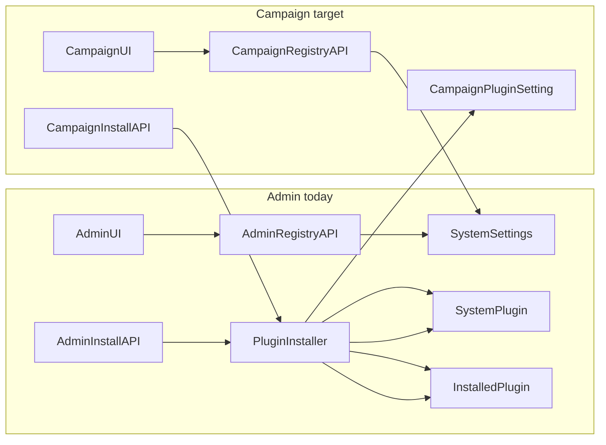

# Campaign Registry Browse (follow-up to v0.8.0)

## Goal

Implement the out-of-scope item from [plugin_registry_activation_ee645924.plan.md](c:\Users\allison\.cursor\plans\plugin_registry_activation_ee645924.plan.md): **campaign registry browse in [`CampaignPluginsSettingsTab.tsx`](frontend/src/components/campaign/CampaignPluginsSettingsTab.tsx)**, mirroring [`AdminPluginsTab.tsx`](frontend/src/components/admin/AdminPluginsTab.tsx).

User choice: **full install parity** — SHA-pinned tarball download, extract to versioned `plugins/{id}/{commitSha}/`, and `InstalledPlugin` upsert (same as admin). Per-campaign runtime enablement remains a known gap: `CampaignPluginSetting.isEnabled` does not yet drive PluginHost (Phase 10); `InstalledPlugin` rows are created **disabled** until a future bridge or global enable.

## Current gaps

| Layer | Admin (done) | Campaign (today) |
|-------|--------------|-------------------|
| Registry fetch | `GET /api/admin/plugins/registry` | None — UI has link-only install |
| Registry install | `POST /api/admin/plugins/install-from-registry` | None |
| Scope filter | `scope === global` | N/A |
| Auth | `SYSTEM_ADMIN` | `requireOperationalManager` on [`campaigns.ts`](backend/src/routes/campaigns.ts) |
| Install artifact | [`pluginInstaller.ts`](backend/src/lib/pluginInstaller.ts) tarball + dual DB | [`installCampaignPluginFromLink`](backend/src/controllers/campaignPluginsController.ts) metadata only |

Registry already contains campaign stubs ([`plugins/registry.json`](plugins/registry.json): `aurora-theme`, `initiative-widget`, `wiki-opds-feed` with `scope: "campaign"`).

---

## Backend changes

### 1. Refactor [`pluginInstaller.ts`](backend/src/lib/pluginInstaller.ts)

Extract scope-aware install so admin and campaign share tarball/manifest/InstalledPlugin logic:

- **`ensurePluginPackageOnDisk(entry, manifest)`** — existing GitHub download/extract (unchanged SHA rules)
- **`installPluginFromRegistryEntry(entry, options)`** where `options` is:
  - `{ mode: 'global' }` → `assertGlobalScope` + `registerGlobalPluginFromManifest` (current behavior)
  - `{ mode: 'campaign', campaignId: string }` → `assertCampaignScope` + `registerCampaignPluginFromManifest(campaignId, manifest)`
- Both modes: upsert `InstalledPlugin` when manifest has `backendEntry`/`frontendEntry`; call `reloadPluginHost()` only if an enabled plugin row changed (install leaves disabled)
- Return type extended for campaign: `{ ..., campaignPlugin: CampaignPluginSettingRecord }`

Update [`installAdminPluginFromRegistry`](backend/src/controllers/adminSystemPluginsController.ts) to call the refactored helper with `mode: 'global'`.

### 2. Campaign controller + routes

Add to [`campaignPluginsController.ts`](backend/src/controllers/campaignPluginsController.ts):

| Handler | Behavior |
|---------|----------|
| **`fetchCampaignPluginRegistry`** | Read `pluginRegistryUrl` from [`getOrCreateSystemSettings()`](backend/src/lib/systemSettings.ts) → [`fetchAndParsePluginRegistry`](backend/src/lib/fetchPluginRegistry.ts) → return `{ registryUrl, plugins }` |
| **`installCampaignPluginFromRegistry`** | Parse/validate `entry` body → `installPluginFromRegistryEntry(entry, { mode: 'campaign', campaignId })` |

Wire in [`campaigns.ts`](backend/src/routes/campaigns.ts) **before** `/:pluginId` routes:

- `GET /:campaignId/plugins/registry` — `attachCampaignByIdParam`, `requireOperationalManager`
- `POST /:campaignId/plugins/install-from-registry` — same middleware

### 3. Campaign plugin meta parity

Update [`buildCampaignPluginDefinitionConfig`](backend/src/lib/campaignPlugins.ts) to persist `category` (and optional `configSchemaUrl` stub) in `__manifest`, matching [`systemPlugins.ts`](backend/src/lib/systemPlugins.ts). Extend `serializeCampaignPluginSetting` / frontend `CampaignPluginSettingRecord.plugin` with optional `category`.

---

## Frontend changes

### 1. Shared registry UI (reduce duplication)

Extract from [`AdminPluginsTab.tsx`](frontend/src/components/admin/AdminPluginsTab.tsx):

| Component | Responsibility |
|-----------|----------------|
| **`PluginRegistrySyncSection`** | Sync button, optional URL input (admin) vs read-only system URL note (campaign), warnings |
| **`PluginDiscoveryGrid`** | Category chips, cards, install state, SHA snippet, scope/installable badges |

Props: `entries`, `installedIds`, `scopeLabel`, `categoryFilter`, `onInstall`, `installingId`, `showRegistryUrlEditor`, `registryUrl`, `onRegistryUrlChange`.

### 2. Campaign API client

Extend [`campaignPlugins.ts`](frontend/src/lib/campaignPlugins.ts):

- `fetchCampaignPluginRegistry(campaignId)`
- `installCampaignPluginFromRegistry(campaignId, entry)`

### 3. Update [`CampaignPluginsSettingsTab.tsx`](frontend/src/components/campaign/CampaignPluginsSettingsTab.tsx)

Add sections above manifest link (keep link install as fallback):

1. **Sync registry** — calls `fetchCampaignPluginRegistry`; no URL editing (copy: “Uses the system registry URL from Admin → Plugins”)
2. **Discoverable from registry** — filter `scope === campaign` (inverse of admin’s global filter); show warning when global entries hidden
3. **Install** — `installCampaignPluginFromRegistry`; refresh installed list; remove entry from discovery grid on success

Refactor [`AdminPluginsTab.tsx`](frontend/src/components/admin/AdminPluginsTab.tsx) to use shared components (behavior unchanged).

---

## Testing

Add to [`pluginManifest.test.ts`](backend/src/lib/pluginManifest.test.ts) or new [`pluginInstaller.test.ts`](backend/src/lib/pluginInstaller.test.ts):

- Campaign-mode install calls `assertCampaignScope` (reject global entry)
- Admin-mode still rejects campaign entry

Optional lightweight controller test with mocked `fetch` for tarball path (follow admin pattern if present).

Manual: as campaign DM/co-DM → Campaign Settings → Plugins → Sync → see `aurora-theme` etc. → install campaign entry with valid `source` + SHA → verify `SystemPlugin`, `CampaignPluginSetting`, and `InstalledPlugin` rows.

---

## Out of scope (document in PR)

- Bridging `CampaignPluginSetting.isEnabled` → PluginHost / per-campaign runtime routing (Phase 10 UI slots + lifecycle)
- Campaign managers editing `pluginRegistryUrl` (remains system-admin setting)
- Signature/trust verification of registry publisher
