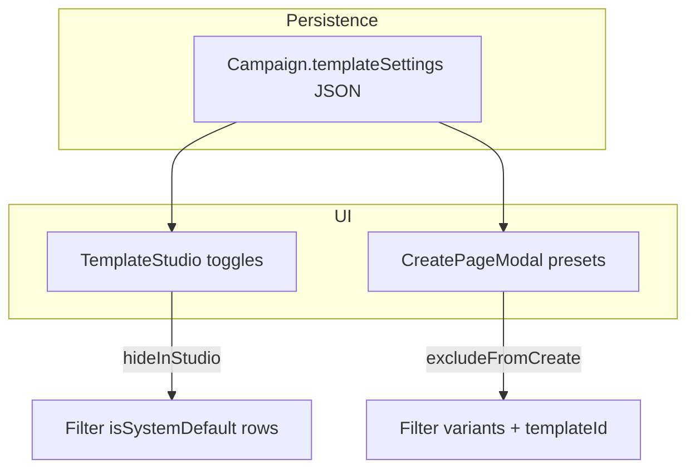

# Campaign system-default template policy

## Goal

DMs/Co-DMs can control how **global** templates (`CampaignTemplate` with `campaignId: null`, `isSystemDefault: true`) appear in their campaign:

| Toggle | Effect |
|--------|--------|
| **Hide system defaults in Template Studio** | System rows not listed on [`CampaignTemplatesPage`](frontend/src/pages/CampaignTemplatesPage.tsx); campaign custom templates still visible. Duplicate-from-system is unavailable while hidden (rows are not shown). |
| **Exclude system defaults from page creation** | [`CreatePageModal`](frontend/src/components/CreatePageModal.tsx) preset picker omits system variants; no `templateId` for global rows; falls back to campaign custom templates, then [`buildDefaultBlocks`](frontend/src/utils/pageTemplates.ts). |

Toggles are **independent** (per your choice): e.g. hide in studio but still allow presets on create, or the reverse.



---

## 1. Data model and normalization

**Schema:** Add optional JSON column on [`Campaign`](backend/prisma/schema.prisma):

```prisma
templateSettings Json?
```

**Shape** (new shared module [`backend/src/lib/templateSettings.ts`](backend/src/lib/templateSettings.ts), mirrored in frontend [`frontend/src/lib/templateSettings.ts`](frontend/src/lib/templateSettings.ts)):

```ts
export interface TemplateSettings {
  hideSystemDefaultsInStudio: boolean;      // default false
  excludeSystemDefaultsFromPageCreate: boolean; // default false
}
```

- `normalizeTemplateSettings(raw): TemplateSettings` — coerce booleans, default false
- Prisma migration: `templateSettings` nullable JSON column

---

## 2. API: read and write settings

**Read:** Include `templateSettings` in wiki tree campaign payload ([`wikiController.ts`](backend/src/controllers/wikiController.ts) `getWikiTree` select + response `campaign` object, ~line 157–220).

**Write:** New handler [`backend/src/controllers/campaignTemplateSettingsController.ts`](backend/src/controllers/campaignTemplateSettingsController.ts) (or extend [`campaignSettings.ts`](backend/src/controllers/campaignSettings.ts)):

- `PATCH /api/c/:campaignSlug/settings/templates` (and legacy `/api/campaign/:id/...` via existing scoped router)
- Middleware: `requireOperationalManager` (same as template CRUD)
- Body: partial `{ hideSystemDefaultsInStudio?, excludeSystemDefaultsFromPageCreate? }`
- Returns normalized `templateSettings`

**Frontend client:** [`frontend/src/lib/campaigns.ts`](frontend/src/lib/campaigns.ts) — `updateCampaignTemplateSettings(campaignSlug, partial)`

**Types:** Extend [`WikiCampaignMeta`](frontend/src/types/wiki.ts) with `templateSettings?: TemplateSettings`

---

## 3. Template Studio UI (campaign mode only)

In [`TemplateStudio.tsx`](frontend/src/components/templates/TemplateStudio.tsx) when `mode === 'campaign'`:

- New props: `templateSettings`, `canManageSettings`, `onTemplateSettingsChange`
- **Settings strip** below header (DM/Co-DM only): two labeled toggles with short help text
  - “Hide system defaults in Template Studio”
  - “Exclude system defaults when creating pages”
- On toggle: call `updateCampaignTemplateSettings`, then `refresh()` wiki context (from parent)
- **List filtering:** After fetch, if `hideSystemDefaultsInStudio`, `templates.filter(t => !t.isSystemDefault)` before `templatesByFolder`
- Empty states: if a folder only had system rows and they are hidden, show existing dashed “No templates” card

Wire from [`CampaignTemplatesPage.tsx`](frontend/src/pages/CampaignTemplatesPage.tsx):

```tsx
const { campaign, campaignSlug, refresh } = useWiki();
const canManage = campaign?.role === 'DM' || campaign?.role === 'Co-DM';
```

Pass `campaign?.templateSettings` and refresh callback into `TemplateStudio`.

---

## 4. Create Page modal integration

In [`CreatePageModal.tsx`](frontend/src/components/CreatePageModal.tsx):

- Accept `templateSettings?: TemplateSettings` (from parent wiki index / category views that open the modal — grep `CreatePageModal` usages and pass `campaign?.templateSettings`)
- When `excludeSystemDefaultsFromPageCreate`:
  - Do **not** merge hardcoded [`folderVariants`](frontend/src/components/CreatePageModal.tsx) entries with `isSystemDefault: true`
  - Filter API `templates` to `!t.isSystemDefault` for the active folder
  - Resolve `templateId` only from remaining variants
  - Keep existing safe fallback: `buildDefaultBlocks(templateType)` when no `templateId`
- If no variants remain: keep single option “Built-in layout” (no system label) using code fallback only

---

## 5. Optional backend enforcement (recommended)

In [`wikiController.ts`](backend/src/controllers/wikiController.ts) page create (~line 293–305), when `templateId` is provided:

- Load campaign `templateSettings`
- If `excludeSystemDefaultsFromPageCreate` and resolved template has `campaignId: null`, return **400** with clear error *or* ignore `templateId` and fall through to `buildDefaultBlocks` (prefer **400** for API clarity; modal already prevents this)

Prevents bypass via devtools/API while setting is on.

---

## 6. Tests

- **Backend:** `templateSettings.test.ts` — normalize defaults; PATCH merges partial updates
- **Frontend logic (optional):** small pure helper `filterTemplatesForStudio(templates, settings)` / `buildCreatePageVariants(...)` unit-tested or covered by backend-only tests of shared rules duplicated minimally

---

## 7. Out of scope

- Per-folder policies (global on/off only)
- Hiding campaign custom templates
- Changes to Admin → Page Templates (system mode unchanged)
- Auto-duplicating system templates when excluded (DMs duplicate manually if needed)

---

## Files to touch

| Area | Files |
|------|-------|
| Schema / migration | [`schema.prisma`](backend/prisma/schema.prisma), new migration |
| Settings lib + API | `backend/src/lib/templateSettings.ts`, controller, [`campaignScoped.ts`](backend/src/routes/campaignScoped.ts) |
| Wiki payload | [`wikiController.ts`](backend/src/controllers/wikiController.ts) |
| Wiki create guard | [`wikiController.ts`](backend/src/controllers/wikiController.ts) |
| Frontend types/API | `frontend/src/lib/templateSettings.ts`, [`campaigns.ts`](frontend/src/lib/campaigns.ts), [`wiki.ts` types](frontend/src/types/wiki.ts) |
| UI | [`TemplateStudio.tsx`](frontend/src/components/templates/TemplateStudio.tsx), [`CampaignTemplatesPage.tsx`](frontend/src/pages/CampaignTemplatesPage.tsx), [`CreatePageModal.tsx`](frontend/src/components/CreatePageModal.tsx) + call sites |

---

## Verification

1. Both toggles off — current behavior unchanged (system rows visible; presets include system defaults).
2. Hide in studio only — Template Studio shows campaign templates only; Create Page still offers NPC/Town/etc.
3. Exclude from create only — Studio still shows system rows (duplicate works); Create Page shows only campaign custom + built-in fallback.
4. Both on — studio and create picker exclude globals; new pages use custom template or `buildDefaultBlocks`.
5. Toggle persists after reload; Co-DM can change; players cannot.
