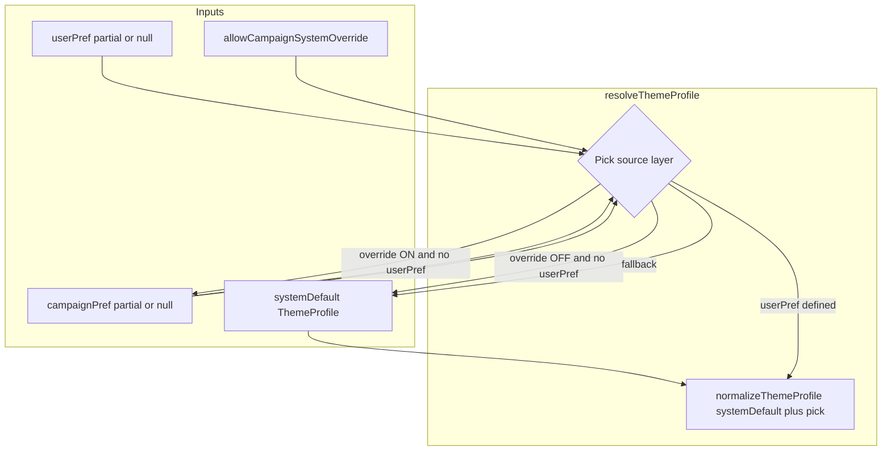

# Cascading Theme Resolver

## Current state

- **System default** lives on [`SystemSetting`](backend/prisma/schema.prisma) as legacy fields (`globalThemePreset`, `globalPalette`, `applyBackgroundTint`), converted via [`legacyBrandingToThemeProfile`](frontend/src/lib/theme/themeProfile.ts) in [`BrandingContext`](frontend/src/contexts/BrandingContext.tsx).
- **Campaign** only has `themePreset` (string); [`CampaignLayout`](frontend/src/layouts/CampaignLayout.tsx) applies a CSS class on `.campaign-theme-shell`, separate from global `applyThemeProfile()` on `<html>`.
- **User** has no appearance fields; [`UserSettings`](frontend/src/pages/UserSettings.tsx) has no appearance tab.
- **Admin UI** is a monolithic [`AdminAppearanceTab`](frontend/src/components/admin/AdminBrandingTab.tsx) (~550 lines).

## Resolution model



**Rules (aligned with spec + your default choice):**

| User `appearanceProfile` | `allowCampaignSystemOverride` | Effective source |
|---|---|---|
| set (custom profile) | ON or OFF | **user** (user always wins when defined) |
| `null` (“Use Campaign/System Default”) | ON | **campaign** → **system** |
| `null` | OFF | **system** only (campaign bypassed) |

“Defined” = non-null `appearanceProfile` JSON on the user. Partial objects are merged into a complete profile via `normalizeThemeProfile({ ...systemDefault, ...partial })`.

## 1. New resolver module

Create [`frontend/src/lib/theme/themeResolver.ts`](frontend/src/lib/theme/themeResolver.ts):

```ts
export interface ThemeResolutionInputs {
  userPref?: Partial<ThemeProfile> | null;
  campaignPref?: Partial<ThemeProfile> | null;
  systemDefault: ThemeProfile;
  allowCampaignSystemOverride?: boolean; // default true
}

export function resolveThemeProfile(inputs: ThemeResolutionInputs): ThemeProfile
export function isAppearanceProfileDefined(pref: unknown): pref is Partial<ThemeProfile>
```

- Re-export from [`frontend/src/lib/theme/index.ts`](frontend/src/lib/theme/index.ts).
- Add shared JSON parse/validate helper [`frontend/src/lib/theme/parseAppearanceProfile.ts`](frontend/src/lib/theme/parseAppearanceProfile.ts) (safe parse + `normalizeThemeProfile`).

Mirror validation on the backend in [`backend/src/lib/appearanceProfile.ts`](backend/src/lib/appearanceProfile.ts) (shape check for foundation/genre/identity/palette/tint keys; reject unknown palette/preset ids using existing [`globalPalette`](backend/src/lib/globalPalette.ts) / [`themePresets`](backend/src/lib/themePresets.ts) helpers).

## 2. Database & API

### Prisma ([`backend/prisma/schema.prisma`](backend/prisma/schema.prisma))

| Model | New fields |
|---|---|
| `User` | `appearanceProfile Json?`, `allowCampaignSystemOverride Boolean @default(true)` |
| `Campaign` | `appearanceProfile Json?` |

Keep `Campaign.themePreset` and `SystemSetting` legacy columns during transition; **dual-write** `themePreset` from `themeProfileToLegacyBranding(profile).globalThemePreset` when saving campaign appearance so [`CampaignLayout`](frontend/src/layouts/CampaignLayout.tsx) and old clients keep working until unified.

Migration: `backend/prisma/migrations/<timestamp>_appearance_profile/migration.sql`.

### Backend handlers

- **[`userController.ts`](backend/src/controllers/userController.ts):** include `appearanceProfile`, `allowCampaignSystemOverride` in GET profile; accept updates in PUT (`appearanceProfile`, `allowCampaignSystemOverride`, existing profile keys).
- **[`campaignsController.ts`](backend/src/controllers/campaignsController.ts):** accept `appearanceProfile` on campaign update; serialize in campaign GET/settings responses; backfill read: if `appearanceProfile` null, derive partial profile from `themePreset` via legacy mapper.
- **[`wikiController.ts`](backend/src/controllers/wikiController.ts):** return `appearanceProfile` on campaign payload (alongside `themePreset`).
- **[`systemSettings.ts`](backend/src/lib/systemSettings.ts):** unchanged for system default (still legacy branding fields); admin continues saving via existing branding API.

### Frontend types & clients

- Extend [`frontend/src/types/user.ts`](frontend/src/types/user.ts), [`frontend/src/types/campaign.ts`](frontend/src/types/campaign.ts), wiki types with `appearanceProfile` + user override flag.
- Extend [`frontend/src/lib/user.ts`](frontend/src/lib/user.ts) update input.

## 3. Extract `AppearanceBuilder`

Create [`frontend/src/components/appearance/AppearanceBuilder.tsx`](frontend/src/components/appearance/AppearanceBuilder.tsx) by moving shared UI from [`AdminBrandingTab.tsx`](frontend/src/components/admin/AdminBrandingTab.tsx):

- Props: `value`, `onChange`, `onPreview?`, `disabled?`, optional `headerSlot` / `footerSlot` for context-specific controls.
- Contains: global tinting bar, Foundation/Genre/Identity tabs, `SelectionCard`s, `PaletteSwatchPreview`, live preview via `applyThemeProfile`.
- Does **not** own save/load; parents handle persistence.

Refactor [`AdminAppearanceTab`](frontend/src/components/admin/AdminBrandingTab.tsx) to a thin shell: load/save admin branding + title/logo, pass profile into `AppearanceBuilder`.

## 4. Three integration surfaces

### Admin ([`AdminBrandingPage`](frontend/src/pages/AdminBrandingPage.tsx))
- Unchanged route; tab edits **systemDefault** (still persisted as legacy branding fields + optional future `appearanceProfile` on system is out of scope).

### User Settings ([`UserSettings.tsx`](frontend/src/pages/UserSettings.tsx))
- Add **Appearance** tab (4th tab or grouped under profile).
- `AppearanceBuilder` + two controls above builder:
  1. **“Use Campaign/System Default”** — when checked, save `appearanceProfile: null` (resolver skips user layer).
  2. **“Allow Campaign/System themes to override my settings”** — maps to `allowCampaignSystemOverride` (**default ON** for new/existing users per your choice).
- On toggle/change: call `applyThemeProfile(resolveThemeProfile(...))` for live preview using current campaign context when available (see below).
- Save via `updateUserProfile`.

### Campaign Settings ([`CampaignSettingsPage.tsx`](frontend/src/pages/CampaignSettingsPage.tsx))
- Replace [`CampaignThemeSettingsTab`](frontend/src/components/campaign/CampaignThemeSettingsTab.tsx) preset dropdown with `AppearanceBuilder` editing **campaignPref**.
- Save `appearanceProfile` (+ dual-write `themePreset`) on campaign PATCH.
- DM/co-DM only (existing settings permissions).

## 5. `BrandingContext` + runtime apply

Refactor [`BrandingContext.tsx`](frontend/src/contexts/BrandingContext.tsx):

1. Load **systemDefault** from `fetchPublicSystemStatus()` (existing).
2. When authenticated, load **userPref** + `allowCampaignSystemOverride` from `fetchUserProfile()`.
3. Expose `setCampaignAppearance(profile | null)` for campaign shell to register **campaignPref** when wiki/campaign loads.
4. Compute `resolvedProfile = resolveThemeProfile({...})` whenever any input changes.
5. Call `applyThemeProfile(resolvedProfile)` + existing localStorage cache helpers (cache resolved profile for FOUC; keep legacy keys synced via `themeProfileToLegacyBranding`).

Add small bridge in [`CampaignLayout.tsx`](frontend/src/layouts/CampaignLayout.tsx):

- `CampaignThemeBridge` effect: read `campaign.appearanceProfile` (fallback from `themePreset`), call `setCampaignAppearance`, clear on unmount.
- Remove duplicate `themeClass` logic on shell once global `applyThemeProfile` + `syncHtmlThemeClassFromProfile` drive campaign pages (shell keeps `campaign-theme-shell` wrapper for layout only).

## 6. Override & “use default” UX copy

Tooltip on override toggle (mirror admin tinting pattern):

> When enabled, your campaign’s appearance applies whenever you haven’t set a personal theme. Turn off to always use your personal theme or the system default.

“Use Campaign/System Default” hint:

> Clears your personal appearance so campaign and system settings apply (if override is allowed).

## 7. Testing & migration notes

- **Manual:** Admin save → logged-out user sees system; user custom profile → wins over campaign; user “use default” + override ON → campaign theme in campaign routes; override OFF + use default → system only inside campaigns.
- **Backfill:** campaigns with only `themePreset` continue working via read-time conversion until edited.
- **FOUC:** extend [`frontend/public/theme-init.js`](frontend/public/theme-init.js) only if needed to read cached resolved profile (optional follow-up; initial pass can keep legacy cache keys from `BrandingContext`).

## File touch summary

| Area | Primary files |
|---|---|
| Resolver | `themeResolver.ts`, `parseAppearanceProfile.ts`, `index.ts` |
| UI | `AppearanceBuilder.tsx`, `AdminBrandingTab.tsx`, `UserSettings.tsx`, `CampaignSettingsPage.tsx` |
| Context | `BrandingContext.tsx`, `CampaignLayout.tsx` |
| Backend | `schema.prisma`, migration, `appearanceProfile.ts`, `userController.ts`, `campaignsController.ts`, `wikiController.ts` |
| Types | `user.ts`, `campaign.ts`, `admin.ts` (minimal) |
