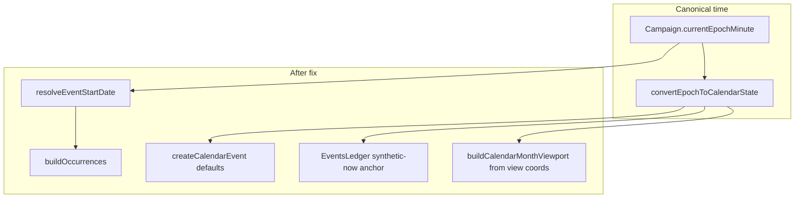

# Synchronize Chronology Navigation, Card Labels, and Ledger Offsets

## Execution safety (mandatory)

These constraints apply to every implementation step below:

1. **Iterative epoch resolution** — `calendarEpochMinuteForDate` must **not** assume a fixed days-per-year or static month-length multiplier. It must loop years and months from the calendar profile (`getMonthsForYear` / `parseMonths`), summing each segment’s actual `length` (including intercalary blocks), then add `(day - 1)` days in minutes. Mirror the forward logic used by `resolveCalendarDate` in [`frontend/src/lib/timeEngine.ts`](frontend/src/lib/timeEngine.ts).

2. **Decouple browser state from clock ticks** — In [`WidescreenCalendarView.tsx`](frontend/src/components/chronology/WidescreenCalendarView.tsx), `viewYear` / `viewMonthIndex` (and optional `viewDay`) must **not** sync from `timeBundle` or `selectedCalendar.state` on every render or `timeBundle` dependency change. Initialize only on: first mount for a calendar, `selectedCalendarId` change, and explicit **Today** click. Live clock updates must not snap the browsed month back to “now.”

3. **Stable synthetic ledger keys** — In [`EventsLedgerView.tsx`](frontend/src/components/chronology/EventsLedgerView.tsx), when the current campaign month has no events, inject a synthetic section with React `key="synthetic-now"` and `data-ledger-section="${now.year}-${now.month}"` via an early boundary pass (before mapping). `handleGoToCurrentDate` must query that stable attribute and no-op safely if the ref/container is missing (never assume a DOM node exists).

---

## Root causes

| Symptom | Cause |
|---------|--------|
| Calendar cannot change months | [`WidescreenCalendarView.tsx`](frontend/src/components/chronology/WidescreenCalendarView.tsx) has no `viewYear` / `viewMonthIndex` or prev/next UI; grid always uses `currentEpochMinute` only |
| Timeline cards lack dates | [`TechTreeTimeline.tsx`](frontend/src/components/chronology/TechTreeTimeline.tsx) cards only show title + visibility |
| Events ledger stuck at Year 1 · Month 1 | [`buildOccurrences`](backend/src/controllers/chronologyController.ts) copies raw `targetYear` / `targetMonth` without resolving `targetEpochMinute`; chronology create omits target dates |
| Go To Current Date ineffective | Ledger anchors only when an event section matches `isCurrentMonth`; date picker uses Gregorian `input type="date"` |

Header clock pills already show correct time via `timeBundle.calendars[].state` ([`ChronologyPage.tsx`](frontend/src/pages/ChronologyPage.tsx)).



---

## Part 1: Shared date helpers (`timeEngine` + `chronologyDates`)

**Add to** [`frontend/src/lib/timeEngine.ts`](frontend/src/lib/timeEngine.ts) and mirror in [`backend/src/lib/timeEngine.ts`](backend/src/lib/timeEngine.ts):

### `calendarEpochMinuteForDate(calendar, year, monthIndex, day)`

- **Iterative only**: for `y` from `1` to `year - 1`, add `sum(month.length)` over `getMonthsForYear(y, baseMonths, leapRules)`.
- For target `year`, iterate months `0 .. monthIndex - 1` and add each `length` (intercalary included).
- Add `(max(1, day) - 1)` days; multiply by `MINUTES_PER_DAY`; add `calendar.epochOffset`.
- **Forbidden**: `year * fixedDaysPerYear`, `monthIndex * 30`, or any constant month length shortcut.

### Other helpers

- `getYearMonthCount(calendar, year)` — `getMonthsForYear(...).length` for pagination bounds.
- `resolveMonthName(calendar, year, monthIndex)` — name from year-expanded month list.

**Extend** [`frontend/src/lib/chronologyDates.ts`](frontend/src/lib/chronologyDates.ts):

- `formatOccurrenceDateLabel(start, monthName?)` → `Yr 4672 · Stormsbreath 13`
- `formatMonthSeparatorWithName(parts, monthName?)` for ledger headers

---

## Part 2: Backend — resolve occurrence coordinates

**[`backend/src/controllers/chronologyController.ts`](backend/src/controllers/chronologyController.ts)** — refactor `buildOccurrences`:

1. `resolveEventStartCoordinates(event, calendarRow, campaignEpochMinute?)`:
   - `targetEpochMinute` → `convertEpochToCalendarState` → `{ year, monthIndex, day, epochMinute, monthName }`
   - else explicit `targetYear` / `targetMonth` / `targetDay` + month name lookup
   - else optional fallback to campaign master epoch for null-target legacy rows
2. Include `monthName` on occurrence `start` in API JSON.

**[`backend/src/controllers/calendarEventsController.ts`](backend/src/controllers/calendarEventsController.ts)** — on `createCalendarEvent`, when all target fields absent, default from campaign `currentEpochMinute` + calendar row.

**Tests** — event with only `targetEpochMinute` resolves to Somerden-scale coordinates; epoch wins over stale `targetYear: 1`.

**[`frontend/src/lib/chronologyApi.ts`](frontend/src/lib/chronologyApi.ts)** — optional `monthName` on `start`.

---

## Part 3: Calendar view month navigation

**[`WidescreenCalendarView.tsx`](frontend/src/components/chronology/WidescreenCalendarView.tsx)**

### View state (decoupled from live clock)

- State: `viewYear`, `viewMonthIndex`, optional `viewDay`.
- **Initialize / reset only when**:
  - `selectedCalendarId` changes (read that calendar’s `state` once),
  - first mount with a valid calendar,
  - user clicks **Today** (copy `selectedCalendar.state` into view state).
- **Do not** include `timeBundle.currentEpochMinute` or `selectedCalendar.state` in a `useEffect` that overwrites view state on tick/poll updates.

### Viewport and pagination

- `buildCalendarMonthViewport(calendarEpochMinuteForDate(calendar, viewYear, viewMonthIndex, 1), calendar)`.
- Next/prev use `getYearMonthCount(calendar, viewYear)` for wrap rules (index 11 → 0, year + 1; index 0 → last, year - 1).
- Filter `eventsByDay` / agenda by `viewYear` + `viewMonthIndex`, not live `monthState`.

### UI

- `<` / `>` , label `Year {viewYear} · {monthName}`, **Today** button.

---

## Part 4: Timeline card date badges

**[`TechTreeTimeline.tsx`](frontend/src/components/chronology/TechTreeTimeline.tsx)** — above title:

```tsx
<span className="text-[11px] font-medium text-sky-400/80 tracking-wide">
  📅 {formatOccurrenceDateLabel(event.start, event.start.monthName)}
</span>
```

---

## Part 5: Events ledger — current date + labels

**[`EventsLedgerView.tsx`](frontend/src/components/chronology/EventsLedgerView.tsx)**

### Synthetic current-month section (stable keys)

1. After `buildLedgerSections`, run an **early boundary check**: if no section has `key === \`${now.year}-${now.month}\``, insert a synthetic section object into the sections array at the correct chronological index (compare `dateSortKey`).
2. Render with `key="synthetic-now"` and `data-ledger-section={\`${now.year}-${now.month}\`}`; attach `ref={anchorRef}` when `isCurrentMonth` or synthetic.
3. `handleGoToCurrentDate`: `scrollRef.current?.querySelector(\`[data-ledger-section="${now.year}-${now.month}"]\`)?.scrollIntoView(...)` — guard if `scrollRef` or node is null (no throw).

### Other ledger fixes

- Headers: `formatMonthSeparatorWithName` + month names from calendar profile.
- Replace Gregorian date picker with fantasy year + month select + **Jump**, or remove until jump exists (minimum: fix Go To Current + synthetic section).

**[`ChronologyPage.tsx`](frontend/src/pages/ChronologyPage.tsx)** — `handleCreateEvent`: pass `targetYear`, `targetMonth`, `targetDay` from master `timeBundle` state (same as dashboard widget).

---

## Verification checklist

- `calendarEpochMinuteForDate` unit-tested against intercalary + variable month lengths (no fixed 30-day math).
- Browsing calendar months while time advances elsewhere does not snap view back until **Today**.
- **Go To Current Date** always finds `data-ledger-section` for current month (synthetic or real); no selector exceptions.
- Timeline cards show `Yr 4672 · Stormsbreath 13` (or event-specific dates).
- New chronology events default to campaign date, not Year 1.
- `npm run test --workspace=backend` passes.
