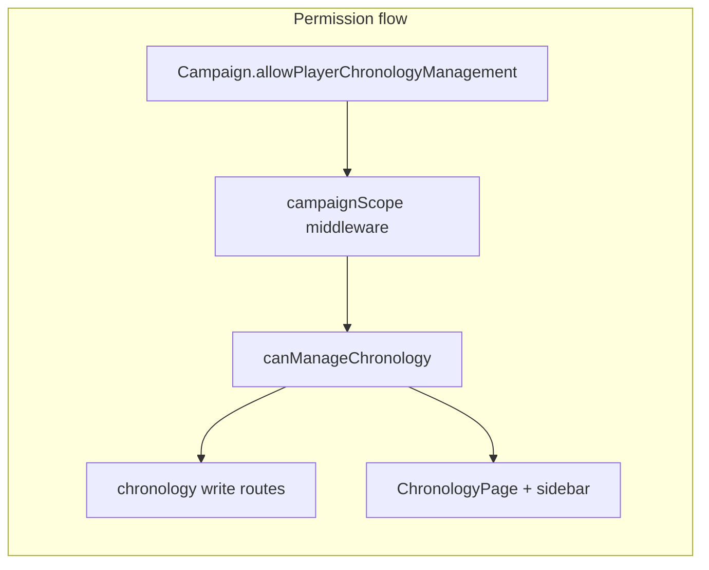

# Inline Event Expansion and Dynamic Chronology Permissions

## Context

The three-view chronology shell is already live ([`ChronologyPage.tsx`](frontend/src/pages/ChronologyPage.tsx), [`WidescreenCalendarView.tsx`](frontend/src/components/chronology/WidescreenCalendarView.tsx), [`EventsLedgerView.tsx`](frontend/src/components/chronology/EventsLedgerView.tsx)). Management is currently gated by `MANAGE_ROLES` (DM / Co-DM) in the frontend and `requireOperationalManager` on backend chronology write routes ([`campaignScoped.ts`](backend/src/routes/campaignScoped.ts) lines 129–183).

Occurrence records lack `tags` and `conditions`; those live on [`TimelineBaseEventRecord`](frontend/src/lib/chronologyApi.ts) in `bundle.baseEvents`. Lore CTA logic already exists in [`ChronologyEventSidebar.tsx`](frontend/src/components/chronology/ChronologyEventSidebar.tsx) and should be reused.



---

## Part 1: Inline event expansion

### Shared UI helpers (new)

| File | Purpose |
|------|---------|
| [`ChronologyLoreLink.tsx`](frontend/src/components/chronology/ChronologyLoreLink.tsx) | Extract lore CTA from sidebar: Open / Initialize / Pending based on `flatPages` + role |
| [`ConditionTreeReadOnly.tsx`](frontend/src/components/chronology/ConditionTreeReadOnly.tsx) | Recursive read-only display of `ConditionNode` (GROUP + CRITERIA), no edit controls |
| [`ChronologyEventInlineDetail.tsx`](frontend/src/components/chronology/ChronologyEventInlineDetail.tsx) | Shared block: description, tags, visibility/duration/calendar metadata, optional conditions tree, `ChronologyLoreLink` |

### [`WidescreenCalendarView.tsx`](frontend/src/components/chronology/WidescreenCalendarView.tsx)

**New props:** `campaignSlug`, `baseEvents` (or full `chronologyBundle`).

**Agenda drawer (`AgendaItem`):**
- Clicking an event card toggles `expandedOccurrenceId` (accordion inside the card, not navigation).
- Expanded panel shows `ChronologyEventInlineDetail` with base event lookup by `occurrence.baseEventId`.
- Chevron or `aria-expanded` on the card header; smooth height transition via `grid-rows-[0fr]` / `overflow-hidden` or `max-h` transition.
- Stop propagation on lore link clicks so they do not collapse the card.

**Scope note:** Events are listed in the day drawer (opened by day cell click), not as labeled cards inside grid cells. Expansion applies to those agenda cards per the task; grid cells keep dot indicators only.

### [`EventsLedgerView.tsx`](frontend/src/components/chronology/EventsLedgerView.tsx)

**New props:** `campaignSlug`, `baseEvents`.

**Row behavior:**
- Replace “select only” with `expandedOccurrenceId` local state; row click toggles expand (separate from optional `onSelectEvent` if still needed for highlight).
- Below the summary row, render an in-flow detail panel (`overflow-hidden transition-[max-height] duration-300`) containing `ChronologyEventInlineDetail` with conditions + core metadata.
- Collapse when changing category carousel index.

**Refactor [`ChronologyEventSidebar.tsx`](frontend/src/components/chronology/ChronologyEventSidebar.tsx)** to use `ChronologyLoreLink` instead of duplicating lore markup.

### [`ChronologyPage.tsx`](frontend/src/pages/ChronologyPage.tsx)

Pass `campaignSlug` and `bundle.baseEvents` into `WidescreenCalendarView` and `EventsLedgerView`.

---

## Part 2: Campaign permission flag (backend)

### Prisma

Add to [`Campaign`](backend/prisma/schema.prisma) model (after existing boolean flags ~line 251):

```prisma
allowPlayerChronologyManagement Boolean @default(false)
```

Create migration `backend/prisma/migrations/<timestamp>_allow_player_chronology_management/migration.sql`.

### ACL ([`backend/src/lib/acl.ts`](backend/src/lib/acl.ts))

Add centralized helper (mirror frontend):

```ts
export function canManageChronology(
  role: CampaignMemberRole | null,
  allowPlayerChronologyManagement: boolean,
): boolean {
  if (role === CampaignMemberRoles.DM || role === CampaignMemberRoles.CO_DM) return true;
  if (role === CampaignMemberRoles.PLAYER && allowPlayerChronologyManagement) return true;
  return false;
}
```

**Out of scope for this flag:** time-tracking advance, fantasy calendar CRUD, and other operational routes remain `requireOperationalManager`.

### Campaign scope ([`campaignScope.ts`](backend/src/middleware/campaignScope.ts))

- Select `allowPlayerChronologyManagement` in `resolveCampaignScope`.
- Extend [`CampaignContext`](backend/src/types/api.ts) with `allowPlayerChronologyManagement: boolean`.

### New middleware

`requireChronologyManager` in [`campaignScope.ts`](backend/src/middleware/campaignScope.ts):

```ts
if (!req.campaign || !canManageChronology(req.campaign.role, req.campaign.allowPlayerChronologyManagement)) {
  res.status(403).json({ error: 'Forbidden: chronology management not permitted' });
  return;
}
```

### Routes ([`campaignScoped.ts`](backend/src/routes/campaignScoped.ts))

Replace `requireOperationalManager` with `requireChronologyManager` on:
- `POST/PATCH/DELETE /chronology/categories/*`
- `POST/PATCH/DELETE /calendars/:calendarId/events/*`

Leave time-tracking and fantasy calendar routes on `requireOperationalManager`.

### Controllers

Replace `canManageOperationalResources(...)` with `canManageChronology(role, allowPlayerChronologyManagement)` for visibility filtering in:
- [`chronologyController.ts`](backend/src/controllers/chronologyController.ts) (line 192)
- [`calendarEventsController.ts`](backend/src/controllers/calendarEventsController.ts) (line 205)

Load flag from `req.campaign.allowPlayerChronologyManagement` (middleware must populate it).

### Campaign settings API

- Add `allowPlayerChronologyManagement?: boolean` to [`UpdateCampaignBody`](backend/src/types/api.ts).
- Handle in [`updateCampaign`](backend/src/controllers/campaignsController.ts) (DM-only patch, same as other campaign fields).
- Include in wiki tree payload [`wikiController.ts`](backend/src/controllers/wikiController.ts) `campaign` object (line ~200).
- Include in campaign GET serializers if settings page loads campaign separately.

---

## Part 3: Frontend permissions

### Types and helper

- Add `allowPlayerChronologyManagement?: boolean` to [`WikiCampaignMeta`](frontend/src/types/wiki.ts).
- New [`chronologyPermissions.ts`](frontend/src/lib/chronologyPermissions.ts):

```ts
export function canManageChronology(
  role: string | undefined,
  allowPlayerChronologyManagement: boolean,
): boolean {
  if (role === 'DM' || role === 'Co-DM') return true;
  if (role === 'Player' && allowPlayerChronologyManagement) return true;
  return false;
}
```

Optional hook `useCanManageChronology()` wrapping `useWiki().campaign`.

### Replace hardcoded checks

| File | Change |
|------|--------|
| [`ChronologyPage.tsx`](frontend/src/pages/ChronologyPage.tsx) | `canManageChronology(campaign?.role, campaign?.allowPlayerChronologyManagement ?? false)` |
| [`ChronologyEventSidebar.tsx`](frontend/src/components/chronology/ChronologyEventSidebar.tsx) | Same for lore Initialize + category footer visibility |
| [`ChronologyLoreLink.tsx`](frontend/src/components/chronology/ChronologyLoreLink.tsx) | Use shared permission helper for Initialize vs Pending |

### Campaign settings UI

In [`CampaignSettingsPage.tsx`](frontend/src/pages/CampaignSettingsPage.tsx) (DM-only section):
- Toggle: **Allow players to manage chronology events**
- Persist via existing campaign PATCH with `allowPlayerChronologyManagement`.
- Short helper text explaining Players can create/edit events and categories when enabled.

---

## Verification checklist

- Calendar day drawer: event card expands inline with description, tags, lore link; second click collapses.
- Events ledger: row expands downward with description, conditions (read-only), metadata; category change resets expansion.
- Player + flag off: 403 on event/category writes; no Create Event button; Lore shows Pending.
- Player + flag on: can create/edit events and categories; Initialize Lore when DM would.
- DM/Co-DM: unchanged full access regardless of flag.
- DM can toggle flag in Campaign Settings; value persists and reflects in wiki context after refresh.
