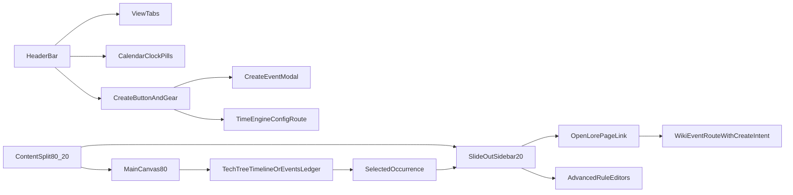

# Chronology Hub Layout Pivot Plan

## Target UX
- Convert `ChronologyPage` into a compact, full-width dashboard header plus canvas-first content region.
- Prioritize timeline/ledger visibility (80%) and move all editing into a slide-out sidebar (20%).
- Integrate event-to-wiki navigation with clear not-created indicators and create-intent routing.

## Implementation Steps

### 1) Refactor top header into compact tri-zone bar
- Update [frontend/src/pages/ChronologyPage.tsx](frontend/src/pages/ChronologyPage.tsx):
  - Replace current large hero header with a low-profile horizontal bar.
  - Left zone:
    - `Chronology Hub` title
    - compact tabs (`Timeline`, `Events`) inline with title
  - Center zone:
    - render lightweight badge pills for each calendar in bundle
    - each pill shows calendar identity + live state snapshot (from chronology aggregate payload)
  - Right zone:
    - keep one primary `+ Create Event` button
    - replace large manage button with compact gear icon button linking to `campaignTimeTrackingPath(campaignSlug)`

### 2) Apply 80/20 split with independent scroll behavior
- In [frontend/src/pages/ChronologyPage.tsx](frontend/src/pages/ChronologyPage.tsx):
  - wrap content in a fixed-height flex container using `h-[calc(100vh-var(--header-offset,120px))] overflow-hidden`
  - main pane (`w-4/5` equivalent, responsive-safe with flex-basis) holds timeline or ledger and scrolls independently
  - right pane (`w-1/5`, min/max constrained) reserved for contextual sidebar and transitions
- Ensure both `TechTreeTimeline` and `EventsLedgerView` remain full-size scroll surfaces inside main pane.

### 3) Convert details block to slide-out contextual sidebar
- Replace static right details card in [frontend/src/pages/ChronologyPage.tsx](frontend/src/pages/ChronologyPage.tsx):
  - default collapsed/peek state when no event is selected
  - slide-in panel when event selected from timeline/ledger
  - smooth transition classes (`translate-x`, opacity) without blocking main canvas
- Keep all advanced controls inside this panel (category, repetition, conditions, moon overrides, etc.) and visually collapsed by section until expanded.

### 4) Wiki integration action with not-created visual state
- In sidebar top block in [frontend/src/pages/ChronologyPage.tsx](frontend/src/pages/ChronologyPage.tsx):
  - add prominent `Open Lore Page ↗` action
  - target route pattern:
    - `/c/:slug/wiki/event-${baseEventId}?intent=create&source=chronology`
- Add explicit visual state for page existence:
  - if known/assumed missing, show indicator badge like `Not created yet`
  - use create-intent routing as selected: no backend auto-create in this pass
- For event selections derived from occurrences, always resolve to `baseEventId` for wiki target.

### 5) Keep sidebar controls editable for all users
- Per your decision, render full editable controls for all roles in sidebar.
- Do not gate edit controls by manager role in this layout pass.
- Keep API error handling in place so permission constraints still surface clearly if backend rejects specific writes.

### 6) Adjust child components for new layout assumptions
- Update [frontend/src/components/chronology/TechTreeTimeline.tsx](frontend/src/components/chronology/TechTreeTimeline.tsx):
  - ensure it fills parent pane height and does not assume page-level header spacing
- Update [frontend/src/components/chronology/EventsLedgerView.tsx](frontend/src/components/chronology/EventsLedgerView.tsx):
  - ensure filter row + table remain usable in constrained height and independent scroll

### 7) Validate interactions and regressions
- Verify:
  - event click opens sidebar with correct event context
  - sidebar close returns focus to main canvas
  - `Open Lore Page ↗` URL always points to `event-${baseEventId}` with create intent params
  - visual “not created yet” indicator appears consistently for unresolved lore pages
  - timeline/ledger no longer squeezed by form-heavy side content

## UI Flow (Post-Refactor)

## Files to Change
- [frontend/src/pages/ChronologyPage.tsx](frontend/src/pages/ChronologyPage.tsx)
- [frontend/src/components/chronology/TechTreeTimeline.tsx](frontend/src/components/chronology/TechTreeTimeline.tsx)
- [frontend/src/components/chronology/EventsLedgerView.tsx](frontend/src/components/chronology/EventsLedgerView.tsx)

## Notes
- This plan intentionally focuses on layout and interaction architecture without changing backend contracts.
- Wiki page existence indicators will use client-available state heuristics in this pass; deeper existence checks can be added in a follow-up if needed.