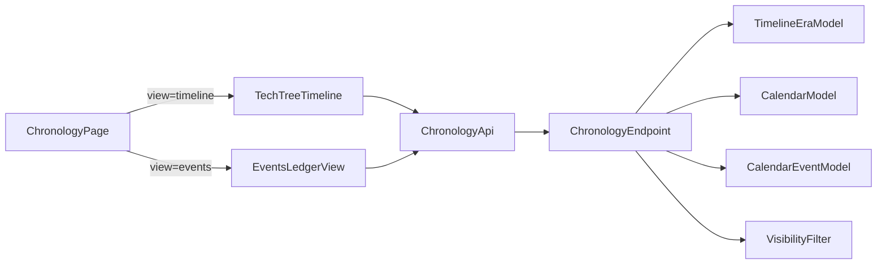

# Decouple Chronology Views + Multi-Calendar Tech-Tree Plan

## Goals
- Replace the current single chronology widget mode-switch with two dedicated widescreen views under chronology: **Timeline** (matrix tech-tree) and **Events** (high-density ledger).
- Extend backend data model to support era columns, calendar swimlanes, prerequisite graph links, and per-event visibility filtering.
- Add an aggregate chronology endpoint that returns view-ready data with campaign + visibility constraints.

## Backend Plan

### 1) Prisma model evolution
- Update [c:\Users\allison\Documents\GIT\Esiana-ttrpg\esiana-core\backend\prisma\schema.prisma](c:\Users\allison\Documents\GIT\Esiana-ttrpg\esiana-core\backend\prisma\schema.prisma):
  - Add `TimelineEra` model with:
    - `id` (cuid), `campaignId`, `title`, `description?`, `order`
    - relation to campaign and related events
    - uniqueness/indexes suitable for ordered era retrieval (`campaignId, order`)
  - Extend existing `CalendarEvent` as chronology event source:
    - add `eraId` (nullable FK to `TimelineEra`)
    - add `prerequisiteId` (nullable self-FK to `CalendarEvent`)
    - add `visibility` enum field (`PUBLIC`, `PARTY`, `DM_ONLY`) with safe default
  - Add indexes for matrix and filters (`campaignId` via relation path, `calendarId`, `eraId`, `visibility`, `prerequisiteId`).

### 2) API contract + controller updates
- Extend [c:\Users\allison\Documents\GIT\Esiana-ttrpg\esiana-core\backend\src\controllers\calendarEventsController.ts](c:\Users\allison\Documents\GIT\Esiana-ttrpg\esiana-core\backend\src\controllers\calendarEventsController.ts):
  - accept/validate `eraId`, `prerequisiteId`, `visibility` on create/update
  - enforce FK ownership checks (era/calendar/event must belong to campaign context)
  - include new fields in serialized event responses
- Add chronology aggregate handler in a dedicated controller file (new):
  - [c:\Users\allison\Documents\GIT\Esiana-ttrpg\esiana-core\backend\src\controllers\chronologyController.ts](c:\Users\allison\Documents\GIT\Esiana-ttrpg\esiana-core\backend\src\controllers\chronologyController.ts)
  - implement `GET /chronology/timeline` response shape:
    - ordered eras
    - active calendars (swimlane descriptors)
    - events with graph fields (`prerequisiteId`) and visibility-filtered rows
- Register route in [c:\Users\allison\Documents\GIT\Esiana-ttrpg\esiana-core\backend\src\routes\campaignScoped.ts](c:\Users\allison\Documents\GIT\Esiana-ttrpg\esiana-core\backend\src\routes\campaignScoped.ts):
  - `GET /chronology/timeline`

### 3) Visibility enforcement rules
- Reuse role checks from campaign scope to derive `canManageChronology` (DM/Co-DM/manager behavior already used in app).
- Filter aggregate chronology events:
  - DM/managers: see all
  - non-manager members: exclude `DM_ONLY`; optionally include/exclude `PARTY` per existing campaign visibility semantics
- Keep visibility enforcement in one shared function to avoid drift between list and aggregate paths.

## Frontend Plan

### 4) Chronology route/view split
- Refactor [c:\Users\allison\Documents\GIT\Esiana-ttrpg\esiana-core\frontend\src\pages\ChronologyPage.tsx](c:\Users\allison\Documents\GIT\Esiana-ttrpg\esiana-core\frontend\src\pages\ChronologyPage.tsx):
  - replace current `grid/chronicle` widget toggle mapping with explicit chronology subviews:
    - `view=timeline` -> new `TechTreeTimeline`
    - `view=events` -> new `EventsLedgerView`
    - preserve backward compatibility for old query values with redirects/fallbacks
- Update [c:\Users\allison\Documents\GIT\Esiana-ttrpg\esiana-core\frontend\src\lib\campaignPaths.ts](c:\Users\allison\Documents\GIT\Esiana-ttrpg\esiana-core\frontend\src\lib\campaignPaths.ts) helpers to produce stable chronology view URLs.
- Ensure [c:\Users\allison\Documents\GIT\Esiana-ttrpg\esiana-core\frontend\src\components\Sidebar.tsx](c:\Users\allison\Documents\GIT\Esiana-ttrpg\esiana-core\frontend\src\components\Sidebar.tsx) links map cleanly to Timeline/Events destinations.

### 5) Build `TechTreeTimeline` matrix canvas
- Add [c:\Users\allison\Documents\GIT\Esiana-ttrpg\esiana-core\frontend\src\components\chronology\TechTreeTimeline.tsx](c:\Users\allison\Documents\GIT\Esiana-ttrpg\esiana-core\frontend\src\components\chronology\TechTreeTimeline.tsx):
  - fullscreen scroll container with `overflow-auto h-[calc(100vh-200px)]`
  - sticky left calendar identity column
  - X-axis era columns ordered by `order`
  - Y-axis calendar swimlanes
  - render events in `[eraId, calendarId]` cell groups as clickable cards
  - draw lightweight prerequisite anchor lines/placeholders (initial pass)
- Keep state minimal: selected event, hovered edge anchor, optional editor drawer trigger.

### 6) Build `EventsLedgerView` master log
- Add [c:\Users\allison\Documents\GIT\Esiana-ttrpg\esiana-core\frontend\src\components\chronology\EventsLedgerView.tsx](c:\Users\allison\Documents\GIT\Esiana-ttrpg\esiana-core\frontend\src\components\chronology\EventsLedgerView.tsx):
  - dense table layout optimized for horizontal data scanning
  - filters:
    - page tags (`#tag` style)
    - era
    - calendar track
  - composable client-side filtering with cheap memoized selectors
  - row click to open event detail/edit context

### 7) Data client updates
- Add chronology aggregate API client in frontend lib (new file):
  - [c:\Users\allison\Documents\GIT\Esiana-ttrpg\esiana-core\frontend\src\lib\chronologyApi.ts](c:\Users\allison\Documents\GIT\Esiana-ttrpg\esiana-core\frontend\src\lib\chronologyApi.ts)
  - single fetch contract consumed by both Timeline and Events views
- Keep existing `calendarEventsApi` for CRUD; extend request/response types for new fields.

## Delivery Sequence
1. Prisma schema + migration + regenerated client.
2. Backend controller/route wiring for aggregate timeline endpoint and visibility logic.
3. Frontend API client/types.
4. Chronology page routing split.
5. Implement `TechTreeTimeline`.
6. Implement `EventsLedgerView` with filters.
7. Validate role-based visibility and regression check old chronology links.

## Validation Checklist
- Aggregate endpoint returns eras/calendars/events with deterministic ordering.
- Non-manager user cannot see `DM_ONLY` chronology events.
- Timeline view correctly places events by era column and calendar row.
- Events view filters instantly by tags/era/calendar and remains responsive with high row counts.
- Sidebar Timeline/Events links land on the correct fullscreen experiences.

## Architecture Flow

