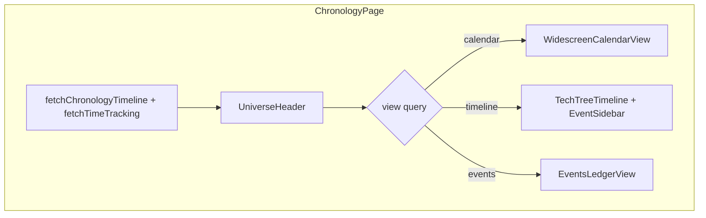

# Chronology Master Refactor: Three Full-Page Views + Universe Header

## Current state

[`ChronologyPage.tsx`](frontend/src/pages/ChronologyPage.tsx) only routes `timeline` | `events` (default `timeline`), uses an **inline header** and a **shared 80/20 sidebar** for both views. There is **no calendar view** yet. [`campaignChronologyPath`](frontend/src/lib/campaignPaths.ts) already supports `?view=calendar|timeline|events`.

Matrix timeline ([`TechTreeTimeline.tsx`](frontend/src/components/chronology/TechTreeTimeline.tsx)) is already **category columns × calendar rows** (confirmed: keep categories, not eras).

Monthly grid logic exists in [`CalendarWidget.tsx`](frontend/src/components/dashboard/widgets/CalendarWidget.tsx) via `fetchTimeTracking` + `buildCalendarMonthViewport` from [`timeEngine.ts`](frontend/src/lib/timeEngine.ts).



---

## 1. Extract shared header — `UniverseHeader.tsx`

**New file:** [`frontend/src/components/chronology/UniverseHeader.tsx`](frontend/src/components/chronology/UniverseHeader.tsx)

**Props (controlled by parent):**
- `activeView: 'calendar' | 'timeline' | 'events'`
- `clockPills: Array<{ id: string; label: string }>` — semantic strings like `Planet Time: Year 1024, Month 3`
- `onCreateEvent: () => void`
- `settingsHref` — `campaignTimeTrackingPath(campaignSlug)`

**Layout:** `grid grid-cols-[auto_1fr_auto]` (same tri-zone pattern as today’s header, lines 252–303 in ChronologyPage).

| Zone | Content |
|------|---------|
| Left | `Chronology Hub` + anchor tab group `[ Calendar ] [ Timeline ] [ Events ]` using `Link` to `?view=calendar` / `timeline` / `events` via [`campaignChronologyPath`](frontend/src/lib/campaignPaths.ts), preserving other query params (`windowMode`, `from`, `to`) with `useSearchParams` |
| Center | Horizontally scrollable pill row (`rounded-full border …`) |
| Right | Icon-only `+` Create Event button (label in `title` attr) + gear `Link` to engine settings |

Remove duplicate header markup from ChronologyPage.

---

## 2. Universe clock pills (real “now” per calendar)

**In ChronologyPage** (alongside existing `fetchChronologyTimeline`):

- Add `fetchTimeTracking(campaignSlug)` from [`timeTrackingApi.ts`](frontend/src/lib/timeTrackingApi.ts).
- Build pills from `bundle.calendars` + each calendar’s `state` in the time-tracking response:
  - Example label: `${calendar.name}: Year ${state.year}, ${state.monthName}` (optionally append day).
- Replace the current placeholder that uses “first occurrence per calendar” (lines 133–145).

---

## 3. Router shell — refactor `ChronologyPage.tsx`

**Structural changes:**

- Default view: **`calendar`** when `view` is missing/invalid (update `activeView` memo, currently defaults to `timeline`).
- Page shell: full viewport, no `max-w-[96vw]` — `flex h-[calc(100vh-<header>)] flex-col overflow-hidden`.
- Render `<UniverseHeader />` once; below it, **exactly one** child view (no shared sub-panel tabs).
- **Remove** the global 80/20 sidebar wrapper; move timeline-specific sidebar into the timeline branch only.
- Keep in page: data loading, create-event modal, category quick-add (if still needed), save handlers.
- Wire `canManageChronology` to real roles (same as [`TimeTrackingManagement.tsx`](frontend/src/pages/TimeTrackingManagement.tsx): `DM` / `Co-DM` via `campaign?.role` from `useWiki()`), replacing hardcoded `true` (line 129).

**View switch:**

```tsx
{activeView === 'calendar' && <WidescreenCalendarView ... />}
{activeView === 'timeline' && <TimelineWithSidebar ... />}
{activeView === 'events' && <EventsLedgerView ... />}
```

---

## 4. Page 1 — `WidescreenCalendarView.tsx` (new)

**New file:** [`frontend/src/components/chronology/WidescreenCalendarView.tsx`](frontend/src/components/chronology/WidescreenCalendarView.tsx)

**Behavior:**
- Full width/height month matrix only (no permanent right agenda).
- Calendar track selector (minimal dropdown, reuse CalendarWidget pattern).
- Month grid: reuse `buildCalendarMonthViewport` + table rendering.
- **Recommended DRY:** extract `MonthGridTableRow` / `IntercalaryBannerRow` from CalendarWidget into [`frontend/src/components/chronology/CalendarMonthGrid.tsx`](frontend/src/components/chronology/CalendarMonthGrid.tsx) and import from both widget and widescreen view.
- Map `bundle.occurrences` onto day cells (filter by `calendarId`, `start.year/month/day`; show continuation dots for multi-day events).
- **Day click:** set `selectedDay` state → right drawer slides in (`translate-x-full` → `translate-x-0`, ~300px), listing that day’s occurrences with title/category; close button clears selection.
- Drawer is **agenda-only** (no full event editor here); deep edit remains on Timeline view or future enhancement.

**Props:** `campaignSlug`, `timeBundle`, `chronologyBundle`, optional `onSelectOccurrence` if we want cross-view jump later.

---

## 5. Page 2 — Timeline matrix + 20% lore sidebar

**Matrix:** Keep [`TechTreeTimeline.tsx`](frontend/src/components/chronology/TechTreeTimeline.tsx) as the 80% canvas (remove redundant outer border if parent provides frame; ensure `h-full overflow-auto`).

**New sidebar component:** [`frontend/src/components/chronology/ChronologyEventSidebar.tsx`](frontend/src/components/chronology/ChronologyEventSidebar.tsx)

- Extract current sidebar body from ChronologyPage (lines 339–561): lore CTA at top, title, collapsible Core/Rules/Visibility, Save.
- **Lore CTA logic** (top of drawer):

| Wiki page `event-{baseEventId}` exists in `flatPages`? | DM/Co-DM? | UI |
|---|---|---|
| Yes | any | Solid primary link: `Open Lore Page` → `/c/:slug/wiki/event-{id}` |
| No | Yes | Dashed outline button: `Initialize Lore Page` → `?intent=create&source=chronology` |
| No | No | Disabled muted label: `Lore Page Pending` |

- Resolve existence via `useWiki().flatPages.some(p => p.id === \`event-${baseEventId}\`)` (page id convention already used in ChronologyPage line 131).
- `canManage` from `campaign.role` in `DM` / `Co-DM`.

**Wrapper in ChronologyPage (timeline branch only):**

```tsx
<div className="flex h-full overflow-hidden">
  <div className="basis-4/5 min-w-0"><TechTreeTimeline ... /></div>
  <aside className="basis-1/5 border-l ...">
    <ChronologyEventSidebar ... />
  </aside>
</div>
```

Sidebar hidden/off-canvas until `selectedOccurrence` is set (same slide pattern as today).

---

## 6. Page 3 — `EventsLedgerView.tsx` rewrite

**Replace** table + filter row with editorial ledger UX.

**Category carousel (top center):**
- Ordered list: `Uncategorized` + `categories` (by name or API order).
- State: `activeCategoryIndex`; chevrons `◀` / `▶` cycle with wrap.
- Center label: `Category: {name}`.

**Chronological vector (main scroll area):**
- Filter `events` to active category only.
- Sort by `(year, month, day, epochMinute)`.
- Render vertical sections with month/year separator strips (e.g. `— Year 1024 · Month 3 —`).
- **Current anchor:** derive “now” from master calendar’s `state` in `timeBundle` (passed as prop).
- On mount + when category changes: `scrollIntoView` nearest event to now (binary search or linear scan on sorted list); mark separator with distinct style (`border-primary`, “Current month” text).
- **Controls (top-right of ledger board):**
  - `Go To Current Date` — re-scroll to anchor.
  - Native `<input type="date">` or lightweight month/year picker → scroll to first event in that month (map picker to campaign calendar month index via time engine if needed; v1 can match year+month on occurrence `start`).

**Visual contrast:**
- Compare each event’s start to “now” using shared helper in new [`frontend/src/lib/chronologyDates.ts`](frontend/src/lib/chronologyDates.ts):
  - `isBeforeNow`, `isAfterNow`, `isCurrentMonth`
- Apply `text-muted-foreground/70` to rows before now or after now (unreached future), full contrast for current month window.

**Selection:** highlight row on click; optional callback `onSelectEvent` for future cross-navigation (no shared Chronology sidebar on this view).

**Props additions:** `timeBundle: TimeTrackingBundle`, `currentCategoryIndex` internal.

---

## 7. Shared utilities

| File | Purpose |
|------|---------|
| [`chronologyDates.ts`](frontend/src/lib/chronologyDates.ts) | Normalize/compare occurrence dates vs `CalendarState`; find closest event index |
| [`ChronologyEventSidebar.tsx`](frontend/src/components/chronology/ChronologyEventSidebar.tsx) | Lore CTA + edit form (timeline only) |
| [`CalendarMonthGrid.tsx`](frontend/src/components/chronology/CalendarMonthGrid.tsx) | Shared grid row components (optional but recommended) |

---

## 8. Files touched (summary)

| Action | File |
|--------|------|
| **Create** | `UniverseHeader.tsx`, `WidescreenCalendarView.tsx`, `ChronologyEventSidebar.tsx`, `chronologyDates.ts`, optionally `CalendarMonthGrid.tsx` |
| **Refactor** | `ChronologyPage.tsx`, `EventsLedgerView.tsx` |
| **Light touch** | `TechTreeTimeline.tsx`, `CalendarWidget.tsx` (if grid extracted) |
| **No backend changes** | Reuse existing chronology + time-tracking APIs |

---

## 9. Verification checklist

- `?view=calendar` (default), `timeline`, `events` each render full-bleed with shared header; tab links preserve other query params.
- Calendar: no sidebar until day click; drawer slides from right.
- Timeline: matrix fills 80%; occurrence click opens 20% sidebar with correct lore CTA for DM vs player vs existing wiki page.
- Ledger: category chevrons work; mounts scrolled to “now”; faded past/future rows; Go To Current Date + date picker scroll.
- Create Event + gear settings still work from header.
- `canManageChronology` respects DM/Co-DM for create modal, category admin footer (timeline), and Initialize Lore button.
