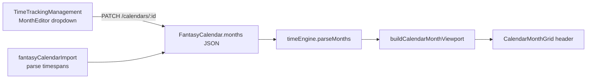

# Abstract Fantasy Climatic Aspects & Calendar Header Icons

## Architecture

`FantasyCalendar.months` stays a Prisma `Json` array ([`backend/prisma/schema.prisma`](backend/prisma/schema.prisma) ~316). No migration required; extend each month object shape:

```ts
{ name: string; length: number; type: 'standard' | 'intercalary'; climateAspect?: ClimateAspect }
```

**Canonical enum** (same strings backend + frontend):

| Token | UI label (editor) | Header icon (text token) |
|-------|-------------------|--------------------------|
| `ARID` | Arid / Searing | warm sun (e.g. `☀️`) |
| `PLUVIAL` | Pluvial / Monsoon | rain cloud (e.g. `🌧️`) |
| `CRYORIC` | Cryoric / Glacial | ice (e.g. `❄️`) |
| `TEMPEST` | Tempest / Storm | whirlwind (e.g. `🌀`) |
| `OVERGROWTH` | Overgrowth / Decay | leaf/spore (e.g. `🍂`) |
| `NEUTRAL` | Temperate / Fair | subtle fair sky (e.g. `🌤️`) or omit icon |



---

## Part 1: Schema & shared types

**Prisma** — Add a brief doc comment on `FantasyCalendar.months` documenting `climateAspect` as an optional enum string (no schema type change).

**New modules** (mirror backend/frontend, same pattern as duplicated `timeEngine`):

- [`backend/src/lib/climateAspect.ts`](backend/src/lib/climateAspect.ts)
- [`frontend/src/lib/climateAspect.ts`](frontend/src/lib/climateAspect.ts)

Exports:

- `CLIMATE_ASPECTS` const tuple + `ClimateAspect` type
- `DEFAULT_CLIMATE_ASPECT = 'NEUTRAL'`
- `normalizeClimateAspect(value: unknown): ClimateAspect` — unknown/invalid → `NEUTRAL`
- `parseClimateAspectFromImportRow(row: Record<string, unknown>): ClimateAspect` — check common export keys (`climateAspect`, `climate_aspect`, `weather`, `weather_type`, `primary_climate`) via `normalizeClimateAspect` after uppercasing; no keyword guessing from month names
- `CLIMATE_ASPECT_EDITOR_OPTIONS` — `{ value, label }` with emoji prefixes for the dropdown
- `getClimateAspectHeaderIcon(aspect: ClimateAspect): string | null` — returns icon char; `NEUTRAL` returns `null` or very subtle `🌤️` per your preference (plan: **omit icon for NEUTRAL** to reduce noise)

**Extend `CalendarMonth`** in both [`backend/src/lib/timeEngine.ts`](backend/src/lib/timeEngine.ts) and [`frontend/src/lib/timeEngine.ts`](frontend/src/lib/timeEngine.ts):

```ts
export interface CalendarMonth {
  name: string;
  length: number;
  type: 'standard' | 'intercalary';
  climateAspect?: ClimateAspect;
}
```

Update `parseMonths()` in both files to set `climateAspect: normalizeClimateAspect(row.climateAspect)` so runtime always has a resolved value.

---

## Part 2: Backend validation & import

**[`backend/src/lib/timeTracking.ts`](backend/src/lib/timeTracking.ts)**

- Add `sanitizeCalendarMonths(months: unknown): CalendarMonth[] | null` — map each row, coerce `climateAspect`, preserve `name`/`length`/`type` rules; return `null` if array empty.
- Call from `normalizeFantasyCalendarInput` so PATCH/create reject nothing extra but **persist only valid aspects** (invalid → `NEUTRAL`).
- Add `climateAspect: 'NEUTRAL'` to boilerplate months in `createBoilerplateFantasyCalendarData`.

**[`backend/src/lib/fantasyCalendarImport.ts`](backend/src/lib/fantasyCalendarImport.ts)**

- Add `climateAspect` to `ParsedFantasyCalendarMonth`.
- In timespan map (~152): `climateAspect: parseClimateAspectFromImportRow(row)`.
- In `monthsForDb` (~311): include `climateAspect`.
- Somerden fixture has no climate fields → all months import as `NEUTRAL`.

**Tests** — extend [`backend/src/lib/fantasyCalendarImport.test.ts`](backend/src/lib/fantasyCalendarImport.test.ts) + new [`backend/src/lib/climateAspect.test.ts`](backend/src/lib/climateAspect.test.ts):

- Import somerden → every month `climateAspect === 'NEUTRAL'`
- Import row with `climateAspect: 'ARID'` preserved
- Invalid value coerces to `NEUTRAL`
- `sanitizeCalendarMonths` strips bad values

Update [`backend/package.json`](backend/package.json) test script to include `climateAspect.test.ts`.

---

## Part 3: Month configuration editor

**[`frontend/src/lib/fantasyCalendarApi.ts`](frontend/src/lib/fantasyCalendarApi.ts)**

- Extend `MonthFormRow` with `climateAspect: ClimateAspect`.
- `normalizeMonthRows`: default missing → `NEUTRAL`.

**[`frontend/src/pages/TimeTrackingManagement.tsx`](frontend/src/pages/TimeTrackingManagement.tsx)** — `MonthEditor` (~423):

- Add compact **Primary Climatic Aspect** `<select>` between Days and Type (or after Title), bound to `row.climateAspect`, options from `CLIMATE_ASPECT_EDITOR_OPTIONS`.
- `add()` default row: `{ ..., climateAspect: 'NEUTRAL' }`.
- `handleSave` (~134): include `climateAspect: m.climateAspect` in each month object sent to `patchFantasyCalendar` (existing save path — no new API).

---

## Part 4: Widescreen calendar header icons

**[`frontend/src/lib/timeEngine.ts`](frontend/src/lib/timeEngine.ts)** — extend `CalendarMonthViewport`:

```ts
climateAspect: ClimateAspect;
```

In `buildCalendarMonthViewport` (~540), set from `segment?.climateAspect ?? 'NEUTRAL'`.

**[`frontend/src/components/chronology/CalendarMonthGrid.tsx`](frontend/src/components/chronology/CalendarMonthGrid.tsx)** — month banner (~29):

- Optional prop `climateAspect?: ClimateAspect | null`.
- Render title row as flex center: `{icon && <span className="mr-1.5 text-muted-foreground/60 text-[10px]">{icon}</span>}{monthTitle}` — no grid width changes.

**[`frontend/src/components/chronology/WidescreenCalendarView.tsx`](frontend/src/components/chronology/WidescreenCalendarView.tsx)** — pass `climateAspect={viewport.climateAspect}` into `CalendarMonthGrid` (~188).

**Bonus (same prop, zero layout risk):** [`frontend/src/components/dashboard/widgets/CalendarWidget.tsx`](frontend/src/components/dashboard/widgets/CalendarWidget.tsx) can pass `viewport.climateAspect` for consistency.

Intercalary banner in `CalendarMonthGrid` can show the same icon beside `row.monthName` when `climateAspect` is set.

---

## Out of scope (per spec)

- No changes to `chronologyController` / timeline bundle (aspects are calendar config only).
- No Fantasy-Calendar weather engine integration (export `seasons.data` is empty in somerden; we only read explicit timespan-level keys if present).
- No new DB column — JSON-only extension.

---

## Verification checklist

- Save calendar with mixed aspects in Time Tracking → reload editor → dropdown values persist.
- PATCH with invalid `climateAspect` → stored as `NEUTRAL`.
- Import `somerden.json` → all months `NEUTRAL`.
- Widescreen chronology calendar view shows muted icon next to current month name; `NEUTRAL` shows no icon (or subtle icon if you prefer during implementation).
- `npm run test --workspace=backend` passes.
