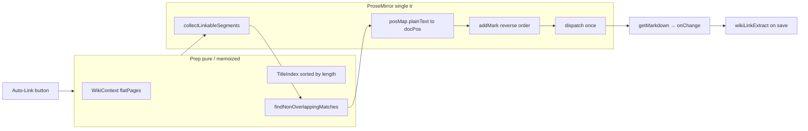

# Document-Wide Auto-Link: Technical Strategy

## Context and gap

The codebase already has global toolbar wiring ([`WikiEditorToolbar.tsx`](frontend/src/components/wiki/WikiEditorToolbar.tsx) → [`wikiAutoLink.ts`](frontend/src/lib/wikiAutoLink.ts)) and index access via [`WikiContext`](frontend/src/contexts/WikiContext.tsx) (`flatPages`, `resolvePageId` / `buildPageIdByTitle`).

**Current behavior** links only the selection or word under the cursor (`getLinkableRange` + one `setLink`). Your requirements change the product semantics to a **full-document scan on button click** with **longest-match, title-only, non-destructive** linking.

Backend [`wikiLinkExtract.ts`](backend/src/lib/wikiLinkExtract.ts) already indexes serialized markdown paths like `/c/:slug/wiki/:pageId` inside `[label](href)`—no backend changes needed if we keep using TipTap’s Link mark (StarterKit) and `campaignWikiPath()`.



---

## 1. Module layout (extend [`wikiAutoLink.ts`](frontend/src/lib/wikiAutoLink.ts))

Split responsibilities so matching is testable without a live editor:

| Layer | Export | Role |
|-------|--------|------|
| Index | `buildWikiTitleIndex(flatPages)` | Canonical `Map<title, { pageId, title }>`; titles sorted **longest first** |
| Boundaries | `isTitleBoundaryMatch(text, start, titleLen)` | Ensures match is not a substring inside a larger token (see below) |
| Matching | `findNonOverlappingTitleMatches(plainText, index)` | Returns `{ start, end, title, pageId }[]` |
| Doc bridge | `collectLinkableSegments(doc, linkMarkType)` | Flatten scannable plain text + position map per block |
| Apply | `scanDocumentWikiAutoLink(editor, opts)` | Orchestrates scan + **one** transaction |

Keep existing cursor helper only if you still want it; otherwise replace toolbar handler to call `scanDocumentWikiAutoLink` exclusively.

---

## 2. Title-only resolution (index contract)

**Source of truth:** [`WikiContext`](frontend/src/contexts/WikiContext.tsx) `flatPages` + [`buildPageIdByTitle`](frontend/src/lib/sidebarNav.ts) (includes `normalizeNavTitle` aliases).

**Rules:**

- Only strings that exist as keys in the index may link. No fuzzy/stemming, no “common word” heuristics—if `"the"` is not a page title, it never appears in the index and never matches.
- **Comparison:** Match document text **exactly** against canonical `page.title` (case-sensitive). Aliases from `normalizeNavTitle` are alternate lookup keys only, not separate match strings in the document.
- **Label in output:** Use canonical `page.title` as the link text label when applying the mark (document text already matched exactly).

**Performance:** Build the index once per toolbar click (or memoize in context keyed by `flatPages` reference). For large campaigns (500+ titles), precompute:

- `titlesByLength: string[]` (descending length)
- Optional **Aho–Corasick automaton** over all titles if profiling shows O(n × titles) is too slow; otherwise a two-phase greedy algorithm (below) is usually sufficient for typical TTRPG wiki sizes.

---

## 3. Longest-match, non-overlapping algorithm

Per **linkable text segment** (see §4), run on plain string `segment.text`:

**Phase A — enumerate candidates**

For each start index `i` and each title `T` in `titlesByLength` (longest first):

- If `segment.text.slice(i, i + T.length) === T` **and** `isTitleBoundaryMatch(...)` → record candidate `{ start: i, end: i + T.length, title, pageId }`.

**Phase B — select non-overlapping (longest wins)**

Sort candidates by `(length desc, start asc)`, greedily accept intervals that do not overlap already-chosen ranges (classic interval packing). This guarantees `"Greenest Inn"` wins over `"Greenest"` when both are valid at overlapping spans.

**Boundary helper** (prevents partial-token false positives without blocking multi-word titles):

- Char before `start` must be absent or **not** a word character: `(^|[^\p{L}\p{N}'_-])` (same family as current `WORD_CHAR` in `wikiAutoLink.ts`).
- Char after `end` must be absent or not a word character.
- Spaces **inside** the title are part of `T`; only edges are boundary-checked.

Unit-test this layer in isolation (no ProseMirror)—extend [`wikiAutoLink.test.ts`](frontend/src/lib/wikiAutoLink.test.ts).

---

## 4. What to scan in the document (safety)

Traverse with `doc.descendants` (or block-grouped walk):

**Include:** Text in paragraphs, headings, list items, table cells (each cell is its own textblock—do not match across cell boundaries).

**Exclude:**

- Any text node that already carries the **link** mark (`node.marks.some(m => m.type.name === 'link')`).
- **Code blocks** (`codeBlock` ancestor) and inline `code` if present.
- Optional: `[[TOC]]` nodes / custom atom nodes from [`TableOfContentsExtension`](frontend/src/components/wiki/extensions/TableOfContentsExtension.tsx).

**Segment flattening:** Within each scannable parent block, concatenate consecutive non-link text nodes into one `plainText` string and a parallel `posMap: number[]` where `posMap[i]` is the absolute document position of `plainText[i]`. Matches in `plainText` map back via `from = posMap[start]`, `to = posMap[end - 1] + 1`.

This satisfies “do not overwrite existing links” without nested-link risk (linked ranges never enter the plain-text buffer).

---

## 5. ProseMirror transaction: atomic, clean undo, no render storms

### Do not

- Loop `editor.chain().focus().setLink()` per match → **N undo steps**, **N `onUpdate` events**, selection thrashing.
- Replace the entire document JSON/markdown in one shot → large diff, worse merge behavior, higher risk of fighting content-sync effects.

### Do (recommended)

```typescript
const { state } = editor;
const linkType = state.schema.marks.link;
const tr = state.tr;
const matches = /* doc-relative { from, to, href, title }[] */;

// Descending `from` so earlier positions stay valid as doc changes
for (const m of [...matches].sort((a, b) => b.from - a.from)) {
  if (state.doc.rangeHasMark(m.from, m.to, linkType)) continue;
  tr.addMark(
    m.from,
    m.to,
    linkType.create({ href: campaignWikiPath(slug, pageId) }),
  );
}

if (tr.docChanged) {
  editor.view.dispatch(tr); // exactly one history entry
}
```

**Undo stack:** ProseMirror records one undo item per dispatched transaction by default. One `dispatch` = one user undo (Ctrl+Z reverts the whole scan).

**History metadata:** Do **not** set `addToHistory: false` unless you intentionally want a silent edit (you don’t). Avoid `appendTransaction` plugins for this—keep logic in the button handler.

**Selection:** Capture `const sel = state.selection` before building `tr`; after marks, `tr.setSelection(sel)` (mapped through `tr.mapping`) so the caret doesn’t jump.

**Focus:** Optional `editor.commands.focus()` after dispatch; not required for correctness.

### Re-render / `onUpdate` loop mitigation

Editors ([`TiptapWidget.tsx`](frontend/src/components/wiki/widgets/TiptapWidget.tsx), [`WikiTipTapEditor.tsx`](frontend/src/components/wiki/WikiTipTapEditor.tsx)) sync props back into the editor when external `content` / `markdown` changes.

- A **single** `dispatch` triggers **one** TipTap `onUpdate` → one parent `onChange`—correct.
- Risk: parent stores new markdown → `useEffect` calls `setContent` and resets the doc. **Mitigation already present** in `TiptapWidget` (`lastEmittedMarkdown` ref). **Recommend mirroring that guard** in `WikiTipTapEditor` if not already: only `setContent` when incoming markdown differs from what the editor last emitted, not merely from parent re-render.
- Do **not** call `setContent` inside the scan path; let the existing `onUpdate` pipeline serialize to markdown.

**Serialization:** TipTap Markdown extension serializes Link marks as `[text](url)`. URLs must continue using [`campaignWikiPath`](frontend/src/lib/campaignPaths.ts) so they match `WIKI_PATH_REGEX` in [`wikiLinkExtract.ts`](backend/src/lib/wikiLinkExtract.ts).

---

## 6. Toolbar integration ([`WikiEditorToolbar.tsx`](frontend/src/components/wiki/WikiEditorToolbar.tsx))

On Auto-Link click:

1. Resolve `campaignSlug`, `flatPages`, `resolvePageId` (existing `useMemo` paths).
2. Call `scanDocumentWikiAutoLink(editor, { campaignSlug, flatPages })`.
3. Return `{ linkedCount, skippedInLinks }`; show a lightweight summary if `linkedCount === 0` (e.g. alert: “No unlinked page titles found”).

No view-mode gating; button remains always available when `editor` is non-null.

---

## 7. Testing strategy

| Layer | Tests |
|-------|--------|
| Pure matching | Longest vs shorter overlap; boundaries; title-only (no spurious “the”); multi-word titles |
| Position map | Mock posMap round-trip (optional) |
| Integration | Manual: layout widget + session notes; save; confirm References/outlinks via existing integrity API |

Avoid full ProseMirror in unit tests unless you add a minimal editor fixture; the high-value coverage is the pure matcher.

---

## 8. Migration from current implementation

Replace `applyWikiAutoLink` body (or add `scanDocumentWikiAutoLink` and switch toolbar to it). Remove cursor-only UX copy in `wikiAutoLinkFailureMessage` (“place the cursor on a word”) in favor of scan-specific messages.

**Out of scope (unchanged):** TipTap Mention / `[[visible]]` nodes, ambient real-time linking, bulk preview alerts listing all would-link phrases.

---

## Summary decision record

| Requirement | Approach |
|-------------|----------|
| Button-triggered full scan | `collectLinkableSegments` + per-segment `findNonOverlappingTitleMatches` |
| Title-only | Index keys = canonical wiki titles only |
| Longest match | Sort candidates by length; greedy non-overlap |
| Safety | Skip link-marked text; skip code; `rangeHasMark` guard before `addMark` |
| Clean markdown | Single `tr` + `link` mark + `campaignWikiPath` href |
| Atomic / undo | One `view.dispatch(tr)`; marks applied **end → start** |
| Re-render | Single `onUpdate`; guard external `setContent` with last-emitted markdown ref |
