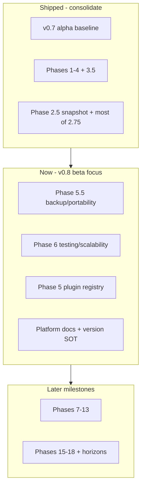

# Elevate `todo.md` roadmap

## Current state

[todo.md](todo.md) is a 226-line phase checklist that duplicates some README scope but has drifted from reality:

| Issue | Example |
|-------|---------|
| Stale “open” items | Phase 2.5 “player session anthology” is deferred, but [docs/session-anthology.md](docs/session-anthology.md) documents a shipped Session Snapshot Formatter (`SessionCombinedNotesPage`, `SessionSnapshotExporter`, combined API) |
| Mostly done phase still open | Phase 2.75 (combined session notes) is implemented in [`backend/src/controllers/wikiController.ts`](backend/src/controllers/wikiController.ts) (`getCombinedSessionNotes`), [`frontend/src/pages/SessionCombinedNotesPage.tsx`](frontend/src/pages/SessionCombinedNotesPage.tsx), [`frontend/src/components/session/SessionNotesSidebar.tsx`](frontend/src/components/session/SessionNotesSidebar.tsx) |
| Formatting bug | Line 133: upload-validation item and Multi-Tenant item are merged on one line |
| Numbering typo | “Phase 188” should be **Phase 18** (World Dashboard) |
| Inconsistent checkboxes | Mix of `[X]`, `[x]`, `[-]` without a legend |
| Weak navigation | No “what to work on now”; v0.8 beta focus is buried at line 98 |
| Version policy | Per your choice: **keep alpha v0.7.0** until v0.8 beta; do not bump README/todo product label |



---

## Target document shape

Replace the flat phase dump with a **four-layer** layout (same file, no new docs unless linking existing ones):

### 1. Header (new)

- Title + one-line purpose (engineering roadmap; user features stay in [README.md](README.md#features))
- **Product status:** Alpha v0.7.0 (unchanged)
- **Last reviewed:** date of edit
- **How to use:** checkbox legend (`[x]` done, `[ ]` open, `[-]` explicitly skipped/won’t do)
- **Doc index:** links to [changelog.md](changelog.md), [docs/session-anthology.md](docs/session-anthology.md), [docs/viewport-audit.md](docs/viewport-audit.md)

### 2. At a glance (new)

Short bullets only:

- **Recently shipped** (Phases 2–4, 3.5, session combined view + snapshot export)
- **Current focus (v0.8 beta):** top 5–7 open items pulled from Phases 5.5, 6, 5, and Platform
- **Explicitly deferred:** anthology compile-hub sidebar link (product polish, not core API)

### 3. Shipped registry (reorganized)

Merge existing “Shipped in alpha” + completed phases into chronological groups:

- **v0.7 alpha baseline** (existing list, keep)
- **Post-v0.7 shipped** (new subsection): Phases 1–4, 3, 3.5, Phase 2 items, Phase 2.5 (with doc link), Phase 2.75 **except** the one remaining gap below

Mark Phase 2.5 as **done** with a note: *compile-hub sidebar link remains out of scope per [docs/session-anthology.md](docs/session-anthology.md#non-goals)*.

### 4. Active backlog (restructured)

Group open work by **milestone**, not only by historical phase number:

#### v0.8 beta (primary)

| Source phase | Open items to keep prominent |
|--------------|------------------------------|
| Phase 5 | Plugin registry activation (remote manifest); keep mail router as `[-]` skipped |
| Phase 5.5 | OneNote ingestion, unified backup ZIP, sovereign Markdown export, fantasy-calendar JSON export |
| Phase 6 | Mock factories, stress tests, OpenAPI, optimistic concurrency, base64 media interceptor |
| Platform | App version source of truth, contributor setup guide |

#### v0.9 RC and beyond

Keep Phases 7–13, 15–18, and “Future horizons” as **collapsed milestone sections** (headers + checklists unchanged in substance, trimmed where redundant).

#### Session notes — one honest open item

After reconciliation, Phase 2.75 collapses to a single tracked item under a small **“Session notes polish”** heading:

- **Per-author references context:** Sidebar [`ReferencesWidget`](frontend/src/components/wiki/widgets/ReferencesWidget.tsx) uses session-wide `aggregateReferences`; selecting a roster member in [`SessionNoteEditor`](frontend/src/components/session/SessionNoteEditor.tsx) updates the main panel but does **not** filter the radar to that author’s `pageId`. Either implement per-`pageId` references (or filtered aggregate) or downgrade the todo to “optional polish” with a clear note.

Remove the long nested 2.75 checklist once items are marked shipped.

#### Phase 18 fix

Rename **Phase 188 → Phase 18: Rich World Dashboard Revamp** and place it under v1.1+ / future horizons (not v0.8).

---

## Edits to apply (content hygiene)

1. **Normalize checkboxes** — all completed → `[x]`; skipped mail → `[-]` with one-line rationale.
2. **Fix line 133** — split upload validation and Multi-Tenant items onto separate lines.
3. **Remove milestone emojis** from headings (🚀, 🌌) for consistent professional tone; keep milestone *names* as plain `## Milestone: …` blocks.
4. **Deduplicate** — where Phase 13 and Platform both mention OpenAPI/README, cross-reference instead of repeating full bullets.
5. **Align cross-links** — README already points to todo; ensure todo’s “Shipped” session work links to `docs/session-anthology.md` (no README version change).

---

## Add `changelog.md`

Introduce a root **[changelog.md](changelog.md)** following [Keep a Changelog](https://keepachangelog.com/en/1.1.0/) (product-facing, not workspace `package.json` versions).

### Initial structure

```markdown
# Changelog

All notable product changes for Esiana are documented here.
Product milestone versions align with [README.md](./README.md) / [todo.md](./todo.md) (currently alpha v0.7.0).

## [Unreleased]

### Changed
- Roadmap reconciliation and structure in `todo.md`. Plan: [Elevate todo.md](docs/plans/elevate-todo.md)

## [0.7.0] - YYYY-MM-DD

### Added
- (Retrospective bullets for v0.7 alpha baseline from todo “Shipped in alpha” + post-v0.7 shipped work, grouped Added/Changed/Fixed)
```

Use a real date for `0.7.0` if known, or `2026-05-29` as “changelog inception” with a note that earlier alpha work is summarized retrospectively.

### Plan link convention

When a change was planned in Cursor before implementation, add an optional **Plan:** line under that bullet (or a `Plan:` suffix on the same line):

- **In-repo plans only** — Cursor’s `.cursor/plans/` outside the repo are not linkable for collaborators. On execution, snapshot this effort to **[docs/plans/elevate-todo.md](docs/plans/elevate-todo.md)** (trimmed from [elevate_todo.md plan](file:///c:/Users/allison/.cursor/plans/elevate_todo.md_bd8fd45a.plan.md): goals, checklist, no Cursor frontmatter).
- **Changelog entry example:**

  ```markdown
  ### Changed
  - Reorganized development roadmap (`todo.md`) to reflect shipped Phases 2–4 and session combined notes. Plan: [Elevate todo.md](docs/plans/elevate-todo.md)
  ```

- **When to omit Plan:** drive-by fixes, dependency bumps, or changes with no plan artifact.
- **Future plans:** add `docs/plans/<slug>.md` when starting substantial work; link from `## [Unreleased]` when it ships.

Add **[docs/plans/README.md](docs/plans/README.md)** (one short paragraph): purpose, naming (`kebab-case.md`), and “link from changelog when applicable.”

### Cross-links

| File | Update |
|------|--------|
| [README.md](README.md) | Versioning note: add link to `changelog.md` alongside todo |
| [todo.md](todo.md) | Doc index + Platform item “app version source of truth”: note changelog is the **release notes** layer; todo remains **roadmap** |
| Platform todo | Soften “keep README status, changelog, and git tags aligned” — changelog becomes the live artifact |

---

## Verification pass (read-only, during implementation)

Quick grep/read confirm before marking items `[x]`:

- Combined API + All View + entities ribbon + DM badge/masking: **shipped**
- Identity mapping (`identityPageId`, `useIdentityDisplay`): **shipped**
- Viewport audit + responsive nav: **shipped** (per [docs/viewport-audit.md](docs/viewport-audit.md))
- Chronicle / recruitment expansion: **shipped** (Recruitment lobby pages, chronology hub)
- Notifications, map pins UI, remote plugin manifest, backup ZIP: **still open** (leave unchecked)

---

## Out of scope (per your choices)

- No product version bump in README or todo (stay v0.7.0 until v0.8 beta)
- No application code changes — documentation-only (`todo.md`, `changelog.md`, `docs/plans/`, README link)

---

## Expected outcome

- **Scannable roadmap** in `todo.md`: shipped vs v0.8 focus vs long-term backlog, reconciled with the codebase.
- **Traceable releases** in `changelog.md`: Keep a Changelog sections, retrospective v0.7.0 summary, `Unreleased` for this doc pass with a plan link where applicable.
- **Durable plan links** via committed snapshots under `docs/plans/`, not ephemeral Cursor-only paths.
