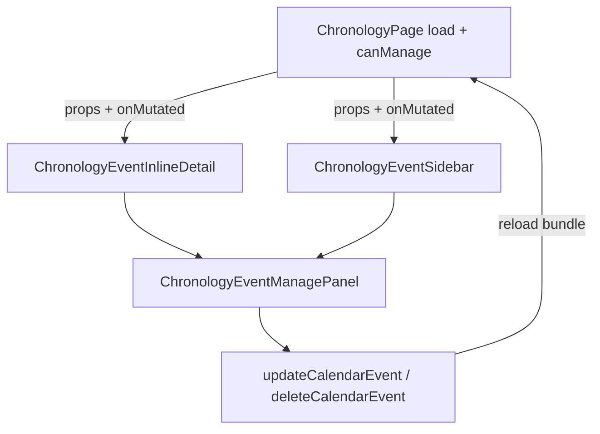

# Centralized Event Mutation, Deletion, and Date Movement

## Current state

| Surface | Component | Management today |
|---------|-----------|------------------|
| Calendar day agenda | [`ChronologyEventInlineDetail.tsx`](frontend/src/components/chronology/ChronologyEventInlineDetail.tsx) | Read-only: lore link, description preview, metadata |
| Events ledger rows | Same inline detail | Read-only |
| Timeline view | [`ChronologyEventSidebar.tsx`](frontend/src/components/chronology/ChronologyEventSidebar.tsx) | Full edit form; save logic in [`ChronologyPage.tsx`](frontend/src/pages/ChronologyPage.tsx) `handleSaveEventEdits` (~259–280) — **no date fields, no delete** |

APIs already exist: [`updateCalendarEvent`](frontend/src/lib/calendarEventsApi.ts) / [`deleteCalendarEvent`](frontend/src/lib/calendarEventsApi.ts) accept `targetYear` / `targetMonth` / `targetDay` / `targetEpochMinute`. [`FantasyDatePicker`](frontend/src/components/chronology/FantasyDatePicker.tsx) + [`clampChronologyDate`](frontend/src/lib/chronologyDates.ts) are implemented for create flow.



---

## Execution safety adjustments (apply during implementation)

### 1. Markdown format preservation (description field)

`CalendarEvent.description` is stored as **Markdown** (synced with lore wiki via [`eventLoreWiki`](backend/src/lib/eventLoreWiki.ts)); values may include TipTap/Markdown syntax (`**bold**`, headings, lists, etc.).

**Do not** use a plain `<textarea>` for description editing in [`ChronologyEventManagePanel.tsx`](frontend/src/components/chronology/ChronologyEventManagePanel.tsx) — uncontrolled typing can corrupt or strip markup on round-trip.

**Instead:**
- Reuse [`WikiTipTapEditor`](frontend/src/components/wiki/WikiTipTapEditor.tsx) (Markdown extension, `onChange` emits markdown via `editor.getMarkdown()`) **or** add a thin `ChronologyDescriptionEditor` wrapper around the same TipTap+Markdown stack with a reduced toolbar suitable for inline drawers.
- Pass `baseEvent.description ?? ''` as initial content; on save, send the markdown string unchanged (trim only empty-to-null if desired — same rule as [`normalizeDescriptionMarkdown`](backend/src/lib/eventLoreWiki.ts) on server).
- `wikiTree` prop: pass `[]` or campaign wiki tree from context if link autocomplete is desired later; empty tree is acceptable for v1.

### 2. Explicit multi-day shift warning

When `dateSeed` is provided and its coordinates differ from the base event anchor (`baseEvent.targetYear` / `targetMonth` / `targetDay`), show a **prominent warning banner** in the date section (above `FantasyDatePicker`):

> Moving this date re-anchors the **entire** continuous duration block (all days shift together).

Helper: `dateSeedDiffersFromAnchor(dateSeed, baseEvent)` comparing year, month index, and day.

Replace the previous small hint with this banner whenever the condition is true (including continuation days on calendar/ledger).

### 3. Reactive hook re-hydration after reload

In [`useChronologyEventEditor.ts`](frontend/src/hooks/useChronologyEventEditor.ts):

```ts
useEffect(() => {
  resetFromEvent();
  setIsDirty(false); // or equivalent editing indicator
}, [baseEvent.id, baseEvent.updatedAt, /* or stable serialized snapshot */]);
```

- After successful `save()` → `await onMutated()` → parent reloads bundle → `baseEvent` prop updates with new `updatedAt` / fields → effect re-runs → local form state syncs to server truth.
- Prevents stale local date/category/description from persisting across the reload loop.
- Collapse transient UI (e.g. “unsaved changes” badge, advanced section flash) as part of reset.

---

## Part 1: Shared editor hook + manage panel

**New:** [`frontend/src/hooks/useChronologyEventEditor.ts`](frontend/src/hooks/useChronologyEventEditor.ts)

- Input: `baseEvent`, `calendarLike` (`FantasyCalendarLike` from `timeBundle`), optional `dateSeed` (`ChronologyDateParts` from occurrence `start` when expanding a continuation day)
- Local state mirrors sidebar fields: category, description, visibility, duration, repeating, prerequisite, conditions, moon overrides, **target date** (via `clampChronologyDate`)
- `resetFromEvent()` when `baseEvent.id` changes **and** on `baseEvent.updatedAt` changes (see safety §3); seed date from `dateSeed ?? { year: targetYear, month: targetMonth, day: targetDay }`
- Track `isDirty` (or equivalent); cleared on `resetFromEvent()` and after successful save
- `save()` → `updateCalendarEvent` with full payload including:
  - `targetYear`, `targetMonth`, `targetDay`
  - `targetEpochMinute: calendarEpochMinuteForDate(...).toString()`
- `deleteEvent()` → `confirm()` then `deleteCalendarEvent`
- Returns `{ fields, setters, targetDate, setTargetDate, saving, deleting, save, deleteEvent, error }`

**New:** [`frontend/src/components/chronology/ChronologyEventManagePanel.tsx`](frontend/src/components/chronology/ChronologyEventManagePanel.tsx)

- Renders when `canManage` is true:
  - **Date movement:** [`FantasyDatePicker`](frontend/src/components/chronology/FantasyDatePicker.tsx) bound to `targetDate` (re-clamp if calendar profile changes)
  - **Mutation (compact):** category, visibility, duration; **description via TipTap/Markdown editor** (safety §1); collapsible **Advanced** for prerequisite, repeating, conditions, moon overrides (reuse existing builders from sidebar)
  - **Actions:** Save (primary), Delete (destructive, confirm copy references title)
  - **Multi-day warning banner** when `dateSeed` ≠ base anchor (safety §2)

**Note:** Date move always updates the **base event anchor** (`target*` + `targetEpochMinute`), not per-occurrence rows — occurrences are regenerated server-side.

---

## Part 2: Embed in `ChronologyEventInlineDetail`

Update [`ChronologyEventInlineDetail.tsx`](frontend/src/components/chronology/ChronologyEventInlineDetail.tsx):

**New optional props:**

```ts
canManage?: boolean;
categories?: TimelineCategoryRecord[];
editableEvents?: TimelineBaseEventRecord[];
calendarLike?: FantasyCalendarLike | null;
dateSeed?: ChronologyDateParts | null;  // occurrence.start when known
onMutated?: () => void | Promise<void>;
```

- Keep existing read-only header (lore, description preview, tags, metadata)
- Below metadata, render `ChronologyEventManagePanel` when `canManage && calendarLike`
- Wire hook at panel level or inside inline detail (prefer panel owns hook, inline passes props)

---

## Part 3: Refactor `ChronologyEventSidebar`

Update [`ChronologyEventSidebar.tsx`](frontend/src/components/chronology/ChronologyEventSidebar.tsx):

- Remove duplicated form fields + page-level edit state dependency
- Accept: `baseEvent`, `categories`, `editableEvents`, `calendarLike`, `canManage`, `onMutated`, `onClose`, `categoryFooter`
- Compose: title/header + `ChronologyEventManagePanel` (expanded layout variant if needed — same panel, `variant="sidebar"` for spacing only)

Update [`ChronologyPage.tsx`](frontend/src/pages/ChronologyPage.tsx):

- **Remove** ~15 `edit*` state variables and `handleSaveEventEdits` / selection sync `useEffect` (~230–243)
- Pass `calendarLike` from `timeBundle` for selected event’s calendar row
- Pass `dateSeed` from `selectedOccurrence?.start` when present
- `onMutated={() => void load()}`; clear `selectedOccurrence` on delete

---

## Part 4: Wire calendar + ledger parents

**[`WidescreenCalendarView.tsx`](frontend/src/components/chronology/WidescreenCalendarView.tsx)** — new props from page:

- `canManageChronology`, `categories`, `timeBundle`, `onEventMutated`
- In `AgendaItem`, pass `dateSeed` from `occurrence.start`, `calendarLike` from selected calendar row, `onMutated`

**[`EventsLedgerView.tsx`](frontend/src/components/chronology/EventsLedgerView.tsx)** — same props; pass `dateSeed={event.start}` per row

**[`ChronologyPage.tsx`](frontend/src/pages/ChronologyPage.tsx)** — thread props into both views + sidebar:

```tsx
canManage={canManageChronologyAccess}
categories={bundle.categories}
editableEvents={bundle.baseEvents}
timeBundle={timeBundle}
onEventMutated={load}
```

---

## Part 5: Permissions and UX safeguards

- Gate all manage UI with `canManageChronology` (same as create modal)
- Disable Save/Delete while `saving` / `deleting`; show inline error on API failure
- After delete: parent `onMutated` + collapse expanded row / clear agenda selection
- After save: `onMutated` refreshes timeline bundle so grid/ledger reflect new date and duration span; hook re-hydrates from updated `baseEvent` (safety §3)
- Reuse existing `stopPropagation` on inline detail root so manage clicks don’t toggle row expand
- Description round-trip: save markdown with formatting intact; verify event with bold/list markup survives edit-save-reload

---

## Verification

- **Calendar:** expand agenda item → change date with FantasyDatePicker → Save → event dots move to new days; multi-day span shifts; continuation-day row shows re-anchor banner before editing date
- **Markdown:** edit description with formatting → Save → reload → formatting preserved (no plain-text corruption)
- **Re-hydration:** save from sidebar → inline/ledger form reflects new values without stale local state
- **Ledger:** same from expanded row
- **Timeline:** sidebar save/delete/date move behaves identically; no duplicate form logic in page
- **Delete:** confirm → event removed from all views after reload
- **Permissions:** manage block hidden when `canManageChronology` is false

No backend changes required.
