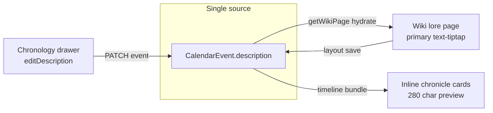

# Event Lore Description Sync

## Design decision (per your answer)

There is **one canonical field**: [`CalendarEvent.description`](backend/prisma/schema.prisma) (markdown string).

- **Chronology sidebar** ([`ChronologyPage.tsx`](frontend/src/pages/ChronologyPage.tsx)) already PATCHes `description` via [`updateCalendarEvent`](frontend/src/lib/chronologyApi.ts) — keep as-is.
- **Event lore wiki** (`event-{baseEventId}`) is a **rich editor UI** for the same field, not a second copy of truth in block JSON.
- **No wiki-vs-DB priority** in [`chronologyController.ts`](backend/src/controllers/chronologyController.ts); bundle continues to use `event.description` after sync.



---

## Part 1: Shared event-lore helpers (backend)

Add [`backend/src/lib/eventLoreWiki.ts`](backend/src/lib/eventLoreWiki.ts):

| Helper | Purpose |
|--------|---------|
| `isEventLorePageId(pageId)` | Matches `event-{baseEventId}` |
| `parseBaseEventIdFromLorePageId(pageId)` | Returns calendar event id |
| `findPrimaryDescriptionBlock(blocks)` | First `text-tiptap` by `(y, x)` |
| `hydrateEventLoreBlocks(blocks, markdown)` | Set primary block `content.markdown` + `title: "Description"` |
| `extractDescriptionMarkdown(blocks)` | Read primary block markdown; **normalize empty TipTap output** |
| `isEffectivelyEmptyDescription(value)` | True for blank markdown/HTML wrappers |

### TipTap boilerplate stripping (`extractDescriptionMarkdown`)

After reading the primary `text-tiptap` block:

1. Strip common empty rich-text wrappers: `<p></p>`, `<p><br></p>`, `<p><br/></p>`, whitespace-only HTML, lone newlines.
2. Trim remaining markdown/text.
3. If the result is empty, return **`null`** (not `""`) so `CalendarEvent.description` is set to SQL `NULL` and not polluted with invisible markup.

Unit tests in [`backend/src/lib/eventLoreWiki.test.ts`](backend/src/lib/eventLoreWiki.test.ts) must cover: empty `<p></p>`, `<p><br></p>`, real markdown, and markdown with only `#` headings/spaces.

---

## Part 2: Wiki read/write sync (backend)

### On read — [`getWikiPage`](backend/src/controllers/wikiController.ts)

After loading the wiki page, if `isEventLorePageId(pageId)`:

1. Load linked `CalendarEvent` where `id === parseBaseEventIdFromLorePageId(pageId)` (same campaign via calendar join).
2. Call `hydrateEventLoreBlocks(page.blocks, event.description ?? '')` before `formatWikiPageDetailResponse`.

Ensures opening the lore editor always shows the same text as the chronology drawer, even if blocks JSON was stale.

### On layout save — [`updateWikiPageLayout`](backend/src/controllers/wikiController.ts)

After persisting `blocks`:

1. If event lore page: `markdown = extractDescriptionMarkdown(blocks)` (may be `null` when effectively empty).
2. `prisma.calendarEvent.update({ data: { description: markdown } })` for the linked event id.
3. **Mandatory** response re-sync: run `hydrateEventLoreBlocks(updatedBlocks, markdown ?? '')` on the payload **before** `res.json(...)`. The frontend must receive DB-canonical blocks so TipTap client state cannot drift from `CalendarEvent.description`.

```ts
// Required pattern in updateWikiPageLayout (event lore branch)
const markdown = extractDescriptionMarkdown(blocks);
await prisma.calendarEvent.update({ where: { id: baseEventId }, data: { description: markdown } });
const syncedBlocks = hydrateEventLoreBlocks(blocks, markdown ?? '');
res.json({ blocks: syncedBlocks, templateType: updatedPage.templateType });
```

### On lore page create — [`WikiPage.tsx`](frontend/src/pages/WikiPage.tsx) init + [`createWikiPage`](backend/src/controllers/wikiController.ts)

When creating `event-{id}` pages:

- Use a dedicated default layout (e.g. `buildEventLoreBlocks()` in [`frontend/src/utils/pageTemplates.ts`](frontend/src/utils/pageTemplates.ts)): one primary `text-tiptap` with **`title: "Description"`** and `markdown` prefilled from existing `CalendarEvent.description` when initializing lore from chronology.

---

## Part 3: Wiki editor labeling (frontend)

There is no standalone `WikiEditor.tsx`; labels live on block chrome in [`WikiPageRenderer.tsx`](frontend/src/components/wiki/WikiPageRenderer.tsx).

- Pass `isEventLorePage={isEventLorePageId(pageId)}` from [`WikiPage.tsx`](frontend/src/pages/WikiPage.tsx).
- For the **primary** `text-tiptap` block on event lore pages:
  - Default block title display: **"Description"** (override `getDefaultBlockTitle` / `getBlockDisplayTitle` when `isEventLorePage && block === primaryDescriptionBlock`).
  - When adding widgets on event lore pages, do not label new text boxes "Description" unless they become the primary block (only the first/main tiptap slot).

Also update [`getDefaultBlockTitle`](frontend/src/utils/wikiWidgets.ts) usage via `buildEventLoreBlocks` so new lore pages start with the correct title without manual rename.

---

## Part 4: Chronicle display truncation + lore deep-link (frontend)

Add [`frontend/src/lib/chronologyText.ts`](frontend/src/lib/chronologyText.ts):

```ts
export const CHRONOLOGY_DESCRIPTION_PREVIEW_LIMIT = 280;

export function truncateChronologyDescription(
  description: string | null | undefined,
  limit = CHRONOLOGY_DESCRIPTION_PREVIEW_LIMIT,
): { text: string; isTruncated: boolean } | null
```

Returns `null` when there is no description to show; `isTruncated: true` when text exceeds the limit.

Update [`ChronologyEventInlineDetail.tsx`](frontend/src/components/chronology/ChronologyEventInlineDetail.tsx):

- Render truncated preview text in the inline card (280 chars).
- When `isTruncated`, append an inline link after the ellipsis:

```tsx
<Link to={campaignEventLorePath(campaignSlug, baseEvent.id)}>
  Read Full Chronicle ↗
</Link>
```

Use [`campaignEventLorePath`](frontend/src/lib/campaignPaths.ts) so the route is `/c/${campaignSlug}/event-${baseEventId}` (no `/wiki` prefix).

- Full text remains available in the chronology sidebar editor and lore wiki page (no truncation there).
- If description is null/empty, keep existing "No description." copy (no link).

Search other chronology surfaces before shipping; today only inline detail renders `baseEvent.description` in the UI.

---

## Part 5: Chronology bundle (no merge layer)

[`getChronologyTimelineBundle`](backend/src/controllers/chronologyController.ts) can stay as-is: `baseEvents` and generated `occurrences` already copy `event.description` ([`buildOccurrences`](backend/src/controllers/chronologyController.ts) ~143). Once wiki save and sidebar save both write `CalendarEvent.description`, chronicle views stay in sync without a second resolution step.

---

## Verification checklist

- Create event with description in chronology drawer → Initialize Lore Page → wiki opens with **Description** box containing the same text.
- Edit lore **Description** → Save layout → chronology drawer + inline card show updated text (card truncated at 280).
- Clear lore **Description** (empty TipTap) → Save → `CalendarEvent.description` is `null`, not `<p></p>`.
- After wiki layout save, API response blocks match DB (no client block drift).
- Truncated inline card shows `... [Read Full Chronicle ↗]` linking to `/c/:slug/event-:id`.
- Edit description in chronology drawer → Save → reopen lore page → **Description** box matches (hydrate on read).
- No duplicate/conflicting text between wiki blocks and chronology API responses after either save path.
