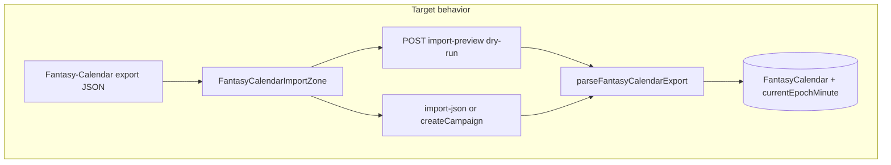

# Fantasy-Calendar Import Mapping Fix

## Problem diagnosis (using [`somerden.json`](somerden.json))

Your export matches the expected top-level shape (`name`, `static_data.year_data.timespans`, `static_data.moons`), but the current importer in [`campaignsController.ts`](backend/src/controllers/campaignsController.ts) (`importCalendarFromJson`, ~996–1147) fails or mis-maps several real-world fields:

| Export field | Your file | Current parser | Result |
|---|---|---|---|
| `year_data.global_week` | `["Arcanaforge", ...]` (strings) | Expects `{ name, length }` objects only | **Weekdays = 0 → 400 error** |
| `moons[].cycle` | `"28"` (string) | `asNumber()` only accepts `number` | **Moons dropped** |
| Current date | `dynamic_data.year/timespan/day/epoch` | Reads `year_data.current_*` only | **Defaults to Year 1, Month 1, Day 1** |
| Intraday time | Not in `dynamic_data` for Somerden | Ignored | Clock resets to midnight when using epoch-only |
| Calendar name | `name: "Somerden"` | Fallback `root.name` | OK |
| `timespans[].type` | `"month"` | Treated as standard | OK (12 months import) |

**Wizard gap:** [`createCampaign`](backend/src/controllers/campaignsController.ts) stores `calendarConfigFile` as asset type `campaign-calendar-config` but **never calls import logic**. Only [`TimeTrackingManagement.tsx`](frontend/src/pages/TimeTrackingManagement.tsx) posts to `/time-tracking/import-json`.



---

## Part 1: Shared backend parser + importer

### New module: [`backend/src/lib/fantasyCalendarImport.ts`](backend/src/lib/fantasyCalendarImport.ts)

Extract parsing and DB write from the controller into reusable functions.

**`parseFantasyCalendarExport(payload: unknown)`**

- Unwrap `{ payload }` wrapper (keep existing behavior).
- **Months** from `static_data.year_data.timespans` — **preserve array order** (critical for intercalary alignment):
  - Map `timespans` **in source array index order** into `months[]` with stable `sourceIndex` (0..n-1).
  - Do **not** filter/re-sort months; intercalary segments must remain at the same positional index FC used for `dynamic_data.timespan` and era date math.
  - `length` from `length` or `timespan_length`.
  - `type: 'intercalary'` when `type` is `intercalary`/`holiday` or `intercalary: true`; otherwise `standard` (including `type: "month"`).
- **Weekdays** from `global_week`:
  - String entry → `{ name, length: 1 }`
  - Object entry → `{ name, length }`
- **Moons** from `static_data.moons`:
  - Coerce numeric strings via `parseCoercedNumber()` (`"28"` → 28)
  - Fields: `cycle`, `orbit`, `cycle_length`
- **Current date** resolution order:
  1. `dynamic_data` (`year`, `timespan` as month index, `day`)
  2. Fallback `year_data.current_year`, `current_timespan`, `current_day`
- **Intraday time** (hours/minutes, default 0):
  1. `dynamic_data.hour` / `dynamic_data.minute` (if present in export)
  2. Else `static_data.clock` (`hours`/`minutes` config + any offset fields if FC provides them)
  3. Else `0` / `0`
- **Epoch minutes (precision formula)** — apply in this order:
  1. If `dynamic_data.epoch` is present (FC day index from calendar start):
     ```
     currentEpochMinute = (epoch * 1440) + (parsedHour * 60) + parsedMinute
     ```
     This preserves the campaign clock position within the day instead of snapping to midnight.
  2. Else compute day offset from resolved `year` + **`timespan` index into ordered `months[]`** + `day`, summing each month's `length` by index (count intercalary lengths in the sum — they occupy index slots in FC's timeline).
  3. Apply same intraday offset: `+ (parsedHour * 60) + parsedMinute`
- **Name**: `year_data.calendar_name` → `root.name` → `"Imported Calendar"`.
- Return structured result + `warnings[]`.

**`applyFantasyCalendarImport(tx, campaignId, parsed)`**

- Transaction-safe upsert of master `FantasyCalendar` (update master or create with `isMasterTime: true`).
- Persist `months` JSON **in order** so [`timeEngine.ts`](backend/src/lib/timeEngine.ts) `resolveCalendarDate` / `buildCalendarMonthViewport` intercalary handling stays aligned.
- Set `campaign.currentEpochMinute` from parsed precision epoch.

Refactor [`importCalendarFromJson`](backend/src/controllers/campaignsController.ts) to call shared helpers.

---

## Part 1b: Dry-run preview endpoint (replaces client-side parser)

**Do not add** [`frontend/src/lib/fantasyCalendarImportPreview.ts`](frontend/src/lib/fantasyCalendarImportPreview.ts). A duplicated frontend parser will drift from backend rules.

### New route: `POST /c/:campaignSlug/chronology/import-preview`

Add to [`campaignScoped.ts`](backend/src/routes/campaignScoped.ts):

- Auth: `requireCampaignMember` (read-only preview for any member) or `requireChronologyManager` if preview should be DM-only — **recommend `requireCampaignMember`** so players can validate files before DM import.
- Handler: `previewFantasyCalendarImport` in [`campaignsController.ts`](backend/src/controllers/campaignsController.ts) or a thin chronology controller.
- Body: raw FC export JSON (same shape as import).
- Behavior: call `parseFantasyCalendarExport` only — **no Prisma writes**.
- Response:

```json
{
  "ok": true,
  "calendarName": "Somerden",
  "monthCount": 12,
  "weekdayCount": 5,
  "moonCount": 2,
  "intercalaryCount": 0,
  "resolvedDate": { "year": 4672, "monthIndex": 6, "day": 13, "hour": 0, "minute": 0 },
  "currentEpochMinute": "2424122880",
  "warnings": []
}
```

[`FantasyCalendarImportZone`](frontend/src/components/chronology/FantasyCalendarImportZone.tsx) calls this on file drop (debounced) before the user commits import/create.

---

## Part 2: Wire New Campaign Wizard import + upload disposal

Calendar JSON is **not** like the markdown import ZIP. The ZIP must remain on disk for async [`campaignImportProcessor`](backend/src/lib/campaignImportProcessor.ts) and is registered as an asset with **`expiresAt` = now + 3 days** (see [`createCampaign`](backend/src/controllers/campaignsController.ts) ~498) so [`assetRetention`](backend/src/lib/assetRetention.ts) can delete it later.

The FC calendar export has **no purpose after parse** — structured data lives in `FantasyCalendar` + `currentEpochMinute`. **Do not** create a `campaign-calendar-config` asset row.

In [`createCampaign`](backend/src/controllers/campaignsController.ts):

1. When `calendarConfigFile` is present:
   - Read multer temp file from `env.uploadsDir` + `calendarConfigFile.filename`.
   - `parseFantasyCalendarExport(JSON.parse(text))`.
2. **Always dispose the upload file** in a `finally` block (success or failure):
   - `deleteUploadedFile(calendarConfigFile.filename)` from [`assetFiles.ts`](backend/src/lib/assetFiles.ts) (same helper used by image uploads).
   - Runs after parse attempt and after transaction commit/rollback — **immediate** deletion, not 3-day retention.
3. **On parse/validation failure (400)**: return clear error JSON (file already deleted in `finally`).
4. **On success**: run `applyFantasyCalendarImport` inside the existing `$transaction` after campaign + `seedWikiSkeleton`.
5. **Remove** existing `campaign-calendar-config` asset creation and drop `calendarConfigAssetId` from `importManifest` (or leave manifest key null for backward compatibility).

**Transaction ordering:**

```
read file → parse → begin transaction → create campaign → applyFantasyCalendarImport → commit
→ finally: deleteUploadedFile(multer filename)
```

**Time Tracking** (`POST .../time-tracking/import-json`): JSON in request body only — no multer file, no disk cleanup needed.

---

## Part 3: Shared frontend import component

### New: [`frontend/src/components/chronology/FantasyCalendarImportZone.tsx`](frontend/src/components/chronology/FantasyCalendarImportZone.tsx)

Props:

- `campaignSlug: string`
- `mode: 'preview' | 'import'` — wizard uses preview-only on drop; Time Tracking uses import on confirm
- `onImport?: (file: File) => Promise<void>` — parent handles `POST .../import-json` for final commit
- `disabled?`, `importing?`, `summary?`

Features:

- Drag/drop + file picker (`accept=".json,application/json"`)
- On drop: read file text → `POST /c/:slug/chronology/import-preview` → show structural summary (months/weekdays/moons, resolved date, warnings)
- On confirm (Time Tracking): `POST /c/:slug/time-tracking/import-json` with same JSON
- Wizard: preview on drop during step; actual DB write on campaign create (Part 2)

### Integrate in both surfaces

| Surface | Change |
|---------|--------|
| [`TimeTrackingManagement.tsx`](frontend/src/pages/TimeTrackingManagement.tsx) | Replace inline drop zone with `FantasyCalendarImportZone` |
| [`NewCampaignWizard.tsx`](frontend/src/components/hub/NewCampaignWizard.tsx) | Use `FantasyCalendarImportZone` for preview; keep file in form state for `createCampaignWithWizard` |

---

## Part 4: Out of scope (document, do not block)

- **Eras** in FC export (`static_data.eras`) — not imported (chronology uses categories).
- **Seasons / leap_days / weather** — skip unless present and trivial later.
- **Non-master calendars** — master chronology only (current behavior).

---

## Verification checklist

- Drop `somerden.json` on import zone → preview shows 12 months, 5 weekdays, 2 moons, resolved date year 4672 / month 6 / day 13 **without** client-side duplicate parser.
- **Time Tracking** import → master calendar **Somerden**; clock uses `(epoch * 1440) + intraday` when epoch present.
- **Wizard** create with same file → calendar exists immediately; upload file **gone from disk** on both success and failure; invalid JSON → 400.
- No `campaign-calendar-config` asset row created (unlike markdown ZIP 3-day `expiresAt` pattern).
- Export with intercalary `timespans` entries at mixed indices → month array order matches FC; `timespan` index resolves to correct segment in timeline math.
- Invalid JSON / missing `timespans` → clear 400 from preview and import endpoints.
