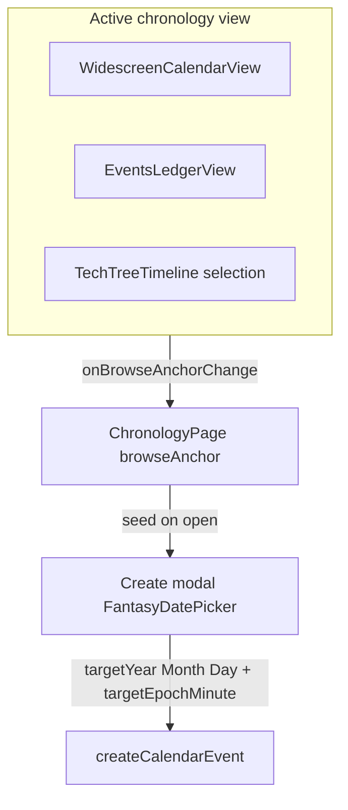

# Fantasy Date Picker for Event Creation

## Current behavior

- [`ChronologyPage.tsx`](frontend/src/pages/ChronologyPage.tsx) create modal (~423–608) has **no date fields**; [`handleCreateEvent`](frontend/src/pages/ChronologyPage.tsx) silently sets `targetYear` / `targetMonth` / `targetDay` from **master calendar live state** (`timeBundle.calendars.find(isMasterTime).state`), not from what the user is browsing.
- Browse state is **trapped inside child views**:
  - [`WidescreenCalendarView.tsx`](frontend/src/components/chronology/WidescreenCalendarView.tsx): `viewYear`, `viewMonthIndex`, `selectedDay`
  - [`EventsLedgerView.tsx`](frontend/src/components/chronology/EventsLedgerView.tsx): `jumpYear` / `jumpMonthIndex` (fantasy month jump controls)
  - Timeline: no browse date; selection uses occurrence `start`
- Backend [`createCalendarEvent`](backend/src/controllers/calendarEventsController.ts) stores `targetEpochMinute` only if sent; chronology resolution **prefers** `targetEpochMinute` over stale Y/M/D ([`resolveEventStartCoordinates`](backend/src/lib/chronologyOccurrences.ts)). Client must compute epoch via [`calendarEpochMinuteForDate`](frontend/src/lib/timeEngine.ts) when the user picks a date.



---

## Crucial safeguards (apply before / during execution)

### 1. Cross-calendar index clamping (`clampChronologyDate`)

In [`chronologyDates.ts`](frontend/src/lib/chronologyDates.ts), `clampChronologyDate(calendar, parts)` must run in this order when the calendar profile changes (e.g. user switches `createCalendarId`):

1. Coerce `year` to `Math.max(1, floor(year ?? 1))`.
2. Resolve `yearMonths = getMonthsForYear(year, …)`; if empty, bail safely.
3. **Clamp `month` first:** `month = min(max(0, month ?? 0), yearMonths.length - 1)` so a prior calendar’s higher month index never leaves an out-of-bounds index on a shorter calendar.
4. **Then clamp `day`:** `day = min(max(1, day ?? 1), yearMonths[month].length)`.

`ChronologyPage` must call `clampChronologyDate` inside a `useEffect` whenever `createCalendarId` or `createTargetDate` changes and the resolved `timeBundle` calendar row updates.

**Unit tests (required, not optional):** month-index overflow when switching from 12-month → 3-month profile; day overflow when target month shortens; year floor at 1.

### 2. Graceful year typestate (`FantasyDatePicker`)

- Keep **display state** for the year field as `string` (`yearInput`), separate from the numeric `value.year` passed to `onChange`.
- `onChange` on the year `<input>` may set `yearInput` to `""` while the user selects/backspaces; do **not** force `1` into the visible field mid-edit.
- For month/day option lists, `resolveMonthName`, `getMonthsForYear`, and `clampChronologyDate`, use `lookupYear = yearInput === "" ? 1 : max(1, parseInt(yearInput, 10) || 1)`.
- On `blur` or when committing month/day/prev-next day: parse year, coerce to `>= 1`, sync `yearInput`, and emit clamped `ChronologyDateParts` via `onChange`.

### 3. Prevent calendar click bubbling (`CalendarMonthGrid`)

When day cells host interactive children (event dots, occurrence chips, or link wrappers), those elements must call `e.stopPropagation()` on `click` (and `pointerdown` if needed) so the parent day `<button onClick={() => onDayClick?.(cell.day)}>` does not fire and **overwrite** the browse anchor with a different day.

Implementation notes for [`CalendarMonthGrid.tsx`](frontend/src/components/chronology/CalendarMonthGrid.tsx):

- Wrap overlay/event UI in a container with `onClick={(e) => e.stopPropagation()}` **or** attach `stopPropagation` on each interactive child.
- If the whole cell remains one `<button>`, refactor to `<td>` + clickable day number area vs. non-bubbling event strip (preferred if event chips become links).
- Verify in [`WidescreenCalendarView.tsx`](frontend/src/components/chronology/WidescreenCalendarView.tsx) agenda-side occurrence toggles do not call `handleDayClick` indirectly.

---

## Part 1: `FantasyDatePicker` component

**New file:** [`frontend/src/components/chronology/FantasyDatePicker.tsx`](frontend/src/components/chronology/FantasyDatePicker.tsx)

Controlled component over `ChronologyDateParts` ([`chronologyDates.ts`](frontend/src/lib/chronologyDates.ts)):

| Control | Implementation |
|---------|----------------|
| Year | `<input type="number" min={1}>` with **string typestate** (see safeguards §2; not `type="date"`) |
| Month | `<select>` options from `getMonthsForYear(year, parseMonths, parseLeapRules)` — show real month names (Stormsbreath, etc.) |
| Day | `<select>` 1…`month.length` for selected year/month (recompute when year/month changes; clamp day if month shortens) |

**Calendar profile:** Accept `FantasyCalendarLike` derived from the **selected create calendar** in `timeBundle` (same `calendarRowToLike` pattern as [`WidescreenCalendarView.tsx`](frontend/src/components/chronology/WidescreenCalendarView.tsx) lines 30–38).

**UX details:**
- Summary line using existing [`formatOccurrenceDateLabel`](frontend/src/lib/chronologyDates.ts) / `resolveMonthName`.
- Optional chevrons: previous/next day using same rollover rules as backend `advanceCalendarDate` logic — **prefer a small shared frontend helper** in `chronologyDates.ts` (loop + `getMonthsForYear` lengths) to avoid duplicating controller logic; keep scope to +1/−1 day only.
- No native browser date/datetime inputs anywhere in the modal date section.

**Helper (required, tested):** `clampChronologyDate(calendar, parts)` in [`chronologyDates.ts`](frontend/src/lib/chronologyDates.ts) — month index clamp **before** day clamp; used on calendar-track change and picker edits (see safeguards §1).

---

## Part 2: Lift browse anchor to `ChronologyPage`

Add parent state:

```ts
const [browseAnchor, setBrowseAnchor] = useState<ChronologyDateParts | null>(null);
```

**Derive anchor per active view** via `onBrowseAnchorChange` callbacks (no React Context needed):

| View | Source | Anchor rule |
|------|--------|-------------|
| Calendar | `WidescreenCalendarView` | Calendar **being viewed** (`selectedCalendar`), not master. `{ year: viewYear, month: viewMonthIndex, day }` where `day = selectedDay ?? (view matches campaign today ? state.day : 1)` |
| Events | `EventsLedgerView` | `{ year: jumpYearNumber, month: Number(jumpMonthIndex), day: 1 }` — update on jump controls and initial `now` sync |
| Timeline | `ChronologyPage` | If `selectedOccurrence` set → its `start` parts; else master `state` |

Call `setBrowseAnchor` in `useEffect` when each view’s inputs change; pass `onBrowseAnchorChange={setBrowseAnchor}` into calendar and ledger components.

**Props changes:**
- [`WidescreenCalendarView.tsx`](frontend/src/components/chronology/WidescreenCalendarView.tsx): optional `onBrowseAnchorChange?: (anchor: ChronologyDateParts) => void`
- [`EventsLedgerView.tsx`](frontend/src/components/chronology/EventsLedgerView.tsx): same callback when `jumpYearNumber` / `jumpMonthIndex` / `now` change

---

## Part 3: Wire create modal + API payload

**State on `ChronologyPage`:**
- `createTargetDate: ChronologyDateParts` (initialized when modal opens)

**On `setShowCreateModal(true)`** (or `useEffect` when `showCreateModal` becomes true):
- Seed `createTargetDate` from `browseAnchor` if set, else master calendar `state`.
- Reset when modal closes (optional).

**Modal UI** (after calendar track select, before duration):
- Render `FantasyDatePicker` bound to `createTargetDate`.
- When `createCalendarId` changes, run `clampChronologyDate` against the **new** calendar profile (month index may shrink — see safeguards §1).

**`handleCreateEvent` changes:**
- Resolve `calendarRow` from `timeBundle` for chosen `calendarId`.
- Send explicit:
  - `targetYear`, `targetMonth`, `targetDay` from picker
  - `targetEpochMinute: calendarEpochMinuteForDate(calendarLike, year, month, day).toString()`
- Remove reliance on `anchorState = masterCalendar?.state`.

---

## Part 4: Verification

- **Manual**
  - Calendar view on Y4672 Stormsbreath day 14 → open Create → picker shows 14 (or selected grid day).
  - Change month via prev/next → open Create → defaults to browsed month (day 1 if no cell selected).
  - Events ledger jump to another year/month → create defaults there.
  - Timeline: select an occurrence → create defaults to that occurrence’s date.
  - Created event appears on correct calendar day in widescreen grid and timeline cards.
- **Automated:** `clampChronologyDate` tests — month-index clamp across calendars, day clamp at month end, year floor; optional day ±1 rollover helper tests.
- **Manual (grid):** click an in-cell event marker/link — selected browse day must not change unless the day number itself is clicked (safeguards §3).

No backend changes required unless we later want the API to auto-fill `targetEpochMinute` from Y/M/D when omitted (out of scope).
