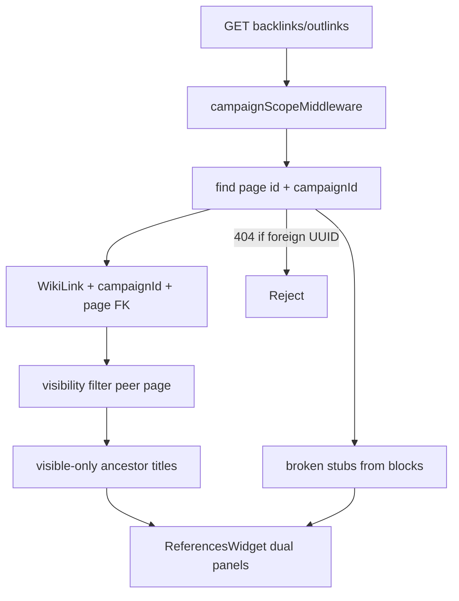

# Finish Phase 2: Cross-hierarchy indexes, References radar, defer player anthology

## Scope decisions

| Item | Action |
|------|--------|
| Cross-Hierarchy Discoverability ([`todo.md`](todo.md) L38) | Implement server location trails + index API fields; UI chips on category grids |
| Bi-Directional References ([`todo.md`](todo.md) L39) | **Dual-panel radar** (incoming + outgoing visible together), prefetch both on mount, fix `/characters/` link extraction |
| Session compile hub link | **Defer** — move to new phase as research/backlog (combined all-player document; formatting TBD) |
| Parental deletion / compile hardening | Already shipped — no additional work |

---

## A. Defer player anthology compile (todo only)

Add a new backlog entry (suggested placement: new **Phase 2.5** block before Phase 3 in [`todo.md`](todo.md)):

- **Player session anthology (deferred):** Research a readable combined export of all players’ session notes (distinct from per-scope `compileSessionNotes`). Out of scope until formatting/structure is defined. Do **not** add a link from [`SessionNotesView.tsx`](frontend/src/pages/SessionNotesView.tsx) in this pass.

No code for compile hub navigation in this phase.

---

## B. Cross-Hierarchy Discoverability

### Current behavior

- [`getCategoryIndex`](backend/src/controllers/wikiController.ts) already queries **campaign-wide** via [`buildCategoryIndexWhereClause`](backend/src/lib/wikiCategoryEntityIndex.ts): Characters/Locations match `metadata.entityCategory` **OR** `templateType` (`CHARACTER` / `LOCATION`).
- Cross-nested placement is hinted client-side by [`formatIndexLocationTrail`](frontend/src/lib/wikiHierarchy.ts) — generic ancestor titles, not location-only, and depends on loaded `flatPages`.

### Backend changes

**New helper** — [`backend/src/lib/wikiCategoryLocationTrail.ts`](backend/src/lib/wikiCategoryLocationTrail.ts) (or extend `wikiCategoryEntityIndex.ts`):

- Load campaign graph once per request: `{ id, title, parentId, templateType, metadata }`.
- Reuse [`isLocationPage`](backend/src/lib/wikiDeletion.ts) for classification.
- `computeLocationAncestorTrail(childId, categoryPageId, graph)`:
  - Walk from `child.parentId` upward until `categoryPageId` or root.
  - Collect only **location** nodes (title + id), excluding structural dividers (`World`, `Game`) via existing [`isStructuralDividerTitle`](backend/src/lib/wikiSystemPages.ts).
  - Return `[]` when child is a direct child of the category folder (`isCrossNested: false`).

**Extend** [`getCategoryIndex`](backend/src/controllers/wikiController.ts) child payload:

```ts
{
  // existing fields...
  isCrossNested: boolean;
  locationAncestors: Array<{ id: string; title: string }>;
  locationTrailLabel: string | null; // "Greenest › Purple Dragon Inn"
}
```

**Entity-type indexing** — tighten [`wikiCategoryEntityIndex.ts`](backend/src/lib/wikiCategoryEntityIndex.ts):

- Document that Characters/Locations indexes are **type-first** (not folder-parent constrained).
- Optional v1 extension: add `Objects` → match `entityCategory === 'Objects'` only (already works); no new `templateType` until Objects get a dedicated type in create flow.

**Tests** — [`backend/src/lib/wikiCategoryLocationTrail.test.ts`](backend/src/lib/wikiCategoryLocationTrail.test.ts):

- NPC under `World › Greenest › Inn` (category Characters) → trail `Greenest › Inn` (locations only).
- Character direct under `Characters` folder → empty trail.
- Location child under `Locations` index but parent is another location → location-only chain.

### Frontend changes

| File | Change |
|------|--------|
| [`frontend/src/lib/wiki.ts`](frontend/src/lib/wiki.ts) | Extend `CategoryIndexChild` with `isCrossNested`, `locationAncestors`, `locationTrailLabel` |
| [`frontend/src/components/IndexGridView.tsx`](frontend/src/components/IndexGridView.tsx) | Prefer API `locationTrailLabel`; render **location chips** (`locationAncestors.map`) when cross-nested; keep `located in:` subline for Characters/Locations indexes |
| [`frontend/src/components/wiki/WikiIndexView.tsx`](frontend/src/components/wiki/WikiIndexView.tsx) | Card mode: same location chips under title |
| [`frontend/src/lib/wikiHierarchy.ts`](frontend/src/lib/wikiHierarchy.ts) | Keep `formatIndexLocationTrail` as fallback when API fields absent (backward compat during rollout) |


---

## C. Bi-Directional References Surface (dual-panel radar)

### Current behavior

- APIs exist: `GET .../backlinks`, `GET .../outlinks` ([`wikiController.ts`](backend/src/controllers/wikiController.ts)).
- Controllers already verify the **anchor page** exists in the scoped campaign (`findFirst({ id: pageId, campaignId: ctx.campaignId })`) before calling the service.
- [`wikiLinkService.ts`](backend/src/lib/wikiLinkService.ts) filters `WikiLink` rows with `campaignId: input.campaignId` and applies visibility on the **peer** page (source for backlinks, target for outlinks) for non-DM roles.
- [`ReferencesWidget.tsx`](frontend/src/components/wiki/widgets/ReferencesWidget.tsx) uses **tabs**; outlinks load only when **Mentions** tab is selected.
- [`wikiLinkExtract.ts`](backend/src/lib/wikiLinkExtract.ts) misses `/characters/:id` hrefs (only `/wiki/` and `event-`).
- `WikiLink` rows cascade-delete when source/target pages are removed; stale markdown can still reference deleted IDs until the next layout save.

### Gaps to close (security and integrity)

| Risk | Current state | Planned fix |
|------|---------------|-------------|
| Cross-campaign UUID probe | Link query uses `campaignId` on `WikiLink`, but not an explicit `sourcePage/targetPage.campaignId` match | Defense-in-depth: require both `WikiLink.campaignId` **and** nested `sourcePage` / `targetPage` `campaignId` filters; reject if anchor page not in campaign (already 404) |
| DM titles via breadcrumbs | `walkAncestorTitles` uses all campaign pages; breadcrumb can include **DM_ONLY** ancestor titles above a visible source | For non-elevated roles, build breadcrumbs only from **PUBLIC/PARTY** ancestors (omit hidden segment titles, no title leak) |
| Hidden targets in Mentions | Outlinks already filter `targetPage.visibility` for players | Add regression tests; document behavior in service |
| Hidden sources in Linked Here | Backlinks already filter `sourcePage.visibility` for players | Same |
| Dangling markdown links | Junction rows removed on delete; body may still mention missing IDs | Merge **broken outbound** entries from `getBrokenLinksForPage` into outlinks response or parallel integrity fetch; UI renders grayed-out rows |



### Backend changes — tenant isolation and visibility

**Harden** [`wikiLinkService.ts`](backend/src/lib/wikiLinkService.ts):

- `getWikiBacklinksForPage`:
  - `where`: `campaignId`, `targetPageId`, `targetPage: { campaignId }`, `sourcePage: { campaignId }`, existing source visibility filter.
- `getWikiOutlinksForPage`:
  - `where`: `campaignId`, `sourcePageId`, `sourcePage: { campaignId }`, `targetPage: { campaignId }`, existing target visibility filter.
- Extract `wikiLinkVisibilityFilter(isElevated)` for reuse (peer page `visibility in [PUBLIC, PARTY]`).
- `buildBreadcrumbLabel(pageId, parentById, visibilityById, isElevated)` — skip ancestors with `DM_ONLY` (and missing from map) when not elevated.

**Controllers** ([`getWikiBacklinks`](backend/src/controllers/wikiController.ts), [`getWikiOutlinks`](backend/src/controllers/wikiController.ts)):

- Keep anchor-page `campaignId` check (no change to happy path).
- Return **404** (not empty list) when page id is outside campaign — already correct; add test that foreign UUID never returns another campaign’s titles.

**Broken / dangling outbound** — extend outlinks response shape:

```ts
{
  outlinks: WikiOutlinkRow[];
  brokenOutlinks: Array<{ targetPageId: string; label?: string }>;
  total: number;
}
```

- Populate `brokenOutlinks` via existing [`getBrokenLinksForPage`](backend/src/lib/wikiLinkService.ts) on the anchor page’s stored `blocks` (controller loads blocks once).
- Do not expose titles for deleted targets beyond optional `label` from mention stub text.

**Tests** — [`backend/src/lib/wikiLinkService.test.ts`](backend/src/lib/wikiLinkService.test.ts) (new):

- Foreign `pageId` in another campaign → controller 404 (integration-style or mocked prisma).
- Player role: outlink to `DM_ONLY` target excluded.
- Player role: backlink from `DM_ONLY` source excluded.
- Breadcrumb omits `DM_ONLY` ancestor titles for players.

### Backend changes — link extraction

**Link extraction** — [`backend/src/lib/wikiLinkExtract.ts`](backend/src/lib/wikiLinkExtract.ts):

- Extend regex (or add second pass) for `/c/:slug/characters/:pageId`.
- Add unit test: markdown with character link syncs to `WikiLink` row.

Optional: one-time `rebuildWikiLinksForCampaign` note in plan for DMs after deploy (manual admin/import path already exists).

### Frontend changes — [`ReferencesWidget.tsx`](frontend/src/components/wiki/widgets/ReferencesWidget.tsx)

**Types** — extend [`frontend/src/lib/wiki.ts`](frontend/src/lib/wiki.ts) / [`frontend/src/types/wiki.ts`](frontend/src/types/wiki.ts) for `brokenOutlinks` on outlinks payload.

**Broken row UI** — new `BrokenReferenceRow` (non-link, muted/italic, optional label + truncated id):

- Render after resolved outlinks in the **Mentions** column.
- Copy: e.g. “Missing page” or mention label from stub.
- Must not throw if `href` missing; no `RouterLink` for broken entries.

Refactor layout to **dual-panel radar**:

```
┌ References ──────────────── Refresh ┐
│ Linked Here (N)  │  Mentions (M)      │  ← section headers with counts (not tab-only)
├──────────────────┼────────────────────┤
│ incoming list    │  outgoing list     │  ← stacked on narrow; side-by-side md+
│ (scroll)         │  (scroll)          │
└──────────────────┴────────────────────┘
```

- On mount: `Promise.all([fetchWikiBacklinks, fetchWikiOutlinks])` — both counts visible immediately (outlinks total = resolved + broken).
- Remove tab-gated fetch; keep section-level error/empty states and skeletons per column.
- Max height + `overflow-y-auto` per column so the widget stays usable on lore pages.
- Refresh reloads **both** lists.

### Tests / docs

- Backend test for character path in `wikiLinkExtract`.
- Backend tests for tenant isolation, visibility scrubbing, breadcrumb redaction (see above).
- Mark [`todo.md`](todo.md) L39 complete after UI ships.

---

## D. Close Phase 2 in roadmap

After implementation, check off in [`todo.md`](todo.md):

- L38 Cross-Hierarchy Discoverability
- L39 Bi-Directional References Surface
- Add deferred L2.5 player anthology item (no checkbox until built)

---

## Implementation order

1. `wikiCategoryLocationTrail` + `getCategoryIndex` fields + tests
2. `IndexGridView` / `WikiIndexView` location chips
3. `wikiLinkService` isolation + visibility + breadcrumb scrub + `brokenOutlinks` + tests
4. `wikiLinkExtract` character URLs + test
5. `ReferencesWidget` dual-panel radar + broken rows + parallel prefetch
6. `todo.md` updates (complete 38–39, add deferred anthology phase)

## Manual verification

- **Characters index:** NPC created under `Greenest › Inn` shows location chips `Greenest`, `Inn` (not `World` / `Organizations`).
- **References widget:** Both columns populate on page load without clicking tabs; outlink count matches editor mentions including character routes.
- **Graph:** Save a page with a link to `/characters/:id` → target appears under Mentions on that source page.
- **Isolation:** Request backlinks for a page UUID from another campaign → `404`, no titles leaked.
- **Visibility:** Player on a public page → Mentions does not list `DM_ONLY` targets; Linked Here does not list `DM_ONLY` sources.
- **Dangling:** Delete a linked page, save source without editing body → Mentions shows grayed broken stub until body is fixed and saved.
