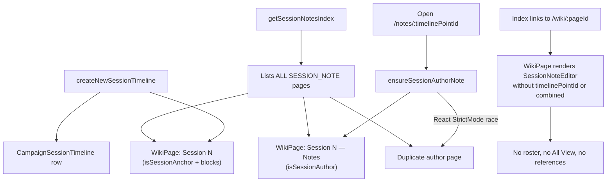

# Fix Player Session Notes Module

## Root cause summary

Three separate bugs stack together:



| Symptom | Cause |
|---------|-------|
| 3 entries after one create | Index lists anchor + author page(s); duplicate author from non-transactional `ensureSessionAuthorNote` under StrictMode |
| All View missing | Index opens [`WikiPage.tsx`](frontend/src/pages/WikiPage.tsx) (lines 587–597) with no `timelinePointId` / `combined` props; sidebar All View link requires both |
| Wrong titles in index | Internal implementation pages (`Session N`, `Session N — Notes`) exposed as user-facing chronicle logs |

Architecture intent (already documented in [`sessionNoteMetadata.ts`](backend/src/lib/sessionNoteMetadata.ts)):
- **Anchor** = one row per `CampaignSessionTimeline` (session metadata shell)
- **Author** = one editable page per roster member per session
- **Combined / All View** = aggregated read of author pages (not a separate wiki page)

---

## Phase 1 — Backend: correct session creation and idempotency

### 1a. Atomic create in `createNewSessionTimeline`

File: [`backend/src/controllers/wikiController.ts`](backend/src/controllers/wikiController.ts) (~1074–1158)

In the existing `$transaction`:
1. Create **anchor** wiki page titled `Session ${n}` with metadata from `anchorMetadataForTimeline`, **empty blocks** (metadata holder only — no duplicate editable content).
2. Create **creator author page** titled `Session ${n} — Notes` with `authorMetadataForSession` and `buildSessionNoteBlocks()` — this is what users edit.
3. Create `CampaignSessionTimeline` pointing at the **anchor** `wikiPageId` (unchanged).

This removes the need for an immediate second page on first open and eliminates the orphan `Session N` content page.

### 1b. Harden `ensureSessionAuthorNote`

File: same controller (~2082–2184)

Wrap find-or-create in `prisma.$transaction`:
- Re-query `fetchAuthorPagesForSession` inside the transaction before insert.
- On duplicate concurrent create, catch unique constraint / return existing (defensive).

Also: if the requesting user is the session creator and an author page already exists from step 1a, return it (`created: false`).

### 1c. Fix `isSessionAuthorPage` helper

File: [`backend/src/lib/sessionNoteMetadata.ts`](backend/src/lib/sessionNoteMetadata.ts) (line 63–66)

Current logic treats any page with `sessionGroupId` as author (including anchors). Change to:

```typescript
return parsed.isSessionAuthor === true
  || (Boolean(parsed.sessionGroupId) && !parsed.isSessionAnchor);
```

---

## Phase 2 — Backend: rebuild session notes index

File: [`getSessionNotesIndex`](backend/src/controllers/wikiController.ts) (~964–1056)

**Timeline sessions (primary index entries):**
- Query `CampaignSessionTimeline` for the campaign (join anchor wiki page for title, visibility, updatedAt).
- Return **one card per session** with:
  - `timelinePointId` (for routing)
  - `title` from anchor page (`Session N`)
  - `updatedAt` = max(anchor, all author pages in group)
  - `canEdit` / `canDelete` based on role (delete = whole session, DM-only)

**Legacy / imported notes (secondary):**
- Keep showing flat `SESSION_NOTE` wiki pages that are **not** anchor and **not** author (no `isSessionAnchor`, no `isSessionAuthor`, no `timelinePointId` in metadata) — covers uploads from `uploadSessionNotePage`.
- Exclude all internal anchor/author rows from this flat list.

Extend API shape in [`frontend/src/types/wiki.ts`](frontend/src/types/wiki.ts):

```typescript
export interface SessionNotesNotebookPage {
  id: string;
  title: string;
  timelinePointId?: string;  // present for timeline sessions
  // ...existing fields
}
```

---

## Phase 3 — Frontend: index routing and wiki redirect

### 3a. Fix index links

File: [`frontend/src/pages/SessionNotesView.tsx`](frontend/src/pages/SessionNotesView.tsx)

Replace `pageHref` → `/wiki/:id` with:

```typescript
page.timelinePointId
  ? campaignNotePath(campaignSlug, page.timelinePointId)
  : campaignWikiPath(campaignSlug, page.id)
```

Apply to both notebook and uncategorized grids (~589, ~664).

### 3b. Redirect wiki SESSION_NOTE pages to timeline route

File: [`frontend/src/pages/WikiPage.tsx`](frontend/src/pages/WikiPage.tsx) (~587)

Before rendering `SessionNoteEditor`, read `parseSessionNoteMetadata(pageData.metadata).timelinePointId`:
- If present → `<Navigate to={campaignNotePath(campaignSlug, timelinePointId)} replace />`
- Else keep legacy wiki rendering for imported notes without timeline

---

## Phase 4 — Frontend: 80/20 editor with inline All Players default

User preference: **default main pane = All Players combined**; keep `/notes/:id/all` for Grid + Snapshot export.

### 4a. Sidebar redesign

File: [`frontend/src/components/session/SessionNotesSidebar.tsx`](frontend/src/components/session/SessionNotesSidebar.tsx)

Reorder and restructure:
1. **All Players** — first selectable button (not a navigation link); uses sentinel id `'__combined__'`
2. **Roster** — DM / Co-DM first, then players (order from existing `combined.columns` sort)
3. **References widget** — always below roster when `combined` is loaded; show loading state while fetching

Keep optional link to `/all` route (small "Open full grid / snapshot" text link) for Snapshot export — user chose to keep that route.

### 4b. SessionNoteEditor main pane

File: [`frontend/src/components/session/SessionNoteEditor.tsx`](frontend/src/components/session/SessionNoteEditor.tsx)

- Default `activeMemberId` to `'__combined__'` (not `currentUserId`).
- When `'__combined__'`: render inline combined content in the 80% pane — compact multi-column or stacked author sections reusing markup patterns from [`SessionCombinedNotesPage.tsx`](frontend/src/pages/SessionCombinedNotesPage.tsx) (entities ribbon + per-author blocks).
- When a roster member selected: existing single-author view/edit behavior.
- Layout: explicit `grid-cols-[minmax(0,4fr)_minmax(0,1fr)]` (80/20) instead of `xl:grid-cols-5`.
- Edit controls hidden in combined mode; shown only when viewing own author page.

### 4c. Wire combined data everywhere

File: [`frontend/src/pages/SessionTimelineNotePage.tsx`](frontend/src/pages/SessionTimelineNotePage.tsx)

Already fetches `useSessionCombined` — no change needed beyond benefiting from fixed backend.

File: [`frontend/src/pages/WikiPage.tsx`](frontend/src/pages/WikiPage.tsx)

For legacy notes without timeline: optionally fetch combined via `pageId` param in `useSessionCombined` so sidebar still works on imported notes.

---

## Phase 5 — Cleanup and tests

### Existing broken data
No automatic DB migration in v1 — document manual cleanup: delete duplicate `Session N — Notes` author pages from index (organize mode + bulk delete), keeping one author page per session per user. Optional follow-up: one-off admin script to dedupe by `(sessionGroupId, sessionNoteAuthorId)`.

### Tests to add/update
- Backend: `createNewSessionTimeline` creates anchor (empty body) + one author page in one transaction
- Backend: `getSessionNotesIndex` returns 1 entry per timeline, excludes anchor/author internals
- Backend: concurrent `ensureSessionAuthorNote` does not create duplicates
- Frontend: index link uses `timelinePointId` when present
- Frontend: `SessionNoteEditor` defaults to combined view; sidebar member switch updates main pane

---

## Files touched (expected)

| Area | Files |
|------|-------|
| Backend create/index/ensure | [`wikiController.ts`](backend/src/controllers/wikiController.ts) |
| Metadata helper | [`sessionNoteMetadata.ts`](backend/src/lib/sessionNoteMetadata.ts) |
| Index types | [`frontend/src/types/wiki.ts`](frontend/src/types/wiki.ts) |
| Index UI | [`SessionNotesView.tsx`](frontend/src/pages/SessionNotesView.tsx) |
| Editor + sidebar | [`SessionNoteEditor.tsx`](frontend/src/components/session/SessionNoteEditor.tsx), [`SessionNotesSidebar.tsx`](frontend/src/components/session/SessionNotesSidebar.tsx) |
| Wiki redirect | [`WikiPage.tsx`](frontend/src/pages/WikiPage.tsx) |
| Tests | new/updated tests alongside existing [`sessionNotesCombined.test.ts`](backend/src/lib/sessionNotesCombined.test.ts) |

---

## Verification checklist

1. Create session from notes index → **one** card appears (`Session 1`), navigates to `/notes/:timelinePointId`
2. Editor opens with **All Players** in main pane; sidebar shows All Players (active), DM, players, references
3. Click a player in sidebar → main pane switches to that author's notes; Edit works for own note only
4. All View link / `/all` route still works for Grid + Snapshot
5. No duplicate author pages on refresh (StrictMode dev)
6. Legacy uploaded notes still appear in index and open via wiki path
