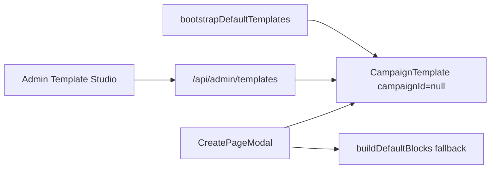

# Global Default Templates Manager

## Context and goal

`CampaignTemplate` stores JSON layout `blocks`. Global defaults use `campaignId: null` and `isSystemDefault: true`. DMs manage templates via [`CampaignTemplatesPage`](frontend/src/pages/CampaignTemplatesPage.tsx) (read-only for global rows).

**Deliverables:**

1. Idempotent server bootstrap seeding global templates on startup
2. Secure Admin API at `/api/admin/templates` with strict block validation
3. Admin UI by refactoring existing layout tools for `mode: 'campaign' | 'system'`
4. Safer [`CreatePageModal`](frontend/src/components/CreatePageModal.tsx) when a preset has no DB row

## Current state

- **Model:** [`CampaignTemplate`](backend/prisma/schema.prisma) — `@@unique([campaignId, folder, name])`
- **Campaign UI:** [`TemplateStudio`](frontend/src/components/templates/TemplateStudio.tsx) — system rows duplicate-only; 403 on edit via [`templatesController.ts`](backend/src/controllers/templatesController.ts)
- **Page creation:** Modal merges API templates + hardcoded variant names; falls back to [`buildDefaultBlocks`](frontend/src/utils/pageTemplates.ts) when no `templateId`
- **Gap:** No bootstrap, no admin API/UI, no shared block validation

---

## 1. Idempotent server bootstrap

**New file:** [`backend/src/lib/defaultPageTemplates.ts`](backend/src/lib/defaultPageTemplates.ts)

**Catalog (exact match to CreatePageModal fallbacks):**

| Folder | Names |
|--------|-------|
| Characters | Player, NPC, Party |
| Locations | Town, Building, Region |
| Objects | Object |

**Block content:**

- Use layout builders from [`backend/src/lib/pageTemplates.ts`](backend/src/lib/pageTemplates.ts) (`CHARACTER` for Characters, `LOCATION` for Locations, `DEFAULT` for Objects)
- Enrich `wiki-infobox` `content.fields` with keys from [`METADATA_CONFIG`](frontend/src/lib/metadataConfig.ts) (NPC → Profession/Ancestry/Location/Gender/Pronouns; locations → Region/Parent/Type; Object → Type/Parent/Invested/Magical)
- Body blocks (`text-tiptap`) stay empty markdown

**Bootstrap rules:**

- Call `bootstrapDefaultTemplates()` from [`backend/src/app.ts`](backend/src/app.ts) alongside `bootstrapSystemPlugins()`
- **Never use Prisma `upsert` on `campaignId: null`** — SQLite treats NULLs as distinct in unique indexes
- Use `findFirst({ where: { campaignId: null, folder, name } })`:
  - **Missing row:** `create` with catalog `blocks`, `isSystemDefault: true`
  - **Existing row:** update non-layout fields only (`folder`, `name`, `isSystemDefault` if needed) — **do not overwrite `blocks`** so admin edits survive restarts

Export catalog constants (folder/name list) for optional frontend import to keep fallbacks in sync.

---

## 2. Block validation (Zod) and shared utilities

**New dependency:** add `zod` to [`backend/package.json`](backend/package.json).

**New file:** [`backend/src/lib/wikiBlockSchema.ts`](backend/src/lib/wikiBlockSchema.ts)

Validate every incoming/outgoing template `blocks` array:

- Non-empty array
- Each block: `id` (string), `type` ∈ known widget types (`text-tiptap`, `image-display`, `stat-block`, `wiki-infobox`, `wiki-backlinks`), numeric `x/y/w/h` within 3-column grid bounds, `content` object, `isPrivate` boolean
- **Structural invariant (replaces `body-editor-root` — not used in this codebase):** at least one `text-tiptap` block (primary body/editor surface). Templates used by Characters should also allow CHARACTER layouts that include image + infobox; validation is per known layout families, not a single DOM id
- Optional: `title`, `visibility` passthrough

**New file:** [`backend/src/lib/templateBlocks.ts`](backend/src/lib/templateBlocks.ts)

Extract from [`templatesController.ts`](backend/src/controllers/templatesController.ts):

- `deepCloneBlocks(blocks)`
- `serializeTemplate(row)`
- `parseAndValidateTemplateBlocks(raw): WikiBlockSeed[]` — runs Zod, returns 400-friendly errors

**Apply validation on:**

- All `/api/admin/templates` write endpoints (POST, PATCH, PUT layout)
- Campaign template writes in [`templatesController.ts`](backend/src/controllers/templatesController.ts) (POST, PATCH, PUT layout) to prevent drift and malformed saves from any client

Bootstrap-generated blocks must pass the same schema before insert.

---

## 3. Secure Admin API

**New controller:** [`backend/src/controllers/adminTemplatesController.ts`](backend/src/controllers/adminTemplatesController.ts)

**Extend existing router:** [`backend/src/routes/admin.ts`](backend/src/routes/admin.ts) (do not replace the file)

All routes: `requireAuth` + `verifySystemAdmin`

| Method | Path | Behavior |
|--------|------|----------|
| GET | `/templates` | List `campaignId: null`, order by folder, name |
| POST | `/templates` | Create global row; validate blocks; force `campaignId: null`, `isSystemDefault: true` |
| PATCH | `/templates/:id` | Rename / metadata; optional blocks with validation |
| PUT | `/templates/:id/layout` | Layout-only update; validate blocks |
| DELETE | `/templates/:id` | Delete only if `campaignId: null` |

**Safety guards:**

- 404 if template id not found or `campaignId !== null`
- Reject invalid block JSON with `400` + Zod error detail
- No campaign-scoped rows reachable from admin routes

Duplicate endpoint is **out of scope** for admin (campaign studio keeps duplicate-to-campaign).

---

## 4. Frontend refactor (dual context)

**Refactor** [`TemplateStudio.tsx`](frontend/src/components/templates/TemplateStudio.tsx) and [`TemplateEditor.tsx`](frontend/src/components/templates/TemplateEditor.tsx):

- Prop: `mode: 'campaign' | 'system'`
- Injected API callbacks (or internal branch on mode)

| Mode | System/global rows | Campaign custom rows |
|------|-------------------|----------------------|
| `campaign` | Read-only: duplicate only | Full edit/delete |
| `system` | Full edit/delete/layout | N/A (only global list) |

**System mode UI:**

- Header: “System Default Templates”
- No “Duplicate to Campaign” on cards
- Edit layout navigates to `/admin/config/templates/:templateId/edit`

**New client:** [`frontend/src/lib/adminTemplates.ts`](frontend/src/lib/adminTemplates.ts) — mirrors [`wiki.ts`](frontend/src/lib/wiki.ts) template helpers against `/admin/templates`

**New page:** [`frontend/src/pages/AdminTemplatesPage.tsx`](frontend/src/pages/AdminTemplatesPage.tsx)

**Routes** in [`App.tsx`](frontend/src/App.tsx):

- `/admin/config/templates`
- `/admin/config/templates/:templateId/edit`

**Nav** in [`AdminLayout.tsx`](frontend/src/layouts/AdminLayout.tsx): “Page Templates” under System Config (`Layers` icon)

---

## 5. CreatePageModal hook integration

In [`CreatePageModal.tsx`](frontend/src/components/CreatePageModal.tsx):

- When variant selection resolves `selectedTemplateId === null` (admin deleted default, bootstrap not run, or API failure), **always** fall back to `buildDefaultBlocks(templateType)` — never pass `templateId: undefined` with empty blocks in a way that crashes the modal
- Map folder → `templateType`: Characters → `CHARACTER`, Locations → `LOCATION`, else `DEFAULT`
- Optionally map variant name (e.g. NPC vs Player) to same type today; future: per-variant builders if catalog exports them
- Guard `handleSubmit` so missing `templateId` is explicit and safe; surface no uncaught errors in the preset `<select>`

Wiki create API ([`wikiController.ts`](backend/src/controllers/wikiController.ts)) already accepts `blocks` OR `templateId`; no change required if modal sends blocks on fallback.

---

## 6. Tests and docs

- **Unit tests** (`backend/src/lib/defaultPageTemplates.test.ts`, `wikiBlockSchema.test.ts`):
  - Catalog NPC infobox fields present
  - Bootstrap second run does not mutate existing `blocks`
  - Invalid block array rejected (missing `text-tiptap`, bad coordinates)
- Update [`todo.md`](todo.md) Phase 2 item when shipped
- Brief [`README.md`](README.md) note: System Admin → Page Templates

---

## Files to touch

| Area | Files |
|------|-------|
| Bootstrap | `backend/src/lib/defaultPageTemplates.ts`, `backend/src/app.ts` |
| Validation + utils | `backend/src/lib/wikiBlockSchema.ts`, `backend/src/lib/templateBlocks.ts`, `backend/package.json` |
| Admin API | `backend/src/controllers/adminTemplatesController.ts`, `backend/src/routes/admin.ts` |
| Campaign API | `backend/src/controllers/templatesController.ts` (use shared validation) |
| Frontend | `frontend/src/lib/adminTemplates.ts`, `frontend/src/pages/AdminTemplatesPage.tsx`, `TemplateStudio.tsx`, `TemplateEditor.tsx`, `CreatePageModal.tsx`, `AdminLayout.tsx`, `App.tsx` |

---

## Verification checklist

1. Restart backend → global rows exist for all 7 catalog entries
2. Second restart → admin-edited NPC blocks unchanged
3. Admin UI: edit NPC layout, save, reload — persists
4. Campaign Template Studio: globals still read-only; duplicate works
5. Create NPC/Location/Object: uses `templateId` when row exists; uses `buildDefaultBlocks` when row deleted
6. POST invalid blocks to admin API → 400, frontend unaffected

---

## Out of scope

- Legacy [`Template`](backend/prisma/schema.prisma) model migration
- Admin “reset to factory default” action
- Seeding templates into existing campaigns
- Admin duplicate endpoint
