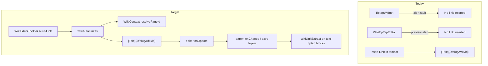

# Global TipTap Auto-Link Refactor

## Current state (findings)

There is **no `isFullscreen` flag** in [`frontend/src`](frontend/src). The effective gate is a stub in [`TiptapWidget.tsx`](frontend/src/components/wiki/widgets/TiptapWidget.tsx) that shows an alert instead of linking:

```175:178:frontend/src/components/wiki/widgets/TiptapWidget.tsx
          onAutoLinkScan={() => {
            window.alert(
              'Auto-Link Scanner is available on full wiki editor pages.',
            );
```

[`WikiTipTapEditor.tsx`](frontend/src/components/wiki/WikiTipTapEditor.tsx) enables the button everywhere but only runs a **preview** full-document title scan (`collectPageTitles` + `window.alert`)—it never mutates the editor.

Both editors share [`WikiEditorToolbar.tsx`](frontend/src/components/wiki/WikiEditorToolbar.tsx), which already has campaign context via `useOptionalWiki()` and uses the same index for manual **Insert Link** (`resolvePageId` + `campaignWikiPath`).

Backend [`wikiLinkExtract.ts`](backend/src/lib/wikiLinkExtract.ts) recognizes **markdown internal paths** (`/c/:slug/wiki/:id`, characters, events) and **mention HTML spans** (import-only today). The live editor does **not** ship a TipTap Mention extension; `setLink` produces standard markdown links, which `extractWikiLinkTargetIdsFromBlocks` already tests against.



## Target behavior

On **Auto-Link** click (always enabled in toolbar):

1. Resolve **non-empty selection** text, or expand to the **word under the cursor** (word-boundary regex on the parent textblock).
2. Look up the phrase in the campaign wiki index (`resolvePageId` from [`WikiContext`](frontend/src/contexts/WikiContext.tsx), with case-insensitive fallback over `flatPages` titles if exact match fails).
3. If matched: `setTextSelection` → `setLink({ href: campaignWikiPath(campaignSlug, pageId) })` (same contract as `handleInsertLink`).
4. If already inside a link mark, no-op or replace—prefer **skip** if `editor.isActive('link')` to avoid nested links.
5. If no match: short user message (replace preview alerts); no document change.
6. Editor `onUpdate` propagates markdown to parents (`TiptapWidget` `onChange`, `WikiTipTapEditor` `onChange`, session notes, etc.).

**Link format:** Use markdown `[PageTitle](/c/.../wiki/pageId)` (not raw `[[Title]]` text), because that is what the editor already serializes and what `wikiLinkExtract` indexes. Mention spans remain an import/legacy format; adding a Mention extension is out of scope for this refactor.

## Implementation plan

### 1. Add shared auto-link utility

Create [`frontend/src/lib/wikiAutoLink.ts`](frontend/src/lib/wikiAutoLink.ts):

| Export | Responsibility |
|--------|----------------|
| `getLinkableRange(editor)` | Returns `{ from, to, text }` for selection or word-at-cursor |
| `resolveWikiPageId(text, resolvePageId, flatPages?)` | Exact via `resolvePageId`, then case-insensitive title scan |
| `applyWikiAutoLink(editor, { campaignSlug, resolvePageId, flatPages? })` | Returns `{ ok, reason?, pageTitle? }`; performs TipTap chain |

Keep logic **pure** where possible for unit tests (mirror patterns in [`wikiHierarchy.test.ts`](frontend/src/lib/wikiHierarchy.test.ts)).

### 2. Centralize handler in `WikiEditorToolbar`

- Remove `onAutoLinkScan` from `WikiEditorToolbarProps`.
- Import `applyWikiAutoLink` and call it from the Auto-Link button `onClick`.
- Use existing `wiki`, `campaignSlug`, `resolvePageId` from `useOptionalWiki()`.
- Optional prop `wikiTree?: WikiTreeNode[]` **only if needed** for editors outside `WikiProvider` (e.g. chronology with `wikiTree={[]}`); build fallback index via `buildPageIdByTitle(flattenWikiTree(wikiTree))` when `resolvePageId` is unavailable.

**UI cleanup:**

- Tooltip: `"Auto-Link: link selection to a wiki page"` (remove “Scanner” / “full wiki” wording).
- Button stays always clickable; disable only when `!editor` (already returns null).

### 3. Simplify consumers

| File | Change |
|------|--------|
| [`TiptapWidget.tsx`](frontend/src/components/wiki/widgets/TiptapWidget.tsx) | Remove stub `onAutoLinkScan`; render `<WikiEditorToolbar editor={editor} />` only |
| [`WikiTipTapEditor.tsx`](frontend/src/components/wiki/WikiTipTapEditor.tsx) | Remove `handleAutoLinkScan`, `collectPageTitles` import, and preview alerts; pass `wikiTree` to toolbar only if fallback index is implemented |
| [`wiki.ts`](frontend/src/lib/wiki.ts) | Remove `collectPageTitles` if unused after refactor (or leave with updated comment if kept for Phase 15 ambient linking) |

### 4. Mentions / `wikiLinkExtract` sync

No backend changes required. After Auto-Link:

- `TiptapWidget` `onUpdate` already writes `{ markdown }` into block content → saved via `saveWikiPageLayout` on wiki pages.
- `useWikiLinkIntegrity` / References widget will see new targets on next integrity fetch after save.
- Serialized markdown will match [`wikiLinkExtract.test.ts`](backend/src/lib/wikiLinkExtract.test.ts) path patterns.

Document in a brief code comment on `applyWikiAutoLink` that output must stay aligned with `WIKI_PATH_REGEX` in backend extract.

### 5. Tests

Add [`frontend/src/lib/wikiAutoLink.test.ts`](frontend/src/lib/wikiAutoLink.test.ts):

- Word-at-cursor boundary extraction (punctuation, selection override).
- Case-insensitive title resolution.
- Skip when text empty / no index match.

## Files touched (expected)

- **New:** `frontend/src/lib/wikiAutoLink.ts`, `frontend/src/lib/wikiAutoLink.test.ts`
- **Edit:** `WikiEditorToolbar.tsx`, `TiptapWidget.tsx`, `WikiTipTapEditor.tsx`, optionally `wiki.ts` (remove dead helper)

## Out of scope (explicit)

- TipTap Mention extension / `[[visible]]` mention nodes (future Phase 15 ambient engine in [`todo.md`](todo.md))
- Full-document bulk auto-link scan (replaced by selection/cursor behavior per requirements)
- Toast system (keep failure feedback minimal; match existing `window.alert` usage only where needed)

## Manual verification

1. **Wiki layout block** (`TiptapWidget` on `/c/:slug/wiki/:pageId`): place cursor on a known page title → Auto-Link → markdown link appears → save layout → References/Mentions updates.
2. **Session notes modal** (`WikiTipTapEditor` in `SessionNoteEditor`): same flow, save draft.
3. **Legacy edit panel** (`WikiEditPanel` DM canon / player notes): Auto-Link works without alert stub.
4. **Unknown word**: Auto-Link shows “no matching wiki page” (no silent preview list).
5. Toolbar tooltip/button never references fullscreen or “full wiki editor pages.”
