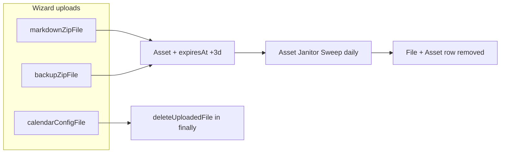

# Import Staging File Retention

## Current state

Staging import ZIPs already get a 3-day `expiresAt` in [`backend/src/controllers/campaignsController.ts`](backend/src/controllers/campaignsController.ts) for:

- `campaign-import-zip` (Obsidian vault ZIP)
- `campaign-backup-zip` (Esiana backup restore ZIP)

The daily sweeper in [`backend/src/lib/assetRetention.ts`](backend/src/lib/assetRetention.ts) deletes any `Asset` with `expiresAt <= now` and registers a `SCHEDULED` task named **Asset Janitor Sweep**. The Admin page at [`frontend/src/pages/AdminBackgroundTasksPage.tsx`](frontend/src/pages/AdminBackgroundTasksPage.tsx) only shows **runtime** task instances — there is no static description of this scheduled import cleanup.

Calendar JSON in the wizard is correctly **immediate-delete** (parsed synchronously in `finally`); it should stay that way.



## Gaps to close

1. **Retention logic is duplicated** — `Date.now() + 3 * 24 * 60 * 60 * 1000` appears twice inline with no shared constant or helper.
2. **No single source of truth** for which asset types are import-staging vs permanent.
3. **Admin Background Tasks** does not explain that import staging files are cleaned up on a schedule (only visible when a sweep actually runs).
4. **Export hygiene** — [`backend/src/lib/campaignExport/buildSovereignExport.ts`](backend/src/lib/campaignExport/buildSovereignExport.ts) skips `campaign-import-zip` but not `campaign-backup-zip`, so a staging backup ZIP could leak into exports before the janitor runs.

## Implementation plan

### 1. Add shared import-staging retention module

Create [`backend/src/lib/importStagingRetention.ts`](backend/src/lib/importStagingRetention.ts) (small, focused):

- `IMPORT_STAGING_RETENTION_MS = 3 * 24 * 60 * 60 * 1000`
- `IMPORT_STAGING_ASSET_TYPES = ['campaign-import-zip', 'campaign-backup-zip'] as const`
- `computeImportStagingExpiresAt(): Date`
- Optional typed helper `buildImportStagingAssetData({ campaignId, url, type })` returning `{ campaignId, url, type, expiresAt }` for Prisma create calls

Add a short unit test file [`backend/src/lib/importStagingRetention.test.ts`](backend/src/lib/importStagingRetention.test.ts) covering the constant and expires-at computation.

### 2. Refactor campaign creation to use the helper

In [`backend/src/controllers/campaignsController.ts`](backend/src/controllers/campaignsController.ts):

- Replace both inline `expiresAt` calculations with `computeImportStagingExpiresAt()` (or the shared asset builder).
- No behavior change for Obsidian / Esiana backup — just DRY + future-proofing for Notion/Kanka/OneNote when those engines land.

Leave calendar JSON path unchanged (`deleteUploadedFile` in `finally`).

### 3. Tighten export + janitor awareness of staging types

- Extend `SKIP_ASSET_TYPES` in [`backend/src/lib/campaignExport/buildSovereignExport.ts`](backend/src/lib/campaignExport/buildSovereignExport.ts) to include `campaign-backup-zip` (import staging only).
- In [`backend/src/lib/assetRetention.ts`](backend/src/lib/assetRetention.ts), import `IMPORT_STAGING_ASSET_TYPES` and include `importStagingDeletedCount` in task `metaMerge` when deleted assets match those types (helps admin metrics without changing deletion behavior).

### 4. Expose scheduled job catalog via admin tasks API

Add a static catalog (not runtime registry entries) in e.g. [`backend/src/lib/scheduledSystemJobs.ts`](backend/src/lib/scheduledSystemJobs.ts):

```typescript
export interface ScheduledSystemJobDefinition {
  id: string;
  taskName: string;
  schedule: string;        // e.g. "Every 24 hours (startup + interval)"
  description: string;
  scope: string;
}

export const SCHEDULED_SYSTEM_JOBS: ScheduledSystemJobDefinition[] = [
  {
    id: 'import-staging-retention',
    taskName: 'Asset Janitor Sweep',
    schedule: 'Every 24 hours',
    description:
      'Deletes expired import staging uploads (Obsidian ZIP, Esiana backup ZIP) 3 days after upload.',
    scope: 'System',
  },
];
```

Extend [`backend/src/controllers/adminTasksController.ts`](backend/src/controllers/adminTasksController.ts) `GET /api/admin/tasks` response with `scheduledJobs: SCHEDULED_SYSTEM_JOBS`.

Update [`frontend/src/types/admin.ts`](frontend/src/types/admin.ts) `BackgroundTaskSnapshot` to include `scheduledJobs`.

### 5. Document on Admin Background Tasks page

In [`frontend/src/pages/AdminBackgroundTasksPage.tsx`](frontend/src/pages/AdminBackgroundTasksPage.tsx):

- Add a new **Scheduled System Jobs** card (above Live Task Queue) listing catalog entries from the API.
- For the import retention job, show:
  - Task name: **Asset Janitor Sweep**
  - Type badge: **System Cron**
  - Schedule: every 24 hours
  - Policy: staging import files removed **3 days** after upload
  - Asset types: `campaign-import-zip`, `campaign-backup-zip`
- Keep existing live queue / history / janitor freed-bytes metrics unchanged.

### 6. Out of scope (explicitly unchanged)

- **Calendar JSON** — remains immediate delete after parse (not 3-day staging).
- **Cover image / extracted wiki media** — permanent assets; not subject to import staging retention.
- **Post-import immediate ZIP delete** — not requested; 3-day fallback remains the policy.
- **Wizard UI copy** about 3-day deletion — not selected in your clarification.

## Files touched (expected)

| Area | Files |
|------|-------|
| Shared retention | `backend/src/lib/importStagingRetention.ts`, `.test.ts` |
| Upload registration | `backend/src/controllers/campaignsController.ts` |
| Sweeper / export | `backend/src/lib/assetRetention.ts`, `backend/src/lib/campaignExport/buildSovereignExport.ts` |
| Admin API | `backend/src/lib/scheduledSystemJobs.ts`, `backend/src/controllers/adminTasksController.ts` |
| Admin UI | `frontend/src/types/admin.ts`, `frontend/src/pages/AdminBackgroundTasksPage.tsx` |

## Verification

- Run `backend` unit tests for `importStagingRetention.test.ts`.
- Manual smoke: create campaign with Obsidian or backup ZIP → confirm `Asset.expiresAt` is ~3 days out; confirm Admin Background Tasks shows the scheduled job catalog entry.
- Confirm calendar wizard upload still deletes temp file immediately on success and failure.
