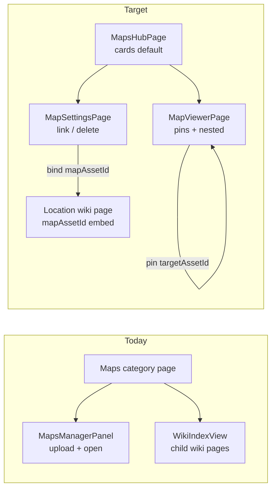

# Phase 7 Polish — Maps Hub, Settings, and Nested Links

## Problem summary

What works today: map viewer, pin editing, visibility split (player omission / DM `isSecret`).

What is broken or missing:

| Gap | Root cause |
|-----|------------|
| Nested maps | Backend supports `targetAssetId` on pins ([`mapsController.ts`](backend/src/controllers/mapsController.ts)); [`MapPinQuickDropDialog.tsx`](frontend/src/components/maps/MapPinQuickDropDialog.tsx) only binds wiki pages / quick-creates Locations — **no nested-map picker** |
| Wiki embed | [`bindWikiPageMapAsset`](frontend/src/lib/maps.ts) API exists; **no UI** to set `WikiPage.mapAssetId` |
| Poor Maps category UX | [`WikiPage.tsx`](frontend/src/pages/WikiPage.tsx) renders [`MapsManagerPanel`](frontend/src/components/maps/MapsManagerPanel.tsx) **plus** [`WikiIndexView`](frontend/src/components/wiki/WikiIndexView.tsx); panel shows asset ID fragments, no thumbs, no delete/settings |
| No map management | `DELETE /api/c/:slug/uploads/:assetId` exists ([`uploadsController.ts`](backend/src/controllers/uploadsController.ts)); **not exposed in frontend** |



---

## Design decisions (confirmed)

- **Location linking model:** Set `mapAssetId` on the chosen **Location** wiki page only. The interactive canvas embeds on that Location page; the Maps hub displays the linked Location title as the map name.
- **One primary link per map:** When binding map → Location, clear `mapAssetId` from any other wiki pages pointing at the same asset (enforce in API, not left to UI discipline).
- **Maps category:** Replace wiki child index + minimal panel with a dedicated **Maps Hub** — no wiki block editor on this page.

---

## 1. Backend — enrich map list + atomic link helper

**Extend `GET /api/c/:slug/maps`** in [`mapsController.ts`](backend/src/controllers/mapsController.ts):

Return enriched DTO per asset (avoid N+1 from hub):

```typescript
{
  id, thumbnailUrl, width, height, createdAt,
  linkedPage: { id, title } | null,  // first/only linked wiki page
  pinCount: number,
  nestedInMaps: { assetId, title }[]  // parent maps with pins targeting this asset
}
```

- `linkedPage`: query `WikiPage` where `mapAssetId = asset.id` (limit 1 after uniqueness enforcement)
- `pinCount`: count pins on this asset
- `nestedInMaps`: query pins where `targetAssetId = asset.id`, join parent asset + linked page title for display

**New route:** `PATCH /api/c/:slug/maps/:assetId/link-page` (operational manager)

Body: `{ pageId: string | null }`

Behavior:

1. If `pageId` set: validate page exists in campaign; **clear** `mapAssetId` from all other pages for this asset; set `mapAssetId` on target page
2. If `pageId` null: clear all pages linked to this asset
3. Return updated `linkedPage`

Implement in [`mapsController.ts`](backend/src/controllers/mapsController.ts); wire in [`campaignScoped.ts`](backend/src/routes/campaignScoped.ts). Reuse or wrap existing [`bindWikiPageMapAsset`](backend/src/controllers/mapsController.ts) logic.

**Frontend client** ([`frontend/src/lib/maps.ts`](frontend/src/lib/maps.ts)):

- `deleteCampaignMap(slug, assetId)` → `DELETE /uploads/:assetId`
- `linkMapToWikiPage(slug, assetId, pageId | null)` → new PATCH route
- Update `CampaignMapAsset` type with enriched fields

No schema migration required for this slice (titles come from linked Location pages).

---

## 2. Maps Hub — replace Maps category content

**New:** [`frontend/src/pages/MapsHubPage.tsx`](frontend/src/pages/MapsHubPage.tsx) (or refactor `MapsManagerPanel` into hub)

**Change** [`WikiPage.tsx`](frontend/src/pages/WikiPage.tsx) Maps branch:

```tsx
if (isIndexCategory && resolvedTitle === 'Maps') {
  return <MapsHubPage campaignSlug={...} />;
}
```

Remove `WikiIndexView` + current `MapsManagerPanel` stack for Maps.

**Hub features** (mirror patterns from [`WikiIndexView.tsx`](frontend/src/components/wiki/WikiIndexView.tsx)):

- **View toggle:** cards (default) / list — persist in `sessionStorage`
- **Upload** control (existing flow)
- **Card grid:** thumbnail via `mapAssetImageUrl(id, 'thumb')`, display title = `linkedPage?.title ?? 'Untitled map'`, dimensions, pin count
- **Actions per card:** Open viewer · Settings · Delete (confirm dialog)
- **Empty state** when no maps uploaded
- DM/Co-DM only: upload, settings, delete; players/members: open viewer only

**Delete flow:** call `deleteCampaignMap`; toast on success; refresh list. Backend already runs pin scrub + file cleanup ([`uploadsController.ts`](backend/src/controllers/uploadsController.ts)).

---

## 3. Map Settings page

**New route:** `/c/:campaignSlug/maps/:assetId/settings` in [`App.tsx`](frontend/src/App.tsx)

**New:** [`frontend/src/pages/MapSettingsPage.tsx`](frontend/src/pages/MapSettingsPage.tsx)

Sections:

| Section | Content |
|---------|---------|
| Preview | Thumb + dimensions + created date |
| Linked Location | Searchable combobox of Location-category wiki pages ([`flatPages`](frontend/src/contexts/WikiContext.tsx) filtered by parent under Locations folder); save via `linkMapToWikiPage`; clear link button |
| Nested in | Read-only list of parent maps (`nestedInMaps`) with links to their viewers |
| Pins | Read-only pin count + link to viewer with edit mode |
| Danger zone | Delete map (same confirm as hub) |

**Location page embed (automatic):** Once linked, any wiki page load with `mapAssetId` already renders [`MapCanvas`](frontend/src/components/maps/MapCanvas.tsx) in [`WikiPage.tsx`](frontend/src/pages/WikiPage.tsx) — no extra work beyond linking UI.

**Optional small addition to Location settings:** In [`WikiPageSettings.tsx`](frontend/src/components/wiki/WikiPageSettings.tsx), when page is under Locations and user is DM, show read-only “Interactive map: {title}” with link to map settings — **secondary** to Map Settings page; skip if scope should stay minimal.

---

## 4. Nested map pins — complete the UI gap

**Extend [`MapPinQuickDropDialog.tsx`](frontend/src/components/maps/MapPinQuickDropDialog.tsx):**

Add third action on choose screen:

- **Open nested map** → picker of other campaign maps (exclude current `assetId`), filtered list with linked titles

On select → `createMapPin({ x, y, targetAssetId, pinType })` (wiki page optional for nested-only pins per backend invariant).

**New:** [`frontend/src/components/maps/MapPinEditorSheet.tsx`](frontend/src/components/maps/MapPinEditorSheet.tsx)

Shown in edit mode when clicking an existing pin on [`MapCanvas.tsx`](frontend/src/components/maps/MapCanvas.tsx):

- Edit pin type, label
- Change target: wiki page **or** nested map (mutually compatible — both allowed per schema)
- Delete pin
- Uses existing `updateMapPin` / `deleteMapPin`

**Fix nested navigation:** [`MapViewerPage.tsx`](frontend/src/pages/MapViewerPage.tsx) already updates breadcrumbs on `onNavigateMap`; verify title comes from linked Location on child map after hub enrichment.

---

## 5. Viewer polish (small)

- Add **Settings** gear link in [`MapViewerPage.tsx`](frontend/src/pages/MapViewerPage.tsx) header (DM only)
- Hub card / settings “Open viewer” remains primary entry
- Remove opaque `assetId.slice(0,8)` display everywhere; use linked Location title

---

## 6. Docs / todo hygiene (after implementation)

- Check off Phase 7 items in [`todo.md`](todo.md) lines 131–137
- Add brief entry to [`changelog.md`](changelog.md): Maps Hub, settings, location linking, nested pin UI

---

## File touch list

| Area | Files |
|------|-------|
| Backend | [`mapsController.ts`](backend/src/controllers/mapsController.ts), [`campaignScoped.ts`](backend/src/routes/campaignScoped.ts) |
| Frontend hub/settings | `MapsHubPage.tsx`, `MapSettingsPage.tsx`, `MapCard.tsx`, `MapDeleteDialog.tsx` |
| Frontend pins | `MapPinQuickDropDialog.tsx`, `MapPinEditorSheet.tsx`, `MapCanvas.tsx` |
| Routing | [`App.tsx`](frontend/src/App.tsx), [`WikiPage.tsx`](frontend/src/pages/WikiPage.tsx) |
| API/types | [`frontend/src/lib/maps.ts`](frontend/src/lib/maps.ts), [`frontend/src/types/maps.ts`](frontend/src/types/maps.ts) |

---

## Manual QA checklist

1. Upload two maps → hub shows card grid with thumbnails and “Untitled map”
2. Map Settings → link to Location “Waterdeep” → hub title updates; Location wiki page shows embedded canvas
3. On world map, double-click pin → “Open nested map” → pick city map → click pin navigates with breadcrumb
4. Delete map from settings → asset + pins removed; no orphan files
5. Player opens hub → can open viewer; no settings/delete; secret pins still hidden
