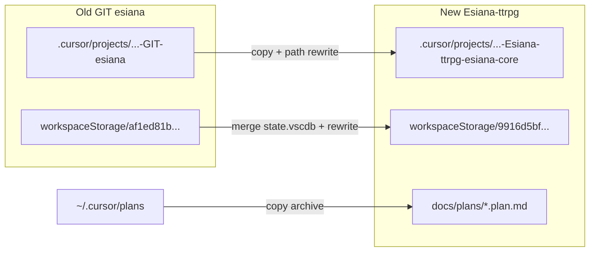

# Migrate Cursor agent history and plans to Esiana-ttrpg workspace

## What we found

Cursor does **not** store agent history inside the git repos. It keys data off the **workspace path** (and a derived slug):

| Data | Location | Old workspace | New workspace |
|------|----------|---------------|---------------|
| Agent transcripts (Agent `@` history, subagents) | `%USERPROFILE%\.cursor\projects\<slug>\` | [`c-Users-allison-Documents-GIT-esiana`](C:\Users\allison\.cursor\projects\c-Users-allison-Documents-GIT-esiana) — **38 chats, ~90 files** | [`c-Users-allison-Documents-GIT-Esiana-ttrpg-esiana-core`](C:\Users\allison\.cursor\projects\c-Users-allison-Documents-GIT-Esiana-ttrpg-esiana-core) — **1 chat so far** |
| Sidebar Composer/Chat threads | `%APPDATA%\Cursor\User\workspaceStorage\<hash>\state.vscdb` | `af1ed81b83ed1d57dc93652d09ae5192` (`GIT\esiana`) — **~272 KB** | `9916d5bf5eb336687f25834d900d0594` (multi-root) — **~4 KB (empty)** |
| Plan mode files | `%USERPROFILE%\.cursor\plans\` | **53 `.plan.md` files** — **global, already usable** | Same (no move required for Cursor to work) |
| Multi-root workspace definition | [`Workspaces/1780168369071/workspace.json`](C:\Users\allison\AppData\Roaming\Cursor\Workspaces\1780168369071\workspace.json) | — | `esiana-core`, `docs`, `community-plugins` |

The old folder `C:\Users\allison\Documents\GIT\Esiana-ttrpg\esiana-core` **no longer exists** on disk, but Cursor still has its metadata. Transcripts still reference old paths like `c:\Users\allison\Documents\GIT\Esiana-ttrpg\esiana-core\backend\...`.

Your active window is the **multi-root** workspace (`9916d5bf...`), not the single-folder `esiana-core` entry. Migration should target that hash so sidebar chats appear where you work today.



---

## Path rewrite map (apply everywhere)

Use these replacements in `.jsonl` transcripts, `uploads/`, copied plans, and inside `state.vscdb` (all slash styles and URL-encoded forms):

| From | To |
|------|-----|
| `C:\Users\allison\Documents\GIT\Esiana-ttrpg\esiana-core` | `C:\Users\allison\Documents\GIT\Esiana-ttrpg\esiana-core` |
| `C:/Users/allison/Documents/GIT/Esiana-ttrpg/esiana-core` | `C:/Users/allison/Documents/GIT/Esiana-ttrpg/esiana-core` |
| `file:///c%3A/Users/allison/Documents/GIT/Esiana-ttrpg/esiana-core` | `file:///c%3A/Users/allison/Documents/GIT/Esiana-ttrpg/esiana-core` |
| `...\GIT\esiana\docs\` | `...\GIT\Esiana-ttrpg\docs\` (only when path clearly meant the wiki tree) |

Do **not** delete the old `.cursor/projects/c-Users-allison-Documents-GIT-esiana` folder until you verify the new workspace.

---

## Phase 1 — Stabilize the workspace (recommended)

Create a committed workspace file so Cursor always resolves the same roots (and fix the broken relative `community-plugins` path in the saved workspace):

**File:** `C:\Users\allison\Documents\GIT\Esiana-ttrpg\Esiana-ttrpg.code-workspace`

```json
{
  "folders": [
    { "path": "esiana-core", "name": "esiana-core (app)" },
    { "path": "docs", "name": "docs (wiki)" },
    { "path": "community-plugins", "name": "community-plugins" }
  ],
  "settings": {}
}
```

After migration, open **File → Open Workspace from File** on this `.code-workspace` (not the loose `esiana-core` folder alone) so agent + chat data stay aligned with the multi-root `9916d5bf...` bucket.

---

## Phase 2 — Migrate agent transcripts (high confidence)

**Prerequisite:** Fully quit Cursor (check Task Manager for lingering `Cursor.exe`).

1. **Backup**  
   Copy `C:\Users\allison\.cursor\projects\c-Users-allison-Documents-GIT-esiana` → `...\esiana-migration-backup-<date>\`

2. **Merge into new slug** (destination already exists):
   - `agent-transcripts\` — copy all UUID folders; skip duplicates if the same UUID already exists in the dest
   - `uploads\` (4 plan excerpt files)
   - `agent-tools\` (5 files)
   - Skip empty `terminals\` / `mcps\`

   Destination: [`c-Users-allison-Documents-GIT-Esiana-ttrpg-esiana-core`](C:\Users\allison\.cursor\projects\c-Users-allison-Documents-GIT-Esiana-ttrpg-esiana-core)

3. **Rewrite paths** in all copied `.jsonl` and `.md` under that tree using the table above (PowerShell `-replace` loop or a small Node script with `node:sqlite` / plain file I/O).

4. **Verify:** Reopen workspace → start Agent → confirm past threads appear; open one old thread and check tool paths point at `esiana-core`.

---

## Phase 3 — Migrate sidebar chat history (best-effort)

Sidebar history lives in SQLite `state.vscdb`. This is **not officially documented**; treat as best-effort with a backup.

**Prerequisite:** Cursor closed.

1. Backup current multi-root DB:
   - `C:\Users\allison\AppData\Roaming\Cursor\User\workspaceStorage\9916d5bf5eb336687f25834d900d0594\` → `...\backup-9916d5bf-<date>\`

2. Copy old chat database:
   - Source: `...\af1ed81b83ed1d57dc93652d09ae5192\state.vscdb`
   - Dest: `...\9916d5bf5eb336687f25834d900d0594\state.vscdb` (replace the 4 KB empty file)
   - **Do not** overwrite dest `workspace.json` (must keep the multi-root `workspace` URI)

3. **Rewrite paths inside `state.vscdb`** using Node 22 built-in `node:sqlite`:
   - `UPDATE ItemTable SET value = replace(value, ...)` for each mapping (handle BLOB/text columns as Cursor stores them)
   - Also replace URL-encoded `file:///c%3A/.../GIT/esiana` variants

4. Reopen Cursor → check Composer/Chat sidebar for old threads.

**If chats do not appear:** fall back to keeping the old workspace entry in **File → Open Recent** (`GIT\esiana` is gone on disk, so this may fail) or accept transcripts-only history. The agent transcript copy (Phase 2) is the reliable part.

---

## Phase 4 — Archive plans into the `docs` repo (your choice)

Global plans already work from any workspace. Per your request, add a **version-controlled archive** in the wiki repo (currently empty):

**Target:** [`C:\Users\allison\Documents\GIT\Esiana-ttrpg\docs\plans\`](C:\Users\allison\Documents\GIT\Esiana-ttrpg\docs\plans\)

1. Copy all `C:\Users\allison\.cursor\plans\*.plan.md` → `docs/plans/`
2. Add [`docs/plans/README.md`](C:\Users\allison\Documents\GIT\Esiana-ttrpg\docs\plans\README.md):
   - Explain these are Cursor Plan-mode archives (not runtime app docs)
   - Note canonical live plans remain in `%USERPROFILE%\.cursor\plans\` while actively editing
   - Link to [`esiana-core/todo.md`](C:\Users\allison\Documents\GIT\Esiana-ttrpg\esiana-core\todo.md) for roadmap truth
3. Run the same path rewrite on copied `.plan.md` files (many link to old `GIT\esiana\...` paths in frontmatter/body)
4. Optional: add `docs/plans/index.md` listing phase plans (`phase_7_*`, `phase_8_*`, `phase_9_*`, `phase_10_*`) for human navigation
5. Commit in the **docs** repo (separate from `esiana-core`)

Keep global `~/.cursor/plans` as-is so Plan mode keeps working without extra sync steps.

---

## Phase 5 — Verification checklist

- [ ] Multi-root workspace opens via `Esiana-ttrpg.code-workspace`
- [ ] Agent sidebar shows pre-move conversations (count ≈ 38)
- [ ] Composer/Chat sidebar shows pre-move threads
- [ ] Resuming an old Agent chat references `Esiana-ttrpg\esiana-core\...` paths, not `GIT\esiana`
- [ ] `docs/plans/` contains archived plans and README
- [ ] Backups retained for 1–2 weeks before deleting old project folder

---

## Risks and limits

- **Undocumented storage:** Cursor updates may change `state.vscdb` layout; backup before merge.
- **Duplicate chat IDs:** Merging transcripts is safe if UUID folders do not collide; resolve any collisions manually.
- **Subagents:** Stay under each parent `agent-transcripts/<uuid>/subagents/` — copy with parents.
- **Local file history:** `%APPDATA%\Cursor\User\History\` still points at old `file:///.../GIT/esiana/...` URIs; separate from agent/chat migration (optional cleanup later).
- **No cloud sync:** This is machine-local only; other machines need the same steps.

---

## Execution order (when you approve)

1. Create `Esiana-ttrpg.code-workspace` + fix workspace paths  
2. Close Cursor → backup → copy/merge agent data → rewrite paths  
3. Migrate `state.vscdb` → rewrite paths  
4. Copy plans to `docs/plans/` + README + path rewrite  
5. Reopen and run verification checklist  

Estimated time: ~30–45 minutes including backups and verification.
