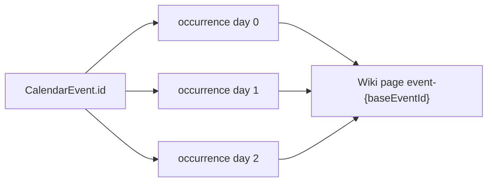

# Multi-Day Occurrence Duration and Lore Page Mapping

## Diagnosis

### Backend bug (confirmed)

In [`buildOccurrences`](backend/src/controllers/chronologyController.ts) (~117–152), the inner `dayOffset` loop pushes occurrences with:

```ts
start: { year: state.year, month: state.month, day: state.day, ... }
```

`dayOffset` is only stored on the row (`dayOffset`, `isContinuation`); **the calendar day never advances**. A 3-day event therefore produces three rows on the same grid day.

`end.day` also uses `state.day + duration - 1` in the same month, which is wrong when the span crosses a month boundary.

`baseEventId: event.id` is already correct for every child row.

### Frontend lore routing (already correct)

| Surface | Behavior |
|---------|----------|
| [`ChronologyLoreLink.tsx`](frontend/src/components/chronology/ChronologyLoreLink.tsx) | `lorePageId = event-${baseEventId}`; links via [`campaignEventLorePath`](frontend/src/lib/campaignPaths.ts) |
| [`ChronologyEventSidebar`](frontend/src/components/chronology/ChronologyEventSidebar.tsx) / [`ChronologyEventInlineDetail`](frontend/src/components/chronology/ChronologyEventInlineDetail.tsx) | Lore button receives `baseEvent.id`, not `occurrenceId` |
| [`ChronologyPage.tsx`](frontend/src/pages/ChronologyPage.tsx) | Drawer resolves `selectedBaseEvent` via `selectedOccurrence.baseEventId` |
| [`WidescreenCalendarView`](frontend/src/components/chronology/WidescreenCalendarView.tsx) | Agenda uses `baseEventById.get(occurrence.baseEventId)` |

No occurrence-index or per-day wiki IDs exist today. After the backend fix, calendar cells will show on consecutive days; clicking any day still opens the same base event and lore page.



---

## Part 1: Calendar day advancement helper

Add to [`backend/src/lib/chronologyOccurrences.ts`](backend/src/lib/chronologyOccurrences.ts):

**`advanceCalendarDate(calendarRow, year, monthIndex, day, daysToAdd)`**

- Input guards: if `year` / `month` / `day` is null, return nulls.
- Use existing [`getMonthLengthsForYear`](backend/src/lib/chronologyOccurrences.ts) (wraps `getMonthsForYear` + `parseMonths`).
- For each day step (apply `daysToAdd` as a loop of +1, or single loop counter):
  - Increment `day`.
  - If `day > monthLength`: set `day = 1`, increment `monthIndex`.
  - If `monthIndex >= monthCount`: set `monthIndex = 0`, increment `year`.
- Resolve `monthName` via existing `resolveMonthName` / `resolveEventStartCoordinates` pattern for the final coordinates.
- **Do not** use fixed 30-day math or `addRepeatUnit` (that helper clips to month end; duration spans should **roll to day 1** per your spec).

**Tests** in [`backend/src/lib/chronologyOccurrences.test.ts`](backend/src/lib/chronologyOccurrences.test.ts):

- Start Y1 M0 D30, duration 3, months length 30 → days 30, 1 (next month), 2.
- Year rollover when advancing past last month index.
- `baseEventId` unchanged across generated slice (integration-style test via exported test helper or small `buildOccurrenceStartsForDuration` test fixture).

---

## Part 2: Wire into `buildOccurrences`

In [`chronologyController.ts`](backend/src/controllers/chronologyController.ts), inside the `dayOffset` loop:

1. Compute **occurrence start** once per offset:

   ```ts
   const startCoords = advanceCalendarDate(
     calendarRow,
     state.year,
     state.month,
     state.day,
     dayOffset,
   );
   ```

2. Compute **span end** once per duration block (before the loop):

   ```ts
   const endCoords = advanceCalendarDate(
     calendarRow,
     state.year,
     state.month,
     state.day,
     duration - 1,
   );
   ```

3. Push `start` / `end` from those coordinates (`monthName` on each), keeping:
   - `occurrenceId: occ_${event.id}_${i}_${dayOffset}`
   - `baseEventId: event.id`
   - `isStart` / `isContinuation` / `dayOffset` as today

4. If `advanceCalendarDate` returns null (invalid base date), skip that offset or emit a warning once.

---

## Part 3: Frontend verification (minimal changes)

**Expected: no lore URL changes required.**

Optional polish (only if you want clearer UX after backend fix):

- [`TechTreeTimeline.tsx`](frontend/src/components/chronology/TechTreeTimeline.tsx): treat selection as `selectedBaseEventId` (or highlight all cards where `event.baseEventId === selected`) so Day 2/3 cards visually match the open drawer—not required for lore correctness.
- [`ChronologyPage.tsx`](frontend/src/pages/ChronologyPage.tsx): already falls back to `baseEventId` on reload; no change strictly needed.

**Audit checklist** (manual after deploy):

- 3-day event shows markers on three consecutive calendar days.
- Timeline: click Day 2 card → sidebar + lore link same as Day 1.
- Lore open/create URL is `/c/:slug/event-{baseEventId}` for every day.

---

## Verification

- `npm run test --workspace=backend` — new advancement tests pass.
- Manual: create event with `duration: 3` at Somerden Y4672 Stormsbreath 13 → occurrences on days 13, 14, 15 (or rolled months if near month end).
- All three days share one lore wiki page at `event-{baseEventId}`.
