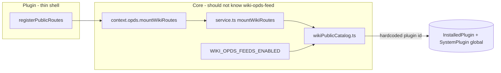
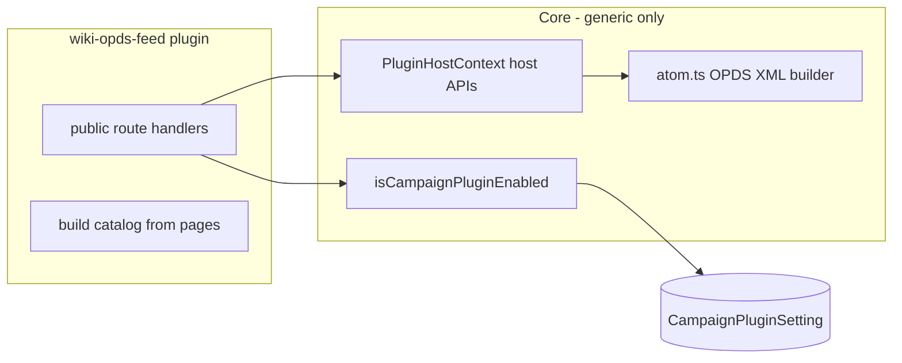

# Refactor OPDS to campaign-scoped plugin

## Problem (current 10E)

Today OPDS is **inverted**: the plugin is ~20 lines while core owns the real implementation.



**User-facing issues:**
- Requires `WIKI_OPDS_FEEDS_ENABLED=true` (env restart) — not acceptable for a “working plugin”
- Enabled globally in **Admin → Plugins** instead of **Campaign Settings → Campaign Plugins**
- [`isWikiOpdsFeedActiveForCampaign`](backend/src/lib/opds/wikiPublicCatalog.ts) ignores `campaignId` and checks global flags + hardcoded `wiki-opds-feed` id
- [`manifest.json`](plugins/wiki-opds-feed/manifest.json) says `"scope": "global"` despite campaign-scoped URLs

## Target architecture



**Enablement (no env):**
1. DM installs **Wiki OPDS Feed** per campaign (Campaign Settings → Campaign Plugins)
2. DM toggles **Enabled** for that campaign → `CampaignPluginSetting.isEnabled`
3. Campaign must remain **Public viewable** (your choice)
4. Only wiki pages with **Public** visibility for **that campaign** appear in the feed

**Public URLs unchanged** (e-readers keep working):
- `GET /api/public/plugin-runtime/wiki-opds-feed/c/{campaignSlug}/opds/catalog.atom`
- `GET /api/public/plugin-runtime/wiki-opds-feed/c/{campaignSlug}/opds/pages/{pageId}.md`

When disabled: JSON **404** with a clear message (not Express “Cannot GET”). Keep existing `feed:public` behavior in [`reloadPluginHost`](backend/src/plugins/pluginManager.ts) so routes always mount.

---

## 1. Strip wiki-specific logic from core

**Delete or gut:**
- [`backend/src/lib/opds/wikiPublicCatalog.ts`](backend/src/lib/opds/wikiPublicCatalog.ts) — move handlers + catalog builder to plugin
- [`backend/src/lib/opds/service.ts`](backend/src/lib/opds/service.ts) — plugin registers routes directly
- `context.opds.mountWikiRoutes` from [`pluginHostContext.ts`](backend/src/lib/plugins/pluginHostContext.ts)
- `WIKI_OPDS_FEEDS_ENABLED` from [`env.ts`](backend/src/config/env.ts) and [`.env.example`](backend/.env.example)

**Keep in core (generic platform primitives):**
- [`backend/src/lib/opds/atom.ts`](backend/src/lib/opds/atom.ts) — OPDS 1.2 Atom XML builder (reusable by future feed plugins)
- Move atom unit tests; remove wiki-catalog tests from core or relocate

---

## 2. Add narrow host APIs (not wiki-opds-specific)

Extend [`PluginHostContext`](backend/src/lib/plugins/pluginHostContext.ts) with permission-gated helpers usable by any `feed:public` plugin:

| API | Permission | Purpose |
|-----|------------|---------|
| `registerPublicRoutes(fn)` | `feed:public` | (existing) |
| `scope` | — | `'global' \| 'campaign'` from manifest |
| `isEnabledForCampaign(campaignId)` | — | Campaign scope → `CampaignPluginSetting.isEnabled`; global → existing global check |
| `resolveCampaignBySlug(slug)` | `feed:public` | `{ id, slug, name, updatedAt, isPublicViewable }` |
| `listPublicWikiPages(campaignId)` | `feed:public` | Public wiki pages only; exclude session notes (reuse existing Prisma query) |
| `getPublicWikiPage(campaignId, pageId)` | `feed:public` | Single public page or null |
| `wikiPageToMarkdown(page)` | `feed:public` | Wrap existing [`wikiPageToMarkdown`](backend/src/lib/campaignExport/wikiPageToMarkdown.ts) |
| `buildOpdsCatalogFeed(feed)` | `feed:public` | Wrap [`buildOpdsCatalogFeed`](backend/src/lib/opds/atom.ts) |

Extract shared backend helper in [`campaignPlugins.ts`](backend/src/lib/campaignPlugins.ts):

```typescript
export async function isCampaignPluginEnabled(campaignId: string, pluginId: string): Promise<boolean>
```

Reuse in `frontendPlugins.ts` (dedupe with existing private `isPluginActiveForCampaign` for campaign scope).

Pass `manifest.scope` into `createPluginHostContext()` from [`pluginManager.ts`](backend/src/plugins/pluginManager.ts).

---

## 3. Move implementation into the plugin

Expand [`plugins/wiki-opds-feed/backend/`](plugins/wiki-opds-feed/backend/):

- **`index.js`** — `register()`: call `context.registerPublicRoutes(...)` and mount handlers (no `context.opds.mountWikiRoutes`)
- **`handlers.js`** (new) — catalog + markdown request handlers:
  - Resolve campaign by slug → 404 if missing
  - 404 if `!campaign.isPublicViewable`
  - 404 if `!(await context.isEnabledForCampaign(campaign.id))`
  - List/get public pages via host APIs
  - Build Atom feed using `context.buildOpdsCatalogFeed`
  - Honor `catalogTitleSuffix` from campaign plugin config (currently dead in manifest)
- **`catalog.js`** (new) — pure feed assembly (entry URLs, titles, snippets)

Update [`manifest.json`](plugins/wiki-opds-feed/manifest.json):
```json
"scope": "campaign"
```

Update [`plugins/registry.json`](plugins/registry.json): `"scope": "campaign"` for `wiki-opds-feed`.

Remove global admin surfacing: after scope change, [`syncGlobalSystemPluginsFromDisk`](backend/src/plugins/pluginManager.ts) will skip it. Add one-time cleanup on boot: delete stale `SystemPlugin` row for `wiki-opds-feed` when on-disk manifest scope is `campaign` (prevents ghost entry in Admin → Plugins).

---

## 4. Campaign install + enable UX

**Install path:** Campaign Settings → Campaign Plugins → Sync Registry → Install **Wiki OPDS Feed** → Enable toggle → Save.

**Optional UX improvement (small, recommended):** In [`CampaignPluginsSettingsTab.tsx`](frontend/src/components/campaign/CampaignPluginsSettingsTab.tsx), when `wiki-opds-feed` is enabled, show the catalog URL for the current campaign (read-only copy field). Uses campaign slug from route context.

**Authenticated status route:** Move `/status` to campaign-aware shape or drop it; if kept, require campaign member auth and report per-campaign enablement + public URL.

---

## 5. Docs and tests

Update:
- [`docs/plugins/phase-10-ecosystem.md`](docs/plugins/phase-10-ecosystem.md) — 10E section: campaign scope, no env flag
- [`docs/plugins/opds-wiki-feed-study.md`](docs/plugins/opds-wiki-feed-study.md)
- [`plugins/wiki-opds-feed/README.md`](plugins/wiki-opds-feed/README.md)

Tests:
- Core: atom builder only ([`opds.test.ts`](backend/src/lib/opds/opds.test.ts))
- New plugin-level or integration tests: 404 when campaign plugin disabled; 404 when not public-viewable; Atom 200 when enabled + public pages exist
- Test `isCampaignPluginEnabled` helper

---

## Migration notes (existing installs)

| Before | After |
|--------|-------|
| Global enable in Admin | Per-campaign enable in Campaign Settings |
| `WIKI_OPDS_FEEDS_ENABLED=true` | Remove — not needed |
| Global `SystemPlugin` row | Removed on boot if scope mismatch |
| `InstalledPlugin` on disk | Unchanged (`syncPluginCatalog` still upserts package) |

Campaigns that had OPDS working under the old model will need the plugin **installed and enabled per campaign**.

---

## Files touched (summary)

| Action | Files |
|--------|-------|
| Remove wiki OPDS from core | `wikiPublicCatalog.ts`, `service.ts`, env flag, `pluginHostContext` opds.mountWikiRoutes |
| Add host APIs | `pluginHostContext.ts`, `campaignPlugins.ts`, `pluginManager.ts` |
| Plugin owns logic | `plugins/wiki-opds-feed/backend/*`, `manifest.json`, `registry.json` |
| UX/docs | `CampaignPluginsSettingsTab.tsx`, README + phase docs |
