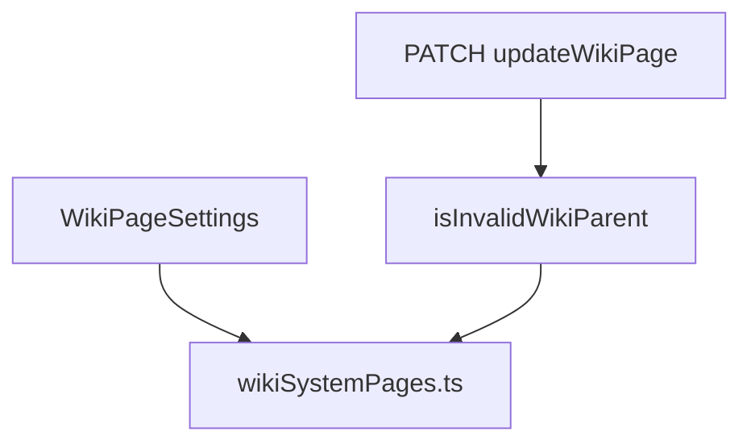

# Compact Parent Picker with System Blacklist

## Context

[`WikiPageSettings.tsx`](frontend/src/components/wiki/WikiPageSettings.tsx) already implements a compact `max-w-sm` autocomplete (focus-driven input + absolute dropdown). This work **adds exclusion rules** and **backend enforcement**—not a full UI rewrite.

**Important data model note:** `WikiPage` has no `slug` column ([`schema.prisma`](backend/prisma/schema.prisma)). System routes are identified by **page title** (seeded in [`seedWiki.ts`](backend/src/lib/seedWiki.ts)) and **`templateType`**. Slug checks will derive a URL-safe slug from `title` using the same rules as [`slugUtils.generateSlug`](backend/src/lib/slugUtils.ts), with a lenient fallback for edge-case titles.



---

## 1. Shared system-page rules (new modules)

Create parallel modules (keep in sync; no shared package in repo):

- [`backend/src/lib/wikiSystemPages.ts`](backend/src/lib/wikiSystemPages.ts)
- [`frontend/src/lib/wikiSystemPages.ts`](frontend/src/lib/wikiSystemPages.ts)

**Exports:**

```ts
export const RESERVED_SYSTEM_SLUGS = [
  'calendar', 'timeline', 'settings', 'recent-changes', 'recent_changes',
  'dashboard', 'bookmarks',
] as const;

export const SYSTEM_UTILITY_TEMPLATE_TYPES = ['SESSION_NOTE'] as const;

// Derived slugs from seeded/routed utility titles (Calendars, Timelines, Events, etc.)
export const RESERVED_SYSTEM_SLUG_SET: ReadonlySet<string>;
```

**Helpers:**

| Function | Behavior |
|----------|----------|
| `wikiPageTitleToSlug(title)` | Lenient `generateSlug` (try/catch + lowercase/hyphen fallback) |
| `matchesReservedSystemSlug(slug)` | Exact `RESERVED_SYSTEM_SLUG_SET` match **or** slug starts with `calendar` / `timeline` (covers `calendars`, `timelines`) |
| `isReservedSystemWikiPage({ title, templateType })` | `true` if slug matches blacklist **or** `templateType` is in `SYSTEM_UTILITY_TEMPLATE_TYPES` |

**Slug set expansion** (documented next to constant): add plural/stem variants used in production data, e.g. `calendars`, `timelines`, `events`, and `generateSlug('Recent Changes')` → `recent-changes`.

---

## 2. Extend wiki tree with `templateType`

Frontend `flatPages` currently lack `templateType` ([`wikiTree.ts`](backend/src/lib/wikiTree.ts) only passes title/parentId).

- Add `templateType` to [`WikiTreeNode`](backend/src/types/api.ts) and [`frontend/src/types/wiki.ts`](frontend/src/types/wiki.ts)
- Include `templateType` in `wikiPageSelect` usage for tree fetch ([`getWikiTree`](backend/src/controllers/wikiController.ts) already uses `wikiPageSelect`, which includes `templateType`)
- Map `templateType` through [`buildWikiTree`](backend/src/lib/wikiTree.ts)

This enables frontend filtering of `SESSION_NOTE` pages without extra API calls.

---

## 3. Frontend filtering and UI polish

**[`frontend/src/lib/wikiHierarchy.ts`](frontend/src/lib/wikiHierarchy.ts)**

Add `isExcludedParentCandidate(page, pageId, flatPages)` combining:

- `collectDescendantIds(pageId, flatPages)` (existing)
- `isReservedSystemWikiPage({ title: page.title, templateType: page.templateType })`

**[`WikiPageSettings.tsx`](frontend/src/components/wiki/WikiPageSettings.tsx)**

- Replace inline exclusion with `isExcludedParentCandidate`
- Keep `max-w-sm` container; optionally allow `max-w-md` only if labels truncate badly
- Dropdown: bump to `z-50`, keep `max-h-60 overflow-y-auto w-full` — use existing theme classes (`bg-background border-border shadow-xl`) rather than hard-coded `slate-*` so dark/light presets stay consistent (functionally matches the spec overlay)

**Search:** Continue filtering `eligiblePages` by title; optionally also match `formatParentOptionLabel` for nested paths.

---

## 4. Backend hardening

**[`backend/src/lib/wikiHierarchy.ts`](backend/src/lib/wikiHierarchy.ts)**

- Import `isReservedSystemWikiPage` from `wikiSystemPages.ts`
- In `isInvalidWikiParent`, after self-check, load proposed parent with `select: { id, title, templateType, parentId }`
- If `isReservedSystemWikiPage(parent)` → return `true`

**[`wikiController.ts`](backend/src/controllers/wikiController.ts)** — `updateWikiPage`

- Update 400 message to match spec:

  `"Cannot set parent: would create an invalid or circular hierarchy"`

(same check path for cycle + reserved system pages)

---

## 5. Files touched (summary)

| File | Change |
|------|--------|
| `backend/src/lib/wikiSystemPages.ts` | New constants + slug/template helpers |
| `frontend/src/lib/wikiSystemPages.ts` | Mirror of backend rules |
| `backend/src/lib/wikiHierarchy.ts` | Reserved-page check in `isInvalidWikiParent` |
| `backend/src/lib/wikiTree.ts` + `types/api.ts` | Pass `templateType` in tree |
| `frontend/src/types/wiki.ts` | `templateType` on `WikiTreeNode` |
| `frontend/src/lib/wikiHierarchy.ts` | `isExcludedParentCandidate` |
| `frontend/src/components/wiki/WikiPageSettings.tsx` | Apply filter + `z-50` dropdown |
| `backend/src/controllers/wikiController.ts` | Error message tweak |

---

## 6. Verification

| Case | Expected |
|------|----------|
| Picker list | No Dashboard, Bookmarks, Calendars, Timelines, Settings, Recent Changes, session notes |
| PATCH parent → Dashboard | 400 invalid/circular hierarchy |
| PATCH parent → valid lore page (e.g. Locations) | 200 |
| PATCH parent → own child | 400 (existing cycle logic) |
| Tree refresh after save | Sidebar nesting updates |

Manual: open a lore page as DM, confirm picker width stays compact and utility pages never appear.
