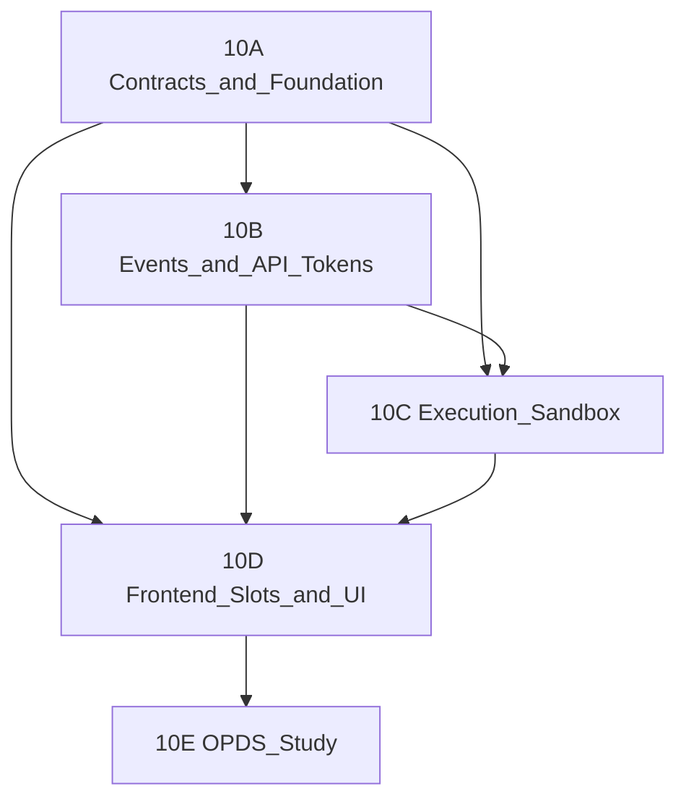

# Phase 10 — Plugin API Ecosystem (Multi-Part Plan)

## Guiding principles

Phase 10 is an **architectural inflection point** ([pluginreadiness.txt](pluginreadiness.txt)): moving from a trusted monolith to hosting **untrusted third-party code**. Shipping items as independent features without boundaries will cause request freezes, React tree crashes, and DB lockups.

**Postgres / db-agnostic rule (cross-cutting):** New Phase 10 persistence must use **Prisma Client only** in `backend/src`—no new `$queryRaw` unless gated by `env.databaseProvider`. New tables/columns ship via **Prisma `migrate dev` generated SQL**, not hand-written SQLite `PRAGMA` / `sqlite_master` patterns (see [backend/prisma/README.md](backend/prisma/README.md)). Long-running work (imports, bulk plugin jobs) must use **background workers + bounded transactions** so Postgres connection pools and SQLite file locks both stay healthy ([pluginreadiness.txt](pluginreadiness.txt) § SQLite deadlock).

**Documentation deliverable (per your preference):** Author **[docs/plugins/phase-10-ecosystem.md](docs/plugins/phase-10-ecosystem.md)** with this five-part breakdown, dependency graph, manifest contract, DTO shapes, safeguards, and a **“hardcoding audit”** appendix—**do not restructure [todo.md](todo.md) yet**.

**Two design pillars (from your feedback + [s3.txt](s3.txt) / [hardcode.txt](hardcode.txt)):**

1. **Open registries, not technology switches** — Core exposes contracts + registration hooks; concrete providers (filesystem, S3-compatible, Azure, LDAP, Foundry sync) ship as installable plugins or thin first-party packages under `/plugins`, not `if (provider === 's3')` in controllers.
2. **Stop fake plugins** — Today’s `BUILTIN_CATALOG` rows look like plugins but bypass the runtime host; that defeats the ecosystem story and duplicates UI in [AdminPluginsTab.tsx](frontend/src/components/admin/AdminPluginsTab.tsx).

---

## Recommendation: ideal path (synthesis)

| Topic | [s3.txt](s3.txt) | [hardcode.txt](hardcode.txt) | **Adopted recommendation** |
|-------|------------------|------------------------------|----------------------------|
| Storage | Behavioral archetypes + `StorageRegistry` + stream vs redirect delivery | (implicit via storage only) | **Registry-first, provider-agnostic API.** Core ships one default **`filesystem`** driver (bootstrap). All remote/blob backends register via plugins with manifest capability `storage:provider`. Delivery uses **`stream`** (host pipes bytes) vs **`redirect`** (short-lived authorized URI)—not “S3 presign”. |
| OIDC / auth | — | `AuthStrategyRegistry`; don’t hardcode OIDC in `auth.ts` | **Core keeps email/password only.** `Account` table links external identities. OIDC, LDAP, proxy-header auth, WebAuthn = **plugins** implementing `AuthStrategy`. Optional **bundled** first-party OIDC package in `/plugins` (same loader as community). |
| Plugin persistence | — | `PluginData` JSON store | **Required in 10A.** Campaign-scoped `PluginData` + host service; no runtime `CREATE TABLE`, no stuffing plugin state into wiki `metadata`. |
| Events | — | Open namespaced strings | **`core:wiki:updated`** for host; **`{pluginId}:entity:action`** for plugins. Typed *helpers* for core events, not a closed enum that rejects plugin emissions. |
| UI | — | Map canvas slots | Layout slots **plus** `map:overlay`, `map:toolbar`, `map:token-context`. Dashboard widgets stay core-defined in v1; add `dashboard:widget` registry in 10D only if needed. |
| Builtin stubs | Treat S3 as optional plugin registration | Auth/storage hardcoding | **Deprecate `BUILTIN_CATALOG`** over 10A: move `amazon-s3-storage`, `openid-connect`, `foundry-vtt-sync` to real manifests under `/plugins` (or community registry); delete `SystemPluginIds` switches and `renderLegacyConfigForm`. |

**What stays in core (not plugins):** session cookies, bcrypt password auth, campaign ACL, Prisma models for wiki/calendar/etc., notification *orchestration* (individual channels may become plugins later).

**What moves out of core naming:** No `S3StorageDriver` / `LocalStorageDriver` in public docs—use `StorageDriver` + `registerStorageProvider(id, factory)` and provider-specific config owned by each plugin’s `configSchema`.

---

## Hardcoding audit (defeats the plugin model today)

| Area | Where | Problem | Phase 10 fix |
|------|-------|---------|--------------|
| **Fake system plugins** | [systemPlugins.ts](backend/src/lib/systemPlugins.ts) `BUILTIN_CATALOG` | Upserts S3/OIDC/Foundry rows without `backendEntry`, not loaded by [pluginManager.ts](backend/src/plugins/pluginManager.ts) | Real packages + remove catalog bootstrap |
| **Admin UI switches** | [AdminPluginsTab.tsx](frontend/src/components/admin/AdminPluginsTab.tsx) `renderLegacyConfigForm` + icon map on `SystemPluginIds` | Per-ID forms duplicate manifest `configTemplate` | Single `PluginConfigForm` driven by manifest/schema only |
| **Duplicate IDs** | [frontend/src/types/admin.ts](frontend/src/types/admin.ts) `SystemPluginIds` | Drift risk vs backend | Delete; use manifest `id` from API |
| **Storage docs** | [object-storage.md](docs/deployment/object-storage.md) | AWS/R2/MinIO-centric env vars in core | Document **provider plugin** config; core only `STORAGE_PROVIDER=filesystem` default |
| **OIDC in todo** | “OIDC-ready schema” | Implies core will own OIDC flow | **Account** schema only; OIDC = plugin implementing `AuthStrategy` |
| **File I/O** | multer, `UPLOADS_DIR`, assets controllers | Direct disk | `StorageRegistry.getActive()` |
| **Events** | (planned) | Closed TS enum would block inter-plugin events | Namespaced bus |
| **Plugin state** | — | No first-class store | `PluginData` model |
| **Email** | [mailSender.ts](backend/src/lib/mail/mailSender.ts) nodemailer | Hardcoded SMTP (acceptable for v0.9) | **Phase 11+ / optional:** `NotificationChannel` registry; not blocking 10A |
| **Dashboard widgets** | [DashboardGrid.tsx](frontend/src/components/dashboard/DashboardGrid.tsx) | Closed `DashboardWidgetId` set | Core product surface for now; document extension via `dashboard:widget` slot later |

---

## Current baseline (what exists)

| Area | Status |
|------|--------|
| Backend plugin host | [backend/src/plugins/pluginManager.ts](backend/src/plugins/pluginManager.ts) — dynamic `import()`, `/api/plugin-runtime`, `BLOCKED_ROUTE_PREFIXES` |
| Manifest / install | [backend/src/lib/pluginManifest.ts](backend/src/lib/pluginManifest.ts), [pluginInstaller.ts](backend/src/lib/pluginInstaller.ts) |
| Config UI | `configTemplate` + [PluginConfigForm](frontend/src/components) (manual fields) |
| Frontend plugins | [frontend/src/plugins/pluginRegistry.ts](frontend/src/plugins/pluginRegistry.ts) — `loadFrontendPlugin()` stub |
| File storage | Direct `UPLOADS_DIR` + multer; **no** `StorageDriver` |
| Events / hooks | None; notifications are product-side only |
| API tokens | [UserToken](backend/prisma/schema.prisma) — no `lastUsedAt` / scopes |
| Auth identity | `User.passwordHash` required; **no** `Account` / OIDC tables |

Phase **10.5** in [todo.md](todo.md) (CSP, `transformWikiContent`, route audit) remains the **hardening pass** after 10C boundaries exist.

---

## Recommended split (5 parts)



### Part 10A — Platform contracts (low risk, enable everything else)

**Goal:** Define stable host APIs plugins may call *without* running arbitrary plugin JS in controllers yet.

1. **Manifest v2 fields** (extend [pluginManifest.ts](backend/src/lib/pluginManifest.ts) + example [plugins/example-plugin](plugins/example-plugin)):
   - `permissions: string[]` — declarative capability model ([pluginreadiness.txt](pluginreadiness.txt) §3A)
   - `engines: { "esiana-core": "^0.8.0" }` — semver gate at `syncPluginCatalog` / enable time; auto-disable mismatch
   - `configSchema` inline or `configSchemaUrl` (JSON Schema subset)

2. **Provider-agnostic storage** ([s3.txt](s3.txt), update [object-storage.md](docs/deployment/object-storage.md)):
   - **`StorageDriver`** contract (technology-neutral): `put`, `get`, `delete`, `exists`, normalized `StorageObjectMetadata` (`key`, `sizeBytes`, `mimeType` only in DB)
   - **`StorageRegistry`**: `register(providerId, factory)`, `resolve(providerId)`, `getActive()` from `STORAGE_PROVIDER` (default `filesystem`)
   - **Delivery strategies** (hybrid, not vendor-specific):
     - `stream` — host reads/writes bytes (small files, sensitive assets, any provider)
     - `redirect` — provider returns short-lived authorized URI; host responds with 302/JSON URL (large maps above configurable threshold)
   - **Core default:** built-in `filesystem` driver wrapping `UPLOADS_DIR` (only hardcoded provider in core)
   - **Extensions:** e.g. `remote-object` plugin registers at boot via manifest hook `registerStorageProvider`; Azure/B2/IPFS = separate plugin IDs, not core env vars like `S3_BUCKET`
   - Refactor [assetsController.ts](backend/src/controllers/assetsController.ts), [multer.ts](backend/src/lib/multer.ts), [assetFiles.ts](backend/src/lib/assetFiles.ts) to use `StorageRegistry.getActive()`; DB stores **logical keys**

3. **`PluginData` store** ([hardcode.txt](hardcode.txt)) — Prisma model, db-agnostic:
   - `pluginId`, `campaignId`, `key`, `value` (Json), `@@unique([pluginId, campaignId, key])`
   - Host API: `getPluginData`, `setPluginData`, `deletePluginData` with campaign jail (no caller-supplied `campaignId` override)

4. **Identity + auth extensibility** (do **not** implement OIDC in core):
   - `User.passwordHash` → `String?`; `Account` for linked providers (`@@unique([provider, providerAccountId])`)
   - **`AuthStrategyRegistry`**: `register(strategy)`, `mountRoutes(router)`; strategies declare `id`, `permissions`
   - First-party **`openid-connect`** plugin under `/plugins` (bundled, same runtime as community)—migrates config off fake `BUILTIN_CATALOG` row
   - Core [auth.ts](backend/src/routes/auth.ts) stays password/session only

5. **Retire fake builtins:**
   - Move `amazon-s3-storage`, `foundry-vtt-sync` to `/plugins` packages with manifests + `storage:provider` or integration permissions
   - Remove `BUILTIN_CATALOG`, `SystemPluginIds`, `renderLegacyConfigForm` once migrations copy default config into plugin manifests

6. **Plugin runtime auth baseline:** Default middleware on `/api/plugin-runtime` — session or bearer + campaign scope when manifest declares `campaign:scoped`

---

### Part 10B — Observability and machine API (medium risk)

**Goal:** Plugins react to core mutations without blocking writes.

1. **`dispatchDomainEvent`** — new `backend/src/lib/domainEvents/`:
   - Fire-and-forget async fan-out (queue in-process first; `setImmediate` / small worker pool)
   - **Namespaced event strings** ([hardcode.txt](hardcode.txt)): core emits `core:wiki:updated`, `core:calendar:advanced`; plugins emit `{manifest.id}:entity:action` and may subscribe to any namespace
   - Optional TypeScript const helpers for core events (ergonomics), not a runtime whitelist
   - **Minimal DTOs** only (serialization wall — [pluginreadiness.txt](pluginreadiness.txt) §2)
   - **Never** pass Prisma delegates or circular graphs to listeners
   - `plugin.emit(event, payload)` host API validates plugin is enabled and namespace matches manifest `id`

2. **Controller mutation sync (incremental):** Start with high-churn domains from todo: calendars, notebook arcs, wiki page create/update/delete. Pattern in controllers:

```ts
// after successful prisma mutation
void dispatchDomainEvent({ type: 'core:wiki:updated', campaignId, payload: toWikiPageDto(row) });
```

   - Align with todo footnote: **direct controller emission first**; extract repository layer only when duplication hurts

3. **Global bearer token support:**
   - Extend `UserToken`: `lastUsedAt`, `scopes` (JSON string array or join table — prefer JSON via Prisma `Json` for portability)
   - Expand [authenticateApiOrSession](backend/src/middleware/auth.ts): optional scope check helper `requireTokenScopes(['campaign:read'])`
   - Touch `lastUsedAt` on successful bearer auth (throttled, e.g. once per 5 min)
   - Enable bearer on `/api/plugins` admin paths where appropriate

---

### Part 10C — Execution boundaries (highest risk; do not rush)

**Goal:** Transform/validate hooks and sandboxed script runs without bricking the monolith.

**Order inside 10C:** sandbox runtime → DTO contract → interceptors with circuit breaker.

1. **Plugin runtime abstraction** (`backend/src/lib/pluginRuntime/`):
   - **Phase 1:** `worker_threads` pool with message-passing JSON (lower integration cost than `isolated-vm`)
   - **Phase 2 (optional):** `isolated-vm` for CPU-bound isolates if workers prove insufficient
   - Hard limits: memory cap, wall-clock timeout (default **200ms** for interceptors per [pluginreadiness.txt](pluginreadiness.txt) §1)

2. **Campaign-context jail:** Runtime context carries immutable `campaignId`; plugin API surface cannot accept caller-supplied `campaignId` for writes — host injects scope ([pluginreadiness.txt](pluginreadiness.txt) §3C). Reuse patterns from [campaignPrisma.ts](backend/src/lib/campaignPrisma.ts) / [campaignScope.ts](backend/src/middleware/campaignScope.ts).

3. **Data interceptor hooks (blocking, guarded):**
   - Register hooks per entity + phase (`beforeCreate`, `beforeUpdate`)
   - On timeout/rejection: log, **disable plugin**, proceed with **unmodified** core payload (fail-open for host stability)
   - Permission manifest enforced before hook runs (`storage:write`, `network:fetch`, etc.)

4. **Resource guardrails:** Per-plugin concurrency limit; max hook registrations; audit log entry on auto-disable

**Postgres note:** Interceptors must not open nested long transactions; hook runs **outside** DB transaction, then core persists in a short `$transaction`.

---

### Part 10D — Frontend and presentation (depends on 10A manifest + 10B events optional)

1. **UI slot system** — `frontend/src/plugins/slots/`:
   - **Layout:** `header`, `sidebar`, `editor`, `dashboard`
   - **Map canvas** ([hardcode.txt](hardcode.txt)): `map:overlay`, `map:toolbar`, `map:token-context` (integrate with Phase 7 Leaflet/canvas components)
   - Each slot wrapped in **React Error Boundary** + fallback card ([pluginreadiness.txt](pluginreadiness.txt) §1)
   - CSS: scoped wrapper class or shadow DOM for plugin widgets; document Tailwind collision policy

2. **Implement `loadFrontendPlugin`:** Vite-safe dynamic import from API-supplied entry URL or built plugin bundle path; register into [pluginRegistry.ts](frontend/src/plugins/pluginRegistry.ts)

3. **Presentation interfaces:** Extend [themeRegistry.ts](frontend/src/lib/theme/themeRegistry.ts) with formal `PluginTheme`, `CustomFieldDefinition`, `LayoutWidget` types; document JSON schema in design doc

4. **Automatic settings generation:** Parser for `config-schema.json` (JSON Schema → field metadata) merging with existing `configTemplate` in [PluginConfigForm](frontend/src/components); reuse admin/campaign plugin tabs

---

### Part 10E — OPDS read-only feed (study / spike)

- Spike only: OPDS 1.2 Atom mapping from public wiki visibility rules
- Likely delivered as **reference plugin** under [plugins/](plugins/) using read-only routes + `dispatchDomainEvent` not required
- Defer until 10A storage + 10B event DTOs for wiki exports are stable

---

## Mapping original todo bullets → parts

| todo.md item | Part |
|--------------|------|
| Core storage layer abstraction | 10A (`StorageRegistry`, not local/S3) |
| Schema normalization for OIDC | 10A (`Account` + `AuthStrategyRegistry`; OIDC = plugin) |
| Plugin structured data | 10A (`PluginData`) |
| Deprecate fake builtin plugins | 10A |
| Global bearer token support | 10B |
| Central domain event dispatcher | 10B |
| Controller mutation sync | 10B |
| Data Interceptor Hooks | 10C |
| Plugin Resource Guardrails | 10C |
| Presentation & component interfaces | 10D |
| UI Slot System | 10D |
| Automatic Settings Generation | 10D |
| OPDS read-only feed plugin (study) | 10E |

**pluginreadiness.txt additions** (document in design doc, implement across parts):

| Recommendation | Part |
|----------------|------|
| Interceptor timeout + auto-disable | 10C |
| React Error Boundaries for slots | 10D |
| Background import transactions | Already partially in export processor; **audit** [campaignImportProcessor](backend/src) in 10A doc + fix in 10C if gaps |
| Declarative permission manifest | 10A validate, 10C enforce |
| Version matrix (`engines`) | 10A |
| Campaign-context jail | 10C |
| Serialization wall / DTOs | 10B define, 10C consume |

---

## Postgres coordination with Phase 11

Phase 10 **must not** add SQLite-only migration SQL. When Phase 11 flips default provider:

- Run **Postgres baseline** migration strategy (documented in design doc appendix)
- CI matrix: same integration tests on SQLite + Postgres Docker
- Gate admin backup paths on `env.databaseProvider` (file copy vs `pg_dump` stub)

Identity and token schema changes in **10A/10B** should be merged **before** Phase 11 cutover so OIDC and tokens exist on both engines.

---

## Suggested implementation order (first 3 milestones)

1. **Design doc** — `docs/plugins/phase-10-ecosystem.md` (this plan + manifest examples + DTO catalog + safeguard tables)
2. **10A** — `StorageRegistry` + `PluginData` + manifest v2 + `Account` + `AuthStrategyRegistry` + migrate fake builtins
3. **10B** — namespaced `dispatchDomainEvent` + wiki/calendar/arc emitters + token scopes/`lastUsedAt`

Defer **10C interceptors** until 10A manifest enforcement and 10B DTOs exist. Defer **10D UI slots** until Error Boundary pattern is prototyped on one slot.

---

## Success criteria (per part)

- **10A:** Uploads work with default `filesystem` provider; optional storage plugin registers and switches via `STORAGE_PROVIDER`; `PluginData` CRUD is campaign-jailed; fake builtins removed from admin switches; invalid `engines` disables plugin at load
- **10B:** Mutation emits event without adding >5ms p95 to request; bearer with wrong scope gets 403; `lastUsedAt` updates
- **10C:** Malicious slow hook times out; core save succeeds; plugin auto-disabled; campaign A hook cannot write campaign B
- **10D:** Broken plugin widget shows fallback; core dashboard still renders
- **10E:** Written spike doc + optional example route behind feature flag
