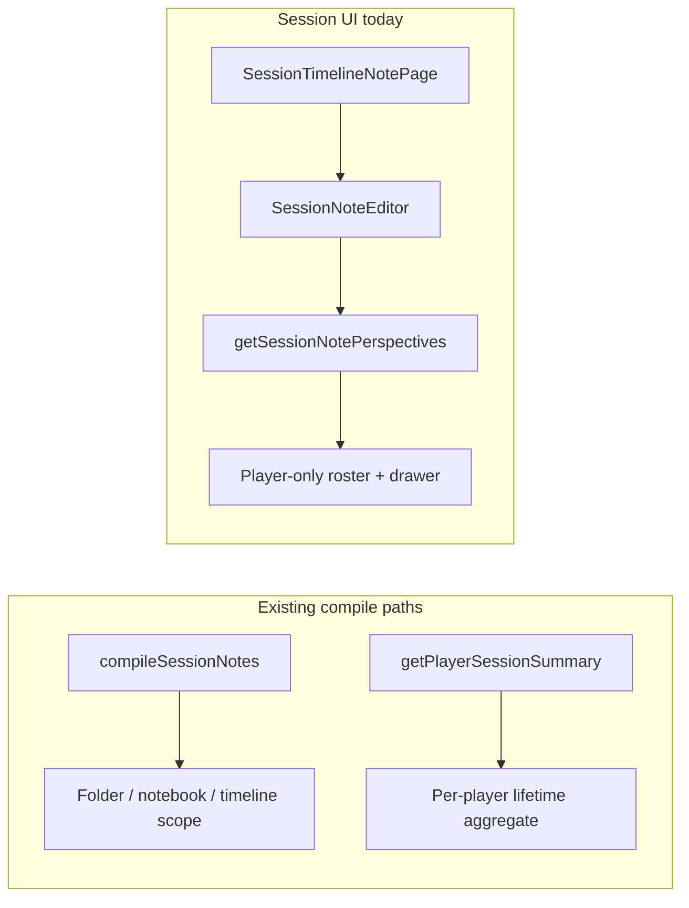
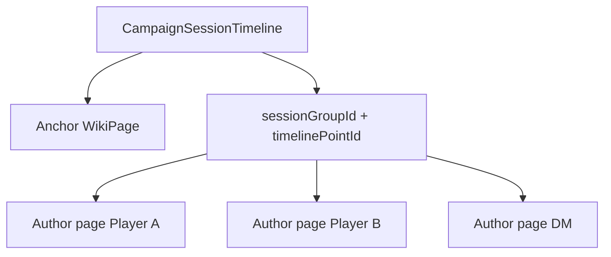

# Phase 2.5 & 2.75 examination and implementation plan

## What the roadmap actually says

In [`todo.md`](todo.md), these phases are **session-notes export and multi-user UX** — not general “game feel” polish:

| Phase | Title | Status |
|-------|--------|--------|
| **2.5** | Session export research (deferred) | Single checkbox: **Player session anthology** — research only until format is defined; no in-app compile hub link until then |
| **2.75** | Session Notes multi-user sidebar & combined view | Nested checklist: backend DM visibility + combined aggregation; frontend All View, entities ribbon, ReferencesWidget wiring |

**Your choices (locked in):**
- **Per-session notes:** separate `SESSION_NOTE` pages linked via **metadata** (e.g. `timelinePointId` / `sessionGroupId`), not child pages under one wiki row.
- **Order:** **Ship 2.75 first**; keep 2.5 as research until 2.75 proves the data model.

---

## Current implementation (baseline)

### Already shipped (related, but not 2.75-complete)



| Capability | Location | What it does |
|------------|----------|--------------|
| Scoped Markdown compile | [`backend/src/lib/sessionNotesCompile.ts`](backend/src/lib/sessionNotesCompile.ts), [`compileSessionNotes`](backend/src/controllers/wikiController.ts) | Merges wiki pages by notebook, session folder, or timeline — **not** a per-game-night multi-player anthology |
| Per-player summary | [`getPlayerSessionSummary`](backend/src/controllers/wikiController.ts) | Sandbox notes + name-matched folders under “Player Session Notes” |
| Timeline session | [`createNewSessionTimeline`](backend/src/controllers/wikiController.ts) | **One** `WikiPage` per `CampaignSessionTimeline` row (`wikiPageId` is `@unique`) |
| Party sidebar (partial) | [`SessionNoteEditor.tsx`](frontend/src/components/session/SessionNoteEditor.tsx) | “Party Perspectives” list + read-only drawer |
| Dual references radar | [`ReferencesWidget.tsx`](frontend/src/components/wiki/widgets/ReferencesWidget.tsx) | Used on **wiki pages** via `WidgetRegistry`; **not** mounted on session note layout |
| Compile UI (limited) | [`SessionNotesCompilePage.tsx`](frontend/src/pages/SessionNotesCompilePage.tsx), [`SessionTagNotesPage.tsx`](frontend/src/pages/SessionTagNotesPage.tsx) | Full-campaign or session-folder compile; **no** “anthology” entry in session hub |

### Gaps vs Phase 2.75 requirements

1. **DM missing from roster** — [`getSessionNotePerspectives`](backend/src/controllers/wikiController.ts) loads members with `role: CampaignMemberRoles.PLAYER` only (lines 1931–1940). DM/Co-DM never appear in the sidebar even when they authored the session page.

2. **Wrong sibling grouping for timeline sessions** — Perspectives query matches siblings by shared `parentId` (session root) or `notebookArcId`. Timeline pages are direct children of the session root, so siblings = **all** top-level session pages, not one game night.

3. **No session binding metadata** — [`SessionNoteMetadata`](frontend/src/utils/sessionNote.ts) only has `sessionNoteAuthorId` and `locationPageId`. Nothing ties multiple author pages to the same `timelinePointId` / session group.

4. **One wiki page per timeline point** — Schema [`CampaignSessionTimeline`](backend/prisma/schema.prisma) enforces `wikiPageId @unique`. The timeline row’s page is the **anchor**; per-player notes must be **additional** `SESSION_NOTE` pages linked by metadata (your chosen model).

5. **No combined API or All View** — No endpoint returns all author notebooks + deduped entity mentions for one session; no `SessionCombinedView` route/component.

6. **ReferencesWidget not context-aware in session flow** — Widget reads `pageId` from route params ([`ReferencesWidget.tsx`](frontend/src/components/wiki/widgets/ReferencesWidget.tsx) lines 101–106). Session notes use `timelinePointId` routes ([`App.tsx`](frontend/src/App.tsx)), so wiring needs an explicit `pageId` prop or route alignment.

---

## Phase 2.5 — examination (stay deferred, inform 2.75)

### Distinction from existing compile

| Export | Audience | Scope | Exists? |
|--------|----------|-------|---------|
| `compileSessionNotes` | DM / party (visibility-filtered) | Notebook, session folder, or timeline range | Yes |
| `getPlayerSessionSummary` | One player’s archive | All sandbox + matched wiki folders | Yes |
| **Player session anthology** (2.5) | Readable **combined** doc for **one game night** | All players’ notes for that session, structured for reading/sharing | **No** |

### Research deliverables (before any compile-hub link)

Produce a short design doc (can live in a comment on the todo item or a `docs/session-anthology.md` if you want it tracked) answering:

1. **Document structure** — e.g. chronological sections per player vs. unified narrative vs. DM summary + appendices.
2. **Visibility rules** — DM-only notes: omit, redact placeholder, or include for DM export only (pairs with 2.75 `EyeOff` masking in UI).
3. **Output channels** — in-app Markdown only, download `.md`, print CSS, or future PDF (out of scope unless requested).
4. **Reuse** — build on the same aggregation layer as 2.75’s combined API (recommended) so anthology export is a **formatter** over one payload, not a second query path.

**Explicit non-goals until spec is done:** new sidebar link to compile hub, new route, or user-facing “Export anthology” button ([`todo.md`](todo.md) line 43).

---

## Phase 2.75 — implementation plan (ship first)

### A. Data model: metadata-linked author notes

Extend session note metadata (backend + [`frontend/src/utils/sessionNote.ts`](frontend/src/utils/sessionNote.ts)):

```ts
// Proposed fields (names can be finalized in PR)
sessionGroupId?: string;      // cuid — shared by all notes for one game night
timelinePointId?: string;     // anchor timeline row when created from timeline flow
sessionNoteAuthorId?: string; // existing
```

**Anchor vs author pages:**
- **Anchor page** — the existing timeline `wikiPageId` (session title, DM metadata, optional shared fields). Created by [`createNewSessionTimeline`](backend/src/controllers/wikiController.ts).
- **Author pages** — `SESSION_NOTE` rows with same `sessionGroupId` (and `timelinePointId` when applicable), each with distinct `sessionNoteAuthorId`.

**Creation flows to update:**
- When a member opens a timeline session and has no author page for that group → create author page (or return existing) via new helper endpoint, e.g. `POST /session-timeline/:timelinePointId/notes/me`.
- [`updateSessionNotePage`](backend/src/controllers/wikiController.ts) must continue to enforce `canModifySessionNote` so DMs edit only their row unless `canManageNotebooks`.



### B. Backend tasks

| Task | File(s) | Notes |
|------|---------|-------|
| DM sidebar visibility fix | [`getSessionNotePerspectives`](backend/src/controllers/wikiController.ts) | Include DM + Co-DM in roster; resolve notes by `sessionGroupId` / `timelinePointId`, not loose `parentId` sibling match |
| Fix sibling query | Same | Replace “all children of session root” logic with metadata filter |
| Combined summary API | New handler + route in [`campaignScoped.ts`](backend/src/routes/campaignScoped.ts) | e.g. `GET /wiki/session-notes/combined?timelinePointId=` or `sessionGroupId=` returning `{ roster, columns[], entitiesMentioned[] }` |
| Entity mention extraction | Reuse [`wikiLinkExtract.ts`](backend/src/lib/wikiLinkExtract.ts) | Scan all author notebooks for session; dedupe by target page id (Option B ribbon) |
| Visibility in combined payload | [`wikiPageVisibilityFilter`](backend/src/lib/wikiTags.js) | DM sees all author columns; players see PARTY/PUBLIC + masked DM column metadata (content omitted or placeholder) |
| Tests | Extend [`sessionNotesCompile.test.ts`](backend/src/lib/sessionNotesCompile.test.ts) or new `sessionNotesCombined.test.ts` | Grouping, dedupe, DM-only masking |

**DM note row behavior (todo item):** Confirm DM save updates **their** author page (`sessionNoteAuthorId` = DM user id), not the anchor page’s body — unless product intent is anchor = DM canon (document in spec).

### C. Frontend tasks

| Task | File(s) | Notes |
|------|---------|-------|
| Refactor session sidebar shell | New `SessionNotesSidebar.tsx` or expand [`SessionNoteEditor.tsx`](frontend/src/components/session/SessionNoteEditor.tsx) | Profile list + “All View” entry at top |
| Combined canvas route | New `SessionCombinedNotesPage.tsx` + route in [`App.tsx`](frontend/src/App.tsx) | Multi-column grid (Option A); fetch combined API |
| DM column UX | Combined view | `isDM` badge + Lucide `EyeOff` when column is hidden from players |
| Entities ribbon | Top of combined view | Interactive tags linking to wiki pages |
| Wire ReferencesWidget | Extract optional `pageId` prop on [`ReferencesWidget`](frontend/src/components/wiki/widgets/ReferencesWidget.tsx) | Mount under sidebar; on profile click, pass selected author `pageId` and bump `reloadToken` for “flash” refresh |
| Single-user editor | [`SessionNoteEditor`](frontend/src/components/session/SessionNoteEditor.tsx) | Load **author** page for current user; perspectives list uses fixed grouping API |
| Entry from index | [`SessionNotesView.tsx`](frontend/src/pages/SessionNotesView.tsx) | Timeline create/navigate should ensure author page exists |

### D. Suggested implementation order

1. Metadata schema + migration/backfill strategy (new sessions only vs. backfill `sessionGroupId` on existing timeline pages).
2. Author-page provisioning endpoint + fix `getSessionNotePerspectives`.
3. Combined aggregation API + tests.
4. Session sidebar refactor (single-user + list).
5. All View page + entities ribbon.
6. ReferencesWidget prop + context snapping.
7. (Later) Phase 2.5 anthology formatter consuming combined API.

### E. Dependencies and follow-ups

- **[Phase 3.5 Identity mapping](todo.md)** — Combined columns can show account names today; `useIdentityDisplay` will improve labels later without blocking 2.75.
- **Phase 3 mobile** — Combined grid will need responsive stacking; acceptable to ship desktop-first if noted in QA.
- **Backfill** — Existing campaigns: assign `sessionGroupId = timelinePoint.id` or anchor `wikiPageId` on first open.

---

## Risk register

| Risk | Mitigation |
|------|------------|
| Legacy sessions lack `sessionGroupId` | Lazy migration on timeline open; perspectives API falls back to anchor-only |
| Double author pages | Unique constraint or upsert on `(campaignId, sessionGroupId, sessionNoteAuthorId)` via app logic |
| Compile vs combined confusion | Keep `compileSessionNotes` unchanged; anthology (2.5) reads combined payload only |
| ReferencesWidget route mismatch | Required prop `pageId` — do not rely on `useParams` in session layout |

---

## Acceptance criteria (Phase 2.75)

- DM/Co-DM appear in session sidebar with their own note row when they have an author page.
- Selecting a player updates main editor content **and** references radar for that author’s `pageId`.
- “All View” shows parallel columns for all authors with DM column masked/badge per spec.
- “Entities Mentioned Tonight” lists deduped wiki links from **all** author notebooks for that session.
- Saving as DM does not overwrite another user’s note row.
- Phase 2.5 remains unchecked until anthology structure doc is approved and a formatter is specified.
