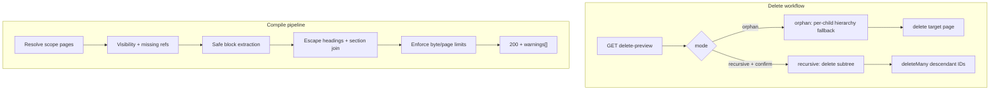
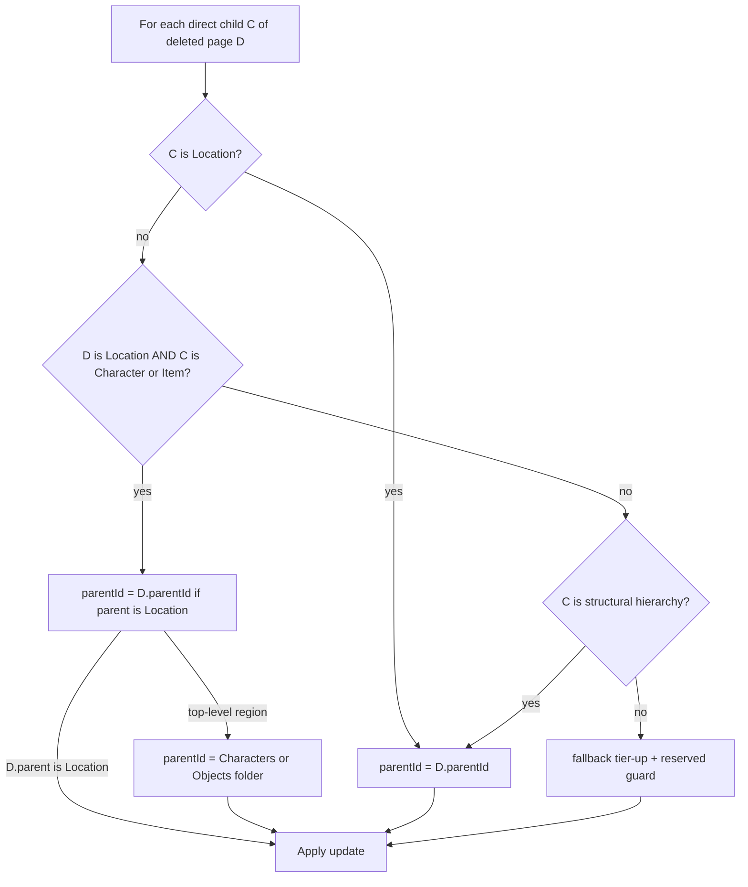

# Phase 2: Parental deletion and session compile hardening

## Current state

| Area | What exists | Gap |
|------|-------------|-----|
| Wiki tree | [`WikiPage.parentId`](backend/prisma/schema.prisma) with DB `ON DELETE SET NULL` ([migration](backend/prisma/migrations/20260528120000_wiki_page_parent_set_null/migration.sql)) | No lore `DELETE` route; implicit DB orphan only flattens to **root**, not **one tier up** |
| Delete UI | Session notes only ([`SessionNotesView.tsx`](frontend/src/pages/SessionNotesView.tsx)) | No delete in [`WikiPage.tsx`](frontend/src/pages/WikiPage.tsx) / [`WikiPageSettings.tsx`](frontend/src/components/wiki/WikiPageSettings.tsx) |
| Compile | [`compileSessionNotes`](backend/src/controllers/wikiController.ts) (~1786–1861) | No try/catch, no visibility filter, no size cap, raw `## ${title}`, wiki-parent ordering only (ignores timeline/notebooks) |



---

## Part 1: Parental deletion workflows

### 1.1 Shared backend library — [`backend/src/lib/wikiDeletion.ts`](backend/src/lib/wikiDeletion.ts) (new)

Mirror frontend [`collectDescendantIds`](frontend/src/lib/wikiHierarchy.ts) on the server:

- `collectDescendantIds(campaignId, rootId): Promise<string[]>` — BFS over `parentId` for the campaign.
- `getWikiDeletePreview(campaignId, pageId)` — returns `{ page, directChildCount, descendantCount, descendantTitlesSample, hasReservedInSubtree, childReparentPlan: Array<{ childId, childTitle, proposedParentId, ruleApplied, rationale }> }` so the UI can show **per-child** outcomes before confirm.
- `assertDeletable(page)` — reject if [`isReservedSystemWikiPage`](backend/src/lib/wikiSystemPages.ts) or structural divider title; for recursive mode, reject if **any** descendant is reserved.

**Orphan mode (`mode: 'orphan'`)** — *Context-Aware Hierarchy Fallback* (not a single blanket `parentId` for all children):

Goals:
- Avoid a **campaign root junk drawer** (mass flattening of location/NPC pages to `parentId: null`).
- Preserve **local geographical / taxonomic context** (e.g. *Sword Coast → Greenest → Inn* stays under *Greenest* when *Inn* is removed).

Implementation shape:
- `resolveOrphanParentId({ deletedPage, childPage, campaignPages }): { parentId: string | null, rule: 'rule1' | 'rule2' | 'rule3', rationale: string }` — evaluated **once per direct child** before delete.
- Transaction: loop direct children → compute target parent → `update({ id: childId, data: { parentId } })` → then `delete` the target page.

### Three-part rule matrix (Context-Aware Hierarchy Fallback)

Evaluated **per direct child** when `mode: 'orphan'`. First matching rule wins (1 → 2 → 3). If no rule matches, fallback: tier-up to `deletedPage.parentId` unless that parent is reserved/structural → coerce to `null` (document as `fallback` in `ruleApplied`).



| Rule | Applies when | New `parentId` for child | Example |
|------|----------------|--------------------------|---------|
| **Rule 1 — Geographical entities** | Child is a **Location** (`templateType === 'LOCATION'`, or `metadata.entityCategory === 'Locations'`) | `deletedPage.parentId` (one tier up) | Delete *The Purple Dragon Inn* → child *Back Room* moves under *Greenest* |
| **Rule 2 — Physically contained entities** | **Deleted page** `D` is a Location **and** child is **Character** or **Item/Object** | If `D.parentId` exists **and** that parent is a Location → `D.parentId`. **Safeguard:** if `D` has no parent or parent is not a Location (top-level region) → snap to campaign **Characters** or **Objects** index folder (never bare campaign root) | Delete inn → NPCs under *Greenest*; delete top-level *Sword Coast* → NPCs under seeded `Characters`, items under `Objects` |
| **Rule 3 — Structural hierarchies** | Child is organizational lore (sub-quest, sub-faction, journal arc) — **not** Rule 1/2 types; typically `templateType === 'DEFAULT'` with ancestry under `Game → Quests`, `World → Organizations`, or `Game → Journals` (not under taxonomic `Characters` / `Locations` / `Objects` index trees) | `deletedPage.parentId` (preserve narrative lineage) | Delete sub-quest folder → milestone attaches under parent quest line |

#### Classification helpers — [`wikiDeletion.ts`](backend/src/lib/wikiDeletion.ts)

Reuse existing signals (no new Prisma fields required for v1):

| Helper | Logic |
|--------|--------|
| `isLocationPage(page)` | `templateType === 'LOCATION'` OR `readEntityCategoryFromMetadata(metadata) === 'Locations'` ([`wikiCategoryEntityIndex.ts`](backend/src/lib/wikiCategoryEntityIndex.ts)) |
| `isCharacterPage(page)` | `templateType === 'CHARACTER'` OR `entityCategory === 'Characters'` |
| `isItemPage(page)` | `entityCategory === 'Objects'` OR ancestor under seeded **Objects** folder ([`seedWiki.ts`](backend/src/lib/seedWiki.ts) `World → Objects`) |
| `isStructuralHierarchyPage(page, campaignGraph)` | `DEFAULT` (or non-LOCATION/CHARACTER/item) **and** nearest taxonomic ancestor is **not** `Characters`/`Locations`/`Objects`; **and** ancestor title in `Quests`, `Organizations`, `Journals`, or nested descendants thereof |
| `resolveTaxonomicFolderId(campaignId, 'Characters' \| 'Objects')` | `findFirst` wiki page by title under campaign (prefer child of `World`; match seeded skeleton) — same titles as [`CATEGORY_INDEX_TITLES`](backend/src/lib/wikiCategories.ts) |
| `parentIsLocation(parentId, graph)` | Load parent node; `isLocationPage(parent)` |

**Rule 2 item routing:** Characters → `Characters` folder id; Items/Objects → `Objects` folder id.

**Reserved parents:** Never reparent under [`isReservedSystemWikiPage`](backend/src/lib/wikiSystemPages.ts) / `isStructuralDividerTitle` (`World`, `Game`). Walk up or use taxonomic snap instead of attaching to dividers.

**Do not** use a single `updateMany` with one `parentId` — children can diverge (e.g. one LOCATION child tier-up vs NPCs under same deleted inn).

#### Preview / API fields

`childReparentPlan[]` entries:

```ts
{
  childId: string;
  childTitle: string;
  proposedParentId: string | null;
  proposedParentTitle: string | null; // resolved label for UI
  ruleApplied: 'geographical' | 'contained' | 'structural' | 'fallback';
  rationale: string; // e.g. "Location tier-up to Greenest" / "NPC snap to Characters (top-level region deleted)"
}
```

**Recursive mode (`mode: 'recursive'`)**:

1. Collect `descendantIds` + target id; abort `409` if reserved page in set.
2. Transaction (same pattern as [`bulkDeleteSessionNotes`](backend/src/controllers/wikiController.ts)):
   - `campaignSessionTimeline.deleteMany({ wikiPageId: { in: ids } })`
   - `wikiPage.deleteMany({ where: { id: { in: ids }, campaignId } })`
3. Activity log per deleted page (reuse `logWikiPageActivity` pattern from `deleteSessionNotePage`).

### 1.2 Controller endpoints — [`wikiController.ts`](backend/src/controllers/wikiController.ts)

| Route | Auth | Handler |
|-------|------|---------|
| `GET /wiki/:pageId/delete-preview` | `requireOperationalManager` | `getWikiPageDeletePreview` |
| `DELETE /wiki/:pageId` | `requireOperationalManager` | `deleteWikiPage` |

**Request body** (JSON):

```ts
{ mode: 'orphan' | 'recursive'; confirm: true; confirmPhrase?: string }
```

**Validation rules:**

- `400` — missing/invalid `mode`, `confirm !== true`.
- `404` — page not in campaign.
- `403` — reserved target.
- `409` — recursive requested but subtree contains reserved pages; include `reservedPageIds` in body.
- `422` — recursive with `descendantCount > 0` requires `confirmPhrase` equal to target page title (case-sensitive trim) — API-level strict confirmation beyond UI dialog.

**Response** (`200`):

```ts
{ ok: true, mode, deletedPageIds: string[], orphanedChildIds?: string[] }
```

Wire routes in [`campaignScoped.ts`](backend/src/routes/campaignScoped.ts) after existing `PATCH /wiki/:pageId` routes.

### 1.3 Extend session-note delete when subtree exists

In [`deleteSessionNotePage`](backend/src/controllers/wikiController.ts): if `collectDescendantIds` returns any id other than the page itself, require the same `mode` + `confirm` body (otherwise `400` with `{ error, descendantCount, requiresMode: true }`). Apply orphan/recursive helpers so session-tag folders cannot silently wipe nested notes.

### 1.4 Frontend UI (minimal but complete workflow)

- [`frontend/src/lib/wiki.ts`](frontend/src/lib/wiki.ts): `fetchWikiDeletePreview`, `deleteWikiPage(slug, pageId, payload)`.
- New [`WikiPageDeleteDialog.tsx`](frontend/src/components/wiki/WikiPageDeleteDialog.tsx):
  - Load preview on open; show direct vs total descendant counts.
  - Radio: **Remove this page only (context-aware reparent)** vs **Delete this page and all sub-pages**.
  - Orphan path: expandable `childReparentPlan` table — each child shows new parent breadcrumb + badge (`Location tier-up`, `Contained entity`, `Structural`, `Fallback`).
  - Short help text summarizing the matrix (locations tier-up; NPCs/items follow location or taxonomic folders; quests/factions keep narrative lineage).
  - Recursive path: disabled until user types page title; destructive styling.
- Integrate into [`WikiPage.tsx`](frontend/src/pages/WikiPage.tsx) toolbar/settings (DM/Co-DM only, matching `requireOperationalManager`).
- Update session-note delete modal in [`SessionNotesView.tsx`](frontend/src/pages/SessionNotesView.tsx) when preview reports `descendantCount > 0`.

### 1.5 Tests

- [`backend/src/lib/wikiDeletion.test.ts`](backend/src/lib/wikiDeletion.test.ts):
  - **Rule 1:** Room → Tavern → Town chain; delete Tavern → Room parent becomes Town.
  - **Rule 2:** Inn under Greenest with NPC child; delete Inn → NPC parent Greenest.
  - **Rule 2 safeguard:** Top-level Region (no location parent) + NPC → parent becomes `Characters` folder id, not `null`.
  - **Rule 3:** Sub-quest under Quests; delete parent quest node → sub-quest parent becomes grandparent quest line.
  - **Mixed:** Delete location with both LOCATION child and NPC child → different `proposedParentId` per plan row.
  - Recursive blocked when subtree contains reserved page.

---

## Part 2: Session compile edge-case hardening

Extract compile logic from the controller into **[`backend/src/lib/sessionNotesCompile.ts`](backend/src/lib/sessionNotesCompile.ts)** (new) so boundaries are testable and `compileSessionNotes` / `getPlayerSessionSummary` stay thin wrappers with `try/catch`.

### 2.1 Safe markdown assembly

New helpers in the same file (or [`backend/src/lib/markdownExport.ts`](backend/src/lib/markdownExport.ts)):

- `escapeMarkdownHeadingText(title: string)` — strip/escape leading `#`, trim, collapse newlines; fallback `"Untitled"`.
- `extractCompileMarkdown(blocks: unknown)` — reuse logic from [`extractSessionNoteMarkdown`](backend/src/controllers/wikiController.ts) (prefer `session-note-body`, then `text-tiptap`); wrap each block read in try/catch; coerce non-string `markdown` to `''`; cap per-block length (e.g. 512 KB).
- `joinCompileSections(sections, separator)` — use a fixed separator line `'\n\n---\n\n'`; if body contains an identical line at column 0, prefix section with HTML comment sentinel or extra newline so thematic breaks do not merge sections.

### 2.2 Scope resolution and partial timelines

Extend query params on `GET /wiki/session-notes/compile`:

| Param | Behavior |
|-------|----------|
| `sessionPageId` | (existing) scope to one session-tag folder |
| `notebookArcId` | Compile `SESSION_NOTE` / arc-assigned pages in that notebook (align with [`getSessionNotesIndex`](backend/src/controllers/wikiController.ts)) |
| `timelineFrom` / `timelineTo` | Filter by `CampaignSessionTimeline.sequenceOrder` range |
| `orderBy=timeline\|updated` | Default `timeline` when timeline rows exist; fallback `updatedAt asc` for pages without timeline rows |

**Partial timeline handling:** join timeline → wiki pages; for timeline rows whose `wikiPageId` is missing (deleted), append to `warnings` and skip body; do not throw.

**Missing scope folder:** keep `404` for missing `Player Session Notes` root; for empty scoped folder return `200` with `compiledMarkdown: ''` and `warnings: ['No pages in scope']`.

### 2.3 Visibility and authorization

Apply [`wikiPageVisibilityFilter(canManage)`](backend/src/lib/wikiTags.ts) inside compile queries (same as index). Non-DM callers must not receive `DM_Only` bodies. Add `requireCampaignMember` is already on router; no change needed.

### 2.4 Size and crash boundaries

Constants (env-overridable, e.g. `COMPILE_MAX_PAGES=500`, `COMPILE_MAX_BYTES=2_000_000`):

- After resolving page list, if `pages.length > COMPILE_MAX_PAGES` → `413` `{ error, code: 'COMPILE_TOO_LARGE', pageCount }`.
- Accumulate markdown length while building; truncate with `warnings: ['Output truncated at N bytes']` rather than OOM.
- Top-level `try/catch` in controller: log error, respond `500` `{ error: 'Compile failed', code: 'COMPILE_INTERNAL' }` — never propagate uncaught exceptions.

**Malformed `blocks` JSON:** treat non-array as `[]`; skip invalid block entries.

### 2.5 Response shape (backward compatible)

Keep existing fields; add optional metadata:

```ts
{
  title: string;
  compiledMarkdown: string;
  pageCount: number;
  sourcePageIds: string[];
  warnings?: string[];      // new
  truncated?: boolean;      // new
  skippedPageIds?: string[]; // new — visibility or missing body
}
```

Refactor [`getPlayerSessionSummary`](backend/src/controllers/wikiController.ts) to use shared `escapeMarkdownHeadingText` + extraction for consistent heading levels (`##` for wiki sections).

### 2.6 Tests

- [`backend/src/lib/sessionNotesCompile.test.ts`](backend/src/lib/sessionNotesCompile.test.ts): titles with `##` and `---`; huge block array; non-array blocks; timeline gap; visibility exclusion; truncation flag.

### 2.7 Frontend compile pages (light touch)

- [`SessionNotesCompilePage.tsx`](frontend/src/pages/SessionNotesCompilePage.tsx) / [`SessionTagNotesPage.tsx`](frontend/src/pages/SessionTagNotesPage.tsx): surface `warnings` banner; handle `413` with user-facing message.
- Optional: link compile from [`SessionNotesView.tsx`](frontend/src/pages/SessionNotesView.tsx) (currently orphaned route).

---

## Implementation order

1. `wikiDeletion.ts` + unit tests + preview/delete routes.
2. Extend `deleteSessionNotePage` for subtree guard.
3. `sessionNotesCompile.ts` + refactor controllers + unit tests.
4. Frontend delete dialog + compile warning UX.
5. Mark Phase 2 items in [`todo.md`](todo.md) when verified manually.

## Manual verification checklist

- Delete *Purple Dragon Inn* (location) with NPC + room child → preview shows NPC→*Greenest*, room→*Greenest* (Rule 1); orphan matches.
- Delete top-level *Sword Coast* region with NPC → NPC snaps to `Characters` folder, not campaign root.
- Delete sub-quest under *Quests* → child tier-up under parent quest line (Rule 3).
- Recursive delete with title confirm removes full subtree.
- Attempt recursive delete on folder containing `Player Session Notes` child → `409`.
- Compile campaign with 0 notes → empty markdown, no 500.
- Compile with `DM_Only` page as player → page omitted from output.
- Compile with 600+ session notes (or lower env cap) → `413` or truncation warning, server stays up.
