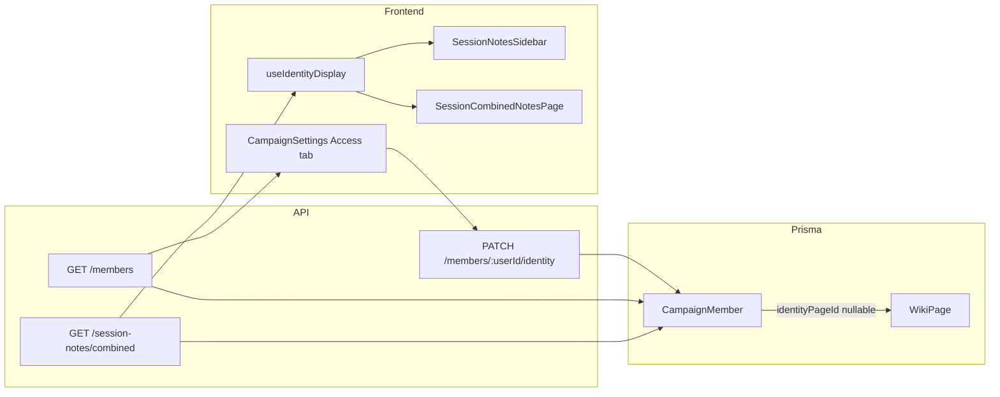

# Phase 3.5: Identity & Persona Mapping — feasibility and execution plan

## Manageability verdict: **Yes — proceed**

Phase 3.5 is a **small-to-medium, well-scoped feature** (not a framework phase). It does not depend on Phase 4+ work and builds on code that already exists.

| Factor | Assessment |
|--------|--------------|
| **Scope** | One nullable FK, one write endpoint, extend 2–3 read paths, one settings section, one hook, 4–5 UI touchpoints |
| **Existing foundations** | Combined session notes API/UI ([`SessionCombinedNotesPage.tsx`](frontend/src/pages/SessionCombinedNotesPage.tsx), [`sessionNotesCombined.ts`](backend/src/lib/sessionNotesCombined.ts)); wiki combobox pattern ([`WikiPageSettings.tsx`](frontend/src/components/wiki/WikiPageSettings.tsx)); `flatPages` via [`WikiContext`](frontend/src/contexts/WikiContext.tsx) |
| **Greenfield work** | No `identityPageId`, no `CampaignUserSettings`, no `useIdentityDisplay` — all net-new |
| **Risk** | Low–medium: validate wiki page belongs to campaign + visibility; avoid leaking DM-only page titles to players |
| **Rough effort** | ~1–2 focused dev days (backend + frontend + light tests) |

Phase 2.75 items in [`todo.md`](todo.md) are still unchecked, but **combined session notes are already shipped** ([`docs/session-anthology.md`](docs/session-anthology.md)). Phase 3.5 can land without finishing every 2.75 checkbox; it **plugs into** the combined/roster label paths that already use `formatPlayerLabel`.

**Out of scope for v1 (per exploration):** Dashboard does not show player names today ([`CampaignDashboardPage.tsx`](frontend/src/pages/CampaignDashboardPage.tsx) only shows campaign name + “Your role”). Defer dashboard identity until a concrete surface exists (e.g. hero subtitle for the current user only).

---

## Product rules (confirmed)

- **Both self-service and DM override:** any member can set their own `identityPageId`; DM/Co-DM can set or clear any member’s mapping from Access settings.
- **Display contract** (from [`todo.md`](todo.md) lines 76–79):
  - `displayName` = linked wiki page `title` when mapped
  - `playerContext` = account display name (subdued secondary line when identity is mapped)
  - Fallback when unmapped: account name only (no “Unassigned” unless product wants that for empty *selection* in settings UI only)

---

## Architecture



**Why `CampaignMember` (not a new `CampaignUserSettings` table):** identity is per-user-per-campaign; `CampaignMember` already has the composite key and membership lifecycle. A separate table adds joins with no benefit at this scale.

---

## Backend plan

### 1. Schema migration

In [`backend/prisma/schema.prisma`](backend/prisma/schema.prisma), extend `CampaignMember`:

```prisma
identityPageId String?
identityPage   WikiPage? @relation("MemberIdentity", fields: [identityPageId], references: [id], onDelete: SetNull)
```

Add inverse on `WikiPage` if needed for Prisma relation naming. Run `db:generate` + `db:push` (or migration per project convention in [`backend/prisma/README.md`](backend/prisma/README.md)).

### 2. Shared resolver (backend)

Add `resolveMemberIdentityDisplay()` in e.g. [`backend/src/lib/memberIdentity.ts`](backend/src/lib/memberIdentity.ts) (new):

- Input: `user`, optional `identityPage: { id, title, visibility } | null`, `index` for `Player N` fallback
- Output: `{ displayName, playerContext, label }` where `label` is what legacy consumers expect (`displayName` if mapped, else `playerContext` from `formatPlayerLabel`)
- Keeps one source of truth for combined notes, perspectives, and wiki tree `players[]`

### 3. Extend read APIs

| Endpoint | File | Change |
|----------|------|--------|
| `GET /api/c/:slug/members` | [`campaignAccessController.ts`](backend/src/controllers/campaignAccessController.ts) | `include: { identityPage: { select: { id, title, visibility } } }`; return `identityPageId`, `identityPageTitle` (or nested `identityPage`) |
| `GET .../wiki/session-notes/combined` | [`wikiController.ts`](backend/src/controllers/wikiController.ts) `loadSessionRosterMembers` + roster map ~2217 | Join identity page; use resolver for `label`; optionally add `playerContext` + `identityPageId` on columns |
| `GET .../wiki/tree` `players[]` | [`wikiController.ts`](wikiController.ts) ~261 | Same resolver for sidebar roster consistency |
| Session perspectives | [`getSessionNotePerspectives`](backend/src/controllers/wikiController.ts) ~2046 | Same label logic |

Update [`SessionAuthorColumn`](backend/src/lib/sessionNotesCombined.ts) / frontend [`types/wiki.ts`](frontend/src/types/wiki.ts) if exposing structured fields (recommended: `label`, `playerContext`, `identityPageId`).

### 4. Write API

Add to [`campaignScoped.ts`](backend/src/routes/campaignScoped.ts):

`PATCH /api/c/:campaignSlug/members/:userId/identity`

Body: `{ identityPageId: string | null }`

Handler in [`campaignAccessController.ts`](backend/src/controllers/campaignAccessController.ts):

- **Auth:** caller is target `userId` OR role is DM/Co-DM
- **Validation:**
  - If `identityPageId` set: page exists, `campaignId` matches, assignee can **view** page per existing `canViewPage` (use assignee’s role, not assigner’s — prevents players linking DM-only pages)
  - DM/Co-DM assigning to others: still enforce assignee visibility (or optionally allow DM to assign any page — prefer strict assignee visibility for consistency)
- **Clear:** `null` always allowed for self or DM

### 5. Tests

- Unit test resolver (mapped / unmapped / missing page title)
- Controller test: self PATCH allowed; other user forbidden for Member; DM can override; invalid cross-campaign page rejected
- Extend [`sessionNotesCombined.test.ts`](backend/src/lib/sessionNotesCombined.test.ts) if column labels change

---

## Frontend plan

### 1. Hook: `useIdentityDisplay`

New [`frontend/src/hooks/useIdentityDisplay.ts`](frontend/src/hooks/useIdentityDisplay.ts):

```ts
// Returns { displayName, playerContext, primaryLabel, showSecondary }
// primaryLabel = displayName ?? playerContext
// showSecondary = Boolean(displayName) — render playerContext in text-[11px] text-muted
```

Mirror backend resolver rules so UI stays consistent if API only sends `label` initially.

### 2. Settings UI — Access tab

In [`CampaignSettingsPage.tsx`](frontend/src/pages/CampaignSettingsPage.tsx) Access tab:

- New subsection **“Player identity mapping”** above or within the roster table
- **Current user row:** searchable combobox (clone pattern from [`WikiPageSettings.tsx`](frontend/src/components/wiki/WikiPageSettings.tsx) lines 72–80) over `useWiki().flatPages` — **all template types**, client filter by title
- **DM/Co-DM:** per-row identity picker + clear on each member (reuse combobox component extracted as `WikiPageCombobox` or `IdentityPagePicker.tsx`)
- Persist via `PATCH .../members/:userId/identity`; refresh members list on success
- Extend `CampaignAccessMember` type with `identityPageId`, `identityPageTitle`

### 3. Display touchpoints (use hook + dual-line pattern)

| Surface | File | Change |
|---------|------|--------|
| Session sidebar | [`SessionNotesSidebar.tsx`](frontend/src/components/session/SessionNotesSidebar.tsx) | Primary: identity title; secondary: account name when mapped |
| All View columns | [`SessionCombinedNotesPage.tsx`](frontend/src/pages/SessionCombinedNotesPage.tsx) | Replace single `column.label` header with hook output; keep role line or move account name to subdued line |
| Session editor header | [`SessionNoteEditor.tsx`](frontend/src/components/session/SessionNoteEditor.tsx) | ``{primary}'s notes`` with optional subdued `playerContext` |
| Snapshot export | [`sessionSnapshotFormat.ts`](frontend/src/lib/sessionSnapshotFormat.ts) | Use `primaryLabel` for `##` headings (identity-first) |

Ensure [`useSessionCombined`](frontend/src/hooks/useSessionCombined.ts) types include new fields when API adds them.

### 4. Optional polish

- Roster table in settings: show mapped character name in addition to account name
- Empty picker state: “No character page linked” (settings only; session UI uses account fallback)

---

## Execution order

1. **Schema + resolver + PATCH endpoint** (unblocks settings and tests)
2. **Extend `GET /members`** (settings UI)
3. **Settings UI** (self + DM override) — validates end-to-end persistence
4. **Session/combined/wiki-tree label paths** — swap `formatPlayerLabel` for resolver at roster build sites
5. **Frontend hook + session UI + snapshot**
6. **Smoke test:** map identity → open All View → sidebar + export headings show wiki title with account subtitle

---

## Acceptance criteria

- Member can link any **visible** wiki page as their identity; DM/Co-DM can set/clear any member’s link
- `GET /members` returns identity page id + title
- Session notes sidebar, All View column headers, and snapshot `##` sections show **wiki title as primary** and **account name as subdued secondary** when mapped
- Unmapped members behave as today (account-based label only)
- Invalid page (wrong campaign, not visible to assignee) returns 400 with clear error
- No regression to DM masking / combined notes visibility

---

## Post-implementation

- Check off Phase 3.5 items in [`todo.md`](todo.md)
- Note in README features (optional one-liner under Sessions) if you want user-facing docs
