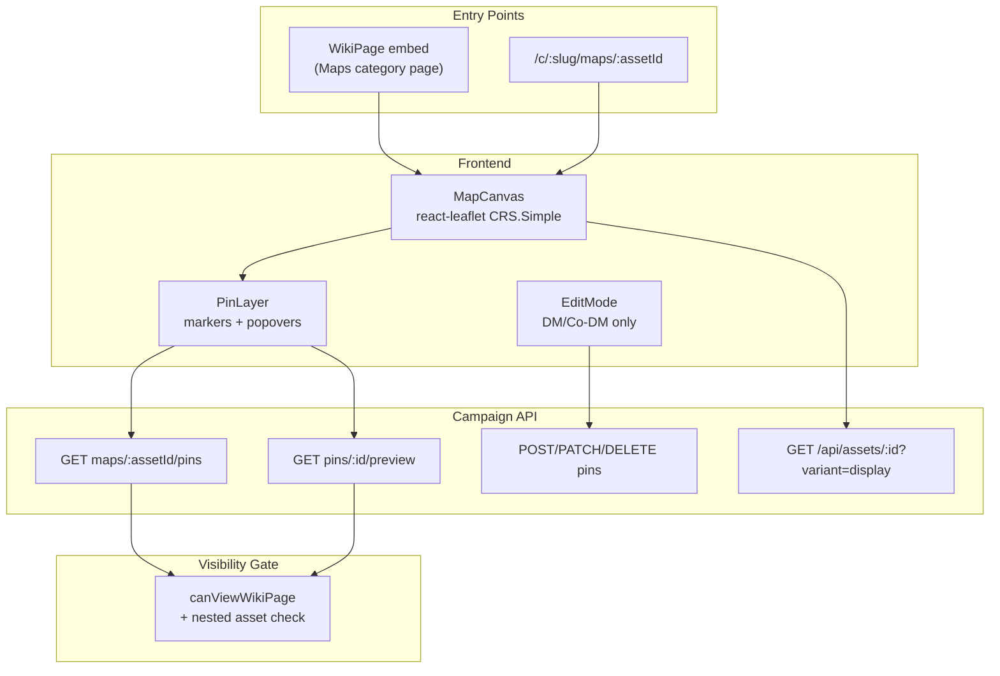

# Phase 7 — Spatial Visualization & Mapping

## Current baseline

| Area | Status |
|------|--------|
| [`MapPin` model](backend/prisma/schema.prisma) | Stub only: `assetId`, required `targetPageId`, `x_coordinate`, `y_coordinate` |
| Map API / UI | None |
| Asset pipeline | Local disk via multer; no `sharp`, no thumbnails, no `MAP_PRESERVE_FULL_RES` |
| Wiki visibility | `Public` / `Party` / `DM_Only` enforced unevenly — lists/trees filter server-side; [`getWikiPage`](backend/src/controllers/wikiController.ts) does not re-check visibility |
| Maps in product today | Wiki **category** only ([`wikiCategories.ts`](backend/src/lib/wikiCategories.ts)); backup **exports** pins but [restore skips them](backend/src/lib/campaignBackupRestore.ts) |

**Terminology alignment:** Esiana uses `Public` / `Party` / `DM_Only` (not Gemini's "ALL"). DM and Co-DM are equivalent elevated roles via [`canViewWikiPage`](backend/src/lib/wikiTree.ts).

---

## Architecture overview



---

## Library choice: Leaflet (recommended)

**Adopt Gemini's Leaflet recommendation** via `leaflet` + `react-leaflet` with `L.CRS.Simple` and `L.imageOverlay` for flat custom cartography.

| Option | Verdict |
|--------|---------|
| **Leaflet + react-leaflet** | Best fit: zoom/pan, bounds, clustering plugin, low overhead |
| OpenSeadragon | Reserve for Phase 7+ if `MAP_PRESERVE_FULL_RES` + 20k+ px maps cause browser pain (tiled deep-zoom) |
| Custom canvas / PixiJS | Avoid — unnecessary for non-VTT image maps |

---

## Schema changes (single migration, consumed across 7A/7B)

### `Asset` extensions

Add fields to support dual-stream delivery and Leaflet bounds:

- `thumbnailUrl String?` — display variant path (e.g. `/uploads/{id}-display.webp`)
- `width Int?`, `height Int?` — pixel dimensions of the **display** variant (Leaflet `[height, width]` bounds)
- `originalWidth Int?`, `originalHeight Int?` — set when full-res is preserved

### `WikiPage` extension

- `mapAssetId String?` — FK to `Asset` where `type = 'map'`; binds a Maps-category wiki page to its interactive canvas (separate from `featuredImageId`, which may be a decorative thumbnail)

### `MapPin` extensions

**7A (minimal):**

- Rename coordinates in API DTOs to `x` / `y` (keep DB columns `x_coordinate` / `y_coordinate` to avoid breaking backup format, or alias in serializers)
- Optional `label String?` for editor display

**7B (Gemini enhancements):**

- `targetPageId String?` — make optional
- `targetAssetId String?` — nested map target (`Asset.type = 'map'`)
- `pinType String @default("Location")` — taxonomy key (Settlement, Ruin, Dungeon, Geography, Quest, …)
- App-layer invariant: at least one of `targetPageId` or `targetAssetId` must be set

### Prisma deletion semantics (orphan protection)

Update `MapPin.targetPage` relation from `onDelete: Cascade` to `onDelete: SetNull` (requires `targetPageId` optional — can land in 7A migration even before nested-map usage). Pair with an application-layer scrub (see Operational Safeguards §1) so rows never sit with both targets null.

---

## Operational safeguards (7A prerequisites)

These four adjustments must land **before or alongside** the first map canvas render — they protect data integrity and DM workflow clarity.

### 1. Orphan pin cascade (broken map invariant)

**Problem:** Deleting a wiki page (or map asset) can leave `MapPin` rows with a dangling `targetPageId`, violating the app-layer invariant and breaking the canvas render loop when the API joins a missing target.

**Fix:** New [`backend/src/lib/mapPinMaintenance.ts`](backend/src/lib/mapPinMaintenance.ts), invoked from wiki and asset deletion paths ([`wikiController.ts`](backend/src/controllers/wikiController.ts) `deleteWikiPage`, [`uploadsController.ts`](backend/src/controllers/uploadsController.ts) `deleteCampaignAsset`).

```typescript
// resolvePinsAfterTargetPageDelete(pageId)
// For each pin where targetPageId === pageId:
//   if pin.targetAssetId → UPDATE targetPageId = null  (pin survives as nested-map-only)
//   else → DELETE pin row

// resolvePinsAfterTargetAssetDelete(assetId)
// For each pin where targetAssetId === assetId:
//   if pin.targetPageId → UPDATE targetAssetId = null
//   else → DELETE pin row
```

**Defense in depth:**

- Prisma `onDelete: SetNull` on optional FKs (never silent cascade that bypasses logging)
- Pin list serializer validates invariant before responding; drop or purge any row where both targets are null (should never happen post-hook)
- Frontend `MapCanvas` treats missing join targets as a skip + Sentry/console warn, not a crash

**Tests:** extend or mirror [`wikiDeletion.test.ts`](backend/src/lib/wikiDeletion.test.ts) with pin scrub scenarios.

### 2. Per-asset coordinate lock (`MAP_DISPLAY_MAX_EDGE` drift)

**Problem:** Changing `MAP_DISPLAY_MAX_EDGE` globally (8192 → 4096) must not shift the coordinate space for maps already processed and pinned.

**Fix:**

- `MAP_DISPLAY_MAX_EDGE` is read **only inside** [`imageProcessing.ts`](backend/src/lib/imageProcessing.ts) at **initial upload processing time**
- Persist locked dimensions on the `Asset` row: `width`, `height` (display variant), `originalWidth`, `originalHeight`
- **Never** auto-reprocess existing assets when the env var changes
- Frontend [`MapCanvas.tsx`](frontend/src/components/maps/MapCanvas.tsx) reads bounds exclusively from `GET /api/c/:slug/maps/:assetId` payload — **never** from env or global config
- Pin `x`/`y` are pixel coordinates relative to that asset's stored `width`/`height`

**Future re-optimize (out of 7A scope):** explicit admin action only, with a warning that existing pin coordinates must be scaled or re-placed manually.

### 3. DM workspace visibility vs player omissions

**Problem:** Omitting secret pins from the payload entirely is correct for players, but DMs need to see and audit hidden pins on their canvas.

**Fix — role-split pin list response:**

| Role | Payload |
|------|---------|
| Player / Member / Viewer | Only pins passing `canViewWikiPage`; secret pins **fully omitted** (no coordinates) |
| DM / Co-DM | **All** pins on the map; each pin includes `isSecret: boolean` — `true` when the pin's effective visibility would hide it from non-elevated members |

`isSecret` is derived, not stored:

```typescript
isSecret = !canViewWikiPage(targetPage.visibility, playerRoleProxy)
// playerRoleProxy = MEMBER (or lowest party role) for evaluation
```

**Frontend:** [`MapPinMarker.tsx`](frontend/src/components/maps/MapPinMarker.tsx) applies DM-only styling when `isSecret === true` — e.g. reduced opacity, dashed outline, or lock badge overlay. Players never receive the field or the pins.

**Security unchanged for players:** no `isSecret`, no hidden coordinates, preview endpoint still 404 for invisible targets.

### 4. Block-aware excerpt sanitization (preview pipeline)

**Problem:** Truncating raw `blocks` JSON produces broken hover text (JSON fragments, widget metadata).

**Fix:** New [`backend/src/lib/wikiExcerpt.ts`](backend/src/lib/wikiExcerpt.ts) — block-aware plain-text extractor reused by the pin preview endpoint.

Pipeline (mirror patterns in [`wikiLinkExtract.ts`](backend/src/lib/wikiLinkExtract.ts) and [`wikiPageToMarkdown.ts`](backend/src/lib/campaignExport/wikiPageToMarkdown.ts)):

1. Walk `blocks` array in layout order
2. Collect text only from `text-tiptap` blocks (`content.markdown`); skip image, grid, metadata, and widget blocks
3. Respect block-level visibility — omit `DM_Only` blocks when building preview for non-elevated callers (preview endpoint already 404s for DM_Only **pages**, but block filter future-proofs Party pages with DM-only sections)
4. Strip markdown syntax to plain text (lightweight: remove `#`, `*`, link syntax) or render-to-text via existing markdown strip helper
5. Join with spaces, normalize whitespace, slice to 200 chars with `…` suffix

Preview DTO field: `excerpt: string` — never raw `blocks`.

---

## Phase 7A — RC foundation (ship first)

### 1. Cartography asset pipeline

**Files:** new [`backend/src/lib/imageProcessing.ts`](backend/src/lib/imageProcessing.ts), extend [`uploadsController.ts`](backend/src/controllers/uploadsController.ts), [`env.ts`](backend/src/config/env.ts), [`.env.example`](backend/.env.example)

When `type === 'map'` on upload:

1. Read image metadata via `sharp`
2. If `MAP_PRESERVE_FULL_RES !== 'true'`: resize display variant (max edge ~8192px, WebP q≈85), write as `{uuid}-display.webp`
3. Always generate thumbnail (~2048px max edge) as `{uuid}-thumb.webp` for admin lists / hover cards
4. Store `url` (original or display path), `thumbnailUrl`, dimensions on `Asset` row

Env vars:

- `MAP_PRESERVE_FULL_RES=false` — when `true`, keep original bytes in `url` but still generate display/thumb siblings
- `MAP_DISPLAY_MAX_EDGE=8192` — **upload-time only**; never used by frontend or pin coordinate math (see Operational Safeguards §2)

Extend [`assetsController.ts`](backend/src/controllers/assetsController.ts):

- `GET /api/assets/:id?variant=full|display|thumb` (default `display` for map assets, `full` for others)
- Resolve correct file path; same campaign ACL as today
- Harden stream error handling (already partially present)

Add campaign upload UI (API exists, no frontend today): map upload control in a new **Maps manager** panel reachable from Maps category index or campaign settings.

### 2. Map & pin API

**New:** [`backend/src/controllers/mapsController.ts`](backend/src/controllers/mapsController.ts), [`backend/src/lib/mapPinVisibility.ts`](backend/src/lib/mapPinVisibility.ts)

| Route | Auth | Behavior |
|-------|------|----------|
| `GET /api/c/:slug/maps` | member | List `Asset` where `type = 'map'` |
| `GET /api/c/:slug/maps/:assetId` | member | Map metadata + `mapAssetId` backlink wiki pages |
| `GET /api/c/:slug/maps/:assetId/pins` | member | **Server-filtered** pin list |
| `GET /api/c/:slug/maps/pins/:pinId/preview` | member | Safe hover payload |
| `POST/PATCH/DELETE .../pins` | `requireOperationalManager` | Pin CRUD |

**Inherited RBAC (Gemini #1 — adopt in 7A):**

Pins are never independently permissioned. Filter logic in `mapPinVisibility.ts`:

```typescript
// Pseudocode — reuse existing helpers
function isPinVisibleToRole(pin, role): boolean {
  if (pin.targetPage && !canViewWikiPage(pin.targetPage.visibility, role)) return false;
  // 7B: if pin.targetAsset, check linked wiki page visibility or asset-only DM gate
  return true;
}
```

**Role-split responses (Operational Safeguards §3):**

- **Non-elevated roles:** return only pins where `isPinVisibleToRole(pin, role)` — hidden pins **fully omitted** (no coordinates, no `isSecret` field)
- **DM / Co-DM:** return all pins; add `isSecret: !isPinVisibleToRole(pin, MEMBER)` so managers can audit party-hidden content with distinct marker styling

Players must not learn secret coordinates via DevTools.

**Preview endpoint security:**

Return only: `title`, `excerpt` (from [`wikiExcerpt.ts`](backend/src/lib/wikiExcerpt.ts) — block-aware, 200-char plain text), `visibility`, `wikiPageId`, `thumbnailUrl`. Never return full `blocks` JSON. If pin fails visibility check → `404` (not `403`, to avoid pin enumeration).

**Deletion hooks (Operational Safeguards §1):** call `mapPinMaintenance` from wiki page delete and map asset delete before/within the transaction.

**Campaign isolation:** every query joins `asset.campaignId === req.campaign.campaignId`.

### 3. Interactive canvas (dual entry points)

**New frontend files:**

- [`frontend/src/pages/MapViewerPage.tsx`](frontend/src/pages/MapViewerPage.tsx) — route `/c/:campaignSlug/maps/:assetId`
- [`frontend/src/components/maps/MapCanvas.tsx`](frontend/src/components/maps/MapCanvas.tsx) — shared Leaflet viewer
- [`frontend/src/components/maps/MapPinMarker.tsx`](frontend/src/components/maps/MapPinMarker.tsx)
- [`frontend/src/components/maps/MapPinPreviewCard.tsx`](frontend/src/components/maps/MapPinPreviewCard.tsx)
- [`frontend/src/lib/maps.ts`](frontend/src/lib/maps.ts) — API client

**Route:** add to [`App.tsx`](frontend/src/App.tsx) under `CampaignLayout`.

**Wiki embed:** in [`WikiPage.tsx`](frontend/src/pages/WikiPage.tsx), when `page.mapAssetId` is set (or page is under Maps category with bound asset), render `MapCanvas` above or below wiki blocks in read mode; DM/Co-DM get edit affordances.

**Leaflet setup:**

- `CRS.Simple`; bounds `[[0,0], [height, width]]` from **asset API payload only** — never from `MAP_DISPLAY_MAX_EDGE` or env (Operational Safeguards §2)
- `minZoom` / `maxZoom` tuned so map fills viewport
- Image URL: `/api/assets/{id}?variant=display` with auth cookies
- Pin coordinates stored as **pixel coords on the locked display variant** (`Asset.width` × `Asset.height` at processing time)

**Dynamic previews (todo item):** Leaflet `Popup` or floating card on hover/focus, fed by preview API (debounced fetch per pin).

**Player UX:** read-only canvas, filtered pins, click pin → navigate to `/c/:slug/wiki/:pageId`.

**DM/Co-DM UX (7A minimal edit):** toggle "Edit pins" → click map to place pin, modal to bind existing wiki page, drag to reposition, delete pin. Secret pins (`isSecret`) render with DM-only styling (opacity / lock badge) per Operational Safeguards §3.

### 4. Backup / restore parity

Extend [`campaignBackupRestore.ts`](backend/src/lib/campaignBackupRestore.ts) to restore `mapPins` array (mirror existing `wikiLinks` restore pattern). Remap `assetId` / `targetPageId` through ID maps built during restore.

### 5. Object storage blueprints (docs only)

**New:** [`docs/deployment/object-storage.md`](docs/deployment/object-storage.md)

Document recommended production layouts for **S3**, **Cloudflare R2**, and **MinIO**:

- Bucket layout (`/campaigns/{id}/maps/{assetId}-display.webp`)
- CDN + signed URL strategy
- Env var sketch aligned with Phase 10 `StorageDriver` (do **not** implement driver in Phase 7)
- Note existing admin S3 plugin stub in [`systemPlugins.ts`](backend/src/lib/systemPlugins.ts) is config-only today

### 7A security hardening (bundled)

| Risk | Mitigation |
|------|------------|
| Hidden pin coordinate leak | Server-side filter for players; no `isSecret` or coords in player payload |
| DM blind to own secrets | Elevated roles receive all pins with `isSecret` flag + distinct marker styling |
| Orphan pins after wiki/asset delete | `mapPinMaintenance` hook; SetNull + purge; serializer invariant check |
| Coordinate drift on env change | Lock `width`/`height` per asset at processing; frontend never reads env |
| Preview content leak | Block-aware `wikiExcerpt` utility; no raw `blocks` in DTO |
| DM_Only wiki page ID guessing | Omit invisible pins from player payload; preview returns 404 |
| Pin mutation by players | `requireOperationalManager` on writes |
| Cross-campaign access | `campaignId` on all queries |
| Oversized upload DoS | Reuse [`uploadLimit.ts`](backend/src/middleware/uploadLimit.ts); stricter default for `type=map` if needed |
| Full-res map scraping | Serve display variant to non-elevated roles when downscaled; optional elevated-only `variant=full` |

**Optional 7A fix (recommended):** add `canViewWikiPage` guard to `getWikiPage` while touching wiki code — closes a pre-existing leak that would undermine map→wiki navigation trust.

---

## Phase 7B — Enhancements (second pass, same milestone)

### Gemini #2 — Nested maps

- Enable `targetAssetId` on pins; clicking pin swaps canvas to nested map (update route + breadcrumb trail: `Faerûn → Waterdeep`)
- Standalone route `/c/:slug/maps/:assetId` is the navigation backbone; wiki embed shows same component with breadcrumb UI
- Visibility: pin visible only if **both** target page (if any) and target map asset pass visibility — for asset-only nested targets, require an associated `WikiPage` with `mapAssetId` pointing at the asset (derive visibility from that page)

### Gemini #3 — Pin taxonomy & icon coding

- `pinType` field + constants in [`domain.ts`](backend/src/types/domain.ts) (both frontend/backend)
- SVG marker registry in [`MapPinMarker.tsx`](frontend/src/components/maps/MapPinMarker.tsx) (castle, skull, star, etc.)
- Filter toolbar: checkboxes to show/hide types (persist in sessionStorage per map)
- Optional: `leaflet.markercluster` when >50 pins visible

### Gemini #4 — Quick-drop & create workflow

DM/Co-DM edit mode only:

- Double-click / long-press empty canvas → mini dialog:
  - **Bind existing wiki page** (searchable combobox scoped to Locations/Maps/Quests)
  - **Quick-create Location** — `POST` creates blank wiki page under Locations category, binds pin in one transaction
- Keep user on map; no navigation away

**API:** extend `POST .../pins` with optional `{ quickCreate: { title, category? } }` or dedicated sub-route; operational manager only.

---

## UI stress points to design for

| Scenario | Design response |
|----------|-----------------|
| 100+ pins on regional map | Type filters (7B), marker clustering, lazy popup fetch |
| 50MB uploaded PNG | Sharp downscale + display variant; warn in upload UI |
| Player on mobile | Touch pan/zoom; tap-to-open preview instead of hover |
| DM editing dense map | Snap-to-grid optional; pin list sidebar for selection |
| Map with no bound wiki page | Standalone route still works; category index links to `/maps/:assetId` |
| Broken asset file | Canvas error state with admin repair link |

---

## Relationship to Phase 9 (Fog of War)

Phase 9 todo mentions pin-level unrevealed flags. **Phase 7 uses inherited wiki visibility only** — no separate pin visibility field. Document that pin-level fog (revealed/unrevealed independent of wiki page) is deferred to Phase 9 to avoid duplicate permission models.

---

## File touch list (estimated)

**Backend:** `schema.prisma`, `env.ts`, `imageProcessing.ts`, `mapsController.ts`, `mapPinVisibility.ts`, `mapPinMaintenance.ts`, `wikiExcerpt.ts`, `uploadsController.ts`, `assetsController.ts`, `wikiController.ts`, `campaignScoped.ts`, `campaignBackupRestore.ts`, `domain.ts`, `.env.example`

**Frontend:** `MapViewerPage.tsx`, `MapCanvas.tsx`, `MapPinMarker.tsx`, `MapPinPreviewCard.tsx`, `MapPinEditor.tsx` (7A basic, 7B enhanced), `maps.ts`, `App.tsx`, `WikiPage.tsx`, sidebar nav entry for Maps assets

**Docs:** `docs/deployment/object-storage.md`, update [`todo.md`](todo.md) checkboxes per sub-phase

---

## Testing plan

**Backend unit tests:** `mapPinVisibility` matrix (DM/Co-DM/Member/Player × Public/Party/DM_Only targets); DM payload includes `isSecret` pins, player payload excludes them; `mapPinMaintenance` orphan cascade (page delete, asset delete); `wikiExcerpt` on mixed block arrays (no JSON fragments); preview DTO never includes blocks; restore remaps pin IDs.

**Frontend tests:** MapCanvas bounds from asset payload only; secret pin marker styling for DM; edit mode gated by role.

**Manual QA checklist:**

1. Upload 20MB map → display variant generated; canvas loads quickly; bounds match API `width`/`height`
2. DM_Only location pin invisible to Player in network tab **and** UI; visible to DM with `isSecret: true` styling
3. Hover preview shows clean plain-text excerpt (no markdown/JSON artifacts)
4. Delete linked wiki page → pin purged (or survives with `targetAssetId` only in 7B)
5. Wiki embed + standalone route show same pins
6. Backup → restore → pins intact
7. (7B) Nested pin navigates with breadcrumb; quick-create binds pin without leaving map
