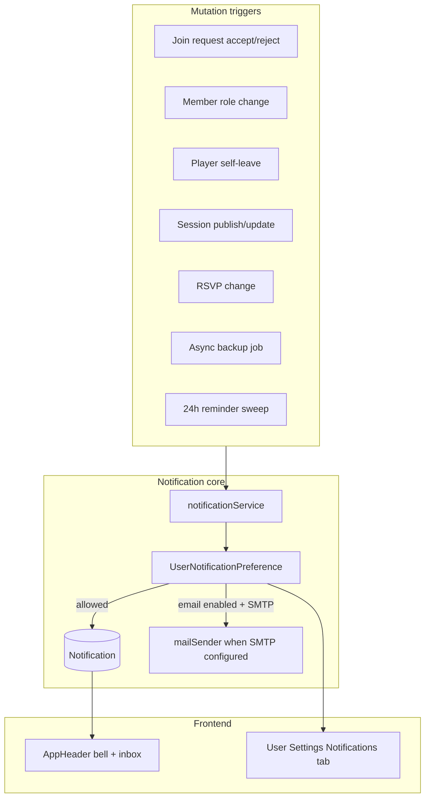
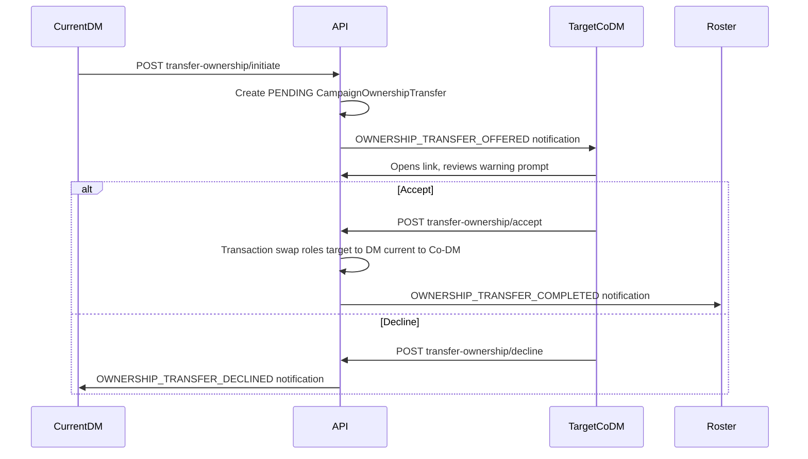

# Phase 8 — Notifications (v0.9.0)

## Current state

Phase 8 in [todo.md](todo.md) lists two unchecked items. The codebase is **pre-notification**:

- [`Notification`](backend/prisma/schema.prisma) model exists (lines 672–686) but has **no migration**, **no API**, **no `prisma.notification` usage**
- SMTP fields on `SystemSetting` are persisted; **no mail sender** (Phase 5 skipped the mail router)
- No bell/inbox UI; [`UserSettings.tsx`](frontend/src/pages/UserSettings.tsx) has profile/appearance/campaigns/developer tabs only
- Campaign backup export is **synchronous** ([`campaignBackupController.ts`](backend/src/controllers/campaignBackupController.ts)); restore already uses async [`taskRegistry`](backend/src/lib/taskRegistry.ts)
- Session scheduling is **campaign-level recurring** (`scheduleDay`, `scheduleTime`) — no per-session OOC datetime, location, or Discord link
- RSVP is **client-only** in [`SessionClockWidget.tsx`](frontend/src/components/dashboard/widgets/SessionClockWidget.tsx) (dashboard widget config, not per-user)
- **No player self-leave** endpoint — only DM-initiated `DELETE .../members/:userId`



---

## 1. Schema and migration

Add a proper migration (Notification is absent from [`backend/prisma/migrations/`](backend/prisma/migrations/)).

### Extend `Notification`

| Field | Purpose |
|-------|---------|
| `type` | Stable enum string for preference mapping (e.g. `JOIN_REQUEST_RESOLVED`) |
| `campaignId?` | Filter/group by campaign; cascade delete |
| `metadata Json?` | Actor name, session number, export task id, etc. |
| `readAt DateTime?` | Replace boolean-only tracking (keep `isRead` as computed/default for queries) |
| `expiresAt DateTime?` | Auto-hide stale export links after TTL |

### New models

**`UserNotificationPreference`** — one row per user:

```prisma
model UserNotificationPreference {
  userId String @id
  /// JSON: { "JOIN_REQUEST_RESOLVED": { inApp: true, email: true }, ... }
  channels Json
  /// Global mute until timestamp (vacation mode)
  mutedUntil DateTime?
  user User @relation(...)
}
```

Default all types to `{ inApp: true, email: false }` except DM-facing types default `email: true` when user has verified email (optional UX hint in settings).

**`CampaignSessionSchedule`** — OOC scheduling per timeline session (1:1 with `CampaignSessionTimeline`):

```prisma
model CampaignSessionSchedule {
  timelinePointId String @id
  status          String  // DRAFT | PUBLISHED | CANCELLED | COMPLETED
  plannedStartAt  DateTime?   // real-world UTC
  plannedEndAt    DateTime?
  timezone        String?     // IANA, e.g. America/New_York
  venueType       String?     // ONLINE | IN_PERSON | HYBRID
  venueLabel      String?     // "John's basement" or room name
  venueUrl        String?     // Discord / VTT link
  locationPageId  String?     // optional wiki location link
  reminderSentAt  DateTime?   // idempotency for 24h job
  publishedAt     DateTime?
  timelinePoint CampaignSessionTimeline @relation(...)
}
```

**`SessionAttendance`** — server-backed RSVP:

```prisma
model SessionAttendance {
  timelinePointId String
  userId          String
  status          String  // ATTENDING | ABSENT | LATE | MAYBE
  note            String?
  updatedAt       DateTime @updatedAt
  @@id([timelinePointId, userId])
}
```

**`CampaignOwnershipTransfer`** — pending two-step DM handoff (one active offer per campaign):

```prisma
model CampaignOwnershipTransfer {
  id          String   @id @default(cuid())
  campaignId  String
  fromUserId  String   // current primary DM initiating
  toUserId    String   // target Co-DM who must accept
  status      String   // PENDING | ACCEPTED | DECLINED | CANCELLED | EXPIRED
  expiresAt   DateTime // default 7 days from initiation
  createdAt   DateTime @default(now())
  resolvedAt  DateTime?
  campaign Campaign @relation(...)
  @@index([campaignId, status])
}
```

Enforce at most one `PENDING` row per campaign in the service layer (transaction + unique check).

**Staging asset type** for async export downloads — reuse existing pattern (`campaign-export-zip` + 3-day TTL from [`importStagingRetention.ts`](backend/src/lib/importStagingRetention.ts)).

**`SystemSetting.notificationPollIntervalSeconds`** — global admin knob for bell badge polling (default **60**, allowed range **30–300**). Stored alongside existing system settings; exposed read-only to authenticated clients via `/api/user/notification-capabilities` (or public system status if we want zero extra round-trip).

---

## 2. Backend notification core

### New files

- [`backend/src/lib/notifications/types.ts`](backend/src/lib/notifications/types.ts) — `NotificationType` enum + human labels
- [`backend/src/lib/notifications/notificationService.ts`](backend/src/lib/notifications/notificationService.ts) — single entry point:

```typescript
await notifyUsers({
  userIds: [...],
  type: NotificationType.JOIN_REQUEST_ACCEPTED,
  title, body, linkUrl, campaignId, metadata,
});
```

- [`backend/src/lib/notifications/deepLinks.ts`](backend/src/lib/notifications/deepLinks.ts) — build frontend paths using slug ([`campaignPaths.ts`](frontend/src/lib/campaignPaths.ts) patterns server-side)
- [`backend/src/lib/mail/mailSender.ts`](backend/src/lib/mail/mailSender.ts) — nodemailer wrapper; **no-op when SMTP incomplete**; reads `SystemSetting` like admin settings do today
- [`backend/src/lib/notifications/sessionReminderJob.ts`](backend/src/lib/notifications/sessionReminderJob.ts) — scheduled sweep

### Preference resolution

Before insert/send:

1. Load user prefs (or defaults)
2. Skip if `mutedUntil > now`
3. Per-type: create `Notification` if `inApp`; call `mailSender` if `email && smtpConfigured`

### API routes — [`backend/src/routes/user.ts`](backend/src/routes/user.ts)

| Method | Endpoint | Purpose |
|--------|----------|---------|
| `GET` | `/api/user/notifications` | Paginated inbox (`?unreadOnly`, `?campaignId`, cursor) |
| `GET` | `/api/user/notifications/unread-count` | Badge count — **indexed query only** (`WHERE userId = ? AND readAt IS NULL`), no table scans |
| `GET` | `/api/user/notification-capabilities` | Poll interval (from admin setting), SMTP/email availability |
| `PATCH` | `/api/user/notifications/:id/read` | Mark one read |
| `POST` | `/api/user/notifications/read-all` | Mark all read |
| `DELETE` | `/api/user/notifications/:id` | Dismiss |
| `GET/PATCH` | `/api/user/notification-preferences` | Read/update channel toggles + mute |

Auth: session only (same as profile routes).

---

## 3. Event hooks (your listed scenarios)

Wire `notifyUsers` at the end of successful transactions in existing controllers. Use `queueMicrotask` (same pattern as [`campaignActivity.ts`](backend/src/lib/campaignActivity.ts)) so HTTP responses stay fast.

| Event | Trigger location | Recipients | Deep link |
|-------|------------------|------------|-----------|
| **Join approved** | [`recruitmentController.ts`](backend/src/controllers/recruitmentController.ts) `resolveJoinRequestByStatus` (ACCEPTED) | Applicant | `/c/:slug/dashboard` |
| **Join denied** | Same (REJECTED) | Applicant | `/hub` or campaign LFG page if public |
| **Role promotion** (→ Co-DM, Viewer→Member, etc.) | [`campaignAccessController.ts`](backend/src/controllers/campaignAccessController.ts) `updateCampaignMemberRole` | Target user | `/c/:slug/dashboard` |
| **Ownership transfer offered** | `POST .../transfer-ownership/initiate` (see handshake below) | Target Co-DM only | `/c/:slug/transfer-ownership` (accept/decline page) |
| **Ownership transfer completed** | `POST .../transfer-ownership/accept` after confirmation | Entire campaign roster | `/c/:slug/dashboard` |
| **Player departure** | New `leaveCampaign` self-service endpoint + existing DM remove | All DM/Co-DM | `/c/:slug/settings` (members tab) |
| **New session published** | New `publishSessionSchedule` when status → PUBLISHED | All campaign members | `/c/:slug/notes/:timelinePointId` |
| **Session details changed** | `PATCH` schedule when `publishedAt` set and datetime/venue fields change | All members | same session note URL |
| **24-hour warning** | Scheduled job finds `plannedStartAt` in [now+23h, now+25h] and `reminderSentAt IS NULL` | Members who RSVP ≠ ABSENT (or all if no RSVP yet) | session note URL |
| **RSVP update** | New attendance PATCH | DM + Co-DMs (digest option below) | session note URL |
| **Export ready** | Async backup task completion | Requesting user | signed download URL or `/c/:slug/settings` backup tab |

**Additional immediate hooks** (low effort, high value):

- **New join request submitted** → DM/Co-DM (`POST .../apply`) → `/c/:slug/settings` recruitment tab
- **Import/restore complete or failed** → user who created campaign via wizard → hub or new campaign dashboard
- **Session cancelled** → all members when schedule status → CANCELLED

### Player self-leave (prerequisite)

Add `DELETE /api/c/:slug/members/me` in [`campaignAccessController.ts`](backend/src/controllers/campaignAccessController.ts):

- Allowed for Member/Viewer/Co-DM (not primary DM)
- Deletes `CampaignMember` row
- Fires departure notification to operational managers

### Ownership transfer — two-step handshake

Accidental DM handoffs are destructive; use an explicit offer/accept flow instead of an immediate role swap.



**Initiation** — `POST /api/c/:slug/transfer-ownership/initiate` (primary DM only):

- Body: `{ targetUserId }`; target must be an existing **Co-DM** on this campaign
- Reject if another `PENDING` transfer already exists for this campaign
- Create `CampaignOwnershipTransfer` with `status=PENDING`, `expiresAt=now+7d`
- Notify target: type `OWNERSHIP_TRANSFER_OFFERED`, link to accept page
- Optionally notify other Co-DMs (informational, not actionable) — defer to keep noise low

**Acceptance** — `POST /api/c/:slug/transfer-ownership/accept` (target Co-DM only):

- Frontend: dedicated route `/c/:slug/transfer-ownership` renders **warning prompt** (irreversible, you become primary DM, current DM becomes Co-DM) with explicit Accept / Decline buttons — notification deep link lands here
- Transaction (all or nothing):
  1. Verify transfer is `PENDING`, not expired, `toUserId === req.user.id`
  2. Swap roles: target → `DM`, initiator → `Co-DM`
  3. Mark transfer `ACCEPTED`, set `resolvedAt`
  4. Cancel any stale pending offers for this campaign
- Notify **entire campaign roster**: type `OWNERSHIP_TRANSFER_COMPLETED` (in-app + email per prefs)

**Decline** — `POST /api/c/:slug/transfer-ownership/decline` (target Co-DM):

- Mark transfer `DECLINED`; notify initiator (`OWNERSHIP_TRANSFER_DECLINED`)

**Cancel** — `DELETE /api/c/:slug/transfer-ownership` (initiating DM only):

- Mark pending transfer `CANCELLED`; dismiss target's offer notification (or mark read)

**Expiry** — scheduled sweep (same job runner as session reminders): mark `EXPIRED` transfers past `expiresAt`; notify initiator.

Aligns with Phase 17 "Transfer Campaign DM" without a full ACL revamp — the handshake *is* the safety mechanism.

---

## 4. OOC session scheduling + RSVP API

### Session schedule endpoints — [`campaignScoped.ts`](backend/src/routes/campaignScoped.ts)

| Method | Endpoint | Auth | Notes |
|--------|----------|------|-------|
| `GET/PATCH` | `/session-timeline/:id/schedule` | DM/Co-DM write; members read | Upsert `CampaignSessionSchedule` |
| `POST` | `/session-timeline/:id/schedule/publish` | DM/Co-DM | Sets `status=PUBLISHED`, `publishedAt=now`, fires party notification |
| `GET/PATCH` | `/session-timeline/:id/attendance/me` | Member | Own RSVP |
| `GET` | `/session-timeline/:id/attendance` | DM/Co-DM | Full roster + quorum summary |

### Frontend

- **Session schedule editor** on session note page or timeline sidebar (DM/Co-DM): datetime picker + timezone, venue type, Discord URL, optional wiki location picker
- **Replace widget-local RSVP** in [`SessionClockWidget.tsx`](frontend/src/components/dashboard/widgets/SessionClockWidget.tsx) with API-backed attendance for the **next published session** (query nearest `plannedStartAt >= now`)
- **Quorum digest**: when RSVP changes, notify DM/Co-DM with counts (`4/5 attending`) — batch via 5-minute debounce in memory per session to avoid spam (acceptable for single-node; note Redis debounce for Phase 16)

---

## 5. Async campaign export

Today: [`downloadCampaignBackup`](backend/src/controllers/campaignBackupController.ts) blocks until ZIP is built.

### New flow

1. `POST /api/c/:slug/backup/async` → returns `{ taskId }`, creates `taskRegistry` AD_HOC task
2. Background: `buildSovereignExport` → `buildCampaignBackupZip` → write to staging asset (`campaign-export-zip`, 3-day TTL)
3. On success: `notifyUsers` with `type=EXPORT_READY`, `linkUrl=/api/c/:slug/backup/download/:assetId` (auth-checked stream)
4. On failure: notification with error summary

### Frontend — [`CampaignBackupTab.tsx`](frontend/src/components/campaign/CampaignBackupTab.tsx)

- Keep **sync download** for small campaigns (optional: auto-async when wiki page count + asset size exceeds threshold, e.g. >50 pages or >20MB media)
- **"Export in background"** button always available; toast/banner: "Export started — we'll notify you when it's ready"
- Notification click triggers download

Reuse admin task progress pattern optionally, but **user-facing completion signal is the notification**, not admin tasks page.

---

## 6. Scheduled 24-hour reminder job

Extend [`assetRetention.ts`](backend/src/lib/assetRetention.ts) pattern (already uses `setInterval`):

- New job in [`scheduledSystemJobs.ts`](backend/src/lib/scheduledSystemJobs.ts): "Session reminder sweep" every 15 minutes
- Query published sessions with `plannedStartAt` window; set `reminderSentAt` in same transaction as notification creation (idempotent)
- Register in admin Background Tasks metadata for observability

---

## 7. Email delivery (SMTP when configured)

Add `nodemailer` to backend dependencies.

- `mailSender.send({ to, subject, text, html })` reads SMTP from `SystemSetting` via existing [`systemSettings.ts`](backend/src/lib/systemSettings.ts)
- HTML template: minimal branded layout (campaign name, CTA button mirroring `linkUrl`)
- If SMTP incomplete: log at debug, in-app still delivered
- Admin SMTP form copy in [`AdminGeneralSettingsForm.tsx`](frontend/src/components/admin/AdminGeneralSettingsForm.tsx) already mentions notifications — add "Send test email" button (admin-only) to validate config

---

## 8. Frontend notification UX

### Bell + inbox — [`AppHeader.tsx`](frontend/src/components/layout/AppHeader.tsx)

**Polling strategy (SQLite-friendly):**

- Default poll interval: **60 seconds** (not 30s) — balances freshness vs. read load on large SQLite deployments
- **Admin-configurable** via `SystemSetting.notificationPollIntervalSeconds` (range 30–300s) in Admin → General Settings under a "Notifications" subsection
- Client reads interval once on auth from `/api/user/notification-capabilities`, re-fetches on login
- **Always refresh immediately** on: tab focus (`visibilitychange`), window focus, and after user actions that create notifications (mark read, dismiss, accept transfer)
- **Pause polling** when tab is hidden (`document.hidden`) to avoid background churn
- Unread-count endpoint must stay cheap: indexed `COUNT(*)` on `(userId, readAt IS NULL)` — never load notification bodies for the badge

- Bell icon with unread badge
- Dropdown: last 8 notifications + "View all" link
- Full inbox page: `/settings/notifications` or `/notifications` (authenticated)

### Components (new)

- `NotificationBell.tsx`, `NotificationInbox.tsx`, `NotificationRow.tsx`
- Types in `frontend/src/types/notifications.ts`
- API client in `frontend/src/lib/notifications.ts`

### User Settings — new **Notifications** tab in [`UserSettings.tsx`](frontend/src/pages/UserSettings.tsx)

Grouped toggles matching `NotificationType` categories:

| Group | Types |
|-------|-------|
| Recruitment | Join resolved, new application (DM) |
| Campaign membership | Role changes, ownership transfer offered/completed/declined, member departed |
| Sessions | Published, changed, 24h reminder, cancelled |
| RSVP (DM) | Player RSVP updates, quorum digest |
| Data & system | Export ready, import/restore complete |

Each row: **In-app** toggle + **Email** toggle (email row disabled with hint when SMTP not configured — fetch from public/admin status or a lightweight `/api/user/notification-capabilities`).

Global **Mute all until…** date picker (vacation mode).

---

## 9. Notification type catalog (including extras)

**Shipped in Phase 8 (from your list + hooks above):**

- Join request approved / denied
- Role promotion / demotion
- Ownership transfer offered / accepted (roster confirmation) / declined / expired
- Player left campaign (self-leave or DM remove → notify managers)
- Session published
- Session details changed
- 24-hour session reminder
- RSVP updated (DM digest)
- Export ready (+ export failed)
- New join request (DM)
- Import/restore complete / failed

**Recommended additions (same infrastructure, low incremental cost):**

- **Session cancelled** — when DM cancels a published session
- **Quorum alert** — DM notified when attending count drops below configurable threshold (campaign setting, default: half the party)
- **Campaign invite / seat available** — if waitlisted join request could be auto-notified when seat opens (stretch)
- **Account security** — password changed, new API token created (security-conscious users expect these)
- **@mention / page assignment** (defer until mentions exist in wiki — note in todo for Phase 15+)

---

## 10. Testing strategy

- Unit tests: `notificationService` preference filtering, deep link builder, reminder window query
- Integration tests: join accept creates notification row; publish session notifies all members; RSVP triggers DM notification
- Mail: mock nodemailer; test "SMTP missing → skip email"
- Async export: task completes → notification + downloadable asset

---

## 11. Documentation and roadmap updates

- Mark Phase 8 items complete in [todo.md](todo.md); add sub-bullets for OOC scheduling, RSVP, async export, email channel
- Entry in [changelog.md](changelog.md) for v0.9.0
- Brief `docs/notifications.md` — type catalog, preference defaults, SMTP requirement for email

---

## Implementation order (recommended)

1. **Schema migration** + notification service + user API + preferences API
2. **Mail sender** (nodemailer + admin test button)
3. **Bell/inbox UI** + User Settings Notifications tab
4. **Immediate hooks**: join, role, leave, new application, export async
5. **OOC session schedule** model + API + DM UI
6. **Publish/changed/cancelled** session notifications
7. **RSVP API** + widget migration + DM digest
8. **24-hour reminder** scheduled job
9. **Ownership transfer handshake** (initiate/accept/decline/cancel + expiry sweep + accept page UI)
10. Tests + docs + todo/changelog

---

## Out of scope (defer)

- WebSockets / SSE live push (admin-configurable polling + focus refresh is sufficient for v0.9.0)
- Phase 10 `dispatchDomainEvent` refactor (direct controller hooks first; refactor when plugin ecosystem lands)
- Push notifications (mobile/PWA)
- Per-campaign notification overrides (user-global prefs only in v0.9.0)
