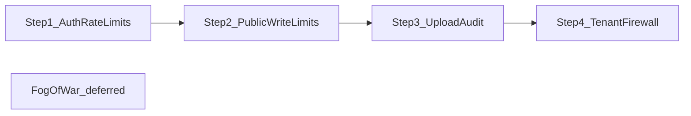

# Phase 9 — Security Hardening (4 Steps)

Phase 9 items from [todo.md](todo.md) lines 153–156, excluding **Fog of war** (line 157) for a later phase. Each step is independently shippable; recommended order matches abuse risk and dependency chain.



**Preferences confirmed:** in-memory rate limit store; remove unauthenticated static `/uploads` and route file access through ACL-backed endpoints.

**Scale context (sub-15 users):** This is a small self-hosted tabletop platform, not a public SaaS. Rate limits should be **guardrails against accidents and scripted abuse**, not tight production SaaS quotas. Defaults can be lenient; skip optional global API throttling entirely. Prioritize correctness fixes (upload bombs, IDOR holes, broken legacy links) over aggressive throttling.

**Gemini review ([phase9.txt](phase9.txt)):** Incorporated below where justified; deferred or scaled down where overkill for this userbase.

---

## Step 1 — Auth rate limits

**Goal:** Throttle credential abuse on login, register, and password change. No password-reset flow exists today; reserve a limiter for future routes.

### Implementation

1. **Add dependency:** `express-rate-limit` in [backend/package.json](backend/package.json).

2. **New module:** [backend/src/middleware/rateLimit.ts](backend/src/middleware/rateLimit.ts)
   - Shared factory with consistent `429` JSON body `{ error, retryAfterSeconds }` — **put the countdown in the JSON body**, not only the `Retry-After` header, so the frontend never depends on CORS-exposed headers (Gemini §1.3).
   - Also set standard `Retry-After` header; optionally add `Access-Control-Expose-Headers: Retry-After` in [backend/src/app.ts](backend/src/app.ts) CORS config as belt-and-suspenders.
   - Named limiters (lenient defaults for sub-15 users; overridable via env):
     - `authLoginLimiter` — ~20 req / 15 min per **IP+email** composite key
     - `authLoginEmailLimiter` — **secondary** ~30 req / hour keyed on **lowercase email only** (Gemini §1.1: closes distributed IP-rotation brute-force against a single account; cheap to add even at small scale)
     - `authRegisterLimiter` — ~10 req / hour per IP
     - `authPasswordChangeLimiter` — ~20 req / hour per user (key on `req.user.id` after auth)
     - `authPasswordResetLimiter` — stub export for future forgot/reset routes
   - In-memory store only (per your preference).
   - **Memory cap hygiene** (Gemini §1.2): use `express-rate-limit`'s built-in window expiry; document that keys auto-expire. If implementing a custom key store, cap entries (~10k) with LRU eviction so dictionary attacks cannot OOM a small VPS. At sub-15 users this is unlikely but costs little.

3. **Env knobs** in [backend/src/config/env.ts](backend/src/config/env.ts):
   - `RATE_LIMIT_LOGIN_MAX`, `RATE_LIMIT_LOGIN_WINDOW_MS`, etc.
   - `TRUST_PROXY` — set `app.set('trust proxy', 1)` in [backend/src/app.ts](backend/src/app.ts) when enabled so `req.ip` is correct behind reverse proxies.

4. **Wire routes:**
   - [backend/src/routes/auth.ts](backend/src/routes/auth.ts): `POST /login`, `POST /register`
   - [backend/src/routes/user.ts](backend/src/routes/user.ts): `POST /change-password`

### Tests

- New [backend/src/middleware/rateLimit.test.ts](backend/src/middleware/rateLimit.test.ts): unit-test key generation and that limiter returns 429 after threshold (mock req/res or supertest against a minimal Express app).

### Done when

- Repeated login/register/change-password attempts return `429` with `Retry-After`.
- Legitimate single-user flows unaffected under normal use.
- `npm test` passes with new test file added to the test script in `package.json`.

---

## Step 2 — Apply / public endpoint limits

**Goal:** Rate-limit high-risk writes beyond auth: LFG apply spam and other unauthenticated or broadly reachable endpoints.

### Scope

| Endpoint | Limiter key | Suggested default |
|----------|-------------|-------------------|
| `POST /api/campaigns/:id/apply` (3 route aliases) | per user + campaign | 5 / hour |
| `POST /api/campaigns/:id/apply` | per user global | 20 / hour |
| `POST /api/user/tokens` | per user | 10 / day |
| ~~Optional global `/api/*` baseline~~ | — | **Skip for sub-15 users** |

**Note:** LFG apply routes in [backend/src/routes/campaigns.ts](backend/src/routes/campaigns.ts) are auth-required (`requireAuth` on router), not anonymous — limits target logged-in spam, not public brute-force (covered in Step 1).

**Gemini §2.1 (global baseline vs map streaming):** A 300 req/min global limiter would false-positive during map panning, hover previews, and notification polling. **Do not ship a global API limiter** at this scale; route-scoped limits only.

**Gemini §2.2 (invite-token auto-join):** Invite auto-join runs through the same `applyToCampaign` handler ([backend/src/controllers/recruitmentController.ts](backend/src/controllers/recruitmentController.ts)) — apply limiters cover it. Explicitly verify in tests; no separate bypass route exists today.

### Implementation

1. Extend [backend/src/middleware/rateLimit.ts](backend/src/middleware/rateLimit.ts) with:
   - `applyToCampaignLimiter` — composite key: `userId:campaignId`
   - `applyGlobalLimiter` — key: `userId`
   - `apiTokenMintLimiter`
   - Optional `apiGlobalLimiter` mounted in [backend/src/app.ts](backend/src/app.ts) before route handlers (skip `/api/health`).

2. Apply on [backend/src/routes/campaigns.ts](backend/src/routes/campaigns.ts) apply routes (handler: [backend/src/controllers/recruitmentController.ts](backend/src/controllers/recruitmentController.ts) `applyToCampaign`).

3. Apply on [backend/src/routes/user.ts](backend/src/routes/user.ts) `POST /tokens`.

4. **Frontend:** Handle `429` gracefully in [frontend/src/lib/campaigns.ts](frontend/src/lib/campaigns.ts) apply flow and token creation — surface a user-friendly “try again later” message.

### Tests

- Integration-style test: apply limiter blocks N+1 requests for same user+campaign.
- Verify invite-token auto-join path is also limited (same handler).

### Done when

- Apply spam and token minting are throttled per user.
- Existing recruitment business rules (duplicate pending, seat caps) unchanged.

---

## Step 3 — Upload validation audit

**Goal:** Harden file type, size, and path handling across all upload surfaces; align wizard uploads with system limits.

### Current gaps (from audit)

| Surface | File | Issue |
|---------|------|-------|
| Campaign wizard | [backend/src/lib/multer.ts](backend/src/lib/multer.ts) `campaignWizardUpload` | No file filter; skips [backend/src/middleware/uploadLimit.ts](backend/src/middleware/uploadLimit.ts) |
| Session docs | `documentUpload` | Extension-only; no MIME check; `.doc` read as UTF-8 |
| Images | `imageUpload` | MIME+ext only; no magic-byte / re-encode validation |
| Paths | multer storage | UUID filenames (good); static `/uploads` exposure deferred to Step 4 |

### Implementation

1. **Centralize validation** in new [backend/src/lib/uploadValidation.ts](backend/src/lib/uploadValidation.ts):
   - `assertImageFile(buffer, mimetype, ext)` — verify magic bytes match allowed types; use `sharp` metadata read with **strict guards** (Gemini §3.1):
     - Enforce multer/system byte limit **before** calling `sharp` (never inspect an unbounded buffer).
     - Cap declared pixel dimensions (e.g. reject if width or height > 16k) to block decompression/pixel-flood bombs on a single-node instance.
     - Use `sharp` with `limitInputPixels` option where supported.
   - `assertDocumentFile(buffer, ext)` — reject empty files; for `.docx` verify ZIP signature; reject binary `.doc` with clear error directing users to `.docx`.
   - `assertZipFile(buffer)` — for wizard markdown/backup ZIPs (PK header check).
   - Reuse constants from [backend/src/types/domain.ts](backend/src/types/domain.ts).

2. **Multer hardening** in [backend/src/lib/multer.ts](backend/src/lib/multer.ts):
   - Add file filters to `campaignWizardUpload` (cover = image types; zips = `.zip`; calendar = `.json`).
   - Add MIME check to `documentFileFilter`.

3. **Route/controller enforcement:**
   - [backend/src/routes/campaigns.ts](backend/src/routes/campaigns.ts): add `enforceSystemUploadLimit` after wizard multer; validate each field in [backend/src/controllers/campaignsController.ts](backend/src/controllers/campaignsController.ts) `createCampaign`.
   - [backend/src/controllers/uploadsController.ts](backend/src/controllers/uploadsController.ts): post-multer image validation.
   - [backend/src/controllers/wikiController.ts](backend/src/controllers/wikiController.ts) `uploadSessionNotePage`: validate buffer before mammoth/UTF-8 parse.
   - [backend/src/controllers/userController.ts](backend/src/controllers/userController.ts) `uploadUserAvatar`: image validation.

4. **Frontend alignment (Gemini §3.2):** Update [frontend/src/pages/SessionNotesView.tsx](frontend/src/pages/SessionNotesView.tsx) to drop `.doc` from `accept` and add client-side extension check with a targeted message (“Convert to .docx before uploading”) so legacy Obsidian/Word users get guidance instead of a silent backend error loop.

5. **Audit logging (lightweight):** Log upload attempts (userId, campaignId, endpoint, originalName, bytes, outcome) to existing system log buffer or a structured console line — not a new DB table unless you want persistence later.

### Tests

- [backend/src/lib/uploadValidation.test.ts](backend/src/lib/uploadValidation.test.ts): magic-byte cases, fake extensions, oversize rejection, empty file rejection.

### Done when

- All four upload surfaces enforce consistent type + system size limits.
- Wizard uploads respect admin `maxUploadSizeMb` setting.
- `.doc` either properly rejected or documented as unsupported.

---

## Step 4 — Multi-tenant isolation firewall

**Goal:** Systematic audit + fixes so every campaign-scoped mutation/read-by-id enforces `campaignId` boundaries. Remove unauthenticated static file serving.

### Audit approach

**Phase A — Route matrix (document + grep)**

Enumerate handlers in [backend/src/routes/campaignScoped.ts](backend/src/routes/campaignScoped.ts), [backend/src/routes/campaigns.ts](backend/src/routes/campaigns.ts), [backend/src/routes/assets.ts](backend/src/routes/assets.ts). For each handler accepting resource IDs (`:pageId`, `:assetId`, `:eventId`, etc.), confirm:
- Scope middleware ran (`resolveCampaignScope` / `attachCampaignByIdParam`)
- Membership/role guard present
- Controller query includes `campaignId`

Output: [docs/security/tenant-isolation-audit.md](docs/security/tenant-isolation-audit.md) (findings checklist).

**Phase B — Query sweep + fixes**

Priority fixes identified in exploration:

1. **`togglePinnedPageShortcut`** ([backend/src/controllers/wikiController.ts](backend/src/controllers/wikiController.ts) ~L2731): verify `wikiPage.findFirst({ id: pageId, campaignId })` before creating `PageShortcut`.

2. **Mutation defense-in-depth (Gemini §4.1 — Prisma constraint):** Do **not** blindly change to `update({ where: { id, campaignId } })`. Prisma `.update()` / `.delete()` require a unique `where`; `{ id, campaignId }` only works if the schema has `@@unique([id, campaignId])`, which most models lack (`id` alone is `@id`).

   **Preferred pattern (no schema migration):**
   ```typescript
   const row = await prisma.model.findFirst({ where: { id, campaignId } });
   if (!row) { /* 404 */ }
   const updated = await prisma.model.update({ where: { id: row.id }, data });
   ```
   Optionally add `updateMany({ where: { id, campaignId } })` when the return value is not needed. Only add compound `@@unique` constraints via migration if a model truly needs atomic composite updates at scale.

3. **Expand scoped Prisma models** in [backend/src/lib/campaignPrisma.ts](backend/src/lib/campaignPrisma.ts) `CAMPAIGN_SCOPED_MODELS`: add `mapPin`, `calendarEvent`, `calendarEventCategory`, `sessionAttendance` (verify exact Prisma delegate names). Migrate 1–2 high-traffic controllers (e.g. `mapsController`, `calendarEventsController`) to `getCampaignPrisma(campaignId)` as pattern; document adoption for remaining controllers.

4. **Align `attachCampaignByIdParam`** ([backend/src/middleware/campaignScope.ts](backend/src/middleware/campaignScope.ts)): apply same `canAccessCampaign` gate as `resolveCampaignScope`, or require membership middleware on `/api/campaigns/:campaignId/*` write routes.

### Replace static `/uploads` with ACL-backed handler (Gemini §4.2)

**Do not** use bare `410 Gone` — imported Obsidian/Notion wiki HTML stores hardcoded `/uploads/<filename>` links; killing static serving without a fallback breaks every embedded image.

1. **Remove** `express.static('/uploads', ...)` from [backend/src/app.ts](backend/src/app.ts).

2. **Add** `GET /uploads/:filename` handler (new controller or extend [backend/src/controllers/assetsController.ts](backend/src/controllers/assetsController.ts)):
   - Resolve filename with `path.basename()` only (no path traversal).
   - Look up `Asset` where `url` ends with `/:filename` (or exact match on stored path).
   - Enforce same ACL as `GET /api/assets/:assetId` (membership / public campaign / map visibility rules).
   - Stream file from disk under `env.uploadsDir`.
   - If no Asset row (legacy avatar files): fall through to avatar lookup or 404.
   - This is **not** static serving — every request hits ACL logic.

3. **Browser cache policy (performance — Gemini cache regression):** Removing `express.static` drops its automatic `Cache-Control`, `ETag`, and `Last-Modified` behavior. Without explicit headers, browsers re-fetch full map/image payloads on every navigation — painful on media-heavy campaigns and a small SQLite node.

   **Remedy:** Centralize streaming response headers in a small helper (e.g. [backend/src/lib/assetStreamHeaders.ts](backend/src/lib/assetStreamHeaders.ts)):
   - `Cache-Control: private, max-age=86400` (24h, session-private — not `public`)
   - `Content-Type` from extension (existing logic)
   - Optional: `ETag` from file `mtime` + size (or asset `updatedAt`) and honor `If-None-Match` → `304 Not Modified` to cut bandwidth on repeat loads during long sessions

   **Apply to all ACL stream endpoints:**
   - `GET /api/assets/:assetId` — already sets `private, max-age=86400` in [backend/src/controllers/assetsController.ts](backend/src/controllers/assetsController.ts) (~L119); refactor to shared helper and add ETag support
   - New `GET /uploads/:filename` proxy
   - New `GET /api/users/:userId/avatar`

   Do **not** use `public` cache — assets are permission-gated. `private` lets the browser cache per-user without CDN/shared-cache leakage.

4. **Campaign assets (new code):** Prefer `/api/assets/:id` in frontend ([frontend/src/lib/maps.ts](frontend/src/lib/maps.ts) `assetUrl()` already does). No need to rewrite stored wiki HTML if the ACL proxy preserves `/uploads/:filename` URLs.

5. **User avatars (Gemini §4.3):** Add `GET /api/users/:userId/avatar` — stream from disk with same cache headers. **Strip historical `/uploads/` prefix** from `User.avatarUrl` before joining to `uploadsDir` to avoid double-prefix (`/uploads/uploads/...`). Update [frontend/src/components/ui/UserAvatar.tsx](frontend/src/components/ui/UserAvatar.tsx) to route avatar paths through this endpoint for new renders; ACL proxy covers legacy `` in any stored content.

6. **Extra testing time (Gemini summary):** Step 4 deserves the most QA — spot-check imported campaigns, wiki embeds, map tiles, and avatars after the swap. Verify in DevTools Network tab that repeat asset loads return `304` or `(disk cache)` / `from cache` after first fetch.

### IDOR regression tests

New [backend/src/lib/tenantIsolation.test.ts](backend/src/lib/tenantIsolation.test.ts) or integration test harness with two campaigns + two users:

| Scenario | Expected |
|----------|----------|
| User A + Campaign B slug URL | 403 |
| User A + Campaign A URL + Campaign B `pageId` | 404 |
| User A pins Campaign B `pageId` | 404 |
| User A fetches Campaign B asset via `/api/assets/:id` | 403 |
| Direct `GET /uploads/<filename>` for own-campaign asset | 200 (ACL proxy) |
| Direct `GET /uploads/<filename>` for other-campaign asset | 403 |

Use existing test patterns (`node --import tsx --test`); may need test DB fixtures or mocked Prisma for unit-level checks on the fixed handlers.

### Done when

- Audit doc lists all campaign-scoped routes with pass/fail status.
- Known IDOR holes fixed (shortcuts, composite where clauses).
- Unauthenticated static `/uploads` removed; legacy and new URLs served through ACL-backed proxy or `/api/assets/:id`.
- IDOR tests cover the critical cross-tenant scenarios.

---

## Cross-cutting notes

- **Sub-15 user tuning:** Env defaults should be generous (e.g. login 20/15min, apply 10/hour per campaign). Document in README that operators can tighten limits if they expose the instance publicly.
- **Changelog:** Add entries to [changelog.md](changelog.md) per step (not one mega-entry).
- **todo.md:** Check off items 153–156 as each step merges; leave line 157 (Fog of war) unchecked.
- **No Redis** unless you later run multiple backend instances — document that limitation in rate-limit middleware comments.
- **Phase 10.5** item “Scoped token validation audit” (todo line 178) remains separate; Step 4 may note API tokens are user-global as a known follow-up.

## Suggested PR sequence

1. `phase-9/1-auth-rate-limits`
2. `phase-9/2-public-write-limits`
3. `phase-9/3-upload-validation`
4. `phase-9/4-tenant-isolation`

Each PR should be reviewable in isolation; Steps 3 and 4 touch overlapping upload code but Step 3 focuses on validation while Step 4 focuses on access control and query scoping.
