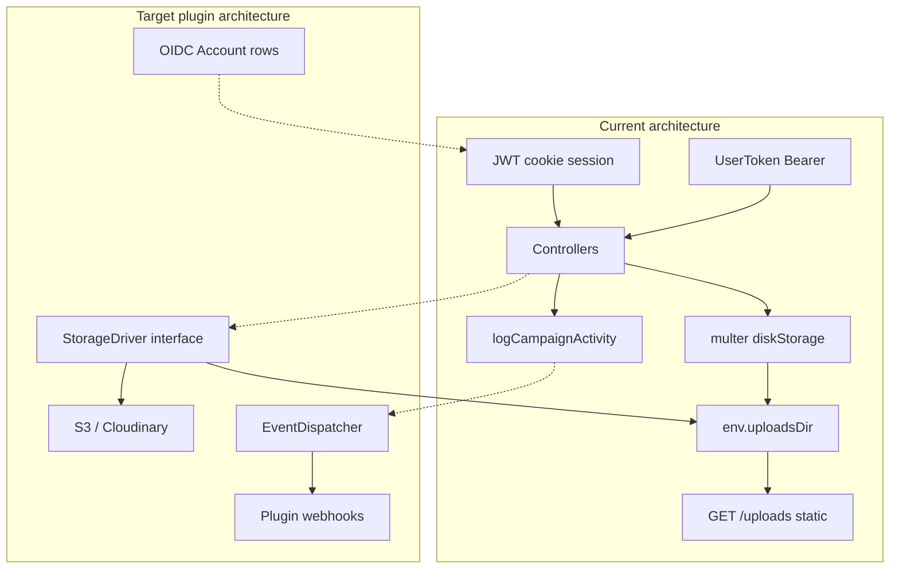
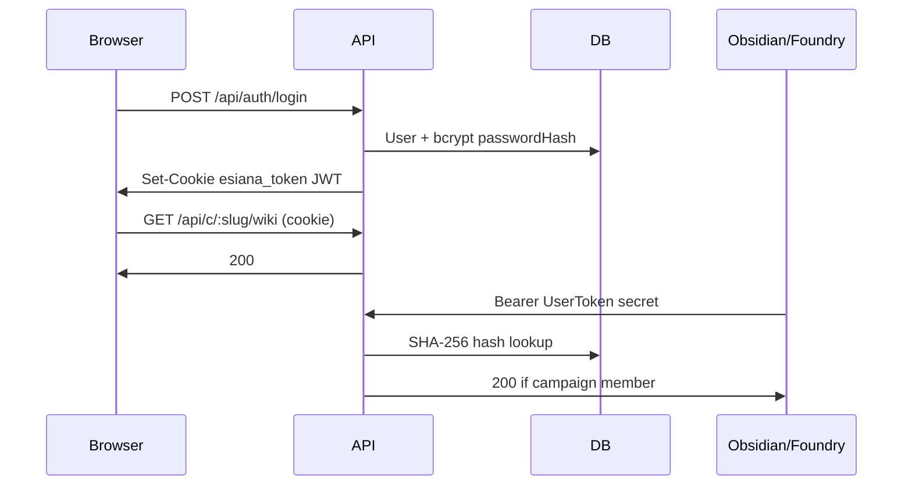
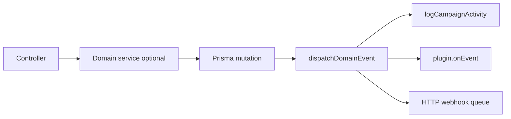

# Architectural Readiness Report — Plugin Ecosystem

## Executive summary


| Integration                     | Readiness  | Blocker severity                                                     |     |     |     |
| ------------------------------- | ---------- | -------------------------------------------------------------------- | --- | --- | --- |
|                                 |            |                                                                      |     |     |     |
|                                 |            |                                                                      |     |     |     |
| S3 / asset bucket               | Low        | High — Multer + `/uploads/` paths baked into controllers             |     |     |     |
| OIDC                            | Low        | High — `passwordHash` required; no `Account` linkage table           |     |     |     |
| API tokens (Obsidian / Foundry) | Medium     | Medium — `UserToken` exists; Bearer only on `/api/c/*`, not global   |     |     |     |
| Obsidian / Foundry sync         | Medium-Low | Medium — partial activity logging; no event pipeline or external IDs |     |     |     |
|                                 |            |                                                                      |     |     |     |


**Positive foundations:** `[UserToken](backend/prisma/schema.prisma)` + `[DeveloperApiKeysSection](frontend/src/components/settings/DeveloperApiKeysSection.tsx)`, `[authenticateApiOrSession](backend/src/middleware/auth.ts)` on campaign routes, `[logCampaignActivity](backend/src/lib/campaignActivity.ts)` as a near-ready hook choke point, and `[pluginManager.ts](backend/src/plugins/pluginManager.ts)` for runtime extension.




---

## 1. Storage Layer Abstraction Audit

### Current state

All persisted binary media (user avatars, campaign `Asset` rows) flow through the same local pipeline:


| Asset type          | Write path                                                                        | DB field          | Delete helper                                                |
| ------------------- | --------------------------------------------------------------------------------- | ----------------- | ------------------------------------------------------------ |
| User avatar         | `[uploadUserAvatar](backend/src/controllers/userController.ts)` via `imageUpload` | `User.avatarUrl`  | `[deleteUploadedFileFromUrl](backend/src/lib/assetFiles.ts)` |
| Campaign image      | `[uploadCampaignImage](backend/src/controllers/uploadsController.ts)`             | `Asset.url`       | `[deleteUploadedFile](backend/src/lib/assetFiles.ts)`        |
| Wiki inline images  | **No upload** — URL string in `blocks` JSON                                       | N/A               | N/A                                                          |
| Session note import | `[documentUpload](backend/src/lib/multer.ts)` memory → mammoth/text               | `WikiPage.blocks` | File not stored                                              |
| Dashboard hero      | URL in `dashboardConfig` JSON                                                     | N/A               | N/A                                                          |


**Coupling evidence:**

- Multer uses `diskStorage` writing directly to `[env.uploadsDir](backend/src/config/env.ts)` (default `../uploads`).
- URLs are hardcoded as `/uploads/${filename}` in controllers — not driver-relative keys.
- `[app.ts](backend/src/app.ts)` serves files via `express.static(env.uploadsDir)`.
- `[assetFiles.ts](backend/src/lib/assetFiles.ts)` assumes `path.join(env.uploadsDir, basename(url))` — breaks for `s3://` or CDN URLs.
- No `fs.writeFile` in app code; Multer owns disk I/O.

**Schema:** `[Asset](backend/prisma/schema.prisma)` stores opaque `url String` — good for swapping storage backends if URLs become absolute CDN URLs. `WikiPage.featuredImageId` exists but is **unused** in controllers.

### Blueprint: Abstract Storage Driver Interface

Introduce a small storage layer; controllers call the driver, never Multer paths or `assetFiles` directly.

```ts
// backend/src/storage/types.ts
export interface StoredObject {
  /** Public or signed URL stored in DB */
  publicUrl: string;
  /** Opaque key for delete/get (e.g. "avatars/uuid.webp" or local filename) */
  storageKey: string;
}

export interface StorageDriver {
  put(params: {
    buffer: Buffer;
    contentType: string;
    folder: 'avatars' | 'campaign-assets';
    originalName?: string;
  }): Promise<StoredObject>;

  delete(storageKey: string): Promise<void>;

  /** Optional: presigned PUT for direct browser upload (S3 later) */
  getUploadUrl?(params: { folder: string; contentType: string }): Promise<{ uploadUrl: string; publicUrl: string; storageKey: string }>;
}
```

**Implementations (phase 1 → 2):**


| Driver               | Env                                                                 | Behavior                                                         |
| -------------------- | ------------------------------------------------------------------- | ---------------------------------------------------------------- |
| `LocalStorageDriver` | `STORAGE_DRIVER=local` (default)                                    | Current behavior: write to `uploadsDir`, return `/uploads/<key>` |
| `S3StorageDriver`    | `STORAGE_DRIVER=s3`, `S3_BUCKET`, `S3_REGION`, `S3_PUBLIC_BASE_URL` | `PutObject` + store `https://cdn.../key` in DB                   |


**Factory:**

```ts
// backend/src/storage/index.ts
export function getStorageDriver(): StorageDriver {
  switch (process.env.STORAGE_DRIVER ?? 'local') {
    case 's3': return new S3StorageDriver(env.s3);
    default: return new LocalStorageDriver(env.uploadsDir);
  }
}
```

**Controller refactor (minimal surface):**

1. Replace Multer `diskStorage` with `memoryStorage` for images (already used for documents).
2. In `[uploadsController.ts](backend/src/controllers/uploadsController.ts)` and `[uploadUserAvatar](backend/src/controllers/userController.ts)`:
  - `const stored = await storage.put({ buffer: req.file.buffer, ... })`
  - Persist `stored.publicUrl` (and optionally `storageKey` on `Asset` if you add a column).
3. Replace `[deleteUploadedFile*](backend/src/lib/assetFiles.ts)` with `storage.delete(storageKey)` — derive key from URL via driver helper `parseKeyFromUrl(url)`.
4. Keep `express.static` only when `STORAGE_DRIVER=local`; for S3, drop static middleware (CDN serves files).

**Schema tweak (recommended this sprint):**

```prisma
model Asset {
  // ...
  url        String  // public URL (local /uploads/* or https://...)
  storageKey String? // driver-internal key; required for non-local deletes
}
```

Same optional `storageKey` on `User` if avatars move to S3 — or store full URL only and parse in driver.

**Files to decouple (rigid today):**

- `[backend/src/lib/multer.ts](backend/src/lib/multer.ts)` — disk destination/filename logic
- `[backend/src/controllers/uploadsController.ts](backend/src/controllers/uploadsController.ts)` — `/uploads/` string
- `[backend/src/controllers/userController.ts](backend/src/controllers/userController.ts)` — avatar path + delete
- `[backend/src/lib/assetFiles.ts](backend/src/lib/assetFiles.ts)` — local path assumptions
- `[backend/src/controllers/campaignsController.ts](backend/src/controllers/campaignsController.ts)` — `deleteCampaignAssetFiles` on campaign delete

---

## 2. API and Authentication Future-Proofing

### Current auth model




| Mechanism | Implementation                                                               | Scope                                                        |
| --------- | ---------------------------------------------------------------------------- | ------------------------------------------------------------ |
| Session   | JWT in HTTP-only cookie (`esiana_token`)                                     | `[requireAuth](backend/src/middleware/auth.ts)`              |
| API token | `UserToken.tokenHash` (SHA-256), 30/90/365d TTL                              | `[authenticateApiOrSession](backend/src/middleware/auth.ts)` |
| Password  | **Required** `passwordHash String` on `[User](backend/prisma/schema.prisma)` | Register/login in `[auth.ts](backend/src/routes/auth.ts)`    |


### Password enforcement at DB level

**Yes.** `passwordHash` is non-nullable. Federated-only OIDC users cannot be created without schema migration.

**OIDC-ready schema (additive migration):**

```prisma
model User {
  id           String   @id @default(cuid())
  email        String   @unique
  passwordHash String?  // null = OIDC-only; app enforces "password OR linked Account"
  emailVerified DateTime?
  // ... existing fields
  accounts     Account[]
}

model Account {
  id                String @id @default(cuid())
  userId            String
  provider          String // "google" | "keycloak" | "authentik" | ...
  providerAccountId String // OIDC `sub`
  accessToken       String?
  refreshToken      String?
  expiresAt         DateTime?

  user User @relation(fields: [userId], references: [id], onDelete: Cascade)

  @@unique([provider, providerAccountId])
  @@index([userId])
}
```

**Application rules (not DB):**

- Local register: set `passwordHash`, no `Account` row.
- OIDC callback: upsert `Account` by `(provider, providerAccountId)`; create `User` with `passwordHash: null` if new; issue same JWT cookie via `signAuthToken`.
- Login with password: reject if `passwordHash` is null (direct user to OIDC).
- Account linking: authenticated user connects provider → new `Account` row.

**Routes to add later:** `GET /api/auth/oidc/:provider`, `GET /api/auth/oidc/:provider/callback` (use `openid-client` or Passport). No OIDC code exists today.

### API tokens for headless clients

**Already implemented:**

- Table: `[UserToken](backend/prisma/schema.prisma)` (`name`, `tokenHash`, `expiresAt`)
- CRUD: `[userTokensController.ts](backend/src/controllers/userTokensController.ts)` at `GET|POST /api/user/tokens`, `DELETE /api/user/tokens/:id` (cookie-only via `[user.ts](backend/src/routes/user.ts)` `requireAuth`)
- UI: `[DeveloperApiKeysSection.tsx](frontend/src/components/settings/DeveloperApiKeysSection.tsx)`

**Gaps for Obsidian / Foundry:**


| Gap                                                                   | Recommendation                                                                                                                            |
| --------------------------------------------------------------------- | ----------------------------------------------------------------------------------------------------------------------------------------- |
| Bearer ignored on `/api/user/`*, `/api/campaigns/*`, `/api/plugins/*` | Unify: `requireAuth` → `authenticateApiOrSession` everywhere, or extract `resolveUser(req)` used by both                                  |
| Campaign membership still required on `/api/c/*`                      | Correct for security; document that tokens act as the user, not campaign-scoped keys                                                      |
| Max TTL 365 days                                                      | Add optional `durationDays: null` = non-expiring (or 10-year) for desktop sync; store `lastUsedAt`                                        |
| No scopes                                                             | Add optional `scopes String?` (JSON string): `wiki:read`, `wiki:write`, `calendar:write` — enforce in middleware                          |
| SHA-256 only                                                          | Acceptable for high-entropy secrets; optional pepper via `API_TOKEN_PEPPER` env                                                           |
| Frontend `AuthContext.token` unused                                   | `[PluginsTab](frontend/src)` / campaign settings using `Bearer ${token}` may fail — fix to cookie-only `apiFetch` or set token after mint |


**Suggested `UserToken` enhancements (sprint-safe):**

```prisma
model UserToken {
  // existing fields...
  lastUsedAt DateTime?
  scopes     String?   // JSON array, default '["*"]'
}
```

Update `[authenticateApiOrSession](backend/src/middleware/auth.ts)` to touch `lastUsedAt` on successful Bearer auth (fire-and-forget).

### Desktop client auth flow (target)

1. User mints token in profile → copies `secret` once.
2. Obsidian/Foundry plugin stores secret in OS keychain.
3. All API calls: `Authorization: Bearer <secret>` to `/api/c/:campaignSlug/...`.
4. Optional future: campaign-specific webhook signing secret in `CampaignPluginConfig` table (separate from user token).

---

## 3. Sync and Hook Hook-Points

### Where mutations happen today

**Wiki / characters** (`[wikiController.ts](backend/src/controllers/wikiController.ts)`) — characters are `WikiPage` under the "Characters" folder, same endpoints:


| Event                       | Handler                                                                                             | Activity logged? |
| --------------------------- | --------------------------------------------------------------------------------------------------- | ---------------- |
| Create page                 | `createWikiPage`                                                                                    | Yes              |
| Update layout/blocks        | `updateWikiPageLayout`                                                                              | Yes              |
| Metadata / visibility       | `updateWikiPageMetadata`, `updateWikiPageVisibility`                                                | Yes              |
| Session notes CRUD          | `updateSessionNotePage`, `deleteSessionNotePage`, `bulkDeleteSessionNotes`, `uploadSessionNotePage` | Yes              |
| Notebook arc CRUD           | `createNotebookArc`, `updateNotebookArc`, `deleteNotebookArc`                                       | **No**           |
| Bulk move / assign notebook | `bulkMoveWikiPages`, `assignWikiPageNotebookArc`                                                    | **No**           |
| New session timeline        | `createNewSessionTimeline`                                                                          | **No**           |
| General wiki delete         | **Not exposed**                                                                                     | —                |


**Calendar / time** (`[campaignsController.ts](backend/src/controllers/campaignsController.ts)`, `[fantasyCalendarController.ts](backend/src/controllers/fantasyCalendarController.ts)`, `[calendarEventsController.ts](backend/src/controllers/calendarEventsController.ts)`):


| Event                 | Handler                               | Activity logged?      |
| --------------------- | ------------------------------------- | --------------------- |
| Advance time          | `advanceCampaignTime`                 | Yes (`TIME_TRACKING`) |
| Import calendar JSON  | `importCalendarFromJson`              | **No**                |
| Fantasy calendar CRUD | `create/update/deleteFantasyCalendar` | **No**                |
| Calendar event CRUD   | `create/update/deleteCalendarEvent`   | **No**                |


**Assets:** `[uploadsController.ts](backend/src/controllers/uploadsController.ts)` — no activity/event logging.

### Existing hook-adjacent pattern

`[logCampaignActivity](backend/src/lib/campaignActivity.ts)` already runs fire-and-forget via `queueMicrotask` and swallows errors — ideal pattern for a non-blocking dispatcher:

```21:48:backend/src/lib/campaignActivity.ts
export function logCampaignActivity(input: { ... }): void {
  queueMicrotask(() => {
    (prisma as any).campaignActivity.create({ ... }).catch(() => {});
  });
}
```

**Plugins today:** `[LoadedPlugin](backend/src/plugins/pluginManager.ts)` only exposes `register(app)` — no `onDomainEvent`. `[InstalledPlugin](backend/prisma/schema.prisma)` tracks enablement, not per-campaign config or webhook URLs.

### Recommended Event Dispatcher

```ts
// backend/src/events/types.ts
export type DomainEvent = {
  id: string;           // cuid, for idempotency
  campaignId: string;
  userId?: string;
  action: 'CREATE' | 'UPDATE' | 'DELETE';
  entityType: string;   // align with CampaignActivityEntityType + CALENDAR_EVENT, ASSET
  entityId: string;
  entityName?: string;
  payload?: Record<string, unknown>;
  occurredAt: string;
};

// backend/src/events/dispatcher.ts
export function dispatchDomainEvent(event: DomainEvent): void {
  queueMicrotask(async () => {
    await deliverToRegisteredPlugins(event);
    await deliverToCampaignWebhooks(event); // future: Foundry
    // keep logCampaignActivity call inside or parallel
  });
}
```

**Injection strategy (tiered):**




| Tier                                              | Effort | Coverage                           |
| ------------------------------------------------- | ------ | ---------------------------------- |
| **1 — Extend `logCampaignActivity`**              | Low    | Wiki + time advance only (partial) |
| **2 — `dispatchDomainEvent` in every controller** | Medium | Full coverage                      |
| **3 — Thin `wikiService` / `calendarService`**    | Higher | Cleanest long-term                 |


**Recommended sprint action:** Tier 1.5 — add `dispatchDomainEvent` beside `logCampaignActivity` in `[wikiPageActivity.ts](backend/src/lib/wikiPageActivity.ts)` and `campaignActivity.ts`, then add missing `log`* calls for calendar/notebook mutations.

### Obsidian-specific considerations

- Content lives in `WikiPage.blocks` JSON, not flat `.md` files. Obsidian sync needs a **block → markdown** serializer (partial exists: `extractSessionNoteMarkdown` in wikiController).
- Add optional sync metadata on `WikiPage`:

```prisma
  externalPath     String?  // vault-relative path
  externalRevision String?  // hash/etag for conflict detection
  lastSyncedAt     DateTime?
```

- Bidirectional pull: new `POST /api/c/:slug/sync/obsidian` authenticated by Bearer — out of scope for sprint, but schema fields prevent rewrite.

### Foundry-specific considerations

- Real-time: dispatcher should enqueue outbound HTTP to user-configured webhook URL (per campaign plugin config), not block request.
- Inbound: Foundry → `POST /api/c/:slug/webhooks/foundry` with HMAC signature verification (new middleware).
- Extend `[LoadedPlugin](backend/src/plugins/pluginManager.ts)`:

```ts
export interface LoadedPlugin {
  register?: (app: Express) => void;
  onDomainEvent?: (event: DomainEvent) => void | Promise<void>;
}
```

---

## 4. Actionable Refactoring Checklist (current sprint)

Priority order — structural only, no full plugin implementation.

### P0 — Do now (blocks future plugins)

1. **Introduce `StorageDriver` + `LocalStorageDriver`** — refactor `[uploadsController.ts](backend/src/controllers/uploadsController.ts)` and `[uploadUserAvatar](backend/src/controllers/userController.ts)` to use `memoryStorage` + driver; keep default behavior identical.
2. **Add `STORAGE_DRIVER` to `[env.ts](backend/src/config/env.ts)` and `.env.example`** — stub S3 driver interface (throw "not configured") so env switch is real.
3. **Unify auth middleware** — replace `requireAuth` with `authenticateApiOrSession` on `[user.ts](backend/src/routes/user.ts)` routes that desktop clients need (at minimum token CRUD is cookie-only, which is fine; campaign + wiki routes must accept Bearer).
4. **Add `dispatchDomainEvent` stub** — call from `[logCampaignActivity](backend/src/lib/campaignActivity.ts)` / `[logWikiPageActivity](backend/src/lib/wikiPageActivity.ts)`; no-op implementation that logs in dev.
5. **Extend activity logging** to unlogged mutations: calendar events, fantasy calendars, `importCalendarFromJson`, notebook arc handlers in `[wikiController.ts](backend/src/controllers/wikiController.ts)`.

### P1 — High value, low risk

1. **Optional `passwordHash` + `Account` model** in Prisma (migration only; keep register/login unchanged until OIDC sprint).
2. `**UserToken.lastUsedAt`** + update on Bearer auth success.
3. `**Asset.storageKey**` column + populate from local driver.
4. **Fix frontend Bearer mismatch** — remove dead `Bearer ${token}` from plugin/campaign settings; use `credentials: 'include'` consistently (`[api.ts](frontend/src/lib/api.ts)`).
5. **Document API token usage** in Developer settings UI (example `curl` to `/api/c/:slug/wiki/tree`).

### P2 — Before implementing sync plugins

1. `**WikiPage` external sync fields** (`externalPath`, `externalRevision`, `lastSyncedAt`).
2. `**CampaignPluginConfig` table** — `{ campaignId, pluginName, config Json, webhookUrl?, webhookSecret? }`.
3. **Extract `blocksToMarkdown(page)` utility** in `backend/src/lib/wikiMarkdown.ts` for Obsidian export.
4. **General wiki delete endpoint** — needed for sync DELETE propagation.
5. **Extend `LoadedPlugin.onDomainEvent`** in plugin manager.

### Files most rigidly coupled (avoid editing logic here without abstraction)


| File                                                                   | Coupling                                 |
| ---------------------------------------------------------------------- | ---------------------------------------- |
| `[multer.ts](backend/src/lib/multer.ts)`                               | Disk paths, filename generation          |
| `[assetFiles.ts](backend/src/lib/assetFiles.ts)`                       | Local filesystem only                    |
| `[uploadsController.ts](backend/src/controllers/uploadsController.ts)` | `/uploads/` URL convention               |
| `[userController.ts](backend/src/controllers/userController.ts)`       | Avatar upload + `/uploads/` validation   |
| `[auth.ts` routes](backend/src/routes/auth.ts)                         | Password-only registration               |
| `[schema.prisma](backend/prisma/schema.prisma)`                        | Required `passwordHash`                  |
| `[campaignActivity.ts](backend/src/lib/campaignActivity.ts)`           | Internal audit only — extend, don't fork |
| `[pluginManager.ts](backend/src/plugins/pluginManager.ts)`             | Route registration only                  |


### What you can defer

- Full S3 driver implementation (interface + local driver is enough)
- OIDC routes and IdP configuration
- Obsidian vault watcher / Foundry socket bridge
- Webhook delivery queue (Redis/Bull) — start with in-process `fetch` + retry in dispatcher

---

## Risk summary

- **Storage:** Without `StorageDriver`, every S3 migration touches Multer, static middleware, delete helpers, and status/file-size endpoints that scan disk (`[getCampaignStatus](backend/src/controllers/campaignsController.ts)`).
- **OIDC:** Required `passwordHash` forces dummy passwords or blocks Google-only users until migrated.
- **Sync:** Partial activity logging means a Foundry plugin listening only to `CampaignActivity` would miss calendar and notebook changes; dispatcher must cover all mutation paths.
- **API tokens:** Desktop clients already work for campaign wiki routes if the user is a member — expanding Bearer to all routes is the main auth gap.

