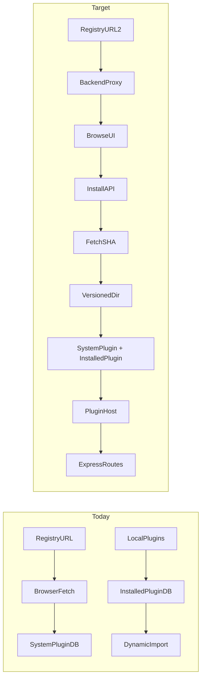
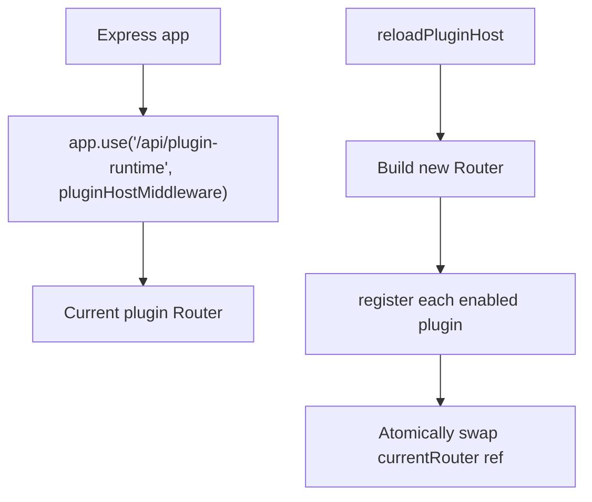

# Plugin Registry Activation (v0.8.0)

## Current state

Esiana has **two disconnected plugin tracks**:

| Track | Storage | What works today |
|-------|---------|------------------|
| **Runtime** | `InstalledPlugin` + files under [`plugins/`](plugins/) | [`pluginManager.ts`](backend/src/plugins/pluginManager.ts) scans disk, dynamic `import()` of `backendEntry` |
| **Admin metadata** | `SystemPlugin` + manifest in config JSON | [`AdminPluginsTab.tsx`](frontend/src/components/admin/AdminPluginsTab.tsx) syncs registry in-browser, registers metadata only |

Registry sync fails in practice because the default URL is a GitHub **HTML** page, not raw JSON, and browser `fetch` hits CORS. Install from registry never downloads code or creates `InstalledPlugin` rows.



---

## Scope for this milestone (user choice: full remote install)

### In scope

1. **Repo-hosted dev registry** — add [`plugins/registry.json`](plugins/registry.json) (fake/sample catalog) referencing pinned SHAs and raw manifest URLs in this repo.
2. **Backend registry proxy** — `GET /api/admin/plugins/registry` reads stored `pluginRegistryUrl` server-side (reuse [`fetchPluginManifest.ts`](backend/src/lib/fetchPluginManifest.ts) size/HTTP guards).
3. **Extended registry/manifest schema** — optional fields, backward compatible with today’s inline full manifests:
   - `category`: `theme | widget | integration | wiki | lfg | utility` (optional, validated if present)
   - `manifestUrl`: lightweight index entries; server fetches full manifest on install
   - `source`: `{ type: "github", repo: "org/repo", commitSha: "<40-char hex>", path: "plugins/foo" }` — **commit SHA required; reject branch/tag names**
4. **SHA-pinned remote install pipeline** — new `POST /api/admin/plugins/install-from-registry` (or extend install-from-link):
   - Validate manifest + global scope
   - Download `https://github.com/{repo}/archive/{commitSha}.tar.gz`, extract to `{pluginsDir}/{pluginId}/{commitSha}/`
   - Verify extracted folder contains `manifest.json` + declared entries
   - Upsert `SystemPlugin` (config/metadata) **and** `InstalledPlugin` (runtime paths relative to versioned dir)
   - Trigger PluginHost reload (see below)
5. **Admin UI enhancements** in [`AdminPluginsTab.tsx`](frontend/src/components/admin/AdminPluginsTab.tsx):
   - Sync via backend proxy (not browser fetch)
   - Category filter chips + badge on discovery cards
   - Install shows progress/errors; post-install reflects both metadata and runtime status
6. **Default registry URL fix** — change [`DEFAULT_PLUGIN_REGISTRY_URL`](backend/src/lib/pluginManifest.ts) to a **raw** URL pointing at this repo’s `plugins/registry.json` for dev; keep official community URL as documented override.

### Explicitly deferred (Phase 10 / 10.5 — design hooks only)

| Phase 10 item | Relationship to this work |
|---------------|---------------------------|
| **Automatic Settings Generation** (`config-schema.json`) | Keep existing `configTemplate` + [`PluginConfigForm`](frontend/src/components/admin/PluginConfigForm.tsx). Add optional `configSchemaUrl` field to manifest meta as a **stub**; parser/UI auto-render is a separate todo. |
| **UI Slot System** | Record `frontendEntry` in `InstalledPlugin`; loading into React slots stays Phase 10 (`pluginRegistry.ts` stub). |
| **Plugin Resource Guardrails** (vm/worker) | Remote code runs in-process for v0.8.0; add size limits + route firewall first; sandbox is follow-up. |
| **Core storage layer** | Package download uses local FS under `pluginsDir`; S3 driver not required yet. |
| **Domain event dispatcher / interceptor hooks** | No changes; plugins can subscribe later via `extendRoutes` hook surface. |
| **Dynamic CSP** | Note in docs: enabling remote frontend plugins will need CSP updates later. |

**Minimum Phase 10.5 guardrail in this milestone:** route namespace firewall in PluginHost — block registrations under `/api/admin`, `/api/auth`, etc.

---

## SHA pinning (not branches)

**Registry entries must pin immutable refs:**

```json
{
  "registryVersion": "1",
  "plugins": [
    {
      "id": "example-plugin",
      "name": "Example Plugin",
      "version": "1.0.0",
      "description": "Reference global plugin with runtime routes.",
      "scope": "global",
      "category": "utility",
      "manifestUrl": "https://raw.githubusercontent.com/<org>/esiana/<commitSha>/plugins/example-plugin/manifest.json",
      "source": {
        "type": "github",
        "repo": "<org>/esiana",
        "commitSha": "<full-40-char-sha>",
        "path": "plugins/example-plugin"
      }
    }
  ]
}
```

Add 2–3 **stub entries** (other categories, campaign scope) with fake SHAs for browse/filter UX; mark `installable: false` or omit `source` so install attempts fail gracefully with a clear message.

**Validation rules** (shared backend + frontend [`pluginManifest.ts`](backend/src/lib/pluginManifest.ts)):

- `commitSha` must match `/^[0-9a-f]{40}$/i`
- Reject `ref`, `branch`, `tag` fields if they look like branch names (or disallow them entirely)
- On install, re-fetch manifest from `manifestUrl` and confirm `id`/`version` match registry entry (TOCTOU guard)

**Schema migration:** extend `InstalledPlugin` in [`schema.prisma`](backend/prisma/schema.prisma):

```prisma
commitSha     String  @default("")
sourceRepo    String  @default("")
installPath   String  @default("")  // e.g. example-plugin/abc123...
```

Store `category` inside `SystemPlugin.config.__manifest` alongside existing meta in [`systemPlugins.ts`](backend/src/lib/systemPlugins.ts).

---

## Hot reload: Node import cache + Express routes

**Problems today:**

- [`loadEnabledPlugins`](backend/src/plugins/pluginManager.ts) clears an in-memory map but **never removes** routes already mounted on `app`
- Node caches `import()` by resolved path — re-enabling same path serves stale module
- [`PATCH /api/plugins/:name/enable`](backend/src/routes/plugins.ts) calls `loadEnabledPlugins(app)` but new installs from admin bypass this entirely

**Recommended architecture: PluginHost sub-router**



1. Mount once at startup: `app.use('/api/plugin-runtime', (req,res,next) => currentPluginRouter(req,res,next))`
2. Plugins receive a **scoped** `Router` (or `app` limited to `/api/plugin-runtime/:pluginId`) in `register(router)` — document migration for [`example-plugin`](plugins/example-plugin/backend/index.js)
3. **Versioned paths** bust import cache: import from `{pluginsDir}/{id}/{commitSha}/{backendEntry}` — each install SHA is a new filesystem path
4. `reloadPluginHost(app)`:
   - Build fresh `express.Router()`
   - Import + register all enabled `InstalledPlugin` rows (parallel with error isolation per plugin)
   - Swap `currentPluginRouter` reference (in-flight requests finish on old router; new requests hit new stack)
5. Call `reloadPluginHost` after: remote install, enable/disable toggle, and startup
6. **Fallback:** expose admin-only `POST /api/admin/plugins/reload-runtime` and document that production may prefer rolling restart for major upgrades (Docker Phase 11)

**Disable/unload:** set `isEnabled=false`, reload host (empty registration for that plugin). No manual stack surgery on root `app`.

---

## Backend modules to add/change

| File | Change |
|------|--------|
| [`backend/src/lib/pluginManifest.ts`](backend/src/lib/pluginManifest.ts) | `PluginCategory`, `PluginSource`, `PluginRegistryEntry`, extend `parsePluginRegistryIndex`, SHA validation |
| **New** `backend/src/lib/fetchPluginRegistry.ts` | Fetch + parse registry index (mirror manifest fetch guards) |
| **New** `backend/src/lib/pluginInstaller.ts` | GitHub tarball download/extract, manifest verify, DB upsert, call reload |
| [`backend/src/plugins/pluginManager.ts`](backend/src/plugins/pluginManager.ts) | Versioned paths, PluginHost, `reloadPluginHost`, deprecate direct `app` registration |
| [`backend/src/controllers/adminSystemPluginsController.ts`](backend/src/controllers/adminSystemPluginsController.ts) | `fetchAdminPluginRegistry`, `installAdminPluginFromRegistry` |
| [`backend/src/routes/admin.ts`](backend/src/routes/admin.ts) | Wire new routes |
| [`frontend/src/lib/pluginManifest.ts`](frontend/src/lib/pluginManifest.ts) | Mirror types + category labels for UI |
| [`frontend/src/lib/adminPlugins.ts`](frontend/src/lib/adminPlugins.ts) | `fetchPluginRegistry()`, `installPluginFromRegistry(entry)` |
| [`frontend/src/components/admin/AdminPluginsTab.tsx`](frontend/src/components/admin/AdminPluginsTab.tsx) | Proxy sync, categories, install flow |
| [`plugins/README.md`](plugins/README.md) | Document registry format, SHA policy, PluginHost route prefix |

**Dependencies:** add a tarball extract library (e.g. `tar` + native streams, or `decompress`) in backend — verify license/size before merge.

---

## Unified install flow (admin)

1. Admin sets registry URL → **Sync** → `GET /api/admin/plugins/registry`
2. UI lists entries (filter by category, hide already-installed IDs)
3. **Install** → `POST /api/admin/plugins/install-from-registry` with `{ id }` or full registry entry
4. Server: resolve entry → fetch manifest if needed → download SHA tarball → extract → dual DB write → `reloadPluginHost`
5. UI refreshes installed list; admin can configure via existing `PluginConfigForm` and toggle enable (calls existing config endpoint + runtime reload)

Bridge **SystemPlugin.isEnabled** with **InstalledPlugin.isEnabled** on save so admin toggle actually activates routes.

---

## Testing

- Unit tests for: SHA validation, registry index parsing (inline + `manifestUrl` entries), category enum, commitSha rejection of branch-like refs
- Integration test (mock fetch): install extracts to versioned dir, `InstalledPlugin` row created, reload invoked
- Manual: point registry URL at raw GitHub URL for [`plugins/registry.json`](plugins/registry.json), install `example-plugin`, hit its hello route without process restart

---

## Out of scope / follow-up tickets

- Campaign registry browse in [`CampaignPluginsSettingsTab.tsx`](frontend/src/components/campaign/CampaignPluginsSettingsTab.tsx) (mirror admin pattern)
- `config-schema.json` auto-render (Phase 10 todo — keep `configTemplate` for now)
- Frontend plugin slot loading + Dynamic CSP
- Worker/vm sandbox for plugin code
- Signature/trust verification of registry publisher
