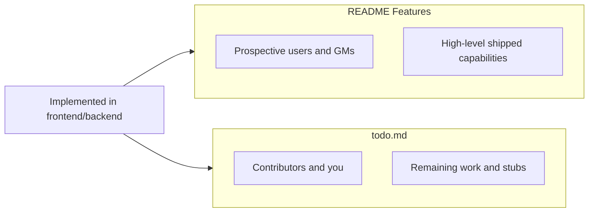

# README Features & todo.md recommendations

## Current state

- [`README.md`](README.md) lines 10–12: **Features is empty** despite a large implemented surface (wiki, sessions, chronology, hub/LFG, admin, plugins, etc.).
- [`todo.md`](todo.md) reads like a greenfield roadmap, but several Phase 1–4 items are **already partially or fully built** in code.
- Minor inconsistency: README claims **v0.7.0**; root [`package.json`](package.json) is **0.1.0** — worth aligning when you edit docs.

---

## README.md — add under **Features**

**Recommendation: Yes.** Use a short, scannable bullet list (roughly 12–18 bullets). Group by theme; do not duplicate the full Quick start / Plugins / Database sections.

Suggested structure:

### Campaign hub & discovery
- Multi-campaign **global hub** with create/join flows
- **Public campaign directory** and slug-based URLs (`/c/:campaignSlug`)
- **Looking-for-group (LFG)** listings and player applications
- Campaign metadata: **game system**, language, visibility, archive

### Wiki & lore
- **Hierarchical wiki** (category folders + nested pages via `parentId`)
- **Block-based pages**: rich text, images, infoboxes, stat blocks, layout grids
- **Visibility levels**: Public / Party / DM-only
- **Bookmarks**, category index pages, **backlinks**
- Dedicated **character** routes

### Sessions & notes
- **Session timeline** and per-session notes
- **Notebook arcs**, player/session/tag views
- **Compile session notes** to markdown; document upload

### Time & chronology
- **Custom fantasy calendars** (months, moons, leap days, advance time)
- **Chronology hub** (calendar + timeline in one place)
- JSON calendar import

### Campaign UX
- **Configurable dashboard** (widgets: clocks, announcements, quest ledger, activity, etc.)
- **Recent changes / activity feed**
- **Template Studio** and per-folder page templates
- Customizable **campaign sidebar**

### Platform & admin
- Email/password auth, profiles, **developer API tokens**
- **Self-hosted** with SQLite or PostgreSQL
- **Runtime plugins** (instance + per-campaign settings)
- **System admin console**: branding, maintenance mode, users, backups, usage analytics

**Explicitly omit from Features** (keep in `todo.md` as future): Obsidian/Notion import, interactive map canvas, live SMTP, remote plugin manifest, OpenAPI docs. `MapPin` exists in [`backend/prisma/schema.prisma`](backend/prisma/schema.prisma) but has no API/UI yet — do not list as shipped.

Optional one-liner under the list pointing to [`todo.md`](todo.md) for the roadmap (you already link it at the bottom; a single cross-reference under Features is enough).

---

## todo.md — what to add or change

**Recommendation: Restructure, not only append.** The biggest gap is **accuracy**: contributors may re-implement work that already exists.

### Add a “Shipped in alpha” section (top or after intro)

Check off or move completed work so phases focus on gaps:

| todo.md item | Status in codebase |
|--------------|-------------------|
| Phase 1: `gameSystem` metadata | **Done** — on `Campaign`, settings UI |
| Phase 1: Public recruitment / LFG hub | **Partial** — hub, `CampaignLFGCard`, `RecruitmentSettingsTab`, join-request APIs |
| Phase 1: Data ingestion (Obsidian/Notion) | **Not started** |
| Phase 1: Multi-step campaign wizard | **Not started** |
| Phase 2: `parentId` / wiki tree | **Done** — schema + `/wiki/tree`, create flows |
| Phase 2: Breadcrumbs for nested locations | **Verify/polish** — tree exists; dedicated breadcrumb UX may still be thin |
| Phase 2: Entity templates | **Partial** — Template Studio + layout editor exist; “default NPC/Location/Item” presets may still be missing |
| Phase 3: Map canvas & pins | **Not started** (schema stub only) |
| Phase 4: Chronicle / timeline expansion | **Partial** — [`ChronologyPage.tsx`](frontend/src/pages/ChronologyPage.tsx) exists; “dedicated Chronicle Canvas” may mean more UI |
| Phase 4: Public recruitment landing | **Partial** — overlaps Phase 1 LFG |
| Phase 5: SMTP wiring | **Still valid** — form UI exists, live send TBD |
| Phase 5: Remote plugin manifest | **Still valid** — local `/plugins` load works |
| Phase 6: Testing & OpenAPI | **Still valid** |

### Refine phase wording (examples)

- **Phase 1:** Split into “Campaign wizard & import parsers” (remaining) vs move LFG/`gameSystem` to shipped or a “Polish recruitment hub” sub-phase.
- **Phase 2:** Retitle to focus on **breadcrumbs UX**, **default entity templates**, and any missing tree UI — not “add parentId schema.”
- **Phase 4:** Clarify delta: what ChronologyPage lacks vs the envisioned “Chronicle Canvas” (full-screen timeline editor? event linking?).

### Consider adding missing roadmap items (not in todo today)

Only if you want the tracker to reflect real backlog, not marketing copy:

- **Wiki / session polish:** backlinks UX, compile edge cases, mobile layout
- **Notifications** model in schema with no backend routes yet
- **Version alignment** (README vs `package.json` vs git tags)
- **Security hardening:** rate limits on auth/apply endpoints, upload validation audit
- **Docs:** contributor setup beyond Quick start (env vars, admin bootstrap)

Keep README Features **user-facing**; put engineering polish in `todo.md`.

---

## Suggested edit scope (when you approve implementation)

1. **[`README.md`](README.md):** Fill **Features** with grouped bullets (~15 lines); optionally fix version string to match a single source of truth.
2. **[`todo.md`](todo.md):** Add **Shipped in alpha (v0.7)** checklist; rewrite Phases 1–4 bullets to reflect partial completion; leave Phases 5–6 largely as-is; add optional backlog bullets above if desired.

No code changes required — documentation only.
