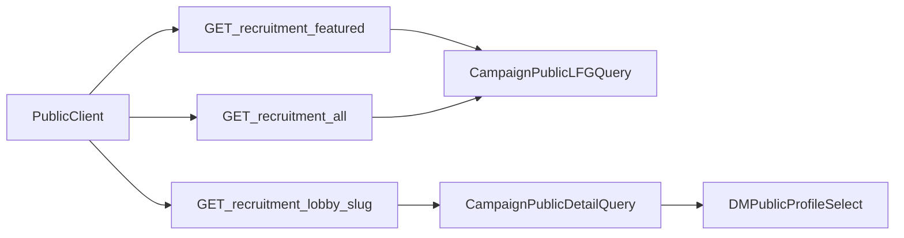

# Recruitment Marketplace Revamp Plan

## Decisions Locked
- Use existing `User.publicBio` as the canonical bio field (no new `User.bio` column).
- Reuse existing campaign recruitment fields (`isLookingForGroup`, `scheduleFrequency`, `scheduleDay`, `scheduleTime`, etc.) as canonical recruitment state.

## Phase 1 — Data Model + Contract Alignment
- Keep Prisma schema stable for `publicBio` and existing recruitment fields; only add truly missing campaign metadata required for new marketplace cards/detail sections:
  - `genreThemes String[] @default([])`
  - `externalTools String[] @default([])`
  - `safetyTools String?`
  - `contentWarnings String?`
  - `equipmentNeeded String?`
- Update backend/frontend types to expose these fields without leaking private campaign internals.
- Generate migration via workspace flow (`npm run db:migrate`) and verify cascade semantics remain intact for all relations referencing `Campaign` and `User`.

Primary files:
- [C:\Users\allison\Documents\GIT\Esiana-ttrpg\esiana-core\backend\prisma\schema.prisma](C:\Users\allison\Documents\GIT\Esiana-ttrpg\esiana-core\backend\prisma\schema.prisma)
- [C:\Users\allison\Documents\GIT\Esiana-ttrpg\esiana-core\frontend\src\types\recruitment.ts](C:\Users\allison\Documents\GIT\Esiana-ttrpg\esiana-core\frontend\src\types\recruitment.ts)
- [C:\Users\allison\Documents\GIT\Esiana-ttrpg\esiana-core\frontend\src\types\campaign.ts](C:\Users\allison\Documents\GIT\Esiana-ttrpg\esiana-core\frontend\src\types\campaign.ts)

## Phase 2 — Public Recruitment API Surface
- Add `backend/src/routes/recruitment.ts` and mount it in `createApp()` at `/api/recruitment`.
- Implement controller methods (new `recruitmentMarketplaceController`) with public-safe select payloads:
  - `GET /api/recruitment/featured`
    - Source set: public + recruiting (`isPublic: true`, `isLookingForGroup: true`).
    - Return 3-5 records with ordering: newest first anchor, randomized remainder.
  - `GET /api/recruitment/all`
    - Global paginated listing for directory grid.
    - Optional filters for `gameSystem` and `externalTools`.
  - `GET /api/recruitment/lobby/:slug`
    - Public detail payload combining campaign metadata + recruitment metadata + DM public profile (`avatarUrl`, display label, `publicBio`).
- Reuse existing display helpers (`resolveUserDisplayName`, `deriveUsername`) and avoid membership-only middleware.

Primary files:
- [C:\Users\allison\Documents\GIT\Esiana-ttrpg\esiana-core\backend\src\app.ts](C:\Users\allison\Documents\GIT\Esiana-ttrpg\esiana-core\backend\src\app.ts)
- [C:\Users\allison\Documents\GIT\Esiana-ttrpg\esiana-core\backend\src\routes\recruitment.ts](C:\Users\allison\Documents\GIT\Esiana-ttrpg\esiana-core\backend\src\routes\recruitment.ts)
- [C:\Users\allison\Documents\GIT\Esiana-ttrpg\esiana-core\backend\src\controllers\recruitmentMarketplaceController.ts](C:\Users\allison\Documents\GIT\Esiana-ttrpg\esiana-core\backend\src\controllers\recruitmentMarketplaceController.ts)
- [C:\Users\allison\Documents\GIT\Esiana-ttrpg\esiana-core\backend\src\lib\userDisplay.ts](C:\Users\allison\Documents\GIT\Esiana-ttrpg\esiana-core\backend\src\lib\userDisplay.ts)

## Phase 3 — DM Configuration UX
- Enhance existing recruitment settings tab instead of adding a new tab (it already exists) to include:
  - `genreThemes` multivalue chips/input
  - `externalTools` multivalue chips/input
  - large textareas for `contentWarnings`, `safetyTools`, `equipmentNeeded`
- Keep existing `isLookingForGroup` + schedule controls as primary visibility/scheduling controls.
- Keep User Settings bio control mapped to `publicBio`, but update copy/placement to emphasize marketplace-facing DM profile usage.

Primary files:
- [C:\Users\allison\Documents\GIT\Esiana-ttrpg\esiana-core\frontend\src\components\campaign\RecruitmentSettingsTab.tsx](C:\Users\allison\Documents\GIT\Esiana-ttrpg\esiana-core\frontend\src\components\campaign\RecruitmentSettingsTab.tsx)
- [C:\Users\allison\Documents\GIT\Esiana-ttrpg\esiana-core\frontend\src\pages\CampaignSettingsPage.tsx](C:\Users\allison\Documents\GIT\Esiana-ttrpg\esiana-core\frontend\src\pages\CampaignSettingsPage.tsx)
- [C:\Users\allison\Documents\GIT\Esiana-ttrpg\esiana-core\frontend\src\pages\UserSettings.tsx](C:\Users\allison\Documents\GIT\Esiana-ttrpg\esiana-core\frontend\src\pages\UserSettings.tsx)

## Phase 4 — Public Marketplace Frontend
- Homepage: add featured recruitment panel consuming `/api/recruitment/featured`, card-based scanning UI, and bottom-right `View All` CTA to `/recruitment`.
- Directory page: add `/recruitment` route/page with responsive grid, pagination, and lightweight filter badges/chips (system/tool).
- Lobby detail page: add `/recruitment/:slug` cinematic layout with:
  - hero/summary content area
  - prominent DM profile card using public attributes only
  - sticky side meta panel (system + schedule + tools)
  - bottom section cards for warnings/safety/equipment
  - `Request a Seat` action wired to existing apply flow modal.
- Update card/link components to route into the new detail page.

Primary files:
- [C:\Users\allison\Documents\GIT\Esiana-ttrpg\esiana-core\frontend\src\App.tsx](C:\Users\allison\Documents\GIT\Esiana-ttrpg\esiana-core\frontend\src\App.tsx)
- [C:\Users\allison\Documents\GIT\Esiana-ttrpg\esiana-core\frontend\src\pages\GlobalHubPage.tsx](C:\Users\allison\Documents\GIT\Esiana-ttrpg\esiana-core\frontend\src\pages\GlobalHubPage.tsx)
- [C:\Users\allison\Documents\GIT\Esiana-ttrpg\esiana-core\frontend\src\pages\RecruitmentDirectoryPage.tsx](C:\Users\allison\Documents\GIT\Esiana-ttrpg\esiana-core\frontend\src\pages\RecruitmentDirectoryPage.tsx)
- [C:\Users\allison\Documents\GIT\Esiana-ttrpg\esiana-core\frontend\src\pages\RecruitmentLobbyPage.tsx](C:\Users\allison\Documents\GIT\Esiana-ttrpg\esiana-core\frontend\src\pages\RecruitmentLobbyPage.tsx)
- [C:\Users\allison\Documents\GIT\Esiana-ttrpg\esiana-core\frontend\src\components\hub\CampaignLFGCard.tsx](C:\Users\allison\Documents\GIT\Esiana-ttrpg\esiana-core\frontend\src\components\hub\CampaignLFGCard.tsx)
- [C:\Users\allison\Documents\GIT\Esiana-ttrpg\esiana-core\frontend\src\lib\campaigns.ts](C:\Users\allison\Documents\GIT\Esiana-ttrpg\esiana-core\frontend\src\lib\campaigns.ts)

## Validation and Hardening
- Run backend typecheck/tests and frontend typecheck/build.
- Verify payload shielding: only public campaign fields and DM public profile fields are serialized.
- Verify responsive dark-theme contrast and keyboard focus behavior for all new marketplace surfaces.