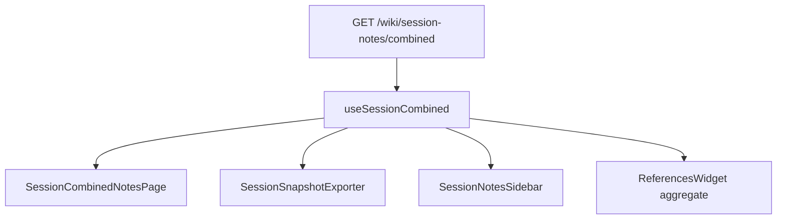

# Unified session combined API + snapshot exporter

## Current state (already shipped)

Phase 2.75 baseline is in place:

- Metadata-linked author pages ([`backend/src/lib/sessionNoteMetadata.ts`](backend/src/lib/sessionNoteMetadata.ts))
- [`GET /wiki/session-notes/combined`](backend/src/routes/campaignScoped.ts) returning `columns` + `entitiesMentioned`
- All View grid ([`frontend/src/pages/SessionCombinedNotesPage.tsx`](frontend/src/pages/SessionCombinedNotesPage.tsx))
- Sidebar with single-page [`ReferencesWidget`](frontend/src/components/wiki/widgets/ReferencesWidget.tsx) via `pageId` prop

**Gap vs your finalized strategy:** the combined payload lacks session header metadata, per-column timestamps for sorting, and aggregate references. Anthology is still a separate mental model from the doc in [`docs/session-anthology.md`](docs/session-anthology.md) (per-author roster order, not chronological section order).

---

## Architecture: one fetch, three consumers



| Consumer | Uses from payload |
|----------|-------------------|
| **All View** | `session`, `columns`, `entitiesMentioned` |
| **Anthology formatter** | Same payload → Markdown via pure function (no second API) |
| **References sidebar** | `references` (pre-merged) or `referenceSourcePageIds` |

---

## 1. Combined API — response shape (single source of truth)

Extend [`CombinedSessionNotesResult`](backend/src/lib/sessionNotesCombined.ts) / [`CombinedSessionNotesPayload`](frontend/src/types/wiki.ts):

```ts
interface CombinedSessionNotesPayload {
  session: {
    sessionGroupId: string;
    timelinePointId: string | null;
    anchorPageId: string | null;
    title: string;                    // anchor wiki title
    sequenceOrder: number | null;     // timeline row
    sessionCreatedAt: string;         // CampaignSessionTimeline.createdAt
    fantasyEpochMinute: string | null; // optional metadata on anchor (see below)
    fantasyDateLabel: string | null;   // server-rendered label for title block
    locationPageId: string | null;     // from anchor metadata
    locationTitle: string | null;
  };
  entitiesMentioned: SessionEntityMention[];
  columns: SessionAuthorColumn[];      // role-masked server-side (existing behavior)
  referenceSourcePageIds: string[];  // visible, non-masked author pageIds
  references: {
    backlinks: WikiBacklink[];
    outlinks: WikiOutlink[];
    brokenOutlinks: WikiBrokenLink[];
  };
}
```

### Extend each `SessionAuthorColumn`

Add fields needed for anthology section ordering (v1 = **author-section order**, per your choice):

| Field | Source |
|-------|--------|
| `createdAt` | `wikiPage.createdAt` |
| `updatedAt` | `wikiPage.updatedAt` |
| `fantasyEpochMinute` | author metadata override, else `session.fantasyEpochMinute` |
| `sortKey` | `[fantasyEpochMinute ?? '', createdAt]` (computed server-side for stable clients) |

Keep existing: `masked`, `isDmRole`, `hasNotes`, `markdown`, `pageId`, `visibility`.

### Handler changes ([`getCombinedSessionNotes`](backend/src/controllers/wikiController.ts))

1. **Resolve group** — existing `resolveSessionGroupContext` (prefer `sessionGroupId` query; `timelinePointId` for timeline UX).
2. **Load anchor + timeline** — title, `sequenceOrder`, `createdAt`, anchor metadata (`locationPageId`, optional `fantasyEpochMinute`).
3. **Fantasy date label** — if `fantasyEpochMinute` present, use existing time engine ([`backend/src/lib/timeEngine.ts`](backend/src/lib/timeEngine.ts) / campaign primary calendar) to produce `fantasyDateLabel` once on the server (avoids client calendar fetch).
4. **Author pages** — existing `fetchAuthorPagesForSession`; include `createdAt`/`updatedAt` in select.
5. **Build columns** — extend [`buildCombinedSessionNotes`](backend/src/lib/sessionNotesCombined.ts) (masking unchanged).
6. **Aggregate references** — new helper in [`wikiLinkService.ts`](backend/src/lib/wikiLinkService.ts), e.g. `getAggregatedReferencesForPages({ campaignId, campaignSlug, pageIds, role })`:
   - Union outlinks from visible author pages (reuse `extractWikiLinkTargetIdsFromBlocks` + resolve titles)
   - Union backlinks where `targetPageId` ∈ `pageIds` (single Prisma query on `WikiLink`)
   - Dedupe by `pageId`; respect visibility same as today
7. **Return** full payload — no separate “anthology” or “references” endpoints.

### Optional metadata (small, enables title block)

Add optional `fantasyEpochMinute` (string bigint) on anchor metadata when session is created/opened ([`createNewSessionTimeline`](backend/src/controllers/wikiController.ts) / timeline backfill): snapshot campaign `currentEpochMinute` at session creation. Author pages inherit unless overridden.

### Query contract

```
GET /c/:slug/wiki/session-notes/combined?sessionGroupId=... 
GET /c/:slug/wiki/session-notes/combined?timelinePointId=...  // resolves to sessionGroupId
```

Primary key for notebook-only sessions: **`sessionGroupId`** (already aligned with [`docs/session-anthology.md`](docs/session-anthology.md)).

---

## 2. Frontend — single fetch hook

Add [`frontend/src/hooks/useSessionCombined.ts`](frontend/src/hooks/useSessionCombined.ts):

```ts
useSessionCombined(campaignSlug, { timelinePointId?, sessionGroupId? })
// → { data, loading, error, refetch }
```

- Wraps existing [`fetchCombinedSessionNotes`](frontend/src/lib/wiki.ts)
- Used by **All View**, **SessionNoteEditor** sidebar (pass data down), and **SessionSnapshotExporter**

Refactor [`SessionCombinedNotesPage.tsx`](frontend/src/pages/SessionCombinedNotesPage.tsx) to consume the hook only (remove inline `useEffect` fetch).

---

## 3. Session Snapshot Exporter (Phase 2.5)

### File split (pure formatter vs UI)

| File | Responsibility |
|------|----------------|
| [`frontend/src/lib/sessionSnapshotFormat.ts`](frontend/src/lib/sessionSnapshotFormat.ts) | Pure functions: filter, sort, render Markdown |
| [`frontend/src/components/session/SessionSnapshotExporter.tsx`](frontend/src/components/session/SessionSnapshotExporter.tsx) | UI: preview, copy, download; receives `CombinedSessionNotesPayload` |

### `sessionSnapshotFormat.ts` API

```ts
function visibleColumns(payload: CombinedSessionNotesPayload): SessionAuthorColumn[]
// columns where !masked && hasNotes (skip empty sections)

function sortColumnsChronologically(
  columns: SessionAuthorColumn[],
  session: CombinedSessionNotesPayload['session'],
): SessionAuthorColumn[]
// sort by (fantasyEpochMinute asc, createdAt asc); tie-break label

function formatSessionSnapshotMarkdown(
  payload: CombinedSessionNotesPayload,
  opts: { campaignName: string; canManage: boolean },
): { title: string; markdown: string; warnings: string[] }
```

### Document structure (matches your spec)

1. **Title block** — `# {session.title}`; campaign name; `fantasyDateLabel` or “Date unknown”; `sessionCreatedAt` (real-world); optional location line
2. **Entities mentioned** — bullet list from `entitiesMentioned` (already deduped server-side)
3. **Per-perspective sections** — for each column in **chronological section order**:
   - `## {label}` (+ optional DM badge in text for managers only)
   - body = column `markdown`
   - **Skip** empty / masked columns (players never see DM-only sections)

No footer / duplicate entity list — sidebar [`ReferencesWidget`](frontend/src/components/wiki/widgets/ReferencesWidget.tsx) handles lore navigation.

### `SessionSnapshotExporter.tsx`

Props: `payload: CombinedSessionNotesPayload`, `campaignName`, `canManage`

- `useMemo` → `formatSessionSnapshotMarkdown`
- Render preview (`WikiMarkdown` or `<pre>` for export fidelity)
- Actions: **Copy**, **Download .md** (client-side blob)
- Optional: embed in All View as a tab/toggle (“Grid | Snapshot”) using **same** `useSessionCombined` data — still one fetch

Role filtering: rely on server `masked` flags; formatter only includes `visibleColumns()`.

---

## 4. ReferencesWidget — aggregate mode

### Approach (no N+1 client fetches)

Prefer **embedded `references`** on the combined payload (built in step 1). Widget does not call `fetchWikiBacklinks` / `fetchWikiOutlinks` when aggregate data is supplied.

Extend props:

```ts
interface ReferencesWidgetProps {
  pageId?: string;           // single-page mode (wiki routes)
  pageIds?: string[];        // legacy fallback: parallel fetch if no references prop
  references?: AggregatedReferencesPayload; // aggregate mode from combined API
  campaignSlug?: string;
  ...
}
```

### Behavior

| Mode | When | Data source |
|------|------|-------------|
| **Route** | Wiki page, `pageId` from params | Existing per-page fetch |
| **Aggregate** | Session sidebar / All View | `references` from combined payload |
| **Single override** | User selects one roster profile | Optional: narrow UI highlight to that author’s outlinks only, **or** keep full-session aggregate (recommended: **keep full session** in sidebar for “entities mentioned tonight”; highlight selected author in list) |

Update [`SessionNotesSidebar.tsx`](frontend/src/components/session/SessionNotesSidebar.tsx):

- Accept `combined: CombinedSessionNotesPayload | null`
- Pass `references={combined.references}` and stop passing single `pageId` for session context
- Remove `key={referencesPageId}` remount hack; use `referenceSourcePageIds.join()` as stable key if refresh needed after save (call `refetch()` on parent hook after save)

### Backend aggregate helper sketch

In [`wikiLinkService.ts`](backend/src/lib/wikiLinkService.ts):

- `getAggregatedReferencesForPages(pageIds[])` → merge + dedupe
- Reuse visibility filters from `getWikiBacklinksForPage` / `getWikiOutlinksForPage`

---

## 5. Wiring checklist

| Area | Change |
|------|--------|
| Backend types | Extend [`sessionNotesCombined.ts`](backend/src/lib/sessionNotesCombined.ts) + tests |
| Handler | Enrich [`getCombinedSessionNotes`](backend/src/controllers/wikiController.ts) |
| Types | [`frontend/src/types/wiki.ts`](frontend/src/types/wiki.ts) |
| Hook | New `useSessionCombined` |
| All View | Use hook; optional Snapshot tab using `SessionSnapshotExporter` |
| Editor sidebar | Parent fetches combined once; pass to `SessionNotesSidebar` |
| Perspectives API | Keep for roster refresh if needed, or derive roster from `columns` to avoid second fetch (optional follow-up) |
| Docs | Update [`docs/session-anthology.md`](docs/session-anthology.md) to “Session Snapshot Formatter”, chronological section order, aggregate refs |

---

## 6. Testing

- **Backend:** extend [`sessionNotesCombined.test.ts`](backend/src/lib/sessionNotesCombined.test.ts) — session header, column sort keys, masked columns excluded from `referenceSourcePageIds`
- **Frontend:** unit tests for `sortColumnsChronologically` + `formatSessionSnapshotMarkdown` (empty sections skipped, DM sections omitted for `canManage: false`)
- **Manual:** All View grid unchanged; snapshot download; sidebar references match combined entities ribbon

---

## Out of scope (explicit)

- Paragraph-level interleave (requires note-entry chunks)
- New anthology footer / compile-hub link (per [`todo.md`](todo.md) until approved)
- Second query path for anthology or references
- PDF / print CSS
