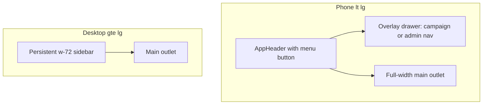
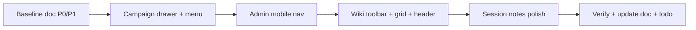

# Phase 3: Mobile UX (audit + navigation + editors)

## Goal

Deliver mobile-usable layouts for **hub, campaign shell, wiki editor, session notes, and admin** in **one pass**, closing these [todo.md](todo.md) items together:

- **Viewport audit** — baseline + post-fix verification in [docs/viewport-audit.md](docs/viewport-audit.md)
- **Responsive navigation** — collapsible campaign sidebar and touch-friendly hub/campaign chrome
- **Editor & forms on mobile** — wiki block editor and session note flows without horizontal scroll traps

**Why one pass:** Root cause is shared—the always-on `w-72` campaign sidebar starves the main column on phones, which makes wiki toolbars, grids, and session layouts *look* like separate bugs. Fixing navigation first unlocks meaningful editor work; verifying without the sidebar fix would be misleading.

---

## Architecture (target state)

**Breakpoint policy:** Use **`lg` (1024px)** as the campaign sidebar persist/show split (sidebar hidden + drawer below `lg`). This matches session notes’ `xl` side-by-side (1280px) so phones/tablets get full-width content before secondary panels appear.

Admin: mirror pattern at **`md` (768px)**—drawer or top **section select** below `md` where nav is currently `hidden`.

---

## Workstream 1 — Baseline audit (short, not a separate milestone)

**Deliverable:** [docs/viewport-audit.md](docs/viewport-audit.md) with findings table + columns `Status` (`open` | `fixed` | `deferred`).

1. **Code scan** (already largely done) — shells: [CampaignLayout.tsx](frontend/src/layouts/CampaignLayout.tsx), [AdminLayout.tsx](frontend/src/layouts/AdminLayout.tsx), [AppLayout.tsx](frontend/src/components/layout/AppLayout.tsx).
2. **Manual sweep** at **375**, **768**, **1024** on the route matrix (hub, campaign wiki/notes/settings, admin nav paths).
3. **Do not block implementation** on a exhaustive doc—capture P0/P1 only, then implement.

**Known P0 (implement, don’t rediscover):**

| ID | Issue | Files |
|----|-------|-------|
| V-01 | Sidebar always `w-72`; ~87px main on 375px | [Sidebar.tsx](frontend/src/components/Sidebar.tsx), [CampaignLayout.tsx](frontend/src/layouts/CampaignLayout.tsx) |
| V-02 | Admin nav missing below `md` | [AdminLayout.tsx](frontend/src/layouts/AdminLayout.tsx) |

---

## Workstream 2 — Responsive navigation

### Campaign shell

- **[CampaignLayout.tsx](frontend/src/layouts/CampaignLayout.tsx):** State `sidebarOpen`; below `lg` render sidebar in **fixed off-canvas drawer** (backdrop, `Escape`, focus trap, body scroll lock). At `lg+`, keep current side-by-side layout.
- **[Sidebar.tsx](frontend/src/components/Sidebar.tsx):** Extract inner nav markup if needed so the same tree renders in drawer and desktop aside; optional `onNavigate` callback to close drawer on `NavLink` click (mobile).
- **Campaign chrome:** Add **menu button** (e.g. `PanelLeft` / `Menu`) visible below `lg`—either extend [AppHeader.tsx](frontend/src/components/layout/AppHeader.tsx) via optional props/context (`CampaignNavContext`) or a slim bar under the header in `CampaignLayout`. Prefer **one** menu control, not duplicate buttons.
- **Touch:** Nav links `min-h-11`, adequate padding; campaign title in sidebar can drop to `text-xl` on small drawer widths.

### Admin shell

- **[AdminLayout.tsx](frontend/src/layouts/AdminLayout.tsx):** Reuse drawer pattern **or** sticky top `<select>` / horizontal scroll chips mapping `SYSTEM_CONFIG_NAV`—pick drawer for consistency with campaign.
- Ensure `md:ml-64` only applies when persistent sidebar is visible.

### Hub / global chrome

- [GlobalHubPage.tsx](frontend/src/pages/GlobalHubPage.tsx) — mostly OK; verify create button and cards at 375px after any header changes.
- [NewCampaignWizard.tsx](frontend/src/components/hub/NewCampaignWizard.tsx) — confirm modal padding and step indicators on phone (minor tweaks only).

**Reference:** Drawer UX already exists on [PlayerSessionNotesPage.tsx](frontend/src/pages/PlayerSessionNotesPage.tsx) (`fixed inset-0`, backdrop, `Escape`)—reuse patterns, not necessarily extract a shared component unless duplication is large.

---

## Workstream 3 — Editor & forms on mobile

Depends on **full-width main** from Workstream 2.

### Wiki block editor / page chrome

| Area | Approach | Files |
|------|----------|-------|
| Toolbar | Below `sm`: icon-only groups + `title` tooltips; semantic highlights in **overflow row** or collapsible “Markers” popover; keep `flex-wrap` as fallback | [WikiEditorToolbar.tsx](frontend/src/components/wiki/WikiEditorToolbar.tsx) |
| TipTap body | Wrap editor in `overflow-x-auto`; tables scroll inside editor, not page | [WikiTipTapEditor.tsx](frontend/src/components/wiki/WikiTipTapEditor.tsx), [index.css](frontend/src/index.css) |
| Widget grid | Below `lg`: **single-column read mode**—either force blocks to `w: 3, x: 0` stacked in [WikiPageRenderer.tsx](frontend/src/components/wiki/WikiPageRenderer.tsx) via resize hook, or CSS override stacking read-only widgets; layout-edit mode can stay 3-col with horizontal scroll only in edit HUD if needed | [WikiPageRenderer.tsx](frontend/src/components/wiki/WikiPageRenderer.tsx), [wikiGrid.ts](frontend/src/utils/wikiGrid.ts) |
| Page header actions | Wrap icon cluster or `sm:` **overflow menu** (“More”) for pin/search/delete/wrench | [WikiPage.tsx](frontend/src/pages/WikiPage.tsx) |
| Layout-edit block chrome | Stack visibility row under title on narrow widths | [WikiPageRenderer.tsx](frontend/src/components/wiki/WikiPageRenderer.tsx) |

### Session notes

| Area | Approach | Files |
|------|----------|-------|
| Breadcrumbs | Add `flex-wrap` / `min-w-0` like [WikiPageBreadcrumbs.tsx](frontend/src/components/wiki/WikiPageBreadcrumbs.tsx) | [SessionNoteEditor.tsx](frontend/src/components/session/SessionNoteEditor.tsx), [SessionCombinedNotesPage.tsx](frontend/src/pages/SessionCombinedNotesPage.tsx) |
| Roster sidebar | Below `xl`: optional **bottom sheet** or reuse drawer to open party list (mirror PlayerSessionNotesPage); stacking below editor is acceptable if roster is collapsible | [SessionNoteEditor.tsx](frontend/src/components/session/SessionNoteEditor.tsx), [SessionNotesSidebar.tsx](frontend/src/components/session/SessionNotesSidebar.tsx) |
| Index toolbar | Confirm [SessionNotesView.tsx](frontend/src/pages/SessionNotesView.tsx) actions wrap at 375px; no change if pass | SessionNotesView |

### Pass criteria (editors)

- No `document.body` horizontal scroll on wiki edit, session note edit, or combined view at 375px.
- Toolbar remains operable without zoom.
- Widget content readable (full-width stack or intentional inner scroll only).

---

## Verification (closes all three todos)

1. Re-run route matrix at **375 / 768 / 1024** after both workstreams.
2. Update [docs/viewport-audit.md](docs/viewport-audit.md): mark each finding `fixed` or `deferred` with PR note.
3. Check off in [todo.md](todo.md):
   - Viewport audit
   - Responsive navigation
   - Editor & forms on mobile

**Deferred (document only, do not block Phase 3):** chronology canvas, recruitment lobby, template studio, dashboard `react-grid-layout` customize mode—unless P0 found during verification.

---

## Suggested implementation order

---

## Files touched (expected)

| Priority | Files |
|----------|--------|
| P0 | `CampaignLayout.tsx`, `Sidebar.tsx`, `AdminLayout.tsx`, `AppHeader.tsx` (or small `CampaignNavContext`) |
| P1 | `WikiEditorToolbar.tsx`, `WikiPageRenderer.tsx`, `WikiPage.tsx`, `WikiTipTapEditor.tsx` |
| P2 | `SessionNoteEditor.tsx`, `SessionNotesSidebar.tsx`, `index.css` |
| Doc | `docs/viewport-audit.md` |

No new dependencies required; use Tailwind + existing React state patterns.
