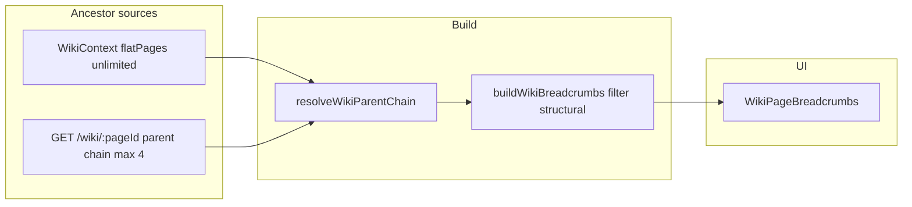

# Wiki breadcrumb hierarchy trails

## Current state

Locations (and all lore) are [`WikiPage`](backend/prisma/schema.prisma) rows linked by `parentId`. Breadcrumb UI already exists but does not reliably match the roadmap example:

| Piece | File | Behavior today |
|-------|------|----------------|
| Trail builder | [`frontend/src/lib/wikiHierarchy.ts`](frontend/src/lib/wikiHierarchy.ts) | `buildWikiBreadcrumbs()` flattens API `parent` chain, drops `World`/`Game` + reserved system pages, appends current page |
| Renderer | [`frontend/src/components/wiki/WikiPageBreadcrumbs.tsx`](frontend/src/components/wiki/WikiPageBreadcrumbs.tsx) | Chevron-separated links; hidden when `crumbs.length <= 1` |
| Wiring | [`frontend/src/pages/WikiPage.tsx`](frontend/src/pages/WikiPage.tsx) | `buildWikiBreadcrumbs(pageData.parent, { id, title })` only |
| API ancestors | [`backend/src/lib/wikiHierarchy.ts`](backend/src/lib/wikiHierarchy.ts) | `WIKI_PARENT_CHAIN_DEPTH = 4` nested `parent` on page detail |

**Gaps vs. goal (*Sword Coast → Greenest → The Purple Dragon Inn*):**

1. **Category folders stay in the trail** — `Locations` is not filtered (only `World`/`Game` are), so users often see `Locations › Sword Coast › …` instead of starting at the region.
2. **Depth cap** — chains deeper than four ancestors are truncated on `GET /wiki/:pageId`; breadcrumbs do not fall back to the wiki tree.
3. **Category index pages have no trail** — [`WikiIndexView`](frontend/src/components/wiki/WikiIndexView.tsx) renders with no breadcrumbs (e.g. opening the Locations folder).

Default seed shape: `World → Locations → …nested locations…` ([`seedWiki.ts`](backend/src/lib/seedWiki.ts)). Correct nesting is already supported via **Page settings → parent** ([`WikiPageSettings.tsx`](frontend/src/components/wiki/WikiPageSettings.tsx)); this work is display-only.



## Implementation plan

### 1. Resolve full parent chain from wiki tree (frontend)

In [`frontend/src/lib/wikiHierarchy.ts`](frontend/src/lib/wikiHierarchy.ts):

**Type matching — nested `WikiPageParentRef`**

[`WikiPageParentRef`](frontend/src/types/wiki.ts) is recursively nested (`{ id, title, parent?: WikiPageParentRef | null }`), matching the API shape consumed by `flattenParentChain()`. The flat-tree builder must produce the same structure, not a flat array.

Algorithm for `buildParentChainFromFlatPages(pageId, pageById)`:

1. Walk **up** from `pageId` via `parentId`, collecting ancestor nodes **immediate-first**: `[Greenest, Sword Coast, Locations, World]`.
2. **Fold bottom-up** (root → immediate parent): start with `null`, iterate ancestors **reversed**, wrapping each as `{ id, title, parent: acc }`. Return the outermost node (immediate parent of `pageId`), or `null` if the page has no parent.

This mirrors API serialization and keeps `flattenParentChain()` unchanged.

**Performance — O(N) lookup map**

Building `Map<string, WikiTreeNode>` from `flatPages` is **O(N)**. Do **not** rebuild it inside `resolveWikiParentChain` on every breadcrumb memo pass.

- Export a small helper: `buildWikiPageLookup(flatPages): Map<string, WikiTreeNode>` (id → node).
- At call sites ([`WikiPage.tsx`](frontend/src/pages/WikiPage.tsx), [`WikiIndexView.tsx`](frontend/src/components/wiki/WikiIndexView.tsx)), memoize once per tree load:

```ts
const pageById = useMemo(
  () => buildWikiPageLookup(flatPages),
  [flatPages],
);
```

Pass `pageById` into `buildParentChainFromFlatPages` / `resolveWikiParentChain`. When `flatPages` reference is stable (normal case after `WikiContext` load), the map is not reallocated.

**Resolver**

- `buildParentChainFromFlatPages(pageId, pageById): WikiPageParentRef | null`
- `resolveWikiParentChain(pageId, apiParent, pageById)` — prefer flat-tree chain when `pageById` contains `pageId`; fall back to `apiParent` while the tree is loading or the page is missing.

No new API route required; [`WikiContext`](frontend/src/contexts/WikiContext.tsx) already exposes `flatPages` on every [`WikiPage`](frontend/src/pages/WikiPage.tsx).

### 2. Filter category index folders from trails

Extend breadcrumb filtering so module folders do not appear as crumbs:

- Import [`isCategoryIndexPage`](frontend/src/lib/wikiCategories.ts) / `CATEGORY_INDEX_TITLES` into `wikiHierarchy.ts`.
- Treat category index titles (e.g. `Locations`, `Characters`, `Quests`) like structural dividers inside `isStructuralBreadcrumbCrumb` (or a sibling helper used only for breadcrumbs).

Result for a typical location: **Sword Coast → Greenest → The Purple Dragon Inn** (no `World`, `Locations`).

Apply the same filter in `formatParentOptionLabel` for consistency with the parent picker label (optional but low-cost).

### 3. Wire WikiPage to resolved chain

In [`WikiPage.tsx`](frontend/src/pages/WikiPage.tsx), update the `wikiBreadcrumbs` memo:

```ts
const pageById = useMemo(
  () => buildWikiPageLookup(flatPages),
  [flatPages],
);

const wikiBreadcrumbs = useMemo(() => {
  if (!pageData) return [];
  const parentChain = resolveWikiParentChain(
    pageId,
    pageData.parent,
    pageById,
  );
  return buildWikiBreadcrumbs(parentChain, {
    id: pageId,
    title: displayTitle,
  });
}, [pageData, pageId, displayTitle, pageById]);
```

After parent changes in settings, existing `onParentChange` + `refresh()` already updates tree and API parent.

### 4. Raise API parent depth (backend, small)

In [`backend/src/lib/wikiHierarchy.ts`](backend/src/lib/wikiHierarchy.ts), increase `WIKI_PARENT_CHAIN_DEPTH` from **4** to **12** (or similar) so other consumers (settings label when tree is stale, PATCH responses) get a generous chain without N+1 queries.

This is a safety net; the frontend tree resolver is the primary fix for deep worlds.

### 5. Breadcrumbs on category index pages

In [`WikiIndexView.tsx`](frontend/src/components/wiki/WikiIndexView.tsx):

- Use `useWiki()` for `flatPages`; memoize `pageById` the same way as `WikiPage`.
- Build crumbs via `resolveWikiParentChain(categoryPageId, null, pageById)` + `buildWikiBreadcrumbs(..., { id: categoryPageId, title: categoryTitle })`.
- Render [`WikiPageBreadcrumbs`](frontend/src/components/wiki/WikiPageBreadcrumbs.tsx) above the index header (same styling as detail pages).

**Zero-crumb index edge case (top-level category folders)**

For a seeded top-level folder like **Locations** (`World → Locations`), after filtering:

- `resolveWikiParentChain` yields a chain whose ancestors are only `World` (structural) and possibly `Locations` itself when included as current page.
- `buildWikiBreadcrumbs` strips `World` and category titles → **empty ancestor list**; with current page appended, only one crumb may remain, or filtering may leave **zero** ancestors before append.

[`WikiPageBreadcrumbs`](frontend/src/components/wiki/WikiPageBreadcrumbs.tsx) already returns `null` when `crumbs.length <= 1`, so the nav **gracefully degrades** — no crash, no floating chevrons. **No special-case UI** required for top-level indexes; still wire the component for nested category-adjacent cases (e.g. a custom folder under `World` that is not a standard index title).

### 6. Minor UX guard (optional)

Keep `WikiPageBreadcrumbs`’s `crumbs.length <= 1` guard unless manual QA shows confusing single-crumb cases; two-level trails (region → site) must remain visible.

Separator stays `ChevronRight` (already matches “hierarchy trail” UX).

### 7. Tests

Add [`frontend/src/lib/wikiHierarchy.test.ts`](frontend/src/lib/wikiHierarchy.test.ts) (Vitest, same pattern as [`chronologyDates.test.ts`](frontend/src/lib/chronologyDates.test.ts)):

- Deep chain (6+ levels) resolves fully from `pageById` with correct nested `WikiPageParentRef` shape (assert via `flattenParentChain` parity with API fixture).
- Category + structural titles stripped.
- `resolveWikiParentChain` falls back to API parent when `pageById` is empty or page is missing.
- Bottom-up fold produces the same nested shape as a hand-built API `parent` object.

## Out of scope (follow-ups)

- **Session note location picker** ([`SessionNoteEditor.tsx`](frontend/src/components/session/SessionNoteEditor.tsx)) — still lists only direct children of the Locations root; separate from breadcrumb display.
- **Create flow parent picker** — index “Create Location” still parents to the Locations folder; deep nesting remains via page settings.
- **Infobox “Region” / metadata “Parent”** — text fields, not wiki links.
- Dedicated `/locations/:id` routes — cosmetic only.

## Acceptance criteria

With `parentId` set to `Greenest` for the inn and `Sword Coast` for Greenest:

- Opening the inn wiki page shows a linked trail: **Sword Coast → Greenest → The Purple Dragon Inn**.
- Intermediate pages (e.g. Greenest) show their own prefix trail.
- Works for other nested wiki types (characters under organizations, etc.) with the same rules.
- Trails remain correct when nesting exceeds four levels (tree-backed).
- [`todo.md`](todo.md) breadcrumb item can be checked off after QA.

## Files to touch

| File | Change |
|------|--------|
| [`frontend/src/lib/wikiHierarchy.ts`](frontend/src/lib/wikiHierarchy.ts) | Tree resolver, category filter, tests |
| [`frontend/src/pages/WikiPage.tsx`](frontend/src/pages/WikiPage.tsx) | Use `resolveWikiParentChain` |
| [`frontend/src/components/wiki/WikiIndexView.tsx`](frontend/src/components/wiki/WikiIndexView.tsx) | Index breadcrumbs |
| [`backend/src/lib/wikiHierarchy.ts`](backend/src/lib/wikiHierarchy.ts) | Increase `WIKI_PARENT_CHAIN_DEPTH` |

No Prisma migration.
