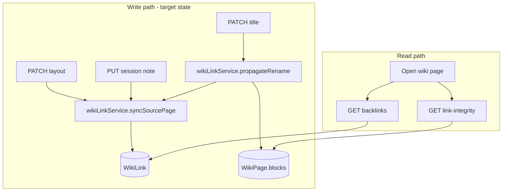
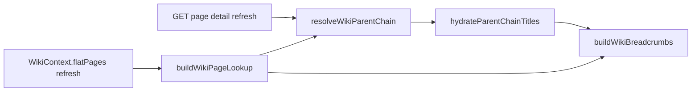

# Wiki internal linking infrastructure (Phase 2)

## Current state

Esiana already has the right **shape** for a decoupled link graph, but it is incomplete:

| Piece | Status |
|-------|--------|
| [`WikiLink`](backend/prisma/schema.prisma) (`sourcePageId`, `targetPageId`, indexes) | In schema, **no migration** under `backend/prisma/migrations/` |
| Graph sync on layout save | Inline in [`updateWikiPageLayout`](backend/src/controllers/wikiController.ts) only |
| Backlinks API | [`GET /wiki/:pageId/backlinks`](backend/src/routes/campaignScoped.ts) → `getWikiBacklinks` |
| Backlinks widget | [`BacklinksWidget.tsx`](frontend/src/components/wiki/widgets/BacklinksWidget.tsx) — basic list, minimal empty state |
| Link extraction regex | Only `/campaign/.../wiki/:pageId` — **misses** editor links from [`campaignWikiPath`](frontend/src/lib/campaignPaths.ts) (`/c/.../wiki/...`) |
| Title rename / broken links | Not implemented |



---

## 1. Prisma schema and migration

**Keep `WikiLink`** (per your choice). Add the missing migration so fresh and existing databases match the schema.

**Schema tweak** (optional but recommended for campaign-scoped rebuilds):

- Add `campaignId` on `WikiLink`, set from `sourcePage.campaignId` on sync, with `@@index([campaignId, targetPageId])`.
- Keep `@@unique([sourcePageId, targetPageId])` and `onDelete: Cascade` on both FKs.

**Migration SQL** ([`backend/prisma/migrations/<timestamp>_wiki_link_graph/migration.sql`](backend/prisma/migrations/)):

1. `CREATE TABLE WikiLink` if absent (matches current schema).
2. If `campaignId` is added: backfill via `UPDATE WikiLink SET campaignId = (SELECT campaignId FROM WikiPage WHERE id = sourcePageId)`.
3. **One-time backfill job** (same migration or a follow-up script invoked once): scan all `WikiPage.blocks` in each campaign and repopulate `WikiLink` using the fixed extractor (repairs the `/c/` regex gap).

No rename to `WikiLinkGraph`; update [`todo.md`](todo.md) wording to reference `WikiLink` as the graph table.

---

## 2. Backend service layer (`wikiLinkService`)

Extract graph logic from [`wikiController.ts`](backend/src/controllers/wikiController.ts) into a dedicated module, e.g. [`backend/src/lib/wikiLinkService.ts`](backend/src/lib/wikiLinkService.ts):

| Function | Responsibility |
|----------|----------------|
| `extractInternalWikiTargets(blocks, campaignSlug?)` | Parse `text-tiptap` `content.markdown` for internal targets |
| `syncWikiLinksForSourcePage(tx, { campaignId, sourcePageId, blocks })` | `deleteMany` outgoing for source → `createMany` valid targets (`skipDuplicates`) |
| `getWikiBacklinks(campaignId, targetPageId, role)` | Current `getWikiBacklinks` query + visibility filter |
| `propagatePageTitleRename(tx, { campaignId, pageId, oldTitle, newTitle })` | Use graph to find sources, rewrite block markdown, re-sync each source |
| `getBrokenLinksForPage(campaignId, pageId, blocks)` | Targets in content that are not valid campaign pages |

**Link extraction** — single regex module supporting:

- `/c/:slug/wiki/:pageId` (primary)
- `/campaign/:slug/wiki/:pageId` (legacy)
- `/c/:slug/event-:eventId` if event-lore pages should count as internal targets
- Obsidian import mentions: `data-id="..."` on `data-type="mention"` spans (empty `data-id` or `data-stub="true"` → broken)

Validate targets against `WikiPage` ids in the campaign before `createMany` (orphan hrefs stay in markdown but **do not** get graph rows).

**Application hook (not DB trigger):** Prisma-managed SQLite/Postgres makes app-level sync the right fit; call `syncWikiLinksForSourcePage` from every block-write path:

- [`updateWikiPageLayout`](backend/src/controllers/wikiController.ts) — replace inline sync
- [`updateSessionNotePage`](backend/src/controllers/wikiController.ts) — **add** sync (currently missing)
- [`createWikiPage`](backend/src/controllers/wikiController.ts) — sync when initial `blocks` contain links
- Post-import bulk path in [`campaignImportProcessor.ts`](backend/src/lib/campaignImportProcessor.ts) — batch sync after pages are written

---

## 3. Wikilink integrity guard

### On block save (graph population)

Already described: transactional sync after `WikiPage.blocks` update.

### On page rename ([`updateWikiPage`](backend/src/controllers/wikiController.ts))

When `title` changes:

1. Load `oldTitle` before update.
2. Query `WikiLink` where `targetPageId = pageId` → list `sourcePageId`s.
3. For each source page, rewrite markdown:
   - `[oldTitle](/c/.../wiki/{pageId})` → new title in bracket text (preserve href)
   - Mention spans with `data-id="{pageId}"`: update `data-label` and visible `[[...]]` text
4. Persist updated `blocks`, then `syncWikiLinksForSourcePage` per source.

Href-based links remain valid (IDs unchanged); this updates **display text** and mention metadata.

### Broken internal links (frontend visual flag)

**New endpoint:** `GET /api/c/:campaignSlug/wiki/:pageId/link-integrity`

Response shape:

```ts
{
  broken: Array<{ targetPageId: string; label?: string }>;
  outboundCount: number;
}
```

Implementation: extract all target ids from blocks → `findMany` existing page ids in campaign → diff. Include mention stubs with empty id as broken with `label` from `data-label`.

**Frontend:** [`frontend/src/lib/wiki.ts`](frontend/src/lib/wiki.ts) client + decorate links in read/edit TipTap:

- Add [`WikiInternalLinkExtension`](frontend/src/components/wiki/extensions/WikiInternalLinkExtension.ts) (extends TipTap `Link`) or a small `useWikiLinkIntegrity` hook that marks `a[href*="/wiki/"]` and mention stubs after integrity payload loads.
- Styles in wiki CSS: e.g. `.wiki-link--broken` (rose, dashed underline, `title="Page not found"`).
- Apply in [`TiptapWidget.tsx`](frontend/src/components/wiki/widgets/TiptapWidget.tsx) and optionally [`WikiTipTapEditor.tsx`](frontend/src/components/wiki/WikiTipTapEditor.tsx) for session notes.

---

## 4. API updates (backlinks)

Enhance existing [`getWikiBacklinks`](backend/src/controllers/wikiController.ts) (no route change):

| Field | Purpose |
|-------|---------|
| `id`, `title`, `visibility`, `updatedAt` | Existing |
| `parentId` | Existing |
| `breadcrumbLabel` | Single string, e.g. `Sword Coast › Greenest › Source Page` via hierarchy helpers (cycle-safe; see §8) |
| `href` | Pre-built path (`/c/:slug/wiki/:id` or character route when applicable) |

Optional: `total` count in JSON wrapper for panel header badge.

Controllers stay thin; delegate to `wikiLinkService`.

---

## 5. Frontend backlinks widget UX

Upgrade [`BacklinksWidget.tsx`](frontend/src/components/wiki/widgets/BacklinksWidget.tsx):

| Area | Change |
|------|--------|
| **Panel chrome** | Header row: icon, “Backlinks”, count badge, subtle border consistent with other widgets |
| **Empty state** | Icon + copy: “No pages link here yet” + hint that links from text blocks will appear after save |
| **Loading** | Skeleton rows instead of plain text |
| **Error** | Retry button calling `fetchWikiBacklinks` again |
| **Deep links** | `RouterLink` using API `href`; secondary line with `breadcrumbLabel` (truncated) |
| **Layout** | `max-h` + `overflow-y-auto` for long lists; compact row layout (title primary, breadcrumb muted) |

Supporting changes:

- Extend [`WikiBacklink`](frontend/src/types/wiki.ts) type with `breadcrumbLabel` and `href`.
- Add **Backlinks** to [`WIKI_WIDGET_OPTIONS`](frontend/src/utils/wikiWidgets.ts) so DMs can drop the widget from layout mode.
- Optionally seed a `wiki-backlinks` block in default page templates ([`pageTemplates.ts`](backend/src/lib/pageTemplates.ts) / frontend mirror) for NPC/location templates.

---

## 8. Client hierarchy edge cases (breadcrumbs & backlinks)

These fixes apply to [`frontend/src/lib/wikiHierarchy.ts`](frontend/src/lib/wikiHierarchy.ts) and call sites (`WikiPage.tsx`, `BacklinksWidget`, `WikiIndexView`). Mirror cycle-safe walking anywhere the **backend** builds breadcrumb labels for backlinks (shared helper or duplicated guard).

### Edge case 1: Cyclic parent references

**Risk:** If Page A’s `parentId` is B and B’s `parentId` is A (bad data or race before server rejects reparent), any unguarded `while (currentId)` parent walk can hang the tab.

**Current state:** [`buildParentChainFromFlatPages`](frontend/src/lib/wikiHierarchy.ts) already keeps a `visited` `Set` and breaks on re-entry (lines 47–57). [`isInvalidWikiParent`](backend/src/lib/wikiHierarchy.ts) also cycle-checks on write. Other frontend walkers are **not** guarded:

| Function | Cycle-safe today? |
|----------|-------------------|
| `buildParentChainFromFlatPages` | Yes |
| `getPageDepth` | No — add `visited` |
| `formatParentOptionLabel` | No — add `visited` |
| `flattenParentChain` (nested `WikiPageParentRef`) | No — add `visited` on `id` while walking |

**Plan:**

1. Extract a small internal helper, e.g. `walkAncestorIds(pageId, pageById, { includeSelf? })`, that always uses `visited` and yields ancestor ids in root→leaf order.
2. Refactor `buildParentChainFromFlatPages`, `getPageDepth`, and `formatParentOptionLabel` to use it (or duplicate the same `visited` pattern inline — prefer one helper).
3. Add regression test in [`wikiHierarchy.test.ts`](frontend/src/lib/wikiHierarchy.test.ts): flat pages `{ A → B, B → A }` — assert `buildParentChainFromFlatPages` returns a finite chain (partial trail) and does not throw or loop.
4. When building `breadcrumbLabel` on the server for backlinks, use the same visited guard if walking `parentId` in SQL/JS.

Server-side reparent should continue to reject cycles via `isInvalidWikiParent`; client guards are defense-in-depth for corrupt or in-flight tree state.

### Edge case 2: Title sync stutter after settings save

**Risk:** After renaming in Page Settings, `WikiContext.flatPages` / tree refresh and `pageData` from `GET /wiki/:pageId` can resolve in either order. Breadcrumbs and backlink trails can briefly show a **mix** of old and new titles (e.g. parent crumbs from fresh `flatPages`, current page from stale `pageData.parent` or `displayTitle`).

**Plan:**

1. Add `hydrateParentChainTitles(chain, pageById)` — walk `WikiPageParentRef` and set each node’s `title` to `pageById.get(node.id)?.title ?? node.title`.
2. In `resolveWikiParentChain`, after choosing flat-tree vs API parent, **always** run `hydrateParentChainTitles` before returning (so API fallback crumbs still pick up fresh tree titles when ids exist in the map).
3. In `buildParentChainFromFlatPages`, when folding ancestors into `WikiPageParentRef`, set `title` from `pageById.get(ancestor.id)!.title` (already from map; keeps a single source of truth).
4. At call sites (`WikiPage.tsx`, `WikiIndexView`), pass the current page crumb title as `pageById.get(pageId)?.title ?? displayTitle` (aligns with existing `resolvedTitle = treePage?.title ?? pageData?.title` preference).
5. Add unit test: build chain from flat map with updated title for one ancestor; pass stale `apiParent` with old titles — assert `resolveWikiParentChain` returns hydrated titles from `pageById`.



---

## 6. Files to touch (concise)

**Backend**

- [`backend/prisma/schema.prisma`](backend/prisma/schema.prisma) — optional `campaignId` on `WikiLink`
- `backend/prisma/migrations/<new>/migration.sql`
- **New** [`backend/src/lib/wikiLinkService.ts`](backend/src/lib/wikiLinkService.ts)
- **New** [`backend/src/lib/wikiLinkExtract.ts`](backend/src/lib/wikiLinkExtract.ts) (regex + mention parsing)
- [`backend/src/controllers/wikiController.ts`](backend/src/controllers/wikiController.ts) — wire service; rename handler; integrity endpoint
- [`backend/src/routes/campaignScoped.ts`](backend/src/routes/campaignScoped.ts) — `GET /wiki/:pageId/link-integrity`
- [`backend/src/lib/campaignImportProcessor.ts`](backend/src/lib/campaignImportProcessor.ts) — post-import sync

**Frontend**

- [`frontend/src/lib/wiki.ts`](frontend/src/lib/wiki.ts) — types + `fetchWikiLinkIntegrity`
- [`frontend/src/components/wiki/widgets/BacklinksWidget.tsx`](frontend/src/components/wiki/widgets/BacklinksWidget.tsx)
- [`frontend/src/components/wiki/extensions/WikiInternalLinkExtension.ts`](frontend/src/components/wiki/extensions/WikiInternalLinkExtension.ts) (new)
- [`frontend/src/components/wiki/widgets/TiptapWidget.tsx`](frontend/src/components/wiki/widgets/TiptapWidget.tsx)
- [`frontend/src/utils/wikiWidgets.ts`](frontend/src/utils/wikiWidgets.ts)
- [`frontend/src/types/wiki.ts`](frontend/src/types/wiki.ts)
- [`frontend/src/lib/wikiHierarchy.ts`](frontend/src/lib/wikiHierarchy.ts) — cycle helper, title hydration, tests
- [`frontend/src/pages/WikiPage.tsx`](frontend/src/pages/WikiPage.tsx) — breadcrumb title source of truth

---

## 7. Verification

1. Create pages A → B via toolbar link (`/c/.../wiki/...`); save layout; open B → backlinks shows A with breadcrumb.
2. Rename B; confirm A’s link text updates; backlinks still resolve.
3. Delete a target page C but leave a stale href in A’s markdown; open A → link renders as broken; graph has no row for C.
4. Save session note with internal link → graph updates (session note path).
5. Run migration on clean DB; confirm `WikiLink` table exists and backfill populates existing campaigns.
6. **Cycle:** Seed A↔B parents in test DB; open either page — UI remains responsive; breadcrumbs show finite trail.
7. **Title stutter:** Rename page in settings; breadcrumb and backlinks label update consistently without flicker of old title on current crumb when tree leads page fetch.

---

## Out of scope (Phase 2 follow-ups in todo)

- Parental deletion workflows
- Campaign-wide link health dashboard
- Prisma DB triggers / plugin `transformWikiContent` hooks (Phase 10)
