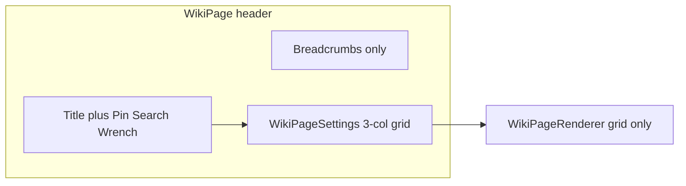

# Collapse Metadata Row and Fix Widget Grid

## Goals

- Header: breadcrumbs + title/actions only; no visibility or template badge in the toolbar.
- Settings panel (wrench open): one `max-w-5xl` card with **Parent | Template | Visibility** in a 3-column grid.
- Layout: auto-save when exiting edit mode via wrench; remove explicit Save layout UI on wiki pages.
- Grid: clip widget content inside RGL slots during drag/resize.



---

## 1. [`WikiPage.tsx`](frontend/src/pages/WikiPage.tsx)

**Remove from header**
- Row 1 visibility block (lines 319–348): label, Lock icon, and `<select>`.
- Toolbar template badge span (`{templateType}`) when `isEditingLayout`.

**Wrench auto-save**

Replace `handleToggleEditLayout` toggle with async exit-save:

```tsx
async function handleToggleEditLayout() {
  if (isEditingLayout) {
    if (isDirty) {
      await handleSaveLayout();
    }
    setIsEditingLayout(false);
    return;
  }
  setIsEditingLayout(true);
}
```

- Disable wrench while `isSaving` to avoid double-toggles during save.
- Stop passing `onSaveLayout` to `WikiPageRenderer` (wiki pages only).

**Settings panel wrapper**

- Change card from `max-w-xl` to `max-w-5xl` (use `max-w-5xl` to align with layout grid width).
- Pass new props into `WikiPageSettings`:

| Prop | Source |
|------|--------|
| `templateType` | state |
| `onTemplateTypeChange` | `setTemplateType` |
| `pageVisibility` | `pageVisibility` |
| `onVisibilityChange` | existing `updateWikiPageVisibility` handler (lifted into a `handleVisibilityChange` callback) |

Row 1 becomes breadcrumbs-only (`justify-between` with empty right side for non-DM, or `justify-start`).

---

## 2. [`WikiPageSettings.tsx`](frontend/src/components/wiki/WikiPageSettings.tsx)

**Layout**

- Replace single-column parent field with:

```tsx
<div className="grid grid-cols-1 gap-6 md:grid-cols-3">
  {/* Col 1: Belongs Within (existing combobox, max-w-full) */}
  {/* Col 2: Template select */}
  {/* Col 3: Visibility select */}
</div>
```

**Column 2 — Template** (moved from [`WikiPageRenderer.tsx`](frontend/src/components/wiki/WikiPageRenderer.tsx) lines 221–233):

- Label: `Template` (uppercase muted, match parent field style).
- Options: `DEFAULT`, `CHARACTER`, `LOCATION` (same as today).

**Column 3 — Visibility**

- Label: `Visibility` only (no “Page visibility” prefix).
- `<select>` with Public / Party-Visible / DM_Only; call `onVisibilityChange` on change (parent performs API + `refresh()`).

Each column: `space-y-1.5` + full-width `select`/`input` using existing border tokens.

---

## 3. [`WikiPageRenderer.tsx`](frontend/src/components/wiki/WikiPageRenderer.tsx)

**Remove wiki metadata toolbar**

- Delete the block at lines 217–248 (`showLayoutChrome && !isTemplateWorkspace`) that renders Template dropdown + Save layout button.
- Keep `workspaceVariant === 'template'` behavior unchanged for [`TemplateEditor.tsx`](frontend/src/components/templates/TemplateEditor.tsx) if it relies on that bar (verify: template editor may need its own save — it has separate HUD in TemplateEditor).

**Grid collision fix**

Apply bounding classes at two levels:

1. **RGL item root** (the `div` with `data-grid`, ~line 266):

```tsx
className={`${getBlockFrameClassName()} h-full w-full overflow-hidden flex flex-col`}
```

2. **Widget body wrapper** (~line 332):

```tsx
className={showLayoutChrome ? 'flex min-h-0 flex-1 flex-col overflow-hidden p-3' : ''}
```

3. **Read view** TipTap wrapper in [`TiptapWidget.tsx`](frontend/src/components/wiki/widgets/TiptapWidget.tsx): add `h-full min-h-0 overflow-hidden flex flex-col` on edit container so prose does not spill slots.

4. Optional scoped rule in [`index.css`](frontend/src/index.css) under `.wiki-grid-3col`:

```css
.wiki-grid-3col .react-grid-item { overflow: hidden; }
.wiki-grid-3col .react-grid-item > div { height: 100%; }
```

Minimal addition — prefer component classes first; add CSS only if RGL inner structure still bleeds.

**Cleanup**

- Remove unused `Save` import if Save button removed.
- `onSaveLayout` prop can remain optional for template workspace or be removed from wiki call site only.

---

## 4. Files touched

| File | Change |
|------|--------|
| [`frontend/src/pages/WikiPage.tsx`](frontend/src/pages/WikiPage.tsx) | Header cleanup, wrench auto-save, widen settings card, pass template/visibility props |
| [`frontend/src/components/wiki/WikiPageSettings.tsx`](frontend/src/components/wiki/WikiPageSettings.tsx) | 3-column metadata grid |
| [`frontend/src/components/wiki/WikiPageRenderer.tsx`](frontend/src/components/wiki/WikiPageRenderer.tsx) | Remove wiki toolbar; grid overflow classes |
| [`frontend/src/components/wiki/widgets/TiptapWidget.tsx`](frontend/src/components/wiki/widgets/TiptapWidget.tsx) | Optional overflow on edit shell |
| [`frontend/src/index.css`](frontend/src/index.css) | Optional `.wiki-grid-3col` overflow helpers |

No backend changes.

---

## 5. Verification

- DM opens lore page: Row 1 = breadcrumbs only; no visibility in header.
- Wrench on: slide-under panel shows Parent | Template | Visibility in one row (3 cols on `md+`).
- Wrench off: auto-saves if dirty; no Save layout button anywhere on wiki page.
- Drag/resize widgets: content stays inside dashed borders; no overlap onto adjacent cells.
- Template editor route still works if it uses `workspaceVariant="template"`.
