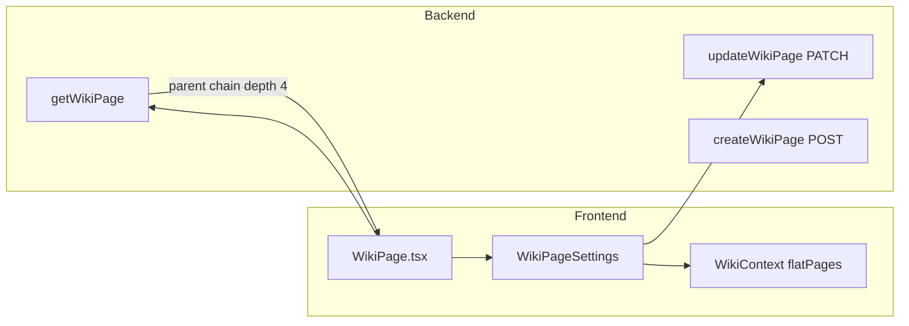

# Wiki Page Parent-Child Hierarchy

## Current state

Much of the hierarchy is already in place:

- [`backend/prisma/schema.prisma`](backend/prisma/schema.prisma) — `WikiPage` already has `parentId`, `parent`, and `children` (lines 383–393), but **`onDelete: Cascade`** (deleting a parent would delete children).
- [`backend/src/controllers/wikiController.ts`](backend/src/controllers/wikiController.ts) — `createWikiPage` already accepts `parentId` but **requires** it (403 if missing). There is **no** general `updateWikiPage` for `parentId`. `getWikiPage` returns only flat `parentId`, no ancestor chain.
- [`frontend/src/pages/WikiPage.tsx`](frontend/src/pages/WikiPage.tsx) — primary wiki editor (block layout). No parent picker. **`WikiEditor.tsx` does not exist**; per your choice, parent UI goes in a new **`WikiPageSettings.tsx`** panel.



---

## 1. Database schema and migration

**File:** [`backend/prisma/schema.prisma`](backend/prisma/schema.prisma)

Change the self-relation delete rule only:

```prisma
parent WikiPage? @relation("WikiPageTree", fields: [parentId], references: [id], onDelete: SetNull)
```

**Migration:** `npx prisma migrate dev --name wiki_page_parent_set_null` from `backend/` (recreates FK on SQLite so orphaned children keep `parentId` cleared instead of being deleted).

No new columns needed — `parentId` and `@@index([parentId])` already exist.

---

## 2. Backend helpers

**New file:** [`backend/src/lib/wikiHierarchy.ts`](backend/src/lib/wikiHierarchy.ts)

| Helper | Purpose |
|--------|---------|
| `WIKI_PARENT_CHAIN_DEPTH = 4` | Shared depth for Prisma `include` and API typing |
| `wikiParentChainSelect(depth)` | Builds nested `parent: { select: { id, title, parent: ... } }` |
| `isInvalidWikiParent(campaignId, pageId, proposedParentId)` | Returns true when `proposedParentId === pageId`, parent not in campaign, or **walking up** from proposed parent reaches `pageId` (covers self + descendant-as-parent cycles) |

Cycle check is O(depth) via repeated `findFirst` on `parentId`, or one `findMany` + in-memory walk — prefer a single campaign-scoped `select: { id, parentId }` map if depth is large; for typical trees, upward walk is fine.

---

## 3. Backend controller changes

**File:** [`backend/src/controllers/wikiController.ts`](backend/src/controllers/wikiController.ts)

### `createWikiPage`

- Treat `parentId` as **optional** per spec: `null` / omitted → root-level page (`parentId: null`).
- Remove the current 403 that blocks missing `parentId` (lines 181–186).
- When `parentId` is provided: validate page exists in campaign (existing logic) + run cycle check (only relevant if re-parenting during create is N/A; still validate parent exists).
- Keep activity logging with `parentContext` when parent exists.

### New `updateWikiPage`

- **Route:** `PATCH /c/:campaignSlug/wiki/:pageId` in [`backend/src/routes/campaignScoped.ts`](backend/src/routes/campaignScoped.ts), `requireCampaignMember` (same as metadata).
- Body: `{ parentId?: string | null, title?: string }` (title optional but useful for settings panel later).
- Validate page in campaign; if `parentId` present (including explicit `null` to detach): validate target + `isInvalidWikiParent`.
- On success: `update` + `select` with `wikiPageSelect` + nested `parent` chain; log via `logWikiPageActivity`.
- **400** with clear message for cycle violations (e.g. `"Cannot set parent: would create a circular hierarchy"`).

### `getWikiPage`

- Extend Prisma query with `parent: wikiParentChainSelect(4)`.
- Response shape (additive, backward compatible):

```ts
{
  id, title, parentId, visibility, metadata, blocks, templateType, createdAt, updatedAt,
  parent?: { id: string; title: string; parent?: ... } | null
}
```

---

## 4. Frontend types and API

**Files:** [`frontend/src/types/wiki.ts`](frontend/src/types/wiki.ts), [`frontend/src/lib/wiki.ts`](frontend/src/lib/wiki.ts)

- Add `WikiPageParentRef` recursive type and extend `WikiPageLayoutPayload` with optional `parent?: WikiPageParentRef | null`.
- Add `buildWikiBreadcrumbs(parentChain, pageTitle)` utility (flatten nested `parent` into root→leaf array) — supports upcoming breadcrumb todo without extra requests.
- Add `updateWikiPage(campaignSlug, pageId, { parentId?, title? })` calling new PATCH endpoint.
- Extend `fetchWikiPageLayout` return type to include `parent`.

**New file:** [`frontend/src/lib/wikiHierarchy.ts`](frontend/src/lib/wikiHierarchy.ts) (mirror backend helpers)

- `collectDescendantIds(pageId, flatPages)` — exclude current page **and all descendants** from parent picker (prevents UI from offering invalid targets).
- `formatParentOptionLabel(node, flatPages)` — optional indented label using depth (e.g. `World › Locations › City`).

---

## 5. UI: `WikiPageSettings` + parent picker

**New file:** [`frontend/src/components/wiki/WikiPageSettings.tsx`](frontend/src/components/wiki/WikiPageSettings.tsx)

- Props: `campaignSlug`, `pageId`, `parentId`, `parentChain?`, `wikiTree` / `flatPages`, `isDMUser`, `onParentChange`.
- Section label: **"Belongs Within (Parent Page)"**.
- Searchable control:
  - Text input filters options by title (case-insensitive).
  - List/dropdown of eligible pages from `flattenWikiTree(wikiTree)`.
  - **Exclude:** current `pageId` and all descendants (`collectDescendantIds`).
  - Include **"None (top level)"** → `parentId: null`.
  - Show current selection from `parentId` / chain.
- On change: call `updateWikiPage`, then `onParentChange` + parent `refresh()` from `WikiContext`.

Pattern: lightweight combobox (input + filtered button list), similar to location picker in [`SessionNoteEditor.tsx`](frontend/src/components/session/SessionNoteEditor.tsx) but with search.

**Integrate in:** [`frontend/src/pages/WikiPage.tsx`](frontend/src/pages/WikiPage.tsx)

- Import `WikiPageSettings`; render for `isDMUser` below the page header (or in a collapsible “Page settings” block).
- Pass `flatPages` from `useWiki()`.
- After save: `refresh()` tree + update local `pageData.parentId` / refetch layout.

---

## 6. Testing checklist

| Case | Expected |
|------|----------|
| Set parent to valid ancestor page | Saves; tree reflects new nesting |
| Set parent to self or own child | 400 cycle error |
| Set parent to `null` | Page becomes root sibling |
| Delete parent page | Children remain; `parentId` becomes `null` (SetNull) |
| `GET /wiki/:id` | Returns up to 4 levels of `parent` for breadcrumbs |
| Parent picker | Current page and descendants not listed |

**Commands:** `cd backend && npx prisma migrate dev` then manual smoke test on a nested location page (e.g. under Locations).

---

## Out of scope (follow-up)

- Full breadcrumb nav UI on [`WikiPage.tsx`](frontend/src/pages/WikiPage.tsx) (tracked in [`todo.md`](todo.md) “Breadcrumb UX”) — this plan only delivers the API data and settings control.
- Changing [`WikiEditPanel.tsx`](frontend/src/components/wiki/WikiEditPanel.tsx) (unused legacy markdown panel).
