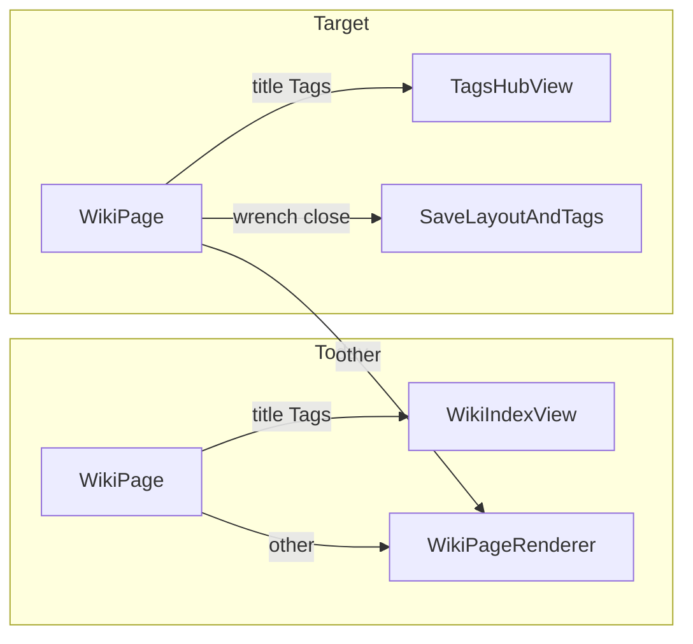

# Cross-Page Tagging & Tags Index Hub

## Current state

- [`backend/prisma/schema.prisma`](backend/prisma/schema.prisma) already has `Tag` + `TagAssignment`, but **no application code** reads or writes them. Wiki pages have no tag relation.
- [`getWikiPage`](backend/src/controllers/wikiController.ts) / [`updateWikiPage`](backend/src/controllers/wikiController.ts) only handle `title` and `parentId`.
- Import pipelines store string tags in `metadata.importMetadata.tags`, not relational tags (out of scope for this task).
- [`WikiPage.tsx`](frontend/src/pages/WikiPage.tsx) routes title `"Tags"` to [`WikiIndexView`](frontend/src/components/wiki/WikiIndexView.tsx) via [`isCategoryIndexPage`](frontend/src/lib/wikiCategories.ts) (folder children, not tag cloud).
- [`WikiPageSettings.tsx`](frontend/src/components/wiki/WikiPageSettings.tsx) is a 3-column grid only; wrench close saves **layout** when `isDirty`, not settings fields (parent/visibility save immediately).



---

## 1. Schema: implicit many-to-many

**File:** [`backend/prisma/schema.prisma`](backend/prisma/schema.prisma)

Replace the unused polymorphic join with Prisma implicit M2M (matches the spec’s `pages` / `tags` relations):

```prisma
model WikiPage {
  // ...existing fields...
  tags Tag[]
}

model Tag {
  id         String   @id @default(cuid())
  campaignId String
  name       String   // unique slug per campaign, e.g. quest-one
  label      String   // display, e.g. Quest One
  color      String?  // keep optional existing field

  campaign Campaign  @relation(...)
  pages    WikiPage[]

  @@unique([campaignId, name])
}
```

- **Drop** `TagAssignment` (never used in `backend/src`; safe to remove in migration).
- **Migration:** add `label` with a backfill (`label` = title-cased `name`); create `_WikiPageToTag` join table; delete `TagAssignment` table.
- Run `prisma migrate` + regenerate client.

**Shared slug helper:** add [`backend/src/lib/tagUtils.ts`](backend/src/lib/tagUtils.ts) with `slugifyTagName()` (reuse lenient logic from [`wikiPageTitleToSlugLenient`](backend/src/lib/wikiSystemPages.ts)) and `labelFromTagName()` for default labels when the client omits `label`.

---

## 2. Backend API

### 2a. Extend page read/write ([`wikiController.ts`](backend/src/controllers/wikiController.ts))

**`getWikiPage`** — include tags in `select`:

```ts
tags: { select: { id: true, name: true, label: true }, orderBy: { label: 'asc' } }
```

Add `tags` array to JSON response.

**`updateWikiPage`** — accept optional `tags` in body:

```ts
tags?: Array<{ id?: string; name?: string; label?: string }>
```

- Allow `parentId` / `title` / `tags` (at least one required).
- In a transaction:
  1. For each entry without `id`, `upsert` by `(campaignId, name)` with provided or derived `label`.
  2. `tags: { set: resolvedIds.map(id => ({ id })) }` on the page.
- Reject tag `name`s outside campaign; validate non-empty slug.
- Return updated page including `tags` (same shape as GET).

Extract tag-sync logic into [`backend/src/lib/wikiTags.ts`](backend/src/lib/wikiTags.ts) for testability.

### 2b. Tags hub endpoint (new)

**Route** in [`campaignScoped.ts`](backend/src/routes/campaignScoped.ts):

`GET /c/:slug/wiki/tags-hub?tagId=<optional>`

**Handler** `getTagsHub` in [`wikiController.ts`](backend/src/controllers/wikiController.ts) or a slim [`tagsController.ts`](backend/src/controllers/tagsController.ts):

| Response field | Content |
|----------------|---------|
| `tags` | `{ id, name, label, pageCount }[]` for campaign, sorted by `label` |
| `selectedTagId` | query `tagId` if valid, else first tag with `pageCount > 0`, else `null` |
| `pages` | Pages linked to selected tag: `id`, `title`, `snippet` (reuse [`buildContentSnippet`](backend/src/lib/wikiCategories.ts)), `visibility`, `updatedAt` |

**Visibility:** mirror wiki read rules — non-DM members only see `Public` / `Party` pages in `pages` and in counts (use `where` on page visibility when aggregating and listing).

**List endpoint for autocomplete:** `GET /c/:slug/wiki/tags` returning `{ id, name, label }[]` (lightweight; used by settings chip input).

Register routes next to existing wiki routes; require campaign member middleware (same as other wiki reads).

### 2c. Campaign scoping

[`campaignPrisma.ts`](backend/src/lib/campaignPrisma.ts) already lists `'tag'` — no change needed. Confirm backup export in [`campaignBackup.ts`](backend/src/lib/campaignBackup.ts) still includes tags (relation shape changes only).

---

## 3. Frontend types & API client

**Files:** [`frontend/src/types/wiki.ts`](frontend/src/types/wiki.ts), [`frontend/src/lib/wiki.ts`](frontend/src/lib/wiki.ts)

- Add `WikiTag` (`id`, `name`, `label`) and extend `WikiPageLayoutPayload` with `tags?: WikiTag[]`.
- Extend `updateWikiPage` body type with optional `tags`.
- Add:
  - `fetchCampaignTags(campaignSlug)`
  - `fetchTagsHub(campaignSlug, tagId?: string)`
- Mirror `slugifyTagName` in [`frontend/src/lib/tagUtils.ts`](frontend/src/lib/tagUtils.ts) for Enter-key preview before save.

---

## 4. Page Settings — chip multi-select

**Files:**
- New [`frontend/src/components/wiki/WikiPageTagsInput.tsx`](frontend/src/components/wiki/WikiPageTagsInput.tsx) — focused UI component
- Update [`WikiPageSettings.tsx`](frontend/src/components/wiki/WikiPageSettings.tsx)

### Layout
- Wrap existing 3-column grid unchanged.
- Below it (`md:col-span-3` or a sibling full-width section): **Page Tags** label + chip container.

### `WikiPageTagsInput` behavior
- Props: `assignedTags`, `allCampaignTags`, `onChange`, `disabled`.
- Render assigned tags as dismissible pills (`×` removes from local selection).
- Inline text input inside bordered container (`bg-background`, `border-border`, `text-xs` label style matching parent combobox labels).
- Filter `allCampaignTags` as user types; dropdown suggestions below input.
- **Enter:** pick exact name match, else stage **new** tag `{ name: slugify(input), label: input.trim() }`.
- **No immediate API call** — only `onChange` to parent.

### Lift state to `WikiPage.tsx`
- On layout fetch, seed `pageTags` from `pageData.tags`.
- Pass `pageTags` + `setPageTags` into settings.
- Track `tagsDirty` when `pageTags` diverges from last saved snapshot.
- **`handleToggleEditLayout`:** when closing wrench, if `tagsDirty`, call `updateWikiPage(..., { tags: pageTags })` then refresh snapshot; keep existing `isDirty` → `saveWikiPageLayout` for blocks/template.
- Optionally save tags even when layout is clean (user requirement: “alongside the layout when closing” — implement as: on wrench close, save tags if `tagsDirty`, save layout if `isDirty`).

- On settings panel open, `fetchCampaignTags` once for autocomplete pool.

---

## 5. `TagsHubView` component

**New file:** [`frontend/src/components/wiki/TagsHubView.tsx`](frontend/src/components/wiki/TagsHubView.tsx)

**Props:** `campaignSlug`, optional initial `tagId` from URL search param (nice-to-have: `?tag=quest-one`).

**UI:**
1. **Tag cloud (top):** flex-wrap pills — `#Quest One (4)` using `label` + `pageCount`; selected state with `bg-primary/15 border-primary/60`.
2. **Page grid (bottom):** responsive grid/list of cards linking via [`campaignWikiPath`](frontend/src/lib/campaignPaths.ts); show `title` + `snippet`; empty state when no tag selected or zero pages.
3. Loading / error states consistent with [`WikiIndexView`](frontend/src/components/wiki/WikiIndexView.tsx).

**Data:** `fetchTagsHub` on mount and when selected tag changes.

---

## 6. `WikiPage.tsx` interception

**File:** [`frontend/src/pages/WikiPage.tsx`](frontend/src/pages/WikiPage.tsx)

Add helper:

```ts
function isTagsHubPage(title: string): boolean {
  return title.trim().toLowerCase() === 'tags';
}
```

**Before** the `isIndexCategory` branch (~line 310), add a dedicated branch for Tags hub:

- Reuse the **article header shell** (breadcrumbs, title, DM wrench, collapsible `WikiPageSettings`) from the normal page path — do **not** use bare `WikiIndexView`.
- Body: `<TagsHubView campaignSlug={campaignSlug} />` instead of `WikiPageRenderer`.
- Skip widget grid / `isDirty` block editing on this page (wrench only toggles settings, not layout widgets).
- Still load `fetchWikiPageLayout` so settings have `parentId`, `tags`, etc.

**Optional cleanup:** remove `'Tags'` from [`frontend/src/lib/wikiCategories.ts`](frontend/src/lib/wikiCategories.ts) `CATEGORY_INDEX_TITLES` so future code cannot accidentally route Tags to the folder index (backend [`wikiCategories.ts`](backend/src/lib/wikiCategories.ts) can keep it for `isIndexCategory` metadata on the seeded folder page — no user-facing change).

Routing stays `/c/:slug/wiki/:pageId` (resolved via sidebar `wikiTitle: 'Tags'`); no new route required.

---

## 7. Verification checklist (manual)

| Scenario | Expected |
|----------|----------|
| Lore page → wrench | Parent, Template, Visibility **+ Page Tags** chip row |
| Add/remove tags, close wrench | `PATCH /wiki/:pageId` with `tags`; layout PATCH if blocks changed |
| Sidebar / tree → Tags | Tag cloud + filtered page list, not folder child index |
| Tag pill click | Bottom grid updates to pages with that tag |
| DM on Tags page | Wrench still opens settings; can tag the index page itself |
| Player view | Hub counts/list respect visibility |

---

## Files touched (summary)

| Layer | Files |
|-------|--------|
| Schema | `backend/prisma/schema.prisma`, new migration |
| Backend lib | `backend/src/lib/tagUtils.ts`, `backend/src/lib/wikiTags.ts` |
| Backend API | `backend/src/controllers/wikiController.ts`, `backend/src/routes/campaignScoped.ts` |
| Frontend lib/types | `frontend/src/lib/wiki.ts`, `frontend/src/types/wiki.ts`, `frontend/src/lib/tagUtils.ts` |
| Frontend UI | `WikiPageTagsInput.tsx`, `TagsHubView.tsx`, `WikiPageSettings.tsx`, `WikiPage.tsx` |
| Optional | `frontend/src/lib/wikiCategories.ts` (remove Tags from index set) |

## Out of scope

- Migrating `metadata.importMetadata.tags` into relational tags on import.
- Tag `color` picker UI (field retained in schema only).
- New `/wiki/tags` URL segment (campaign uses page ID routing today).
